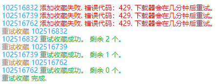
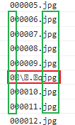

## 15.1.1 2022/12/30

### 权限变更

`declarativeNetRequest` 变为 `declarativeNetRequestWithHostAccess`。

后者不会导致扩展被禁用，也不会显示额外的警告，如“阻止你访问的所有页面内容”。

https://developer.chrome.com/docs/extensions/reference/declarativeNetRequest/

## 15.1.0 2022/12/26

### 新增设置项：AI 作品

用户可以选择是否下载由 AI 生成的作品。

你可以在“抓取”选项卡里找到它。（需要先启用“显示高级设置”）

提示：这个设置项比使用标签来排除 AI 作品的方式更准确，因为有些作品可能没有添加 AI 相关的标签。不过你也可以把这两种方式结合起来使用。

----------

现在新投稿作品时，插画、漫画、动图必须选择是否为 AI 生成。小说投稿可选是否为 AI 生成。

最近 Pixiv 给所有作品的数据都添加了 `aiType` 字段，标明是否为 AI 生成。早期作品也有此字段，但值为 `0`。

```json
aiType: 0 | 1 | 2
```

值的含义：

- 0 未知（未标明是否为 AI 生成的作品）（主要是早期作品）
- 1 否，不是 AI 生成
- 2 是 AI 生成

### 新增命名标记：{AI}

如果作品是由 AI 生成的，则输出 `AI`。

### 对于 AI 生成的作品，下载器会在抓取结果的标签列表里添加特定标记

在 AI 生成的作品页面里，标签列表处会显示 `AI生成` 的标记。实际上这个 `AI生成` 并不是作品的标签，只是 pixiv 显示的一个标记。但是因为它和作品的标签显示在一起，所以很多人以为这是作品的标签里的，进而疑惑为什么下载器抓取不到这个“标签”。

所以现在下载器干脆把这个标记添加到了作品的标签列表里。

**提示：**根据用户在 pixiv 使用的不同语言，`AI生成` 这个标记也字会随语言变化。下载器会根据语言来添加对应的标记，比如英文时添加的标记是 `AI-generated`。

### 修复 bug：某些小说标题中含有特殊字符导致 XML 解析出错的问题

https://www.pixiv.net/novel/show.php?id=17968738

【JPN & ENG】 ユイ vs 桃香　激闘！ 空手対決！！ 【Karate Combat】

标题中的 `&` 会导致 XML 解析出错，现在修复。

### 替换第三方库 pako.js 为 UZIP.js

这项措施提升了动图转换为 APNG 图像的速度。

--------------

创建 APNG 图像的库 UPNG.js 需要使用其他库来压缩数据，之前我引用的库是 pako.js，不过它的体积太大了（282KB），但只用到了压缩数据这一个功能，我觉得太浪费空间了。

现在我把压缩库替换成了 UZIP.js，它的体积很小，只有 29KB。

UZIP.js 的压缩率没有 pako.js 高，但是相差不大。而且它的压缩速度比 pako.js 更快。

#### 体积差别

我使用了两个动图转换为 APNG 来比较它们的体积差别。

| 编号 | pako 生成的体积 (byte) | UZIP 生成的体积 (byte) | UZIP 增加的体积比例 |
| ---- | ---------------------- | ---------------------- | ------------------- |
| 1    | 2098919                | 2116220                | 0.00824             |
| 2    | 53275917               | 53795392               | 0.00975             |

可以看到，相比 pako，UZIP 会增加不到 1％ 的体积，我觉得这是可以接受的。

#### 压缩速度差别

测试步骤：

打开这个画师的 [动图页面](https://www.pixiv.net/users/1319940/artworks/%E3%81%86%E3%81%94%E3%82%A4%E3%83%A9)，下载同一个动图 79551391（中间的那个）。这个动图的源文件大小是 9MB，有 105 张 640x360 分辨率的 jpg 图像，在 pixiv 的动图里算中等大小。

先保存为 zip，使源文件压缩包有缓存，然后再改为保存为 APNG。

当下载器显示正在转换动图时开始计时，转换完毕时结束计时。

- 使用 UZIP 时，转换时间为 9.38s。
- 使用 pako 时，转换时间为 11.42s。

经过多次测试，都符合这个结果。

在这个例子中，UZIP 比 pako 快了 2s，节约了将近 18% 的时间。

### 修复了转换 APNG 时的一处警告信息

在转换 APNG 时，下载器会创建一个 CanvasRenderingContext2D，并在上面依次绘制每个图像 `drawImage` 和获取绘制后的数据 `getImageData`。

Chrome 会显示一条警告消息：

```log
Canvas2D: Multiple readback operations using getImageData are faster with the willReadFrequently attribute set to true. See: https://html.spec.whatwg.org/multipage/canvas.html#concept-canvas-will-read-frequently
```

意思是设置 `willReadFrequently` 属性为 `true` 可以加快读取速度，提高效率。于是我加上了这个属性，来避免出现这个警告：

```js
const ctx = canvas.getContext('2d', { willReadFrequently: true })
```

我看了上面链接中的说明，默认情况下浏览器可能会把画布的输出内容存放在 GPU 上（使用硬件加速）。如果设置 `willReadFrequently` 为 `true`，则输出内容会存放在 CPU 上，这在回读图像数据时会更快。这些回读操作包括：`getImageData()`, `toDataURL()`, or `toBlob()`。

我使用上面测试过的动图进行对比（有 105 张 640x360 分辨率的 jpg 图像），输出了绘制和读取全部 105 张图像的总时间：

未设置 `willReadFrequently` 时的典型时间：

- 128 ms
- 131 ms
- 129 ms

设置 `willReadFrequently` 之后的典型时间：

- 116 ms
- 123 ms
- 116 ms

速度有提升，但是幅度小于 10%，聊胜于吧。

### 更新了作品发布时间数据

## 15.0.1 2022/12/26

### 修复小说保存为 EPUB 时下载失败的问题

上个版本升级到 Manifest V3 之后，小说保存为 EPUB 时会报错，无法下载，现在修复。

报错信息如下：

```log
Uncaught (in promise) EvalError: Refused to evaluate a string as JavaScript because 'unsafe-eval' is not an allowed source of script in the following Content Security Policy directive: "script-src 'self' 'wasm-unsafe-eval'".
```

报错的信息指向 `handlebars.min.js`，我以前没注意过它，去搜了下才知道它是一个 HTML 模板编译器（类似于 Vue，用 `{{var}}` 的语法把变量的值插入到 HTML 文本中）。它里面用到了动态构建 Function 的功能，在下载器升级到 Manifest V3 之后，浏览器不允许在扩展脚本使用 eval 功能，就产生了报错。呃呃，第三方库出现问题实在令我猝不及防，平白增加工作量了。

引用 `handlebars.min.js` 的是用于创建 EPUB 文件的库 `js-epub-maker`。

https://github.com/bbottema/js-epub-maker

我有点疑惑，`js-epub-maker` 怎么不用模板字符串来生成 HTML 模板？它引用的 `handlebars.min.js` 不仅使用了 eval，而且体积也有 150KB，太大了些。不过我看了下 `js-epub-maker` 的主要更新时间是 2015-2017 年，可能当时模板字符串的浏览器支持情况还不太乐观，或者作者就是想偷懒，我也管不着。

现在我把 `js-epub-maker.js` 里使用 handlebars 的地方用模板字符串进行了重构，修复了此问题，并删除了 `handlebars.min.js`。

## 15.0.0 2022/12/24

### 扩展升级到 Manifest V3

### 更新了作品发布时间数据

### 修复点击扩展图标时可能产生的一处错误

如果在本扩展权限之外的其他页面（也就是非 Pixiv 页面），点击扩展图标会产生一条错误：

```
Uncaught (in promise) Error: Could not establish connection. Receiving end does not exist.
```

原因是点击图标时，后台脚本会向前台脚本发送消息，但是在没有权限的页面里，不存在本扩展的前台脚本，于是产生了这个错误。

现在修复此问题。

## 14.3.0 2022/12/22

### 修复 Bug：抓取系列小说失败的问题

由于 Pixiv API 返回的数据格式变化，导致最近下载器抓取系列小说失败。

现在修复了此问题。

### 从主机权限中移除 techorus-cdn.com

现在 pixiv 应该没有使用 techorus-cdn.com 了吧，所以我就去掉了。

### 新增功能：如果作品含有某些特定标签，则对这个作品使用另一种命名规则

此功能为特供版添加，将会在正式版中移除。

注意：由于是定制功能，所以本程序假定了用户在此功能内只会设置文件名部分，而不会设置文件夹部分。

### 新增功能：特定用户的多图作品不下载最后几张图片

此功能为特供版添加，将会在正式版中移除。

### 从 Edge 外接程序商店下架

由于 Edge 审核速度太慢（通常需要一周以上），并且这次重要更新（14.2.0版本）审核失败了，所以我已将这个扩展程序从 Edge 扩展商店下架。

如果你的 Powerful Pixiv Downloader 是从 Edge 外接程序安装的，你可以先卸载它，然后从 Chrome Web Store 安装：
https://chrome.google.com/webstore/detail/powerful-pixiv-downloader/dkndmhgdcmjdmkdonmbgjpijejdcilfh

如果你需要备份 Powerful Pixiv Downloader 的一些数据，请参照以下步骤。（非必须，如果你不需要备份数据请忽略）

在卸载它之前打开下载器的“更多”选项卡，并启用“显示高级设置”：

1. 下载器的设置：点击“导出设置”按钮（它位于“更多”选项卡的底部），下载器会把设置项保存为一个 JSON 文件。当你重新安装扩展之后，可以点击“导入设置”按钮，选择这个文件来恢复你的设置。
2. 下载器的下载记录（用于避免下载重复文件）：启用“不下载重复文件”，然后点击它后面的“导出”按钮，下载器会把下载记录保存为一个 JSON 文件。当你重新安装扩展之后，可以点击“导入”按钮，选择这个文件来恢复下载器的下载记录。

全文：https://afdian.net/p/55d1f13c7e0b11ed8eba52540025c377

## 14.2.0 2022/12/04

### 修复了 Chrome 108 版本导致 WebM 视频转换出错的问题

Chrome 108 版本对 `canvas.toDataURL('image/webp')` 生成的内容进行了调整，相比之前减少了 80 字节的空白内容，导致转换 WebM 视频失败。

现在修复。

问题原因记录在 `/notes/Chrome 108 版本转换 WebM 失败的问题.md` 中。

### 作品元数据的文件名规则微调

当用户启用“在序号前面填充 0”时，不会替换文件名里的序号部分。

若未启用则和以前一样，会替换序号部分。

### 更新了作品发布时间数据

## 14.1.0 2022/11/29

### 新增功能：导出日志

你可以在“更多”选项卡的“其他”分类中找到这个功能。默认未启用。

这个功能可以导出下载器在网页顶部显示的日志。

你可以设置为导出全部日志，或者只导出错误日志。

你还可以设置想要排除的关键字，避免导出不想要的日志内容。

### 其他优化

用户设置“为每个作品建立单独的文件夹”的规则时，下载器会自动把 `{id}` 更正为 `{id_num}`。

### 更新了作品发布时间数据

## 14.0.2 2022/11/15

### 在 Yandex 浏览器显示提示消息，建议用户切换到 kiwi 浏览器

### 更新了作品发布时间数据

## 14.0.1 2022/11/10

### 修复上个版本对抓取时间范围进行优化时产生的 bug

https://github.com/xuejianxianzun/PixivBatchDownloader/issues/270

bug 之一就是如果用户设置的日期范围超出最后一条记录的日期，那么下载器会错误的排除超出最后一条记录日期的作品。

此外还有些其他情况可能导致误判，现在一并进行修复。

### 更新了作品发布时间数据

### 优化了过度访问警告

之前的过度访问警告没有说到可能会被封号的问题，现在添加了这一点，现在的警告文本如下：

```html
下载器检测到你可能收到了 pixiv 的警告消息，这通常是因为过度下载导致的。<br>
<strong>当你再次被警告时，你会被 Pixiv 封号。</strong><br>
我建议你减少下载数量，或者使用新的账号进行下载。
```

### 预览作品时，会在标题栏显示发布日期

之前没有显示发布日期，现在把它添加上去了。

## 14.0.0 2022/11/05

### 优化了特定情况下的抓取效率（当用户设置了投稿时间范围时）

假如用户设置了投稿时间范围（如设置抓取 2022-2023 年的作品）：

以前下载器会对抓取到的所有作品发出请求，以获取它们的发表日期。

现在下载器内置了一些时间对照数据，可以知道每个作品的大致发表日期，这样就可以提前判断出不符合条件的作品，不需要去抓取它们。

这提高了抓取效率。

### 添加收藏失败时，下载器将会重试

现在当下载器发出的收藏请求遇到 429 错误时，会在几分钟后重试，重新发送这个收藏请求。

--------------

我在添加收藏的模块里增加了重试队列。

当收藏出错以及重试时，下载器会在日志上显示提示。例如：



不过，由于有多个地方会调用添加收藏的 API `bookmark.add`，所以有些地方没有做更详细的提示优化。（如根据情况使用消息框提示，或在专用元素上显示提示文字。全部处理的话太麻烦了）

### 设置了下载器语言为俄语时的字体

https://github.com/xuejianxianzun/PixivBatchDownloader/issues/264

下载器的语言为俄语时，字体设置如下： `font-family: "NotoSans",sans-serif;`。

### AI 排行榜

最近 pixiv 在排行榜里为 AI 作品单独开了 AI 排行榜。

目前只有普通与 R-18 作品的日榜，作品数量均为 50 个，下载器可以直接抓取，无需修改代码。

- https://www.pixiv.net/ranking.php?mode=daily_ai
- https://www.pixiv.net/ranking.php?mode=daily_r18_ai

## 13.9.1 2022/10/22

### 429 错误导致添加收藏失败时，显示提示

当用户因为触发 429 错误而被临时限制时，不能添加收藏。下载器的收藏作品功能也会受到影响，导致收藏失败。

以前下载器不会处理此错误，现在下载器会检测此问题，并显示提示。

*429 错误不会影响取消收藏的功能。*

## 13.9.0 2022/10/21

### 新增功能：取消收藏本页面的所有作品

当你在自己的收藏页面时，可以在“更多”选项卡里看到这个按钮。

它可以取消这一页里所有作品的收藏状态。

点击一次只能操作一页，不能操作多页。

*虽然可以实现一次操作多页的功能，但是考虑到用户可能会误操作；并且获取多页作品时可能会出现 429 错误，使得情况更加麻烦。所以现在固定为一页。*

### 修复下载小说内嵌图片时的 bug

有些小说里的内嵌图片是引用自同一个作品里的多张图片，之前下载器没有遇到过这种情况，无法处理，现在进行了修复。

https://github.com/xuejianxianzun/PixivBatchDownloader/issues/262

## 13.8.2 2022/10/02

### 修复一处样式问题

在 Pixiv 夜间模式下，下载器放大缩略图的样式不正常，因为夜间模式时，图片的 className 会变化。

把夜间模式的 className 加上就好了。

## 13.8.1 2022/09/27

### 把 QQ 群号替换为 1 群的

2 群的不活跃人数很少了，所以 1 群的不活跃人数很多，所以改成了 1 群的。

## 13.8.0 2022/09/25

### 添加了俄语翻译

感谢 [bropines](https://github.com/bropines) 翻译俄语。

在下载器的语言设置里，用户可以选择俄语（Русский）了。

## 13.7.0 2022/09/21

### 支持了“仅可由链接浏览”页面的抓取

仅可由链接浏览页面如： https://www.pixiv.net/artworks/unlisted/CbLRCId2sY3ZzQDqnQj6

仅可由链接浏览的页面不会在地址栏显示作品的数字 id。（其实它是有数字 id 的，但是不能直接访问，只能通过这个字符串 id 来访问）

### 修复 bug

修复了因为作品下方的工具栏里增加了“添加绘文字”按钮，导致下载器把它当做心形收藏按钮的 bug。

## 13.6.2 2022/09/16

### 优化了一些提示

### 浏览器最低版本号提高到 88

如果用户的浏览器内核版本低于 88，就会显示提示。

## 13.6.1 2022/09/10

### 修复了下载小说内嵌图片时可能卡住的问题

小说里内嵌的图片可以引用另一个图像作品里的图片，但是如果这个图像作品被删除了，下载器在下载这个小说时就会卡住。

现在修复了此问题。

---------

复现：

https://www.pixiv.net/novel/show.php?id=13898151#3

这个小说引用的作品已经 404 了：

https://www.pixiv.net/ajax/illust/84978836

## 13.6.0 2022/09/01

### 优化慢速抓取时的定时器，避免浏览器增加延迟时间

慢速抓取时，下载器设置的 `setTimeout` 时间是 1300ms，但是当页面处于后台时，浏览器为了节省性能，会把延迟时间增加到 1800ms 左右。这白白浪费了时间，导致下载器需要花费更多的时间才能完成抓取。

现在我使用 Worker 来执行慢速抓取的 setTimeout，避免了延迟时间被加大的问题。

### 慢速抓取的间隔时间增加到 1400ms

之前，慢速抓取模式下，每个抓取请求之间的间隔时间为 1300ms，但是这仍然有可能被限制。

如果网络请求速度比较快（在 200ms 以内），那么每个请求+间隔时间不超过 1500ms，就仍然有可能被限制。

我今天在抓取到 90 个作品的时候被限制了，可见即使降低了抓取间隔，但是触发限制时的数量还是和之前差不多。

为了保证不触发 429 错误，所以我加大了间隔时间，现在是 1400ms。

### 优化手动选择作品功能

优化了手动选择作品时的体验。

特别是对于小说作品，之前只能点击它的标题才能选中，现在点击简介、标签等其他区域也能选中了。

------------

之前手动选择作品功能时，该模块自己判断点击区域是否是作品，现在很多情况不需要自己判断了，改为把事件委托给缩略图模块。这也提高了性能。

### 稍微加快了转换动图的速度

现在，转换动图时花费的时间会比之前少一些。

我还尝试用 Worker 来避免在转换动图时导致页面渲染卡住，但是失败了。

### 移除了转换动图处于后台时的提示

移除此提示：

```
这个标签页正在转换动图。如果这个标签页被隐藏了，转换速度可能会变慢。
```

因为现在标签页处于后台时，动图转换速度不会大幅降低，所以我移除了这个提示。

详细情况可以查看 `notes/页面处于后台时，转换动图的时间.md`。

## 13.5.3 2022/08/29

### 修复在用户作品标签分类页面抓取卡住的问题

在用户作品的标签分类页面，如：https://www.pixiv.net/users/635526/illustrations/%E5%A5%B3%E3%81%AE%E5%AD%90

之前抓取此处作品的 API 可以一次获取全部作品，现在 Pixiv 添加了限制：

```
https://www.pixiv.net/ajax/user/635526/illusts/tag?tag=%E5%A5%B3%E3%81%AE%E5%AD%90&offset=0&limit=48&lang=zh
```

上面 API 中的 `limit` 最大值之前没有限制，现在为 100。

之前我设置的数字超过了 100，现在会报错，所以抓取会卡住。现在改为一页的作品数量，修复此问题。

## 13.5.2 2022/08/28

### 适应小说搜索页面的变化

Pixiv 开始在小说搜索页面进行一些改变，下载器对此进行了处理。

详情参见 `notes/小说搜索页面的“以系列为单位显示”.md`。

### 修改两个命名标记的名称

| 旧名称    | 新名称       |
| --------- | ------------ |
| {p_title} | {page_title} |
| {p_tag}   | {page_tag}   |

单纯的修改了名称。

旧名称把 page 缩写为 p，有点抽象，现在改成 page。

但是旧名称依然可以使用，这是为了保持兼容性。

## 13.5.1 2022/08/27

### 修复 bug：英语用户遇到的缩略图增强功能失效的问题

上个版本的修改导致了此问题，现在修复。

因为用户把 Pixiv 的语言设置为 English 时，URL 会多出 `/en` 的路径，例如：

`https://www.pixiv.net/en/artworks/100761776`

而其他语言没有 `/en` 路径。有时候我没有考虑到这个差异，可能就会出现问题。

## 13.5.0 2022/08/25

### 新增设置项：点击收藏按钮时下载作品

你可以在“更多”选项卡的“下载”分类中找到它。默认未启用。

启用之后，当你点击作品的收藏按钮时，下载器会自动下载这个作品。

**注意：**必须是**点击收藏按钮**才会触发此功能。如果你有时不是通过点击收藏按钮来收藏作品的，那么就不会触发此功能。

例如，在画师主页使用下载器的“收藏本页面的所有作品”功能，或是“下载之后收藏作品”功能，这些操作也会收藏作品，但不是用户点击收藏按钮触发的，所以也就不会触发此功能的自动下载效果。

### 新增设置项：点击点赞按钮时下载作品

你可以在“更多”选项卡的“下载”分类中找到它。默认未启用。

启用之后，当你在作品页面里点赞时，下载器会自动下载这个作品。

### 新增命名标记：{upload_date}

`{upload_date}` 作品内容最后一次被修改的时间。其实就是作品数据里的 `updateDate`。

**注意：** `updateDate` 并不是作品有任意修改就会改变。例如修改标题、标签并不会导致 `updateDate` 变化。

我推测是只有重新上传图片、追加上传图片、修改小说内容等操作，才会改变 `updateDate`。

### 可以抓取分组的画师了

Pixiv 高级会员可以给关注的画师设置分组，在“已关注用户的作品”页面里，还有“关注”页面里，可以按分组筛选画师，只查看这些画师和他们的作品。

之前下载器没有考虑到分组的情况，不能按照分组抓取画师，现在可以识别分组并抓取了。

### 慢速抓取的延迟时间增加到 1300ms

之前是 1200ms，但是如果每个请求耗费的时间比较少（比如少于 200ms），那么仍然可能会被限制。

所以现在增加到了 1300ms。

### 修复了预览搜索结果时，动图排在前面的问题

如果用户开启了 `downloadUgoiraFirst` 设置，那么预览搜索结果时，动图会排在最前面，这不符合下载器在搜索页面按收藏数量排序的规则。

现在修复了此问题，把 `downloadUgoiraFirst` 的处理放在了准备下载阶段，这样预览搜索结果时，就不会受到影响了。

### 下载器的一些元素移动到 body 外面

这些元素之前是添加在 body 里面的，现在改为 body 外面。

- 下载器面板
- 输出面板
- 日志面板
- 首页输入 id 列表等元素
- 
这是因为下载器监听 DOM 元素变化的 observer 作用范围是 body，如果这些元素放在 body 里，它们的变化会导致 observer 进行不必要的处理，浪费资源。

## 13.4.0 2022/08/19

### 新增设置：减慢抓取速度

```
减慢抓取速度 ?  作品数量 > 100
```

你可以在“更多”选项卡的“抓取”分类中找到它。默认未启用。

减慢抓取速度可以避免在抓取时被 Pixiv 临时限制。但这会增加抓取时间。

如果用户启用了这个设置，那么下载器在抓取时的并发请求数量会变成 1（原本抓取列表页时是 1，抓取作品数据时是 10），并且会在每个请求完成之后，延迟 1.2 秒再开始下一个请求，以避免用户被限制。

**注意：**如果该标签页处于后台，则定时器的时间会被浏览器增加。1.2 秒的延迟可能会变成 1.8 秒。

这个设置不会对下载阶段产生影响。

--------------

启用这个设置之后，它可能会同时影响抓取列表数据和抓取作品数据两个阶段。

- 抓取列表数据时，不会判断“作品数量”的值。在一些可能会产生大量列表页请求的页面里，应用了延迟时间。（一些页数很少的页面里，没有应用延迟，不会产生影响）
- 抓取作品数据时，会判断“作品数量”的值。如果作品数量大于设置的值，并发请求数量会变成 1，并且会应用延迟时间。（如果作品数量未达到设置值，则不会产生影响）

在这些列表页里会使用慢速抓取的设置：

- 搜索页面
- 大家的新作品/关注的新作品页面
- 收藏页面
- 关注页面

--------------

测试数据：

在这个画师主页抓取全部作品（现在有 128 个作品）：https://www.pixiv.net/users/145944

10 个并发请求时，花费的时间约为 5 秒。
 
1 个并发请求时，花费的时间约为 35 秒。

1 个并发请求并且有 1.2 秒的延迟时，花费的时间约为 187 秒。

### 减慢了在搜索页面里获取列表数据时的速度

之前在搜索页面里获取列表数据时，10 个并发请求。现在改为 1。

## 13.3.1 2022/08/15

### 添加了 429 错误状态码的处理

之前抓取太多时，会返回 500 错误，现在改为了 429。

但是抓取作品遇到 429 错误时，之前版本的下载器不会重新抓取这个作品。这是因为之前从未遇到过 429 错误，下载器没有对此进行处理。

从这个版本开始会重新抓取 429 状态码的作品。

## 13.3.0 2022/08/13

### 添加了“取消定时抓取”按钮

点击这个按钮可以取消定时抓取任务。

### 增加一处错误提示

如果扩展程序更新（或刷新）了，但是前台页面没有刷新，那么下载器向后台脚本发送消息就会出错：`Extension context invalidated`。

这是导致下载进度卡住不动的其中一种原因。下载器现在增加了对这种错误的检测，会提示用户刷新页面。

### 修复了约稿页面显示更大的缩略图失效的问题

### 修复了 NameRuleManager 的一处 bug

如果 settings.nameRuleForEachPageType 里面没有当前页面的命名规则，在之前会产生错误，现在下载器会将其设置为通用的命名规则。

### 其他修改

- 移除了 States 里的 `downloadFromViewer` 标记，因为它可以被 `quickCrawl` 完全取代。

- 设置里的 `quietDownload` 字段名称修改为 `autoStartDownload`。这个设置会被重置为默认值。

- 优化了一些提示

## 13.2.0 2022/08/12

### 新增功能：定时抓取

在一些页面里，随着时间推移可能会出现新的作品，例如：

- 画师主页
- 已关注用户的新作页面
- 大家的新作页面
- 自己的收藏页面
- 搜索页面

在这些页面里，如果你希望能源源不断的抓取新出现的作品，就可以使用定时抓取功能。

点击“定时抓取”按钮，就可以开始定时抓取了。

下载器每隔指定的时间，就会自动进行一次抓取和下载。

你可以在“更多”选项卡-“抓取”里面设置“定时抓取的间隔时间”。

-----------

执行定时抓取时，有一些需要注意的地方：

1. 不要关闭当前标签页。（你可以切换到其他标签页，继续使用浏览器）
2. 不要改变当前标签页的 URL。URL 变化之后，定时抓取任务会被取消。
3. 建议启用“不下载重复文件”功能，以避免下载重复的文件。
4. 建议离线安装本扩展程序，以免以为扩展程序自动更新而导致无法下载。
5. 抓取页数可以设置的少一些，以避免抓取到太多重复的作品。
6. 在搜索页面定时抓取时，抓取到的作品不会显示在页面上（也就是不能预览搜索结果）
7. 定时抓取总是会自动开始下载。

### 修复其他问题

我发现搜索页面热门作品上遮挡的会员购买链接没有去除，不知何时因为 Pixiv 的修改而失效了，现在修复。

## 13.1.3 2022/08/09

### 优化了设置面板对键盘导航的的支持

之前如果用户使用键盘的 Tab 键在设置面板上导航，效果是很差的，因为表单控件被隐藏了，所以这些控件没有高亮提示（不会显示获得焦点时的外边框），用户不知道哪个控件获得了焦点。一些文字或图标类型的按钮也存在同样的问题。

现在设置面板上的所有可交互元素都可以用 Tab 导航了，从顶部（关闭按钮等）、选项卡栏、设置表单、底部按钮等都可以用 Tab 导航，并且有高亮提示。

当某个元素获得焦点时，按下空格或回车键即可执行对应的动作。

### 优化 500 错误时的提示

当抓取作品遇到限制时，之前下载器的提示不够清晰：

```无权访问 {}，跳过该作品。```

其实下载器并不会“跳过”这个作品，稍后还会再次抓取它。所以我把提示改成了这样：

```Pixiv 拒绝返回数据 (500)```

### 其他优化

优化了一些样式；

选项卡标题下面的蓝色横条现在添加了动画效果。

## 13.1.2 2022/08/07

### 修复导入抓取结果后，不显示下载区域的 bug

`1ca16cd :memo:优化一些提示` 这个提交里面的修改导致了此 bug，现在修复。

## 13.1.1 2022/08/07

### 可以替换排行榜页面的缩略图为更清晰的缩略图

如果用户开启了“显示更大的缩略图”，那么在排行榜页面里，下载器会把原本的小尺寸缩略图替换成大尺寸缩略图。

这是因为缩略图的显示尺寸变大之后，原本的缩略图会因为放大而显得模糊，所以有必要替换成更清晰的缩略图。

## 13.1.0 2022/08/04

### 预览作品时，按快捷键 D 可以下载这个作品

预览作品时（包括长按右键查看大图时），按快捷键 `D` 可以直接下载这个作品。

### 优化了检查图片颜色时的准确度

现在检查图片颜色会更准确。

---------

优化 1：现在下载器会把图片分成 4 部分，分别检查每个部分的颜色。如果有一个部分是彩色，就判断为彩色图片。如果所有部分都是黑白的，才会判断为黑白图片。

RGB 三种颜色的图片：https://www.pixiv.net/artworks/100215825

在之前的版本中，由于下载器计算的是整张图片的所有像素的平均值，所以这张图片会被判断成黑白图片。

现在可以正常判断为彩色图片了。

类似的图片还有：https://www.pixiv.net/artworks/96306274 

-----------

优化 2：对于多图作品，之前下载器在抓取时会检查第一张图片的颜色。但实际上第一张图的颜色不能代表后面图片的颜色，这有可能造成误判。现在对于多图作品，下载器只会在下载阶段检查图片颜色，避免了误判。

测试黑白图片和彩色图片: https://www.pixiv.net/artworks/100215679

第一张图是黑白的，后面的是彩色的。

之前如果设置为只下载彩色图片，由于第一张图不符合要求，会导致整个作品（包括后续图片）都会被排除。

现在可以正常判断和下载了。

-----------

其实还有一个可以优化的地方，但是必要性不大。

在下载阶段，下载器先下载了完整的图片，然后才去检查它的颜色。

优化思路是：先用小尺寸的缩略图去检查颜色，然后再决定是否下载这张图片。

但是必要性不大，因为多数情况下用户需要下载的是彩色图片，而 pixiv 上大部分图片也都是彩色的，所以图片大概率还是要下载的，没必要先加载缩略图，直接用原图好了。

### 优化了一些提示

在用户页面里保存用户头像、封面图时，会显示轻提示。

优化了没有可用的抓取结果时的提示。

优化了系列作品相关的命名标记的提示。

## 13.0.1 2022/08/02

### 修复了导出下载记录时，可能失败的问题

如果下载记录的数据量太大（超过 512MB），之前的版本就无法导出下载记录。这是因为 `JSON.stringify` 生成的字符串如果长度大于 512MB，会产生内部错误。

现在修复了此问题。

### 优化了“抓取多少作品/页面”的提示效果

因为有很多人问我设置页面数量到底是什么效果，该怎么用。所以我优化了此处的提示。

以前鼠标放到左侧文字和问号上才显示提示，现在改为在这一行的任意元素上都会显示提示。

## 13.0.0 2022/07/29

### 新增设置项：隐藏浏览器底部的下载栏

你可以在“更多”选项卡的“下载”分类里找到这个设置。

默认未启用。

### 宽高比例可以设置为小于或等于

https://github.com/xuejianxianzun/PixivBatchDownloader/issues/234

之前用户手动输入的宽高比例只能选择 `>=`，现在我增加了 `=` 和 `<=`。

### 修复了显示更大的缩略图时，某些竖长图片会挡住图片下方链接的问题

一些用户使用高分辨率屏幕，并且系统（或浏览器）的 DPI 缩放值比较小，会导致某些竖长的图片显示出现问题。

现在修复了这个问题。

### 其他优化

## 12.9.2 2022/07/29

### 修复了某些动图转换失败的问题

### 修复了极少数特殊的动图会转换失败的问题

在前几个版本里，有用户报告说 https://www.pixiv.net/artworks/72815999 这个动图会转换失败。

原因是下载器在查找压缩包里的 jpg 图片时，查找的位数（特征）不够多，这个文件又比较特殊，其中有段字符被错误的判断成了文件名：



之前下载器只会检测 4 个位置的字符，也就是绿色方块的部分，这段字符正好符合条件。

现在下载器会检测 7 个位置的字符，以减少此类错误出现的概率。

## 12.9.1 2022/07/28

### 适配了 Pixiv 对抓取小说的限制

最近我发现在批量抓取小说时，Pixiv 可能也会返回空数据。

比如小说 tag 搜索页面，以及自己的收藏页面。大量抓取小说就会触发限制。

被限制后，小说数据返回 500 状态码，期间无法正常打开小说作品页面。

现在下载器对其进行适配，被限制时会暂停抓取，等待一定时间（3 分钟左右）之后再次抓取。

## 12.9.0 2022/07/24

### 新增设置：下载小说里的内嵌图片

该功能默认开启。

当你下载小说时，如果小说正文里有内嵌（插入）的图片，下载器可以保存它们。

- 如果小说的保存格式是 EPUB，图片会保存在 EPUB 里面。
- 如果小说的保存格式是 TXT，图片会单独保存。

对于体积比较大的 PNG 格式图片，有些小说阅读器可能不能完整显示图像。我在手机上的静读天下就出现了这个问题。这是小说阅读器的问题。

### 检测用户是否收到了过度访问的警告

如果短时间内下载了太多文件，用户可能会收到 pixiv 发送的“过度访问”警告信息。

下载器现在可以检测用户是否在最近收到了此信息，如果检测到，就暂停下载，避免用户被第二次警告，因为第二次警告可能就被封号了。

### 优化了收藏作品失败时的处理

下载器收藏作品时，需要用到用户的 token。一般是不会出问题的，但是如果用户切换了 pixiv 账号（退出，然后登录另一个账号），下载器保存的 token 却还是之用用户的，就会导致下载器收藏作品失败。

现在解决了这个问题，收藏失败时，下载器会重新获取 token，然后重新收藏作品。

## 12.8.2 2022/07/22

### 当其他扩展导致文件名异常时，显示消息框进行提示

一些使用了下载权限的扩展可能会导致本程序保存的文件名异常。

之前出现这种情况时，只在日志里进行提示，现在还会显示一个对话框，让提示更明显。

此外，我也考虑过遇到此情况时改为使用 `a` 标签进行下载，例如：

```js
const blob = new Blob(['123456'])
const url = URL.createObjectURL(blob)
const fileName = 'aaa/123.txt'
const a = document.createElement('a')
a.href = url
a.download = fileName
a.click()
```

但是这种方式不能建立文件夹，路径里的斜线 `/` 会被浏览器替换成下划线，所以文件名变成了 `aaa_123.txt`。

所以我没有改为使用这个方式来下载。

### 预览作品时，顶部文字区域会显示收藏数量

## 12.8.1 2022/07/19

### 补充一条缺失的韩语文本

## 12.8.0 2022/07/19

### 减少转换动图所需的时间

转换动图会比以前更快一些，性能也得到了一些优化。

### 修复了预览动图时，动图的高度可能大于实际高度的 bug

这个 bug 会导致图片看起来有点变形，现在已修复。

### 添加韩语文本

韩语文本由 [KOZ39](https://github.com/KOZ39) 翻译：

https://github.com/xuejianxianzun/PixivBatchDownloader/pull/229

感谢你的帮助！

## 12.7.1 2022/07/16

### 优化预览动图的性能和体验

1. 减少了刚开始播放时，画面快速循环导致看起来鬼畜的情况
2. 播放动画的方式由 setTimeout 定时器改为 requestAnimationFrame，画面切换会更加顺滑。
3. 优化了一些内存操作，提升性能。

## 12.7.0 2022/07/11

### 新增设置：预览动图

*在“更多”选项卡-“增强”分类中添加了此设置。这个设置是默认开启的。*

当用户预览动图（和右键查看原图）时，下载器可以播放动图。

这个功能花了我快一天的时间，一点一点做出来，还要从二进制数据里提取文件，太麻烦了。

目前有一个小问题，因为动图的压缩包分成了多个片段加载，一开始加载前面的一部分，先显示一部分图片。所以一开始只能循环播放前面的动画，慢慢的才能播放完整的动画。

一般来说这个问题不明显，但是如果用户访问 Pixiv 时网络延迟过高，或者加载速度太慢，可能会出现鬼畜的现象。

## 12.6.0 2022/07/09

### 新增设置：下载小说的封面图片

*在“更多”选项卡-“下载”分类中添加了此设置。这个设置是默认开启的。*

启用此设置之后，在下载小说时，除了小说文件（txt 或者 epub），还会单独保存小说的封面图片。

封面图片的文件名与小说的文件名一致，这样它们在资源管理器里可以排在一起。

## 12.5.1 2022/07/09

### 优化检查重复文件的功能

早期的下载记录里没有日期，现在的下载记录里有日期。

由于检查重复文件时，下载器会对比日期，所以这会导致之前没有日期的记录被认为需要重新下载一次。

这会造成重复的下载，现在进行优化，如果之前的记录里没有日期，则不检查日期。

## 12.5.0 2022/07/09

### 新增设置：不抓取多图作品的最后一张图片

启用该设置后，下载器抓取时会跳过多图作品的最后一张图片。

例如，有些画师的多图作品的最后一张图片是 Fanbox 的宣传图，不需要下载，此时就可以启用这个设置。

### 文本优化

优化了下载器的一些文本和提示，使其意思更准确。

“其他”选项卡的名字改为了“更多”。

## 12.4.1 2022/07/06

### 新增设置：不抓取多图作品的最后一张图片

~~这是一个不可见的设置。~

在下一个版本中改成了可见设置。

## 12.4.0 2022/06/29

### 修复某些特殊字符导致 epub 小说解析出错的问题

今天我偶然发现一个系列小说下载的 epub 文件异常，只能查看前面的一部分，后面的不显示。原来是特殊字符导致了解析错误。

epub 文件的内部其实是用 xml 格式（xhtml 文件）存放小说内容文本的，所以一些特殊字符要转义，否则可能发生解析错误。出错时，出错位置后面的内容无法显示。

只有两个特殊字符需要转义：`&` 和 `<`，转义之后就不会发生解析错误的问题了。

## 12.3.9 2022/06/29

### 可以保存小说设定资料的详细信息了

小说的每条设定资料可以拥有两条用于说明补充的数据，之前只会保存第一条，现在可以保存第二条了。

## 12.3.8 2022/06/27

### 修复英语用户在作品页内看不到快速下载按钮的 bug

英语用户的作品页 URL 里含有 `/en`，例如：https://www.pixiv.net/en/artworks/99105889

之前的修改里忽略了这个条件，所以在作品页内不会显示快速下载按钮。现在修复。

## 12.3.7 2022/06/26

### 用户手动取消保存文件时，不再重试保存它

如果用户没有关闭浏览器设置里的“下载前询问每个文件的保存位置”，那么下载器保存文件时会弹出“另存为”对话框。

从这个版本开始，如果用户点了“取消”按钮，不保存这个文件，下载器不会再重试保存它。

---------

以前之所以用户取消后还会重试保存，是考虑了一些特殊的异常情况。比如：

[下载时弹出另存为对话框](https://xuejianxianzun.github.io/PBDWiki/#/zh-cn/%E5%B8%B8%E8%A7%81%E9%97%AE%E9%A2%98?id=%e4%b8%8b%e8%bd%bd%e6%97%b6%e5%bc%b9%e5%87%ba%e5%8f%a6%e5%ad%98%e4%b8%ba%e5%af%b9%e8%af%9d%e6%a1%86)

当浏览器因为文件名重复而弹出另存为对话框时，用户的以下行为也会触发 `USER_CANCELED` 代码：

- 点击取消按钮
- 点击确定按钮（覆盖已存在的同名文件）

如果用户在对话框中修改了当前文件名，使其不再与已有的文件重名，之后再点击确定按钮保存这个文件，会返回正常的保存成功的代码。

## 12.3.6 2022/06/26

### 优化小说去重功能

https://github.com/xuejianxianzun/PixivBatchDownloader/issues/224

现在下载器在下载重复的小说作品时，可以判断小说在上次下载之后是否被修改过。如果修改过了，则下载器会重新下载它。（严格策略和宽松策略均是如此）

*以前下载器没有保存作品的修改日期数据，所以不能判断小说是否修改过。现在保存了修改日期数据。*

## 12.3.5 2022/06/26

### 合并系列小说时可以保存元数据、设定资料

https://github.com/xuejianxianzun/PixivBatchDownloader/issues/223

以前合并系列小说时，即使用户启用了“在小说里保存元数据”，文件里也不会保存小说的元数据。

现在下载器会把一些元数据保存到合并后的文件里。

另外，如果这个系列小说有设定资料，下载器会把设定资料也保存到文件里。

提示：大部分系列小说没有设定资料，只有少部分有设定资料，例如：

https://www.pixiv.net/novel/series/8913386

只有“合并系列小说”时，下载器才会保存设定资料。如果把每个小说保存成一个文件的话，是不会保存设定设定资料的。这是因为设定资料是只有系列页面才有的，单个小说没有设定资料。

## 12.3.4 2022/06/24

### 调整了“下载”选项卡第一排按钮的位置

```
导入抓取结果  导出抓取结果    导出 CSV 文件   预览文件名
```

上面的按钮原本和下面的按钮没有贴在一起，中间有一些设置项分开。现在贴在一起了。

```
开始下载    暂停下载     停止下载    复制 URL
```

此外，默认只会显示第一个按钮（导入抓取结果），因为它是始终可用的。导出抓取结果和预览文件名的按钮则默认隐藏，等到有抓取结果后再显示。

### “下载”选项卡里的部分设置移动到“其他”选项卡

“下载”选项卡里的一些设置是用户不会频繁修改的，现在移动到“其他”选项卡：

- 根据作品类型自动建立文件夹
- 为每个作品建立单独的文件夹

### 修复一处页面类型判断错误的情况

有用户反馈在这个网址里，下载器出现问题： https://www.pixiv.net/users/72939230/bookmarks/artworks/2022

这个网址是用户书签里的某个标签分类，由于其标签是数字 2022，比较特殊，导致下载器把这个页面误判成了作品页面。

现在修复了这个 bug。
 
## 12.3.3 2022/06/09

### 修复首页“关注用户的新作品”放大缩略图的功能失效的问题

因为 pixiv 改版导致元素的 className 变化，一些样式失效了。现在修复。

同时下载器也会尝试给这个容器添加自定义的 className，防止失效。

## 12.3.2 2022/06/07

### 修复首页“关注用户的新作品”放大缩略图的功能失效的问题

因为 pixiv 改版导致元素的 className 变化，一些样式失效了。现在修复。

## 12.3.1 2022/06/07

### 适配 pixiv 对底部“关注”相关缩略图的尺寸的修改

点击在有些页面里，点击“关注”按钮之后，页面底部会显示一排推荐的画师和他们的 3 个作品。

这些作品之前的尺寸是 136，现在 pixiv 正在逐步改为 131。这对预览此处作品的功能产生了影响，现在进行了适配以修复问题。

## 12.3.0 2022/06/05

### 在网页标题上显示剩余下载数量

下载时，网页标题上会显示还有多少个文件尚未下载。

这样，用户不需要打开下载面板就能够知道下载进度。

### 下载时也可以建立一些新的下载任务

以前如果下载器正在下载中，用户无法建立新的下载，此时下载器会提示“当前任务尚未完成”。

现在我对此进行了优化，即使下载器正在下载中，用户也可以添加某些类型（*）的新的下载任务。

新的下载任务会进入等待队列，等下载器完成本次任务之后，会抓取和下载等待队列中的作品。

---------

只有**抓取前就已经知道了作品的 id** 的任务才能使用这个新特性。这些任务有：

- 点击作品页面里的快速下载按钮
- 点击作品缩略图上的下载按钮
- 点击图片查看器里的下载按钮
- 抓取手动选择的作品
- 在首页下载 id 列表、id 区间

相反的，抓取前不知道作品 id 的任务不能使用这个新特性。

例如很多页面的“开始抓取”按钮，下载器需要在抓取之后才知道有哪些作品，所以它们不适用于这个新特性。

--------

注意：如果你点击了“停止下载”按钮，那么等待队列会被清空。

### crawlStart 事件的触发时机提前了

InitPageBase 里 `EVT.fire('crawlStart')` 的执行时机提前了一些。

以前它在稍后面一些的位置，没有问题，但是这个版本由于增加了等待的任务列表，就必须提前了。

这使因为 crawlStart 事件会使 `states.busy = true`。如果不尽早执行此事件，下载器自动下载 waitingIdList 和用户手动触发的下载有可能在此事件执行前同时到达这里并执行。

这就会造成并发的抓取和下载任务，导致下载文件时卡住。

为了只让一种下载可以同时执行，所以 `states.busy = true`（也就是 `EVT.fire('crawlStart')`）必须尽早执行。

--------

bug 的原因是这样的：

当下载器完成一次下载时，用户恰好在这使点击了快速下载按钮，下载器开始抓取这个作品。

几乎同时，下载器开始自动抓取 waitingIdList 里的作品。

先完成的抓取任务会触发下载。假设有 1 个抓取结果，下载时的进度为 0/1。

此时后完成的抓取任务把它的结果也添加到了 store 里（假设有 1 个结果），此时下载进度变成了 0/2。

这就导致在下载途中，store 里的结果数量变化了。这会导致下载卡住。

我花了好长时间才找出这个原因。太坑了。

### 优化了作品缩略图选择器列表

移除了 `figure > div` 选择器。

避免了一些情况下的事件重复绑定。

### 保存下载状态时的错误

我发现偶尔保存下载状态时，IndexedDB 会报错 `Key already exists`。但是我很疑惑，key 是 `id` 字段，id 是每次下载任务开始时的时间戳，这怎么会重复呢，没有搞懂。

现在还没有发现稳定复现此问题的方法。

### 其他优化

## 12.2.0 2022/05/24

### 新增命名标记 {series_id}

`{series_id}` 是“系列 ID” ，只在系列页面中可用。（小说系列、漫画系列）

例如 `https://www.pixiv.net/user/3698796/series/61267` 的 `{series_id}` 是 `61267`。

### 预览作品时，允许预览图遮挡作品缩略图，以显示更大的预览图

以前预览作品时，预览图不会遮挡作品缩略图，但是这容易导致预览图被迫缩小尺寸（否则就会遮挡作品缩略图了）。

现在允许预览图遮挡作品缩略图，这也就意味着预览图不会被迫缩小尺寸了，观感更舒服，体验更好。

这个策略的变化没有在设置里添加开关，因为我在 QQ 群里调查，大家都觉得现在修改后的效果更好，没有必要保留以前的方式。

此外我还针对现在的效果进行了一些优化，以提高用户体验。

### 修复了“相关作品”里的缩略图放大功能失效的问题

作品下面的相关作品部分的 className 变了，导致这里不能显示更大的缩略图，现在在样式表里做了相应的修改，修复此问题。

## 12.1.2 2022/05/19

### 当搜索页面作品数量为 0 时显示提示

添加了新的提示：

```
作品总数为 0，Pixiv 可能拒绝了此次抓取。请稍后重试。
```

在搜索页面里，当下载器短时间内抓取了大量作品时，pixiv 会在一定时间内限制抓取，此时下载器只能获取到空数据。

在这种情况下开始抓取，就会出现“作品数量为 0”的错误。

## 12.1.1 2022/05/02

### 修复“第一张图不带序号”功能一处逻辑判断不严谨的地方

第一张图不带序号功能的逻辑存在不严谨的地方，可能错误的去除序号。现在修复。

## 12.1.0 2022/04/21

### 预览作品功能添加子选项：使用鼠标滚轮切换多图作品里的图片

以前当鼠标指针放在一个多图作品上，并显示预览图之后，滚动鼠标滚轮不会滚动页面，而是会切换显示多图作品里的图片。

现在有人想要让鼠标滚轮能照常滚动页面，因此我添加了这个设置。 [issues/202](https://github.com/xuejianxianzun/PixivBatchDownloader/issues/202)

这个设置是默认开启的。如果关闭这个设置，就可以让鼠标滚轮滚动页面，并且不会切换多图作品里的图片。

### 显示更大的缩略图设置改为默认关闭

这个功能之前是默认开启，现在改为默认关闭。

这只影响新安装的用户。

### 为日志里的作品 id 添加了超链接

当有作品被排除，或者下载出错时，下载器会在日志里显示提示，例如：

```
97691114_p0 没有被保存，因为它的颜色不符合设定。

97382485_p0 保存失败，code：xxx
```

现在我在作品的 id 上添加了链接，你可以点击作品 id 直接打开这个作品的页面。

## 12.0.0 2022/04/12

### 新增设置项：显示更大的缩略图

[issues 198](https://github.com/xuejianxianzun/PixivBatchDownloader/issues/198)

pixiv 页面的宽度是固定的，即使屏幕宽度更大，它也不会在一排显示更多缩略图，或者加大缩略图的尺寸。

现在我用 css 显示更大的缩略图，并且解除了一些地方的宽度限制。

#### 横图占用二倍宽度

默认情况下，一排显示 6 个缩略图，每个作品缩略图的宽度是相等的。

设想有一个横图和一个竖图，它们显示出来的宽度都是 260px。此时竖图的高度比横图更大，所以竖图显示的比较大，横图显示的比较小。这就导致横图的细节看的不清楚。

为了解决横图显示的小的问题，添加了一个子选项：横图占用二倍宽度。这样横图会变大，能够看清楚了。

**注意：** 必须开启“替换方形缩略图以显示图片比例”，这样“横图占用二倍宽度”才能生效。

因为如果不开启“替换方形缩略图以显示图片比例”，缩略图的图片默认是正方形，下载器也就无法检查那些图片是横图了。

必须开启“替换方形缩略图以显示图片比例”，下载器才能检查图片是不是横图。

#### 已知问题1

如果把一些横向滚动区域的缩略图放大（左右两侧有箭头按钮的那种区域），则滚动区域不能正常显示所有图片。

这是因为滚动区域的宽度是 pixiv 设定的，但是下载器把图片放大了，所以图片就只能显示前面的一部分了。

另外，首页顶部的“关注用户・好P友的作品”也存在问题，因为它原本以此显示 6 个作品，开启“放大缩略图”之后，只能显示 4 个。滚动的时候 pixiv 还是按照原来逻辑进行滚动，一次滚动 5 个作品，经常会导致有一个作品被滚动到可视区域之外。

#### 已知问题2

目前是使用 css 控制样式，但是如果以后 pixiv 的 className 变了，下载器也需要进行更新修复。

#### 已知问题3

横图占用二倍宽度开启时，偶尔有竖图作品的容器被错误的放大到二倍宽度了。目前还不清楚具体原因。

### 优化预览作品功能

[issues 198](https://github.com/xuejianxianzun/PixivBatchDownloader/issues/198)

#### 作品预览图在页面滚动时不会被遮挡了

之前版本中，预览作品时，预览图是页面上的绝对定位 `absolute`，导致页面滚动时，预览图也跟着滚动，这样预览图很容易被遮挡一部分。

现在改为使用固定定位 `fixed`，不会随着页面滚动，也就不会被遮挡了。

*ps：我尝试过在页面滚动时动态改变预览图的 top，让预览图始终不会被遮挡。但是这样在视觉上不连贯，有抖动的感觉，费力不讨好。还是改成固定定位更简单，一劳永逸。*

#### 可以隐藏作品预览图顶部的摘要信息了

[issues 198](https://github.com/xuejianxianzun/PixivBatchDownloader/issues/198)

之前的版本中，作品的预览图顶部会显示摘要信息，例如作者、图片宽高、简介等。

现在我添加了一个子选项“显示摘要信息”，关闭它之后就不会显示摘要信息了，并且也不会显示蓝色边框。

#### 减少边框宽度

边框宽度从之前的 4px 减少到 2px。

如果不显示摘要信息，则不会显示边框。

### 减少发送一些不必要的请求

现在下载器在获取每个作品的详细数据之前，都会检查它是否符合“ID 范围”条件。

如果不符合条件则跳过这个请求，这样可以避免发送不必要的请求，提高抓取效率。

### 在下载进度条上用文件名作为 title 属性

如果文件名很长，下载进度条上显示不完，那么用户就无法在这里看到完整的文件名。

现在下载进度条会使用文件名作为 title 属性，这样鼠标在进度条上悬浮时就可以看到完整的文件名。

### 修复了下载器的背景图片预加载失效的问题

如果用户为下载器设置了背景图片，那么下载器在页面加载时也会预加载背景图片。这样用户首次打开下载器面板时，背景图片已经可用，而不是一点一点加载出来。

之前的预加载的代码失效了，推测是之前没把 img 元素插入到页面上，所以新版本的 Chrome 不会真的对它进行加载，或者是会延后加载。

现在把 img 元素插入到页面上，预加载恢复正常了。

## 11.9.3 2022/04/06

### 修复缓存的数据可能会导致错误的过滤结果的问题

下载器会缓存一些作品数据以减少不必要的请求。之前在抓取作品时也会使用缓存的数据，但是这可能会导致一些过滤器出现错误的结果。

这是因为开始抓取时，被缓存的作品的数据也许发生了变化。如果还使用缓存的旧的数据，就可能导致错误的过滤结果。

所以现在抓取作品时不会再使用缓存的数据。

------

之前版本可以复现这个问题：

1. 进入一个未收藏的作品的页面（此时下载器会缓存这个作品的数据）
2. 点击收藏按钮，收藏这个作品
3. 设置筛选条件，取消勾选“未收藏”，也就是只下载已收藏的作品
4. 点击快速下载按钮，抓取这个作品
5. 下载器提示“没有找到符合筛选条件的作品”。

这是因为在缓存的作品数据里，这个作品没有被收藏。即使用户收藏了这个作品，但是缓存里的数据还是未收藏的。这就导致筛选出现问题。在之前，必须刷新页面才能解决这个问题。

缓存的数据最容易因为收藏状态的变化而出现问题。但是也有小概率会因为其他数据的变化而出现问题，例如收藏数量。所以抓取作品时不应该使用缓存的数据。

### 优化文件保存失败时的提示

文件保存失败时的提示之前只有英语，现在添加了其他语言。

新增一条提示：

如果文件保存失败时的错误代码是 `FILE_FAILED`，下载器会提示：可能是因为文件名太长导致文件保存失败。

### 判断文件名被其他扩展修改时，不再判断 jfif 后缀

如果文件名被其他扩展修改，那么保存后的文件的名字会是 UUID 格式。

之前在检查这个情况时，还判断了扩展名为 jfif 的情况。如果扩展名是 jfif，则也认为是被其他扩展修改了。

但是现在情况不一样了，我发现图片尺寸选择“方形缩略图”时，在 Windows 10 最新版本下，文件的扩展名是 jfif。这不是其他扩展导致的，而是 Windows 导致的。

所以现在不会判断扩展名为 jfif 的情况。只会判断文件名是否是 UUID 格式。

### 优化代码

在 Utils 添加了节流和防抖函数，以供其他模块使用。

以前其他模块里的节流、防抖都是自行处理，这导致多出了一些定时器、时间戳变量，代码也显得重复。现在使用 Utils 里的工具函数进行封装，减少了不必要的变量和代码。

## 11.9.2 2022/03/22

上个版本里有几句提示只有简体中文，忘记翻译其他语言了。现在添加了其他语言的文本。

## 11.9.1 2022/03/22

### 解决了抓取搜索页面时可能会被 Pixiv 限制的问题

在搜索图片的页面里，短时间内抓取太多页面可能会被 pixiv 限制，pixiv 会直接返回空结果。

这个问题大概是从一周前出现的。现在修复了这个问题，下载器会等待限制时间结束之后再继续抓取。

关于这个问题的详细情况，可以查看 notes 目录里的文档：`抓取 tag 搜索页面遇到限制.md`。

### 添加了一些提示

在某些抓取情况下，下载器会显示更详细的进度提示信息。

在搜索页面开始抓取时，日志里会显示搜索模式。

## 11.9.0 2022/02/16

### 新增设置：移除用户名中的 @ 和后续字符

在“其他”选项卡的“命名”分类里添加了新的设置：`移除用户名中的 @ 和后续字符`。默认未启用。

有一些用户的用户名后面添加了 @ 后缀，例如：

- Anmi@画集発売中
- 奥馬@skeb募集中
- TonyG @__tony_g

启用这个设置之后，命名规则里的 `{user}` 标记的结果会从 `@` 处截断，变成：

- Anmi
- 奥馬
- TonyG

## 11.8.2 2022/02/15

### 修复了“针对特定用户屏蔽标签”启用时子选项区域不会显示的问题  

## 11.8.1 2022/01/29

### 修复了“群组”页面卡死的问题

群组页面 https://www.pixiv.net/group/ 并不是下载器支持下载的页面。

当启用“替换方形缩略图以显示图片比例”设置之后，在该页面上试图替换图片 url 会引起无限循环导致页面卡死。现在进行了修复，在这个页面不会试图替换图片 url 了。

## 11.8.0 2021/12/30

### 新增设置项：自定义用户名

在“其他”选项卡的“命名”分类里添加了“自定义用户名”的功能。

这个功能主要是为了解决一些画师有时会在名字后面加后缀，导致使用他的名字建立文件夹时，可能会产生多个文件夹的问题。

有些用户可能会改名（或者加后缀），例如：

- Anmi@画集発売中
- 奥馬@skeb募集中
- mignon@抱き枕受注中
- TonyG @__tony_g
- ひさまくまこ＠連載中
- 弱電波(@JackDempa)
- LaoMeng@
- 焔すばる★２日目 東C17a
- つる12/31東地区メ-28a

如果你想使用他本来的名字，不想要后缀，你可以使用这个功能来手动设置他的名字。

当你在命名规则中使用 `{user}` 标记时，下载器会优先使用你设置的名字。

注意：这个设置只会影响命名规则中的 `{user}` 标记。pixiv 网页上显示的用户名不会改变。

### 优化了一些提示

在搜索页面抓取列表页时，会显示页面总数。

之前：`已抓取列表页 30 个页面`

现在：`正在抓取列表页 30/1000`

## 11.7.0 2021/12/22

### 新增命名标记 {bmk_id}

`{bmk_id}` Bookmark Id。你收藏的每一个作品都会有一个 Bookmark Id。收藏的时间越晚，Bookmark Id 就越大。当你下载你的收藏时，可以使用 {bmk_id} 作为排序依据。

这个标记是为了达到一个目的：下载收藏页面的作品时，让下载后的文件的排序跟网页上显示的一致。

## 11.6.5 2021/12/15

### 多图作品检查宽高时会更准确

**这个修改的影响：**

如果你设置了对作品进行宽高检查，并且抓取的作品里含有多图作品，那么下载所花费的时间会更久，同时结果也会更加准确。

宽高检查包括：
1. 设置宽高比例（图片的形状）
2. 设置宽高条件（图片的宽高）

为了避免误判，下载器在抓取多图作品时不会检查它们的宽高是否符合要求，而是在下载时在检查宽高。

也就是说，下载器在抓取时会保留不符合宽高设置的多图作品，在下载时再检查里面的每一张图片，跳过不符合条件的图片。

-------

关于误判的说明：这是因为多图作品的数据里只有第一张图片的宽高，但是多图作品里可能每张图片的宽高都不一样，所以在抓取时无法准确判断。只有在下载时（可以获取每张图片的宽高）检查才是准确的。

以前下载器对多图作品的宽高就是在抓取时判断的，这样只能假设里面的所有图片都是第一张图的尺寸。但是这样不准确，所以现在修改了。

现在在下载时，下载器会先尝试加载图片以获取其宽高，一旦获取到宽高就停止加载。这样只需要加载图片的一小部分就能够获取宽高，不需要完全加载图片。这样在大多数情况下都可以节约流量和时间。

测试作品：https://www.pixiv.net/artworks/94640010

这个作品第一张图是正方形，第二张图是竖图，后面的图片都是横图。

### 日志区域上限改为 100 条

之前日志区域上限是 200 条，达到上限后会清空一次日志。

由于修改了检查宽高条件的处理，在下载时可能会产生很多日志（大部分都是“跳过下载，因为宽高不符合设定”），所以上限缩减为 100 条。

### 优化了预览作品时的体验

#### 修复了切换图片时，不能及时显示新图片的问题

之前在预览多图作品时，如果用户滚动鼠标滚轮来切换图片，那么在新图片的加载过程中，预览图可能一直在显示旧的图片，没有显示新的图片。（切换预览不同作品时也可能出现这个问题）。

现在解决了这个问题，新图片在加载过程中可以显示出来了。

#### 修复了切换图片时，图片可能变形的问题

有时候前后两张预览图的尺寸不同，在新图片显示之前，显示的还是旧图片，此时旧图片就是变形的。

现在修复了这个问题。

#### 修复了有时候鼠标移出缩略图之后，预览图却依然会显示出来的问题

鼠标移出缩略图后，不应该再显示预览图。之前预览图可能会在鼠标移出缩略图之后才显示出来，造成困扰。

现在修复了这个问题。

### 减少了检查过期的未完成任务的频率

之前每次脚本执行都会检查是否有过期的未完成任务的数据。现在改为每天检查一次。

### 预览搜索页面的筛选结果时，可以设置数量上限

预览搜索页面的筛选结果是一项很有用的功能，但是如果添加的结果太多了，可能会导致页面占用内存、CPU 资源增加，页面也会变得卡顿。现在可以设置预览的作品数量上限了。

根据我的简单测试，每显示 1000 个结果大约会增加 90 MB 的内存占用（这里面包含了抓取结果占用的内存），同时页面也会越来越卡。

现在默认值是 3000 个。

### 优化预览搜索页面的筛选结果时的渲染性能

现在使用了 DocumentFragment 暂存生成的元素，然后定期添加到页面上。

相比之前生成一个元素就添加一个元素的方式，这样可以大幅减少页面上的的回流和重绘次数。

这个优化的效果并不能减少内存和 CPU 占用。只是在添加结果的过程中，在页面上进行操作以及翻页查看作品时，会比之前稍微流畅一些。

### 其他优化

## 11.6.4 2021/12/10

### 搜索页面的默认标签匹配模式改为完全一致

现在，如果页面 URL 里没有指定标签的匹配模式，则使用 s_tag_full（完全一致），尽量与 pixiv 保持一致。

### 优化一些提示

## 11.6.3 2021/12/06

### 优化了图片查看器底部缩略图的显示

之前底部缩略图是正方形的，现在改为可以显示图片原本的比例。

### 代码优化

去掉了 `Resume` 类里的 `flag` 状态，使其与其他模块解耦。并且在下载控制里简化了恢复未完成的下载时的逻辑。

### 替换视频教程地址

之前发在 bilibili 的视频教程，因为是个大杂烩，所有内容都塞在一个很长的视频里，观看体验不好。所以我最近录制了新的视频教程，分成了很多短的视频。我把 b 站的教程视频修改，传上了新的视频，但是没过审。之后我把旧的视频重新传上去，也没过审。所以视频被和谐了，看不了了。我只好把新的教程视频传到了 YouTube。

https://www.youtube.com/playlist?list=PLO2Mj4AiZzWEpN6x_lAG8mzeNyJzd478d

## 11.6.2 2021/12/04

### 修复了小说排行榜抓取失败的问题

小说排行榜里多了个无关元素，导致抓取失败，现在修复。

## 11.6.1 2021/11/31

### 优化设置：第一张图不带序号

第一张图不带序号可以选择只对单图作品或者多图作品生效了。

```
第一张图不带序号 ?  ✓ 单图作品  ✓ 多图作品
```

因为有些用户想要只让单图不带序号，多图正常带序号。这样看到序号 0 就知道这是个多图作品。

此外，如果多图作品第一张图不带序号的话，有些用户的命名规则会导致在资源管理器里，第一张图反而是排在最后面的。例如：

```
// 命名规则 {id_num} {p_num}
83432129 1.jpg
83432129 2.jpg
83432129.jpg    // 这是第一张图片
```

所以我做了这个优化。

----------

B 站评论里有人说想设置序号从 1 开始（而不是从 0 开始），我在 QQ 群里简单问了下意见，绝大部分人都觉得没必要。

鉴于这个需求只有很少一部分人需要，所以没有添加此功能。

其实默认的序号像 0, 1, 2, 3... 这样在排序上也是不会出问题的。改成从 1 开始更多的只是个人习惯问题，所以这个需求的必要性也不大。

## 11.6.0 2021/11/30

### 新增设置项：只有一个文件时不建立文件夹

在“下载”选项卡里添加了这个设置。

启用后，如果本次下载只有一个文件，那么下载器就不会建立文件夹，文件会直接存放到下载目录里。

### 新增设置项：替换方形缩略图以显示图片比例

pixiv 新版页面的缩略图都是正方形，不像旧版那样可以看到图片的全貌，也看不出来图片的比例（横图还是竖图）。

现在在“其他”选项卡里增加了这个设置，启用之后可以把方形缩略图替换为 540px 尺寸的缩略图，这样可以看到图片的全貌和原始比例。

### 优化了下载方形缩略图(250px)的效果

之前当图片尺寸选择“方形缩略图(250px)”时，有一些多图作品下载的图片是 128px 的。

现在进行优化，可以正常下载 250px 的图片，不会再下载到 128px 的图片了。

### 图片查看器底部的缩略图改为正方形

现在图片查看器底部缩略图显示的是正方形缩略图，但是之前这里的图片显示出来的比例是竖图，现在改为正方形。

### 修复 bug：小说内部标记异常时可能导致抓取卡住的问题

pixiv 的小说里面的图片、超链接等是通过特定的标签来作为标记的，例如这样添加一个图片：

```js
[pixivimage:70551567]
```

下载器保存小说时，会将其替换为：

```js
[pixiv image link: <a href="http://pixiv.net/i/70551567" target="_blank">http://pixiv.net/i/70551567</a>]
```

代码中使用正则表达式来捕获图片 id，之前的正则表达式是这样的：

```js
/\[pixivimage:(.*?)\]/g
```

这对于正常的标记来说是没问题的，但是偶尔有些小说的标签是不正常的，如下是异常嵌套的：

```js
// https://www.pixiv.net/novel/show.php?id=16211229
// 其结尾处图片的标签是异常的：
[pixivimage:[pixivimage:93405506]]
```

上面的正则匹配就会出现问题，本来分组里期望捕获 `93405506`，但实际上会捕获 `[pixivimage:93405506]`, 导致代码无限循环，占用内存越来越大，最后导致页面卡死（RESULT_CODE_HUNG）。

现在修改正则，解决了这个问题。

```js
/\[pixivimage:(\d*?)\]/g
```

### 修复 bug：命名规则可能显示初始命名规则的问题

这是从 11.5.0 版本开始出现问题，如果用户没有开启 “在不同的页面类型中使用不同的命名规则” 这个设置，那么命名规则输入框里显示的命名规则是初始的命名规则（如 `{p_title}/{id}`）。但是实际下载时使用的是正确的命名规则。

这是因为 11.5.0 版本修改了设置相关的代码，导致命名规则管理模块在上面的情况里不会恢复用户设置的命名规则，用户看到的就是初始的命名规则。现在修复。

### 调整了部分选项的位置

把“下载”选项卡里的 3 个选项移动到了“其他”选项卡中。

这是因为“下载”选项卡里的选项比较多，下载时用户可能看不到底部的下载进度区域，所以移动了一些选项。

## 11.5.1 2021/11/28

### 修复长按右键查看大图功能的一处计算错误

当图片尺寸超过窗口尺寸时，鼠标移动时图片也会跟着移动。

之前版本有一处计算错误，可能在很少数情况下导致鼠标在水平方向移动时，图片的两侧无法完全显示出来。现在修复了这个问题。

## 11.5.0 2021/11/25

### 持久化保存配置

相关 issues：https://github.com/xuejianxianzun/PixivBatchDownloader/issues/180

之前清除浏览器的 “cookies 及其它网站数据” 会导致下载器的配置丢失（初始化），这对一些用户造成了困扰。

从这个版本开始，下载器的设置会持久化保存，即使清除 “cookies 及其它网站数据” 也不会导致下载器的配置丢失。

但是下列数据不会持久化保存（因为体积可能比较大）：

- 下载记录
- 未完成的任务的数据
- 背景图像

以上三项数据都保存在 IndexedDB 中，清除 “cookies 及其它网站数据” 会导致这些数据丢失。

---------

下载器现在使用 `chrome.storage.local` 持久化储存配置。

我搜索了代码中使用 `localStorage.getItem` 的地方，把一些需要修改的地方替换成了 `chrome.storage.local`。

不过，并非所有使用 `localStorage` 的地方都需要改为持久化保存。因为有些地方储存的是临时数据，不属于应该持久保存的配置，所以没有修改。

一开始我是使用 `chrome.storage.sync` 的，但是 `chrome.storage.sync` 的存储容量限制太小了，每个项目的体积限制为 8 KiB。我自己的配置的体积已经超过了 5 KiB，有些用户的甚至达到了 16 KiB，这超过了限制。所以后来改成使用 `chrome.storage.local` 储存配置了。

`chrome.storage.local` 可以储存 5 MiB 的数据，相比 `chrome.storage.sync` 的缺点是不能被浏览器自动同步。不过这个缺点问题不大。

### 支持动态切换界面语言

之前用户切换下载器的语言时，下载器界面上的文本不会直接变化，需要用户刷新页面才能生效。

现在切换语言可以立即生效，不需要刷新页面了。

---------

代码上的细节可以参考 `notes/动态切换界面语言.md`。

这个优化其实是因为“持久化保存配置”的修改而导致的。

在之前的代码里，下载器在启动时，`Lang` 模块需要最先执行，它会读取语言设置，然后再执行其他模块。

之前下载器使用 `localStorage` 储存设置，读取设置的代码是同步的，所以这个流程没有问题。

现在设置保存在 `chrome.storage.sync` 里，读取数据时只能使用异步代码，之前的同步流程在执行时会出现问题，所以现在修改了逻辑。

新的执行流程是：`Lang` 模块默认使用网页上的语言类型，并且不再阻塞其他模块的执行。等设置读取完毕之后，`Lang` 模块获取用户设置的语言，再去更新一次界面文本（如果语言类型不同的话）。

这就需要界面文本能动态变化，所以做了这个优化。

现在下载器的大部分界面元素都支持动态变化了，除了一些必要性不大的地方，如：日志、消息框、轻提示、弹窗提示、图片查看器。

### 修复了在缩略图上按鼠标右键会立刻显示原图的 bug

正常情况下应该是长按鼠标右键才会显示原图，但是之前的代码存在 bug，有时候正常右键单击也会显示原图。

现在修复了这个问题。

### 优化了长按右键显示原图时的效果

现在对于图片尺寸大于浏览器窗口尺寸的图片（即一屏显示不完的），图片会首先显示顶部，并且在水平方向上居中显示。

因为图片加载时是从上到下显示的，所以图片显示时也应该从顶部显示，这样便于查看。之前首先显示图片中间部分，效果不好。

### 代码优化

## 11.4.3 2021/11/12

### 取消上个版本中“优化文件名异常”的修改

上次尝试优化文件名异常的问题，但是只能减少异常情况的发生几率，不能彻底解决这个问题。

而且因为这个修改，导致了一些其他问题（可能会影响其他扩展程序的文件名），所以取消了这个修改。

以后仍然需要多注意其他会引起冲突的扩展程序。

### 尝试获取浏览器的下载记录数量

浏览器的下载记录达到数万个的时候，浏览器启动时就会卡顿、无响应。

下载器试图获取浏览器的下载记录数量，如果数量太多就提醒用户清理。但是试了试发现一次最多只能获取 1000 个，遂作罢。

```js
// 不带参数时，可以获取最近 1000 个下载记录
// chrome.downloads.search({}, function (items) {
//   console.log(items)
// })
```

## 11.4.2 2021/11/11

### 优化预览作品功能

用户可以设置鼠标悬停时间。

### 优化文件名异常的问题

从这个版本开始，文件名异常（看上去像是乱码）的情况将会有所改善。

如果仍然遇到这个情况，请打开扩展管理，移除本扩展，然后**重新安装本扩展**。

之后请刷新所有打开的 Pixiv 页面，或者重启浏览器。

---------

有些用户会遇到这种情况：下载器下载的文件名像是乱码，比如：

```
76c14361-6c58-40d9-9fa5-5997d429e5c6,jpg
ca4d3451-e8b4-4908-bbe9-343151d9a809,jpg
8f46a729-f989-4f36-846a-be59478f2983,jpg
```

原因就是其他扩展程序搞的鬼，它们修改了这次下载所使用的文件名。

今天我查看了一些有冲突的扩展程序的代码，发现它们对 `downloads.onDeterminingFilename` 事件添加了侦听器，所以会导致下载器所设置的文件名被修改。

现在下载器也对 `downloads.onDeterminingFilename` 事件添加了侦听器，把文件名修改为下载器所设置的文件名。

在这种情况下，有多个扩展程序会修改文件名，只有**最后执行的**那个扩展有决定权。

所以从这个版本开始，文件名异常的问题应该有所减少，但是并不能完全杜绝。

如果发现下载器的文件名仍然是异常的，就需要让下载器是（在有冲突的扩展程序里）最后安装的一个扩展程序。

## 11.4.1 2021/11/08

### 适配了新版发现页面

https://www.pixiv.net/discovery

发现页面最近变成新版了，似乎所有用户都更新到新版了。现在对其进行了适配。

相比旧版，下载器去掉了用于删除作品的按钮。

### 允许用户在不支持的页面类型上下载作品

之前在不支持的页面类型上，用户无法使用下载器进行下载。

但是现在下载器添加了一些和页面无关的通用抓取功能：

1. 手动选择作品的功能
2. 从作品缩略图上直接下载这个作品的功能

所以我进行了修改，现在用户可以使用这两种通用抓取功能进行下载了。

### 支持在约稿页面里的作品缩略图上显示图标、预览作品了

约稿页面：https://www.pixiv.net/request

同时修复了在约稿页面里手动选择作品时，会导致作品的缩略图不显示的问题。

## 11.4.0 2021/11/03

### 新增功能：在缩略图上长按鼠标右键时查看大图

在缩略图上长按鼠标右键时查看大图。

默认显示原图。默认以原始尺寸（1:1）显示图片。

你可以使用鼠标滚轮放大或者缩小图片，也可以移动鼠标查看图片被隐藏的区域。

### 优化预览作品功能

#### 自适应尺寸

不需要用户设置预览区域的尺寸——尺寸会自适应可用区域。

在不遮挡作品缩略图的前提下，使用尽量多的区域。

#### 鼠标滚动切换图片

如果一个作品有多张图片，在它的缩略图上滚动鼠标滚轮可以切换显示所有图片。

如果下载器没有处于下载状态中，则会自动预加载下一张图片。

#### 在顶部显示摘要信息

在预览区域的顶部显示序号、尺寸、标题、简介。

#### 可以选择加载的图片尺寸

可以设置加载原图或者普通尺寸的图片。

#### 避免浪费网络流量

如果图片还没有加载完成，用户就关闭了预览区域，那么图片的剩余部分不会被加载，这样可以节约一些网络资源。

此外，鼠标重复进入同一个作品的缩略图时，不会重复发送请求。

### 限制日志同时显示的最大条数

如果日志条数超过一定数量（200 条），将会清空一次日志。这样可以避免日志数量太多而占用大量内存。

### 修复了导入设置之后，命名规则不会自动恢复的 bug

## 11.3.3 2021/10/29

### 对“其他”选项卡里的设置进行了分类

把“其他”选项卡里的设置分成了 4 类，现在会显示 4 个小标题，让用户能更容易的找到自己需要的设置。

### 优化图片查看器

1. 如果只有 1 张图片，则不显示底部的缩略图区域
2. 1:1 查看模式不再进入全屏。
3. 1:1 显示时，如果图片高度超出窗口高度，则从顶部显示（之前只有漫画是从顶部显示）

以前点击 1:1 按钮，会进入全屏模式，并且会把图片按原始尺寸显示。

但是仔细想想，根本没必要进入全屏，而且进入、退出全屏还会导致画面卡顿。所以去掉了进入全屏的功能。

前两天有人说想默认启用 1:1 显示，我发起了个投票，结果显示大家希望保持默认的缩放显示。

- 默认不使用1:1  |  33 人 | 占比 67.35%
- 默认1:1        |  16 人 | 占比 32.65%

### 优化样式

当用户为下载器启用了“背景图片”时，下载器界面上的蓝色文字会变成白色，以提高可读性。

因为之前的蓝色文字有时候不容易辨认，尤其是在背景比较白的情况下。

## 11.3.2 2021/10/27

### 优化粗体显示关键字

1. 改为默认开启
2. 关键字除了加粗，还会显示为蓝色。（白色主题下使用比较暗的蓝色，深色主题下使用比较亮的蓝色）

我在问卷星上开了个问卷调查，截止目前 33 人中有 22 人支持默认开启此设置。

- 开启	  22	66.67%
- 不开启	11	33.33%

### 在“其他”选项卡里添加了“显示高级设置”

下载器现在默认隐藏了高级设置，但是一些用户不知道怎么开启高级设置。

原本是在“抓取”里面有个开关“显示高级设置”，现在在“其他”里面也加了一份“显示高级设置”，也许能让他们更容易注意到这个开关。

## 11.3.1 2021/10/24

### 修复抓取标签列表时导出的 csv 文件名异常的 bug

下载器在抓取标签列表时会让 title 变化，但是 og:title 是不会变的，这会导致导出的 csv 文件的文件名重复了。

现在进行了修复，导出 csv 的时候，文件名直接获取页面 title，不再获取页面的 og:title。

### 优化了预览作品功能

## 11.3.0 2021/10/23

### 新增功能：预览作品

在“其他”选项卡中添加了设置：预览作品。

```
预览作品  尺寸 600 px  ✓ 允许鼠标停留在预览图上
```
当鼠标停留在作品的缩略图上时，下载器会显示更大尺寸的预览图。

- 你可以设置大预览图的尺寸。
- 大预览图的默认尺寸是 600px，一般不会超出屏幕可视范围。如果你把预览图尺寸设置的比较大，就可能会超出屏幕。此时你可以允许鼠标停留在预览图上，这样便于你滚动页面来查看完整的预览图。
- 在预览图上点击鼠标左键可以关闭它。
- 你可以使用快捷键 Alt+P 来切换开启/关闭此功能。
- 显示的图片是普通尺寸（1200px），不是原图。因为有些原图太大了，加载比较慢。

### 新增功能：在图片作品的缩略图上显示下载按钮

点击图片缩略图上的下载按钮可以直接下载这个作品，提高下载效率。

### 新增功能：抓取标签列表

在搜索页面添加了新的抓取按钮：“抓取标签列表”。

这个功能可以让用户输入多个标签，然后全部抓取和下载。（一次性下载多个标签）

为了能够让每个标签的作品可以保存到对应的文件夹里，在抓取标签列表时，你可以使用 `{p_tag}` 或者 `{p_title}` 标记获取当前抓取的标签，用来建立文件夹。例如设置命名规则：`{p_tag}/{id}`。

提示：
- 此功能必须在搜索页面使用。下载器在抓取所有标签时都会应用当前页面的搜索条件。
- 下载器会依次对每个标签进行抓取和下载（总是会自动开始下载）。下载完一个标签的作品之后才会抓取下一个标签。
- 抓取标签列表时，请不要让当前页面跳转到其他页面。（不要点击页面上的链接）
- 此功能支持保存任务进度，即使关闭了页面或者浏览器，也可以重新打开页面，继续抓取未完成的标签。

### 新增功能：自动导出抓取结果

在“其他”选项卡中添加了设置：自动导出抓取结果。

```
自动导出抓取结果  文件数量 > 1     文件格式  CSV    JSON
```

启用此设置后，下载器在抓取完成之后会自动导出抓取结果。

你可以选择导出 CSV 文件还是 JSON 文件，也可以两者都选。

### 新增命名标记：{bmk_1000}

`{bmk_1000}`：作品收藏数的简化显示。例如：0+、1000+、2000+、15000+ 。

这个标记不会显示具体的收藏数量，而是以 `1000` 为计算单位，显示一个整数（千位以下会被替换为 `0`，并在最后显示一个加号 `+`）。这样可以让收藏数显得不那么杂乱。

例如：

| 收藏数量 |   结果 |
| -------- | -----: |
| 1        |     0+ |
| 63       |     0+ |
| 530      |     0+ |
| 1338     |  1000+ |
| 25680    | 25000+ |

用户可以像使用 `{bmk}` 那样使用 `{bmk_1000}`。此外，用户也可以使用这个标记来建立文件夹，按收藏数量的范围来集中存放作品。

### 支持在“把 R-18(G) 作品存入指定的文件夹里”里面使用命名规则

“把 R-18(G) 作品存入指定的文件夹里”可以设置文件夹名字，之前这里设置的文件夹名字是不能使用命名规则的，因为下载器不会把这里的字符作为命名规则去解析。现在支持了在这里使用命名规则。

### 新增设置：用粗体显示关键字

在“其他”选项卡里新增了设置：用粗体显示关键字。

开启之后，下载器的设置项的一些文字会被加粗显示。这是因为设置项太多了，用户想找到一个特定设置项的时候可能会花费比较长的时间。加粗显示关键字可以提高查找设置的效率。

### pixiv 会员在搜索页面可以抓取超过 1000 页了

在 pixiv 的搜索页面，非会员用户最多可以抓取 1000 页。会员用户最多可以抓取 50000 页。

之前没有考虑到会员的情况，导致会员也只能抓取 1000 页，现在进行了修复，会员可以抓取超过 1000 页了。

### 检查重复文件时，将会检查作品是否被修改过

从这个版本开始，下载器检查重复文件时，会通过检查日期的变化来判断作品是否被修改过，从而决定是否再次下载它。

这是因为有些作品会在上传后被再次修改（其 URL 里的日期也会变化）。如果在作品修改之前下载过它，那么当它被修改之后，是应该再次下载它的。

之前版本里没有检查日期，所以会把修改后的作品视为重复文件。以后的版本里不会把修改后的作品视为重复文件。

### 在线安装版不检查 github 上的新版本

下载器会定时检查 github 上有没有新版本。从这个版本开始，区分了提交到商店的在线安装包（不检查 github 上的更新），和发布在 github 上的离线安装包（会检查 github 上的更新）。

如果用户是从浏览器的扩展商店安装的本扩展，那么不应该进行这个检查。因为：

1. github 上有新版本时，扩展商店里还没有更新。
2. github 上的版本只能离线安装，所以不适合提供给在线安装的用户。

### 其他优化

#### 搜索页面的默认标签匹配模式改为部分一致

现在，如果页面 URL 里没有指定标签的匹配模式，则使用 s_tag 标签（部分一致），以获取更多搜索结果。

之前是 s_tag_full（完全一致）。

#### 优化日志区域

1. 最大高度从 300px 改为 200px，减少占用的空间
2. 之前是自适应高度，也就是高度会从 0 开始逐渐增加到最大高度。现在改为固定高度，这样可以减少页面的抖动。
3. 清空日志时，移除日志区域，避免留下一块空白区域，显得突兀。

#### 转换动图时，如果页面被隐藏了则显示提示

下载器在转换动图时，如果当前页面被隐藏了，转换速度就会变得很慢。

这是 Chrome 为了节省电量做出的限制。现在遇到这种情况的话，下载器会显示一句提示：

```
这个标签页正在转换动图。如果这个标签页被隐藏了，转换速度可能会变慢。
```

转换动图时，如果你切换到了其他程序，请确保这个程序是窗口化的（不是最大化），让你**能够看到转换动图的页面的一部分**，这样就不会受到限制。

如果你要在转换期间切换到其他网页，可以先把转换动图的页面拖出来成为一个独立的窗口，然后把之前的浏览器窗口取消最大化，不要把转换的那个页面完全挡住。

---------

“隐藏”指这个页面被完全遮挡住，对用户来说是完全看不见的。例如：

- 用户切换到了另一个页面，导致页面看不到了
- 浏览器被最小化了，导致页面看不到了
- 浏览器被一个最大化的窗口遮挡了，导致页面看不到了

如果这个页面至少有一部分可以被用户看到，那么就不是隐藏状态。

## 11.2.0 2021/10/09

### 添加下载完成后显示通知的功能

在“下载”选项卡里添加了一个设置：“下载完成后显示通知”。

如果启用这个设置，下载器每次下载完所有文件就会通过浏览器显示一条系统通知。

### 支持了新版“已关注用户的最新作品”页面

https://www.pixiv.net/bookmark_new_illust.php

有少部分用户的“已关注用户的最新作品”页面变成了新版，所以下载器对新版页面进行了支持（同时兼容旧版页面）。

同时优化了这个页面的抓取效率，避免抓取到重复的数据。

之前下载器区把“已关注用户的最新作品”页面分为两种页面类型：插画类型和小说类型。现在使用了新版的 API，已经不需要区分了，可以视为同一个页面类型。但是为了让用户在插画页面和小说页面里能够使用不同的命名规则，我没有把这两个页面类型合并为一个。

### 优化代码

之前是 `DownloadControl` 控制下载状态文本的显示（下载中、下载完毕等）。现在改为使用单独的一个类进行控制，这使  `DownloadControl` 看起来更整洁了一些。

## 11.1.0 2021/10/07

### 解决动图转换为 GIF 之后内存占用越来越高的问题

在之前的版本里，如果用户转换了 GIF 动图，那么内存占用将会升高，并且迟迟无法降低。这导致了如果用户在一个页面里连续转换多个动图，内存占用可能会达到浏览器限制，进而导致页面崩溃，下载中断。

现在终于找到原因了，转换 GIF 使用了一个库，这个库在转换完成之后没有释放内存。

在库的代码里添加了释放内存的代码，解决了这个问题。以后转换再多的 GIF 也很难令页面崩溃了。

我向这个库提交了一个 issues：[释放内存 Releasing memory](https://github.com/jnordberg/gif.js/issues/141) （虽说解决了问题应该提个 PR，但是因为懒所以只提了个 issues）。

## 11.0.8 2021/09/28

### 用户开始抓取时，如果没有登录则提示用户登录

由于下载器需要获取用户的屏蔽（Mute）设置来过滤作品，所以需要用户处于登录状态。

如果用户没有登录 Pixiv 账号就使用下载器进行抓取，那么就会因为获取 Mute 失败而导致抓取中止。

现在获取 Mute 失败时，提示用户登录。

--------

获取 Mute 失败时，另一种处理思路是跳过此步骤，继续抓取。

但是如果用户未登录的话，除了不能检查 Mute 设置，也不能对作品添加收藏，在某些页面可能还会导致抓取失败。所以还是让用户保持登录最好。

## 11.0.7 2021/09/21

### 当浏览器不能正常使用本程序时显示提示

有一些浏览器无法正常使用本下载器，例如：

- 搜狗浏览器
- QQ浏览器
- 2345浏览器
- 猎豹浏览器

此外，内核版本号低于 80 的浏览器也都会被认为存在问题。

当下载器检测到上述情况，会在网页顶部的日志区域显示提示：

```
你的浏览器可能不能正常使用这个扩展程序。
如果你在使用中遇到问题，请安装最新版本的 Chrome 浏览器，然后在 Chrome 浏览器上使用这个扩展。
```

## 11.0.6 2021/09/15

### 修复在无痕模式中无法下载的问题

有一些用户在无痕模式下使用这个扩展，之前这是不可行的，因为下载器把文件保存到本地时总是失败，错误代码 `NETWORK_FAILED`。

现在修复了此问题。在 manifest.json 里添加了这个键值对：

```json
"incognito":"split",
```

incognito 的默认值是 `spanning`，这个模式意味着无痕模式里，浏览器不会创建扩展的背景页：无痕模式的前台页面向后台脚本发送的请求会被发送给正常模式（非无痕模式）里的背景页。

这个模式导致下载失败的原因是：无痕模式里的前台脚本会向正常模式的背景页发送文件的 BLOB URL，但是这个 URL 无法被正常模式的背景页加载，所以无法下载这个文件，并产生 `NETWORK_FAILED` 错误。

把 incognito 设置为 `split` 模式之后，浏览器无痕模式里也会创建扩展的背景页。无痕模式里的前后脚本的通讯也会被发送到无痕模式里的背景页。此时文件的 URL 可以加载，下载也就不会出错了。

官方文档：https://developer.chrome.com/docs/extensions/mv2/manifest/incognito/

### 缩短清单中的介绍文本

旧版和新版对比：

```
强大的 Pixiv 下载器，支持批量下载。強力な Pixiv ダウンローダー。The powerful Pixiv downloader supports batch downloading.

强大的 Pixiv 批量下载器。Powerful Pixiv batch downloader. 強力な Pixiv ダウンローダー。
```

修改的主要原因是：介绍文本会显示在应用商店里。之前的介绍文本太长了，不能完整显示，现在修改后可以完整显示了：


此外，在管理后台的统计数据中，下载器用户的语言分布从高到低是：

1. 简体中文 （大约一半）
2. 英语
3. 繁体中文
4. 日语
5. 其他

由于英语用户比日语用户多，所以新的介绍文本里，英语处于日语之前。

## 11.0.5 2021/09/12

### 优化对日均收藏数量的检查

之前下载器不会检查发表时间小于 4 个小时的作品的日均收藏数量，不管它是否达到了设置的要求。

现在进行了改进，如果 4 小时里的收藏数量已经达到了日均收藏数量的要求，那么就保留这个作品。

## 11.0.4 2021/09/09

### 修复了复制 URL 时可能显示空白内容的问题

如果抓取的作品都是小说，那么复制 URL 时的结果是空的（因为小说的文件没有链接可用）。上个版本的修改导致下载面板会显示空白内容，现在进行修复，如果没有内容就不显示输出面板。

## 11.0.3 2021/09/08

### 优化预览文件名、复制 URL 功能

1. 对生成输出内容的代码进行了优化。
2. 预览文件名时，文件夹部分会显示为蓝色，以便和文件名进行区分（仅在白色主题下有效）
3. 把输入内容保存到文件时，提示更加友好。

之前当输出内容过多的时候，输出面板仍然会显示，但是并不会显示输出内容：


现在当输出内容过多的时候，只会显示一个消息框，不再显示无用的输出面板。


之前那样是历史遗留问题，因为制作输出面板的时候还没有消息框模块。

### 优化生成文件名的效率

生成文件名的效率提高 10%。

具体情况可以查看 `notes` 文件夹的 `优化生成文件名的效率.md`。

## 11.0.2 2021/09/08

### 修复设置命名规则时存在的问题

之前的版本里，如果用户的修改导致命名规则非法，下载器会显示消息框，提示命名规则非法。

用户看到提示之后，可能会点击输入框，尝试修改命名规则。这时候就出现了问题，用户点击输入框的时候下载器又会进行检查，又显示消息框，导致用户无法通过输入框来修改命名规则。（只能通过下拉框操作）

现在修复了这个问题，点击输入框的时候，如果值没有发生变化就什么都不做，让用户可以修改命名规则。

其实还有另外一个问题：

用户输入非法的命名规则，然后点击下载器面板的空白区域，（此时会触发 change 事件），然后下载器会显示消息框。

但是如果点击的时候，点击的区域是消息框稍后显示的区域，那么下载器面板会自动隐藏。

我之前认为应该先点击在下载面板上，然后才出现提示框。但是实际上的效果，看起来是先点到提示框了，然后因此导致下载面板隐藏了。

通过调试发现，点击下载器面板鱼消息框重叠的区域时，触发了 document.body 的 click 事件，所以下载器面板隐藏了。

虽然我是先点击的鼠标，然后出现的消息框。但是可能因为事件循环机制，绑定的这个事件回调是异步的，所以在消息框被生成之后 click 事件的回调才被执行。（但是仍然存疑，因为消息框没有被 click 到，此时下载面板也还在显示，怎么 click 到 body 的）。

现在把这个提示加了定时器延迟执行解决了这个问题，下载器面板不会自动隐藏了。

### 把 QQ 群号换成了 2 群的

因为 5 群人满了而且潜水的人比较少（为了给新加进来的人腾地方，现在潜水超过 3 个月的都踢了）。

所以现在启用 2 群，2 群清理了常年潜水的人之后还有 200 多个位置。

## 11.0.1 2021/09/05

### 针对系统磁盘空间不足导致下载失败的情况进行了提示

系统磁盘剩余空间较少时，下载器可能会无法下载文件。现在对这种情况进行了检测，遇到这种情况时下载器会显示提示：

```
下载时出现错误，可能的原因：<br>系统磁盘的剩余空间可能太少。请尝试清理系统磁盘空间，然后重新启动浏览器，继续未完成的下载。
```

关于此问题的详细信息，可以查看 notes 目录中的文件 `系统磁盘剩余空间不足导致下载失败的情况.md`。

## 11.0.0 2021/09/05

### 新增设置：显示高级设置

在“抓取”选项卡里增加了这个设置：显示高级设置。

默认为关闭状态，也就是隐藏高级设置。这样会让界面更加简洁，避免因为选项过多导致困扰。

如果开启这个设置，就会像以前一样显示所有的设置。

**提示：** 被隐藏的设置只是在视觉上进行了隐藏，它们仍然会继续工作。

### 命名规则最右侧的问号改成文字

在命名规则一栏的最右侧有一个帮助按钮，以前是一个问号 `?`，但是我猜测因为问号占据的地方太小所以有些人会忽略掉它的存在，导致他们不知道去查看帮助信息。现在改为文字 `提示` 使其更显眼一些。

## 10.9.0 2021/09/04

### 新增设置：在不同的页面类型中使用不同的命名规则

在“下载”选项卡中添加了这个设置。

如果你想要在某些页面里使用与其他页面不同的命名规则，可以使用这个设置。

应用场景示例：

- 在用户的作品列表页面设置为 `{user}/{id}`，使用用户名建立文件夹。
- 在搜索 tag 的页面设置为 `{p_tag}/{id}`，使用这个页面的 tag 建立文件夹。
- 在排行榜页面设置为 `{p_title}/{rank}-{id}`，在文件名的前面添加它在排行榜中的编号。

**注意：**
- 启用这个设置之后，在各种页面里的命名规则都会变成下载器预设的规则。你可以把它们修改成你需要的规则。
- 启用这个设置之后，如果你在下载时切换了页面类型，可能文件名会发生变化。

例如你在画师页面抓取了很多作品，此时的命名规则时 `user/id`。在下载时你进入了作品页面，此时命名规则变成了 `p_title/id`，那么下载目录里就会出现 `user` 和 `p_title` 两个文件夹。

### 默认命名规则变化

默认的命名规则从 `{id}` 变成了 `{p_title}/{id}`，也就是会使用页面标题来建立文件夹。

这是因为有很多用户不知道该如何建立文件夹。使用 `{p_title}` 作为文件夹名称是因为它在所有页面都能够使用。

## 10.8.1 2021/09/02

从此版本开始依然使用 Manifest V2。

### 修复了保存 gif 格式的用户头像时，保存的是静态图的问题

今天看到 [HEIJUN・玉田平準](https://www.pixiv.net/users/10427188) 的头像是 gif 图，以前下载器没遇到过这种情况，会保存成静态图片，现在进行了修复。

但是这还不够完美，作为头像的 gif 图的尺寸是 170px（可能是经过裁剪的），我不知道最大能上传多大的 gif 头像图，以及如果有更大的尺寸，该如何获取其 url。

### 修复了下载动图的方形缩略图时出现错误的问题

之前如果需要转换动图，而且图片尺寸设置为方形缩略图，则下载动图时会出错。这是因为动图的方形缩略图是静态图片，下载器尝试将它转换为动图失败了，所以报错。
现在修复了这个错误，下载动图的方形缩略图时直接下载缩略图，不会进行转换。

## 10.8.0 2021/09/02

扩展迁移到 Manifest V3。

此版本未发布，保存在了分支 `manifestv3` 中，等以后 V3 的支持情况更加普及之后再合并它。

## 10.7.2 2021/08/30

### 调整布局：“其他”选项卡里的功能按钮移动到顶部

由于“其他”选项卡里的设置项越来越多，出现了滚动条，因此导致底部的功能按钮默认是看不见的，必须滚动到底部才能看到。

这影响了用户使用这些按钮。更糟糕的是，新用户如果不滚动这个选项卡，就一直不知道底部还有这些按钮。所以我把这些按钮移到了顶部显示。

## 10.7.1 2021/08/30

### 修复 bug：获取用户的屏蔽设置时，没有检查屏蔽项是否有效的问题

有个用户之前开通了 pixiv 高级会员，添加了很多屏蔽项。后来会员过期了，这些屏蔽项也失效了，但是仍然存在在设置里。

之前下载器没有判断屏蔽项失效的情况，导致下载器会排除失效的屏蔽项。（也就是用户在 pixiv 页面上能看到这些作品，下载器在抓取时却过滤掉了。）

现在修复了这个问题，下载器会忽略失效的屏蔽项。

## 10.7.0 2021/08/29

### 新增选项：保存作品的元数据

在“其他”选项卡里添加了这个选项。

```
保存作品的元数据 ?   插画   漫画   动图   小说 
```

如果勾选了对应的作品类型，下载器在下载这类作品时会为每一个作品建立一个 txt 文件，保存它的一些元数据，例如标题、简介、标签等。

**提示：**

这个功能是会单独建立一个 txt 文件的，所以它适合保存图片作品的元数据，不太适合保存小说的元数据。

因为小说本来就是文本文件，如果再单独建立一个 txt 文件保存元数据，反而容易导致混乱。小说的元数据还是建议使用“在小说里保存元数据”的设置。

#### 数据体积增大

由于在抓取结果里保存了简介的数据，所以抓取结果的体积变大了，使用的内存会更多。

具体多了多少呢？我搜索“原神” tag 抓取了 1000 页约 60000 个作品的数据，导出抓取结果（JSON 文件）。

没有保存简介的版本，文件体积 163 MB。保存了简介的版本，文件体积 196 MB。

196 / 163 = 1.20，所以数据的体积增加了 20%，在可接受范围内。

## 10.6.0 2021/08/29

### 新增功能：合并系列小说

在系列小说页面的“抓取”选项卡添加了这个按钮：合并系列小说。

点击这个按钮，下载器会把这个系列里的多个小说合并到一个文件里，便于保存和阅读。

此功能请求来自 [issues 164](https://github.com/xuejianxianzun/PixivBatchDownloader/issues/164)。

**提示：**

1. 此功能所下载的文件的名称是固定的格式：`系列名称 + 第一个小说的 tags + 用户名 + 系列 id`。这是因为下载的文件保存了多个小说，所以命名规则对这个文件名不起作用。
2. 此功能不会在小说里保存元数据，也就是不保存每个小说的标题、tag、url 等信息，因为在一本书中出现多次元数据会破坏阅读体验。
3. 在使用此功能时，下载器面板里不会出现进度条。下载会很快完成，并且显示一个轻量提示。
4. 在使用此功能的过程中，下载器不会保存这次任务中的抓取记录。在文件下载之后，下载器也会清除这次的抓取数据。

## 10.5.2 2021/08/25

### 优化了 Bookmark.add 方法

为 `Bookmark.add` 方法添加了两个可选参数。

现在所有添加收藏的操作都是调用的这个方法。

## 10.5.1 2021/08/23

### 提高了检查“不能含有 tag（部分一致）”时的准确性

“不能含有的 tag（部分一致）”是不够准确的，有时候一些不该排除的作品被错误的排除了。

部分一致牺牲了准确度来提高使用时的便利，例如你只要设置 `BL` 就能排除多个包含 `BL` 的 tag，例如 `BL銀魂、BL松、創作BL` 等。但是这也会排除与“腐向”无关的 `blue`。

现在下载器在尝试提高检查**含有多个单词的 tag** 时的准确率。

举个相关的例子：用户排除了腐向作品（`BL`），但是作品的某个 tag 是 `Strike the Blood` 或者 `Blue Poison`，这些 tag 都会导致作品被排除。实际上这些 tag 不是腐向的，只是因为单词里包含了 `BL` 这两个字母就被排除，这是错误的。

现在下载器在检查到作品被排除时会进行复查。如果是上面例子中那样含有空格的多个单词组成的 tag，下载器会**对每个单词进行全词匹配**。

实际效果就是，下面的每个单词都会与 `BL` 进行全等比较（都转换成小写）：

```
Strike
the
Blood
Blue
Poison
```

如果某个单词与 `bl` 是全等的，才会排除这个作品。如果这个单词只有部分相等，则不会被排除。

这样略微提高了准确率，不过这不是万能的。如果 tag 没有空格（也就不会被分词），例如某个 tag 只有 `blue` 这一个单词，那么它仍然会因为检查到 `BL` 而被错误的排除。如果只有一个单词还要完全一致，那就应该使用“完全一致”模式。

### “不能含有 tag”的默认模式改为“完全一致”

如上所述，“部分一致”模式不够准确，不可避免的会造成误判。因此，从这个版本开始，“不能含有 tag”的默认模式改为“完全一致”。

## 10.5.0 2021/08/22

### 优化设置：为每个作品创建单独的文件夹

在这个设置里可以使用命名规则了。

- 默认的规则是 `{id_num}` 
- 可以使用斜线 `/` 来建立文件夹

## 10.4.1 2021/08/15

### 修复了在图片搜索页面里，图片查看器不能自动下载的问题

之前在图片搜索页面里，点击图片查看器下方的下载按钮后，会出现一些预期之外的行为：

1. 不会自动开始下载
2. 搜索结果被清空

现在修复了上面的问题。

## 10.4.0 2021/08/15

### 优化搜索页面顶部的快速搜索功能

下载器会在 tag 搜索页的顶部添加一些快捷搜索的按钮，例如：

```
100users入り 500users入り 1000users入り 5000users入り 10000users入り 20000users入り 30000users入り 50000users入り  100000users入り
```

在这个版本里，下载器对此功能进行了一些优化和调整。

1. 增加了是否显示快捷搜索区域的开关。如果关闭了这个开关，就不会显示快速搜索区域。
2. 移除 3000 收藏数量的 tag；增加了 100000 收藏数量的 tag。
3. 如果页面处于“顶部”分类，用户点击快速搜索按钮之后，页面会切换到“插画·漫画”分类。这是因为“顶部”分类始终是严格匹配 tag，所以结果经常为 0。“插画·漫画”分类可以使用宽松匹配，搜索结果比较多。

提示：点击这些快捷搜索按钮时，下载器总是会把搜索条件设置为“标签（部分一致）”，也就是比较宽松的搜索模式，这是为了获取更多搜索结果。此时在地址栏里可以看到对应的查询参数 `s_mode=s_tag`。

## 10.3.5 2021/08/15

### 查看大图功能支持了搜索框下拉区域

点击 Pixiv 页面顶部的搜索框，会出现下拉区域，里面会推荐一些作品，现在这些作品上面也会显示放大图标了。

## 10.3.4 2021/08/12

### 修复检查黑白图片时，图片加载失败会导致任务无法完成的问题

[issues 160](https://github.com/xuejianxianzun/PixivBatchDownloader/issues/160) 的情况可能与此有关。

如果用户设置了筛选黑白图片/彩色图片，下载器将会加载图片的缩略图。在之前的版本，如果加载缩略图失败，可能导致任务卡住，无法完成。

现在修复了这个问题，加载缩略图失败也不会导致任务卡住。这个 issue 应该被解决了。

## 10.3.3 2021/08/09

### 下载线程的上限改为 6

之前下载器的下载线程数量最大可以设置为 10，现在减小到 6。

这有助于减少下载超时的情况，而且下载速度不会比修改之前慢。

-----------

这主要是因为 Chrome 下载 Pixiv 文件时的同时下载数量最多 6 个(同时 Pixiv 的文件下载协议是 HTTP/1.1)。

我测试了下载线程为 10 的情况下，Chrome 的网络请求状况如下：

1. 浏览器同时建立 10 个请求
2. 一开始只有 6 个请求会立刻开始下载数据（并且是同时进行下载），较晚建立连接的 4 个请求会开始等待（TTFB)
3. 约 5 秒钟之后，浏览器会开始重复以下动作：把 10 个请求里的随机一个请求作为主要下载的请求，使其快速进行下载，其他线程不下载或者下载很慢。每当经过一段时间（十秒左右，有波动），选择另一个请求作为主要下载的请求。

**结论：**（不保证完全准确）

从 Pixiv 下载多个文件时，**Chrome 同时下载的文件数量不会超过 6**。

一开始，Chrome 会同时下载最多 6 个文件，持续一段时间（暂且称为“起步时间”，大约是 5 秒左右，有一定波动）。

如果这些文件体积较小，在 “起步时间”内可以下载完，那么 Chrome 可以维持同时下载多个文件。

如果文件的体积较大，“起步时间”过去之后有 1 个或更多个文件没有下载完毕，那么 Chrome 会选择一个未完成的请求继续下载，其他请求会被暂停，或者维持很慢的下载速度。Chrome 会不断切换主要的下载请求，这样在同一时间内，**只有 1 个文件在下载**，其他文件都在等待。

-----------

很多用户会把下载线程设置为最大值（例如 10），以为这样可以提高下载速度。实际上这个作用并不显著，反而因为并发连接数太多（需要同时保持 10 个请求），导致大文件的等待时间很长，进而可能导致请求超时，导致这个文件下载失败。一旦有文件下载失败，下载器就需要重新下载它，这样反而会降低下载效率，多花费一些时间。

所以同时下载数量不宜过大，太大了并不能加快下载，反而可能会带来副作用。

## 10.3.2 2021/08/09

### 检查“日均收藏数量”时要求作品之后发表经过一定时间

检查日均收藏数量时，要求作品发表之后至少经过了指定的时间（现在设置为 4 个小时），否则不检查其日均收藏数量。（对于这种作品，实际效果上等于没有启用“日均收藏数量”这个选项。）

这是为了提高过滤结果的准确性。因为发表之后经过的时间很短的作品，其日均收藏数量非常不可靠。

举个例子，某个作品发表了 0.5 个小时，有 30 个收藏，按照这个数据计算，其 24 小时里会获得 1440 个收藏。实际上这是很不准确的，其后续的增速往往会放缓，最后可能达不到日均 1440 个收藏。所以下载器不应该对刚发表的作品计算日均收藏数量。

## 10.3.1 2021/08/09

### 在第一次开始下载时，显示相关提示

当用户第一次使用本下载器进行下载时，显示简单的帮助信息。例如：

```
下载的文件保存在浏览器的下载目录里。

建议您在浏览器的下载设置中关闭“下载前询问每个文件的保存位置”。

如果你使用 ssr、v2ray 等代理软件，开启全局代理有助于提高下载速度。
```

这是为了解决一些用户的疑惑，以便提升用户的使用体验。

以后可能会根据需要添加更多的提示。

## 10.3.0 2021/08/08

### “图片尺寸”设置里新增了选项：方形缩略图

“图片尺寸”设置里添加了“方形缩略图”选项。

**注意：** 方形缩略图的图片最大尺寸为 250*250px，并且总是**正方形**的（不论原图是什么形状）。

方形缩略图适合用作预览图、封面图，或者用来制作图标。

如果你想要保持图片的比例，你不应该选择“方形缩略图”选项。

## 10.2.0 2021/07/31

### 修复 Chrome 新版本导致的动图转换为 webm 出错的问题

Chrome 浏览器从版本号 92 开始，升级了 webp 图片的编码。

下载器使用了一个把图片转换为 webm 的库：whammy.js，但是它已经很久没更新了，不能适应这个情况。

对于这样的代码：

```js
Canvas.toDataURL('image/webp')
```

以前版本的 Chrome 是 `WEBPVP8` 编码，新版本的 Chrome 是 `WEBPVP8X` 编码，生成的图片文件有所不同。新编码比旧编码多了一段内容，导致新版本的图片合称 webm 之后出现问题，无法播放。现在对这个问题进行修复。

[whammy/issues/70](https://github.com/antimatter15/whammy/issues/70)

## 10.1.2 2021/07/12

### 完善对异常文件名的处理

修复了 [issues 161](https://github.com/xuejianxianzun/PixivBatchDownloader/issues/161) 遇到的异常情况。

当文件名开头是空格加斜线时，Chrome 不能下载这样的文件，所以导致了下载出错。

以前只考虑了开头是斜线的异常情况，没考虑到空格加斜线的情况。现在对此加以处理。

## 10.1.1 2021/04/30

### 修复 pixivision 下载时文件名都是 0 的 bug

以前的一个修改导致下载 pixivision 的文件时，文件名都是一样的，现在修复了这个 bug。

## 10.1.0 2021/04/23

### 优化一些设置的描述文字

- “多图作品设置”的描述文字改为“多图作品只下载前几张图片”
- 一些需要判断大于小于关系的数字，在前面添加了大于小于的数学符号，看起来更加直观

### 新增设置：多图作品的图片数量限制

这个设置的作用：如果多图作品里的图片数量超过了 `n` 个，就不下载这个多图作品。

### 关于在抓取阶段检查重复文件的优化策略

有用户反馈说能不能在抓取阶段检查重复文件，这样如果一个文件重复了，就跳过抓取，节约了抓取的网络请求耗时。

这个想法是存在问题的。

1. 就算这么做，也只有策略为“宽松”时可行。宽松策略只判断 id，所以抓取之前就可以进行检查。而严格策略需要判断文件名，必须获取作品数据，所以必须进行抓取。
2. 更严重的问题在于这样会产生错误的判断。因为“重复文件”检查的是“文件”，但是一个作品可能含有多个文件。例如：一个作品有 10 个文件，以前只下载了 2 个文件。当用户再次抓取这个作品时（尚未发送请求），下载器不知道它有多少个文件。唯一能确定的是它至少含有一个文件。如果此时检查第一个文件，结果是“重复”，于是下载器不再抓取它。这样是错误的！因为后面的每个文件也必须依次检查，才不会出错。所以抓取是必要的。

## 10.0.1 2021/04/20

### 放大镜图标可以显示在左上角

在作品缩略图上显示的放大镜图标之前是显示在右上角，这与 pixiv downloader ex 的放大镜重叠了。

现在增加了一个设置，可以把下载器的放大镜图标显示在左上角。

### 优化图片查看器体验

- 点击 1:1 按钮全屏查看图片时，减少图片闪烁的次数；
- 全屏查看时，如果漫画的图片的高度超出查看器的区域，则显示其顶部，这样方便看漫画。（插画则会显示中间区域）

## 10.0.0 2021/04/16

### 排除 tag 时可以设置部分匹配

“不能含有 tag”的设置增加了匹配模式的选择：

```
○ 部分一致   ○ 完全一致
```

以前没有这个设置的时候，使用的是“完全一致”。现在默认使用“部分一致”。

举个例子，抓取结果中可能有一些腐向（BL）作品，如果你想排除它们，会有一些困难。因为腐向作品的 tag 有很多，而且还在不断增加中。

如果使用“完全一致”，你必须设置完整的 tag，例如：

```
BL,腐向け,腐向けHQ,Free!,腐ree!,BL松,刀剣乱舞,刀剣乱腐,黒子のバスケ,鬼灯の腐向け,創作BL,◆A【腐】,腐術廻戦,dcst腐向け
```

如果使用“部分一致”，你只需要设置一些出现频率高的关键字，就能排除大部分腐向作品。如：

```
BL,腐
```

注意：如果你要排除一个特定的 tag（区别于上例中排除多个 tag 的复杂情况），建议输入完整的 tag，以避免误伤。

## 9.9.2 2021/04/08

### 修复 bug

修复了抓取图片作品时，`{tags_transl_only}` 命名标记可能会遗漏一些未翻译的 tag 的 bug。

## 9.9.1 2021/04/02

### 代码优化

使用空值合并运算符 `??` 对几处代码进行了优化。

空值合并运算符在它左侧的值是 `null` 或者 `undefined` 的时候会返回右侧的值。

它的作用与逻辑或操作符 `||` 类似，但不同的地方在于 `||` 判断的是假值，除了 `null` 和 `undefined`， 还包括 `false` `0` `''` `NaN`。当我们明确要针对 `null` 或者 `undefined` 处理时应当使用 `??`。

当 `??` 与 `||` 或者 `&&` 联合使用时，应当手动添加括号以避免语法错误。

```js
null ?? undefined || 'a'
// Uncaught SyntaxError: Unexpected token '||'

null ??( undefined || 'a')
// 'a'
```

当 `??` 与 `?:` 联合使用时，应当手动添加括号以明确优先级，避免出现不符合预期的结果。

```js
true ?? false ? 'a' : 'b'
// 'a'

true ?? (false ? 'a' : 'b')
// true
```

## 9.9.0 2021/04/01

### 新增设置：在序号前面填充 0

插画和漫画作品因为可能有多张图片，所以是有序号的。

下载器默认不会在序号前添加 0，但是一些软件对于文件名排序不正确，在这种情况下需要添加 0。

开启这个设置后，序号的形式可能如下：

```
001
002
003
...
010
011
012
...
```

你可以在子选项里设置填充后的长度，默认为 3。（因为插画和漫画最多可以有 200 p，所以长度应该设置为 3）。

为了便于对序号进行处理，在文件数据里添加了 index 字段保存其原编号。旧版本没有 index 字段，所以对使用 index 的地方做了兼容性处理。

### 新增设置：选项卡切换方式

```
○ 鼠标经过   ○ 鼠标点击
```

用户可以选择使用哪种方式切换下载器的选项卡。

默认方式是鼠标经过，这样更快捷。

一些用户担心鼠标经过的方式会误操作，此时可以选择鼠标点击的方式。

### 移除隐藏设置 mouseEnterSwitchTabbar

因为新增了选项卡切换方式的设置，这个隐藏设置已经没有必要保留了。

### 优化生成文件名的效率

#### 优化 1

之前每生成一个文件名，都会对命名规则进行非法字符的处理，这造成了效率上的浪费。

现在这个处理被放到了 Settings 类里，只在修改命名规则时执行一次。生成文件名的时候不必执行这个处理，提高了效率。

之后在本机上进行的效率测试：

使用命名规则 `{p_title}/{id}-{user}-{user_id}-{tags_transl_only}` 对抓取的 11377 个文件预览文件名，进行多次测试。

花费的时间稳定在大约 `350 ms`。比起优化之前有微小的提升。

#### 优化 2

下载器在每次生成文件名之前，都会预先生成所有命名标记的值。

但是一般来说，用户只会使用少数几个命名标记，对未使用的命名标记进行预处理造成了浪费。

优化措施：如果命名规则里没有使用这个标记，就不计算它的值。主要是应用在计算耗时较长的字段；对于无需计算，直接引用值的字段没有使用此措施。

之后使用与上面相同的测试条件进行测试，耗时从 `350 ms` 降低到了 `250 ms`，效果明显，并且内存占用也会比之前更少。

### 修复 bug

之前的版本在保存 `input[type="text"]` 类型选项的变化时，额外的把 `setWidthAndOr` 设置的值修改成了空字符串，这会导致宽高设置的过滤条件失效。

可能是以前编辑代码的时候忘记删掉这一行了，现在修复此问题，并把被误修改的 `setWidthAndOr` 重置为默认值。

### 其他记录

尝试优化 dlCount 但是放弃了。

现在每个文件的数据里都保存了 dlCount，用来记录需要从这个作品里下载多少个文件。这个数据保存到文件里不合适，因为它不是文件本身的信息，而是一个附加信息，应该每个作品（而不是文件）保存一份。我尝试把它单独保存到 map 结构里，但是在断点续传时会有点麻烦，因为断点续传时还得恢复 dlCount 数据。把它独立出来的话，要额外恢复它，略显麻烦。放在文件数据里不用额外恢复了，所以我放弃了这个优化。

## 9.8.5 2021/03/29

### 修复下载重试时，一处存在问题的代码

浏览器保存文件到本地失败时，下载器会进行重试，由于一处代码存在问题，可能导致重试无效，现在进行了修复。

具体来说就是使用了数组的 `findIndex` 方法但是参数函数里忘记 `return` 值导致总是返回 `-1`，现在修复。

## 9.8.4 2021/03/25

### 对 nginx 反代理访问 pixiv 的方式进行下载支持

nginx 反代理上 p 站的方式是把图片网址的域名 `pximg.net` 重定向到 `pixiv.cat`（因为后者没有被国内屏蔽，可以正常加载）。

之前 nginx 反代理的用户无法使用下载器进行下载，现在下载器里添加了对 `pixiv.cat` 的支持，可以进行下载了。

**注意：**
1. `pixiv.cat` 的图片加载速度可能比较慢，所以下载线程应该设置的小一些。
2. 某些用户的 nginx 反代理使用的域名不是 `pixiv.cat`，此时下载器仍然无法进行下载。你可以从下载器里复制 url，把`pximg.net` 替换成你的反向代理域名，用其他下载软件进行下载。

### 优化下载遇到错误时的重试处理

新增了对 500 错误的处理，遇到 500 错误时不会重试下载这个文件。

重试次数从 30 降低到 10。如果重试最大次数之后仍然出错，根据 http 状态码决定稍后是否再次重试下载它。

目前，404 和 500 错误不会重试下载。

## 9.8.3 2021/03/24

### 修复部分用户遇到的文本显示为 undefined 的问题

文本显示为 undefined 的 bug 之前已经修复了，但是最近有些用户安装下载器的最新版还是会遇到这个情况。

我进行了测试但是无法复现这个问题。

现在我对 Lang 语言类进行了完善，以后应该不会再出现这个问题了。

## 9.8.2 2021/03/21

### 修复了小说详情页面里向前向后抓取失效的问题

现在小说详情页面里可以正常抓取了。

### 修复了动图和小说的 id 后面添加 p0 的问题

现在动图和小说的 id 后面不会出现 p0 了。

## 9.8.1 2021/03/19

### 修复了收藏时不添加 tag 失效的问题

9.7.3 版本对收藏的代码进行了修改，导致收藏时始终会添加 tag，不添加 tag 失效了，现在修复。

## 9.8.0 2021/03/19

### 新增功能：抓取 id 范围

在 Pixiv 首页可以看到这个抓取按钮。

你可以设置一个作品 id 范围，抓取此范围内的所有作品（包含开始和结束的 id）。

建议一次不要抓取超过 100,000 个 id。（虽然你可以设置更多，但是不推荐那样做）。

**注意：**

1. 如果一次任务中产生的抓取结果数量太多，可能会因为内存使用量太多而导致页面崩溃。如果你设置了很多 id，请考虑使用过滤条件进行过滤，以减少抓取结果的数量。
2. 当抓取数量太多时，浏览器对网络请求的处理会逐渐变慢。即使网络请求的耗时没有变，但是随着抓取数量的增加，浏览器对网络请求的处理速度会越来越慢，所以不要一次任务中抓取太多 id。
3. 如果一次任务中抓取了太多 id，在抓取完成之后，下载器**可能**不会自动进入下载流程。你可以导出抓取结果，然后刷新页面，导入抓取结果，然后开始下载。

>这个功能是对“输入id进行抓取”的补充。在你需要抓取许多 id 的时候（如 5,000,000 个），使用“输入id进行抓取”需要用户先生成 id 列表，然后粘贴到 id 列表输入框里。这样很不方便，所以我添加了抓取 id 范围的功能。

### 优化对缩略图 url 的处理

之前多图作品的缩略图直接使用 api 返回的 `body.urls.thumb`，但是 p0 之后的图片没有对应的文件，导致后续的缩略图因为 404 无法显示。根据 [issues#140](https://github.com/xuejianxianzun/PixivBatchDownloader/issues/140) 使用另一套 url 作为缩略图 url，不会产生 404。

此外，这个优化也应用到了抓取结果里。对于多图作品，抓取结果里保存的 thumb url 也是优化过后的，以确保每个图片文件都有对应的缩略图 url。

导出抓取结果为 csv 时，内容里也添加了 thumb 一项。

### 查看大图功能支持查看搜索页面的热门作品

tag 搜索页面顶部经常会显示几个热门作品（附带购买会员的链接），之前没有支持对其查看大图，现在也进行了支持。

### 优化了搜索页面移除会员购买链接的功能

搜索页面顶部热门作品上覆盖有购买会员的链接，下载器会把它去除掉，使得热门作品可以直接点击。

但是之前在无刷新切换了搜索词的情况下，后续页面会生成新的热门元素，下载器没有移除新的会员购买链接。现在则始终可以移除会员购买链接了。

### 修复 bug

修复了导入抓取结果时，数据的 `id` 每次导入都被添加一次编号的问题。现在即使导入多次也不会产生多余的编号了。

### 代码优化和提示优化

## 9.7.5 2021/03/13

### 代码优化

EVT 类里在触发自定义事件时添加了重载，这样绑定事件时可以看到需要传递的数据的类型。

### 优化提示

为了防止文件名重复，命名规则里一定要包含 {id} 或者 {id_num}{p_num}。

当开始下载时，如果命名规则不符合要求，就会出现这个提示，并且会取消下载。

## 9.7.4 2021/03/06

### 新增隐藏设置：鼠标经过切换选项卡

下载器的选项卡可以用鼠标点击和鼠标经过两个事件来进行切换。

有的用户想要**只用鼠标点击**切换，不想用鼠标经过来切换。对此增加了一个隐藏设置：

`mouseEnterSwitchTabbar`

- 默认值为 `true`，允许鼠标经过切换选项卡。
- 如果为 `false`，不允许鼠标经过切换选项卡。

**使用方法**：在页面上输入口令 `mouseenter` 即可切换该选项的开启与关闭。

### 生成文件名时对边界情况进行了更好的处理

对一些会发生错误的情况进行了处理。

## 9.7.3 2021/03/05

### 处理 Window 保留名称可能导致下载失败的问题

如果文件名使用了 Window 保留名称，可能导致下载失败。如下路径就是不合法的：

```
// 文件夹和文件名都不合法
aux/aux.jpg
// 文件夹不合法
com1/com1_1234.jpg
```

现在下载器对这种边界情况作了处理，在其后添加一个提示用的字符串，使其合法：

```
aux[downloader_add]/aux[downloader_add].jpg
com1[downloader_add]/com1_1234.jpg
```

详情可以查看 `/notes/文件名中不可以使用的字符.md`。

### 导入抓取结果时，可以应用用户在 Pixiv 中的屏蔽设定

用户可以在 Pixiv 上屏蔽指定的用户或者 tag（这是 Pixiv 本身的功能）。

之前下载器在导入抓取结果时，没有读取用户在 Pixiv 的屏蔽设定，现在做了修改，可以应用这个屏蔽设定了。

----------

现在导入抓取结果时，可以应用下载器里的许多过滤选项。除了：
1. 设置页面数量/作品数量
2. 彩色图片/黑白图片
3. 文件体积限制

用户可以使用“导入抓取结果”功能，对已有的抓取结果进行再次过滤。

### 在图片查看器上添加了收藏按钮

在图片查看器底部添加了一个心形按钮，点击它可以把当前查看的作品添加到收藏。

即使点击多次也都是收藏，不会取消收藏。

### 优化收藏相关的代码

- 封装了添加作品收藏的方法 `Bookmark.add`
- 封装了从作品数据里提取 tags 的方法 `Tools.extractTags`

## 9.7.2 2021/02/28

### 代码优化

优化了 `FormSettings` 的代码，把设置项汇总到一个配置项里，易于理解和修改。如果需要增删设置项，只需要在配置项里修改一下即可。

### 导入下载记录时，可以导入含有 id 列表的 txt 文件

这是个隐藏功能，可以在页面上输入口令 `recordtxt` 使用。

以前，下载器只能导入自己导出的下载记录（json 文件），不支持导入其他格式的文件。

但是有用户想导入 txt 格式的 id 列表，如：

```
84334853_p0
84334853_p1
84334853_p2
```

所以我添加了这个隐藏功能。

txt 文件的内容必须是文件 ID（带序号），否则即使导入了，和下载器内部的格式不一致，也是无法生效的。

ID 不能重复，否则会导入失败。

导入之后可以用“宽松”策略来使用。（“严格”策略下无效，因为这样的导入只有 id，没有文件名）。

## 9.7.1 2021/02/27

### 修复 bug

修复“为每个作品创建单独的文件夹”功能异常的问题。

## 9.7.0 2021/02/24

### 导入抓取结果时，可以应用多图作品设置

现在多图作品设置会影响导入的结果。

如果导出的数据没有设置多图作品只下载前面 n 张，导入前设置只下载前面 n 张，这样就可以减少导入的结果数量。反之也一样。

现在导入抓取结果时，可以应用“抓取”选项卡里的大部分设置。除了：
1. 设置页面数量/作品数量
2. 彩色图片/黑白图片

### 解决了抓取结果太多时，导出抓取结果失败的问题

具体信息可以参考 `notes` 文件夹里的文件：

`抓取结果数量太多时，导出到文件会失败的问题.md`

### 导出结果为 csv 文件时，增加了 xRestrict 数据

根据 xRestrict 的含义，输出对应的字符串。

```ts
private readonly xRestrictMap = new Map([
  [0, 'AllAges'],
  [1, 'R-18'],
  [2, 'R-18G'],
])
```

### 调整了两个选项的位置

1. “下载之后收藏作品”调整到下载选项卡里。这是因为这个开关和下载功能联系紧密，之前处在其他选项卡里查看和操作都不方便，所以放到了下载区域。
2. “文件名长度限制”调整到其他选项卡里。因为这个设置对绝大部分用户而言是用不到的。放在下载选项卡里太占地方了。

### 优化页面右侧按钮的图标

下载器会在页面右侧添加两个蓝色按钮，一个用于打开下载面板，一个用于快速下载。

之前这两个按钮的图标是相同的，都是放入了一个文字 `↓` 。不仅不太美观，而且它们图标相同也会引起迷惑。所以现在优化了它们的图标。第一个按钮的图标是“打开”的意思，第二个按钮的图标是“下载”的意思。

### 查看大图功能支持了更多的缩略图

有一些地方的缩略图不能查看大图，现在也可以查看大图了。

之前，画师资料下面的三个缩略图不能使用这个功能，现在也进行了适配。

当关注一个用户时，页面底部会弹出画师列表，每个画师的资料下面有三个缩略图。

鼠标放到画师名字上，也会出现画师的资料和三个缩略图。

### 优化项目结构

### 优化一些样式

### 修复一些问题

## 9.6.0 2021/02/21

### 新增设置项：按照分级限制筛选作品

在抓取页面里添加了一个设置：

```
下载作品类型  ✓全年龄  ✓R-18  ✓R-18G 
```

这样便于用户根据分级过滤作品。

在只想下载限制级作品的场景，这个功能比通过设置 “必须的 tag” 为 “R-18,R-18G” 更好用，因为通过 tag 来过滤限制级作品是不够准确的：某些限制级作品并没有添加对应的 tag。

### 修复 bug

修复在小说页面里快速下载失败的问题。

## 9.5.2 2021/02/18

### 优化新版收藏页面的使用体验

今晚发现 Pixiv 把我的收藏页面也改成了新版，因为每次改版我基本都是最后一批，所以现在应该所有用户都是新版收藏页面了。

而且新版也在顶部加上了 tag 列表，完善了体验。下载器也对这一变化进行了更优的适配。

## 9.5.1 2021/02/17

### 修复 bug

修复设置抓取页数/个数无效的问题。

## 9.5.0 2021/02/16

### 修复 bug

修复了新安装 9.4.0 版本的用户打开下载器界面看到的文字都是 undefined 的问题。

### 功能变化：导入抓取结果时，会根据过滤条件进行过滤

以前导入抓取结果时，不会进行过滤，而是把所有结果全部导入。

但是有些用户想要只导入某些类型的结果，所以现在导入抓取结果时，会进行过滤。

现在，你设置的过滤条件可能会过滤掉某些结果。如果你想全部导入（不过滤），请先把过滤选项重置到默认状态，然后再导入抓取结果。

### 新增隐藏设置：根据 sl 创建文件夹

根据作品的 sl 数据创建文件夹。

小说作品没有 sl 数据所以不会建立文件夹；只有插画、漫画、动图可以用 sl 建立文件夹。

开关这个设置的方法：在页面上用键盘依次按下口令：（任选其一）

- `switchsl`
- `kaiguansl`

### 新增隐藏设置：优先下载动图

如果要使用这个功能，请先开启它，然后再抓取作品，或者导入抓取结果。

这个设置的作用是：抓取完成后，把结果中的动图排列到结果的最前面，这样可以优先下载动图。

开关这个设置的方法：在页面上用键盘依次按下口令：（任选其一）

- `dlugoirafirst`
- `qw111`

### 新增隐藏功能：切换只选择动图/选择全部作品类型

这是个隐藏的功能，用于切换作品类型：

如果只有动图被选中，则改为选择全部作品类型。否则改为只选择动图。

启动这个功能的方法：在页面上用键盘依次按下口令：（任选其一）

- `onlyugoira`
- `qw222`

### 代码优化

一些 .d.ts 文件改名。

之前一些类的类型声明是放在同名的 .d.ts 文件里的，如下：

- `Store.ts`
- `Store.d.ts`

导入的时候：

```
import {} from './Store'
import {} from './Store.d'
```

有时候，编辑器会自动把 import 的 `.d` 去掉，这样就会导致报错。为了避免这个麻烦，把同名的 .d.ts 文件改名了。

## 9.4.0 2021/02/13

### 新增设置：使用第一个匹配的 tag 建立文件夹

该功能由赞助者提供赞助。

启用这个设置之后，用户可以输入 tag 列表。

在下载时，如果作品的 tag 列表里含有用户设置的 tag，就会使用这个 tag 建立文件夹（仅限第一个匹配的 tag）

### 移除设置：快速下载始终建立文件夹

移除了这个设置项。

现在快速下载始终会建立文件夹。

### 在抓取结果中添加了 xRestrict 字段

`
xRestrict: 0 | 1 | 2
`

- 0 非限制级作品
- 1 R-18 作品
- 2 R-18G 作品

以前下载器判断一个作品是否是 R-18（G）靠的是分析 tag，但是一些 R-18（G）作品的 tag 里却没有 R-18 或者 R-18G。

例如： https://www.pixiv.net/en/artworks/80533327

现在使用作品数据里的 xRestrict 来判断，应该不会遗漏了。

### 代码优化

## 9.3.0 2021/02/11

### 新增设置：根据作品类型自动创建文件夹

该功能由赞助者提供赞助。

```
根据作品类型自动创建文件夹  ✓插画  ✓漫画  ✓动图  ✓小说
```

你可以勾选其中**任意多个**选项，这样下载器会根据作品类型自动创建文件夹。

- 如果勾选了*插画*，插画作品会被存入 Illustration 文件夹
- 如果勾选了*漫画*，漫画作品会被存入 Manga 文件夹
- 如果勾选了*动图*，动图作品会被存入 Ugoira 文件夹
- 如果勾选了*小说*，小说作品会被存入 Novel 文件夹

这个设置所产生的结果和命名标记的 `{type}` 很相似，区别在于：

- `{type}` 总是会为所有类型的作品创建文件夹，你不可以选择特定的类型；
- “根据作品类型自动创建文件夹”允许你**选择特定的类型**，例如你可以只为动图建立文件夹。

其实这个设置可以代替 `{type}`，因为如果你勾选了这个设置里的所有类型，则它的效果和 `{type}` 是一样的。所以以后没必要继续使用 `{type}` 了。

### 其他修改

根据作品类型创建的文件夹的名字改成首字母大写。

```
['Illustration', 'Manga', 'Ugoira', 'Novel']
```

以前首字母是小写，现在改成大写。

## 9.2.0 2021/02/10

### 新增功能：为下载器设置背景图片

在“其他”选项卡里添加了“背景图片”的设置。

你可以选择自己喜欢的图片作为下载器的背景图片，并且可以调节透明度、对齐方式。

**提示：**

建议使用颜色较暗的图片作为背景图片。

### 优化下载器面板布局

1. 略微加宽
2. 修改结构
3. 滚动区域由整体滚动改成了只滚动表单区域
4. 滚动时最顶部一栏不会隐藏了（这减少了滚动时的可显示区域）
5. 滚动时底部的帮助信息不再显示，因为现在它会处于滚动区域底部。（这增加了滚动时的可显示区域）
6. 底部“常见问题”点击之后会从消息框显示，而不是显示底部的折叠区域。

修改结构的主要原因是为了能给下载器设置背景图片。之前由于选项卡一栏是粘性定位，它下方会有内容穿过，所以要给它设置背景颜色，但这样它的背景就会挡住下载器整体的背景，不好看。

而且之前下载器顶部区域的布局不太好，各种定位，我自己都看的头大，修改之后好理解多了。

### 优化轻提示的动画效果

之前轻提示的出现没有动画，直接出现；消失时则是上浮并消失。

现在改为出现时上浮，消失时渐隐。

因为出现时上浮可以吸引用户的注意力，消失时则不需要明显的动画效果。现在修改后更加合理。

### 修复 bug

#### 修复了动图下载途中切换格式，后缀名没变的问题

之前版本存在 bug，如果在抓取动图时设置的格式是 zip，下载开始之后把格式改为其他格式，转换会成功但是文件名后缀还是 zip。现在修复。

#### 修复了抓取相关作品时，可能出错的问题

抓取相关作品时可能会遇到错误，也可能不会，原因是相关作品数据里有一些是广告，但是之前没有对此进行鉴别，如果把广告也放到作品 id 列表里就会出错。

现在进行了修复。

### 代码优化

#### API 里的一些函数移到 Tools 里面

现在 API 里面都是网络请求的函数了。

#### 优化 Lang 类

上个版本里 `Lang` 获取语言设置有多个时机：

1. 模块被加载时，从本地存储读取设置。
2. `Settings` 模块初始化时，触发 `settingChange` 事件，`Lang` 监听这个事件并获取设置值。
3. 当用户修改了下载器的语言设置时，`Settings` 模块也会触发 `settingChange` 事件。

现在去掉了第一条，也就是说现在 `Lang` 完全依赖于 `settingChange` 事件来获取设置。

这简化了代码逻辑，不过现在 `Lang` 必须在 `Settings` 之前加载，否则监听不到 `Settings` 初始化时触发的 `settingChange` 事件。

#### 优化 Theme 类

和 `Lang` 类相似，也是去掉了模块初始化时读取设置的步骤。

## 9.1.0 2021/02/07

### 新增“导入抓取结果”功能

下载器导出的结果可以被导入并进行下载。

你的抓取结果可以分享给其他人进行下载；你也可以导出抓取结果留待以后随时下载；或者用一台设备抓取，之后在另一台设备上进行下载。

某些情况下会是很有用的功能，不过大多数时间都没啥用吧（笑

**注意**：
1. 抓取结果里不包含这些命名数据：`{p_title}`, `{p_tag}`, `{task_date}`。导入抓取结果之后，这些标记依然可以使用，但它们可能和你导出抓取结果时的数据不同，需要注意。
2. 抓取结果里不包含进度信息，所以导入之后下载器会重新开始下载，不能从中间开始下载。（你可以编辑导出的文件，删除不想下载的文件数据）。

### 优化收藏页面的抓取效率

在获取作品列表时就使用过滤器进行检查，尽早过滤掉不符合条件的作品。

此外，在获取作品列表的过程中显示了作品数量，优化了提示。

### 代码优化

#### IndexPage 改名为 HomePage

#### 使用 enum 描述页面类型

在 `PageType` 类里添加了 enum 类型的 `PageName` 来描述页面类型及其数字编号的对应顺序。

这样在使用页面类型时，可以通过页面名字来引用它所代表的数字编号。示例：

```javascript
// old
if(pageType.type === 1){}

// new
if(pageType.type === pageType.list.Artwork){}
```

这样不仅易于理解，而且也便于修改。因为 `PageName` 相当于数据源，它维护着页面名称和编号的对应关系，其他模块都是通过它来获取编号，所以修改页面类型编号的话只需要修改它，其他模块不需要任何修改。（不过因为 `settings.wantPageArr` 是使用页面的编号来储存数据的，所以为了保持兼容性，不能更改 `PageName` 里的编号顺序）

#### 使用 enum 描述用户主页里的子页面类型

在 `InitUserPage` 里添加了 `ListType` 的 enum 类型描述。

#### 使用 enum 描述颜色

将颜色值改为用 enum 表示，并且修改了颜色的属性名，使其更规范，易懂，免得我自己用的时候都搞不清要用哪个。

#### 优化轻提示 Toast

轻提示之前是通过传递事件来触发，调用起来很麻烦，而且如果要设置背景颜色就需要在参数里传递颜色值。

```javascript
EVT.fire(EVT.list.sendToast, {
  text: lang.transl('_没有数据可供使用'),
  bgColorType: 'error',
})
```

现在改为调用 Toast 实例的方法，并且预设了几个方法来显示不同的背景颜色。一般只需要传递消息文本就可以了，调用起来方便了很多。

```javascript
toast.error(lang.transl('_没有数据可供使用'))
```

这让我思考事件总线的应用场景。虽然事件总线可以作为“中间人”传递消息来使模块解耦，但是像“显示消息”这样简单的事情让它再传递一遍反而还不如直接调用消息模块方便。而且消息模块是无副作用的纯工具模块，其他模块引入它也无所谓。

现在我觉得事件总应该用在业务模块之间，对于纯工具类函数则无需使用事件总线。

#### 优化 MsgBox

MsgBox 之前也是通过触发自定义事件来调用的，现在进行优化，改成了调用实例方法。

#### Lang 与 Settings 解耦

`Lang` 和 `Settings` 都是被许多模块所引用的类，之前 `Lang` 依赖 `Settings`，也就是说它必须在 `Settings` 之后才能使用。这导致 `Lang` 不能随心所欲的在其他模块里使用，如果引用 `Lang` 时 `Settings` 还没有生成，就会导致循环依赖，程序无法运行）。 

例如：`Settings` 引入了 `MsgBox`，`MsgBox` 依赖 `Lang`，`Lang` 依赖 `Settings`，形成了闭环。

现在把 `Lang` 和 `Settings` 解耦了，`Lang` 不再依赖 `Settings`，可以自由的使用了。

#### 优化 Theme

把 Theme 与 Settings 解耦了，理由也是为了避免引起循环依赖。

另外还增添了一种检测 Pixiv 当前主题色的方法：分析 html 元素的背景颜色。

#### 抓取结果里的 rank 数据类型从 string 改成 number

以前抓取结果里保存的 rank 是 '#1' 这样的字符串，这样不好。

现在把 rank 改为数字类型，'#' 号在获取文件名的时候再加上。

### 其他优化

#### 下载时遇到 404 错误会跳过下载，不会一直重试

下载文件时如果遇到 404 错误，一般是因为这个作品被删除了，此时重试也是没有意义的。

对于 404 错误的文件，以前在重试达到最大次数后，会暂时跳过，等到其他正常文件下载完成之后继续重试。

现在改为重试达到最大次数后，跳过下载，不会再重试。

原因：

1. 重试也没有意义，404 就是 404，无法挽救，一直重试反而会导致下载无法完成。
2. 这个版本加入了“导入抓取结果”的功能，试想现在导出的结果，过段时间再去下载，其中就有可能出现 404 作品，如果一直重试导致下载无法完成，是不合适的。所以做了这个修改。

#### 优化快速收藏功能

修复一些 bug，优化逻辑。

#### 中间面板加宽到 700px

从 680px 加宽到 700px。按钮也相应的略微加宽了一些

#### 修复了 Pixivision 下载出错的问题

之前版本加入了获取用户屏蔽设置的功能，结果没注意 Pixivision，导致出错了，现在修复。

### Star

*2021/01/29 Github 仓库达到 1K star*

## 9.0.2 2021/01/27

### 添加了一些提示

1. 安装下载器后，第一次打开 Pixiv 页面会提示如何使用：“点击页面右侧的蓝色按钮可以打开下载器面板。”
2. 命名规则下面显示如何建立文件夹的提示。以前这个提示需要点击命名规则右侧的问号才会显示，现在直接显示出来。
3. 下载完成后显示一条提示消息。
4. 批量添加收藏完成之后会显示提示。

### 把一些对话框提示改成了轻提示

一些提示不需要用户确认，甚至看不到也无所谓。

之前大部分提示都是使用对话框的，需要用户点击确认按钮。现在把一些提示改成轻提示，这样就不需要用户进行任何操作。

## 9.0.1 2021/01/24

### 修复了在作品页面内快速收藏时没有自动添加 tag 的问题

原本快速收藏是从页面上获取 tag 列表的，但是这两天 P 站进行了改版，导致获取不到 tag，所以失效了。

现在改成了从 api 请求作品的数据，然后提取 tag 列表。这样不会因为页面改版而失效。

之前从页面上获取 tag 是因为这样不用发送一次网络请求，比较快。不过现在也还好，因为图片查看器会先加载一遍作品的数据，所以快速收藏时的请求是从缓存获取的，花费的时间并没有明显增加。

## 9.0.0 2021/01/23

### 新增设置：在作品缩略图上显示放大图标

鼠标经过作品缩略图时，会在缩略图右上角显示一个放大图标，点击可以打开图片查看器，直接查看作品的大图。

你可以设置查看的图片尺寸是原图还是中等尺寸。（默认选择中等尺寸的图片，以便图片可以更快的显示出来）

### 优化图片查看器

#### 添加了下载按钮

在图片查看器里添加了下载按钮，可以直接下载当前作品。

提示：

1. 查看器显示的图片尺寸不会影响下载时的图片尺寸。这两个设置没有关联。
2. 当你从查看器里建立下载时，下载途中不会显示下载面板，并且会自动开始下载，以避免影响到用户查看图片。如果你想查看下载进度，可以按 Alt + X 打开下载面板，或者退出看图模式。

#### 可以用方向键操作了

以前图片查看器不能用键盘操作，原因是按左右方向键时 Pixiv 会自动切换作品页面。

现在进行了优化，图片查看器可以用键盘操作了。当图片查看器显示时，按左右键不会让 Pixiv 自动切换页面。

主要的键盘操作：

* `ESC` 退出全屏模式；退出查看器
* `F` 进入全屏模式；退出全屏模式
* `D` 下载当前查看的作品
* `←` 切换到上一张图片
* `→` 切换到下一张图片
* `↑` 放大图片
* `↓` 缩小图片

#### 解决了切换图片时抖动的问题

以前切换图片时，图片会发生很短的抖动，全屏查看时更加明显。现在不会抖动了。

### 命名标记里添加了点赞数和浏览量

此功能由赞助者提供赞助。

点赞数：`{like}`

浏览量：`{view}`

### 优化 Pixiv 会员按热门度搜索时的速度

Pixiv 会员在搜索页面可以选择“按热门度排序”，获得的作品是大致按照收藏数量从高到低排列的。

如果此时用户设置了收藏数量要求，就可以在某个临界点，不再抓取后续作品（因为后续的都是收藏数量不满足要求的了）。

在这种情况下，下载器优化了抓取速度。

### 代码优化

#### 优化快速下载功能

把快速下载功能归纳到到了 `QuickDownload` 类里。

之前是哪个页面需要快速下载功能就在这个页面里添加对应的代码，现在快速下载功能是全局的，只需要在 `QuickDownload` 里面定义在哪些页面启用它就行了。

#### 统一管理页面的 destroy 函数

下载器在每个页面上都可能会添加元素，绑定事件。当离开这个页面时应该销毁这些元素和事件，这就是 destroy 函数。

之前 destroy 函数的管理不太好，导致了一些问题，现在建立 `DestroyManager` 类来统一管理所有页面的 destroy 函数。

#### EVT 类添加了 bindOnce 方法

通过 `bindOnce` 只绑定某个事件一次，用于防止事件重复绑定。

需要注意的是，它绑定的事件可以执行多次，不会自动解绑。所以这个方法叫做 `bindOnce` 而不是 `once`，后者是只执行一次的意思。

#### 优化了 ImgViewer 类

ImgViewer 类以前只在作品页面内使用，内部配置是固定死的，现在为了让“在作品缩略图上显示放大图标”功能也可以使用它，对它进行了修改，添加了配置参数，优化了内部流程。

#### 添加了 Loading 类

通过修改它的 `show` 属性为 `true` 或者 `false`，可以用它来显示一个 loading 动画。

#### 添加了 Toast 类

用于显示轻量的提示。

#### 添加了 IdListWithPageNo 类

这是为了解决需要抓取多个列表页面时，获得的 id 数据顺序混乱的问题。

例如在搜索页面，下载器会一次抓取多个页面，但是由于网络请求的耗时是不固定的，所以这些请求返回的顺序并不符合发送顺序。

如下为某次测试的结果，同时抓取 10 个页面，返回的页面的顺序如下：

```
10
5
1
7
9
3
2
6
4
8
```

之前在每个页面返回后都立即把 id 数据存入 store，这样 id 数据的顺序是乱的。

现在添加了 IdListWithPageNo 类解决这个问题，使 id 数据保持正确的顺序。

#### 添加了 VipSearchOptimize 类

当 Pixiv 会员使用按热门度排序搜索时，进行优化。

目前只在插画、漫画搜索页面启用。其他页面不适合这个情况。

优化的原理：当会员使用热门度排序时，Pixiv 返回的数据是按收藏数量从高到低排序的。

但是 Pixiv 返回的数据并不是严格按照收藏数量排序的，经常有一些作品顺序不对。如下：

```
作品 id   收藏数量
86825642  10356
86327501  10122
86849274  10805
87125991  9865
85997617  9849
87053323  10254
```

如下两个作品的数据，第一个都低于第二个，但是却排在第二个的前面。

```
87125991 点赞、收藏、浏览 6,322 - 9,868 - 29,857
87053323 点赞、收藏、浏览 7,112 - 10,254 - 33,441
```

所以为了解决这个问题，设置了一个数字：连续多少个作品未达到要求时，停止抓取。这是一个猜测值，大部分情况下应该没问题。

### 其他优化

#### 修复 bug

修复了抓取途中设置 quickDownload 或者 downloadFromViewer 会导致抓取之后的下载被错误影响的问题；

#### 当某些设置不合法时，修改为默认值

多图下载下载前几张图片不能小于 0，现在当这个设置的值不合法的时候，会自动修改为默认值。

## 8.9.1 2021/01/07

### 在新版收藏页面里添加“给未分类作品添加 tag”

之前有段时间，Pixiv 的新版收藏页面里不显示非公开的作品，所以下载器去掉了这个按钮。

现在又可以用了，就添加回去了。

而且有用户说他的 pixiv 会从旧版收藏页面自动跳转到新版收藏页面，可能以后 Pixiv 会逐步停用掉旧版页面。

### 其他优化

在搜索页面如果用户在1000页之后的页码进行抓取，会显示提示：超出最大页码

## 8.9.0 2021/01/07

### 新增功能：针对特定用户屏蔽 tag

这个功能是由赞助者所赞助的。

Pixiv 本身有屏蔽 tag 功能，但它是屏蔽了所有用户的这个 tag，不能只针对某个用户屏蔽这个 tag。所以添加了这个设置。

### 新增功能：把 R-18(G) 作品存入指定的文件夹里

这个功能是由赞助者所赞助的。

如果你开启了这个选项，下载器就会把本次下载任务里的 R-18(G) 作品统一放到一个文件夹里。

下载器可以根据作品的 tag 判断这个作品是不是 R-18(G)。

**提示：**

1. R-18 和 R-18G 作品会放到同一个文件夹里；不能分开放到两个文件夹里。
2. 你可以修改使用的文件夹的名字。
3. 如果本次任务会建立文件夹，那么为 R-18(G) 作品建立的文件夹会放进任务文件夹里，成为子文件夹。

### 其他优化

#### 文本优化

#### 优化一些异常情况的提示

- 当用户在搜索页面 1000 页之后进行抓取时提示；
- 当用户在用户阻止列表里输入的用户 id 不是数字时提示；

## 8.8.0 2021/01/03

### 新增功能：保存用户头像和封面图片

在用户页面里添加了两个按钮，用于保存用户头像、封面图片。

当你处于用户页面里时，可以在“其他”选项卡里看到这两个按钮。

### 手动删除作品时，会显示一个指示图标

在搜索页面和发现页面可以使用“手动删除作品”。以前进入删除模式之后没有明显的提示，有时候会导致用户忘记现在处于删除模式之中，可能产生错误操作。

现在进入手动删除模式之后，会有一个红色的圆形图标跟随鼠标，表示这是在手动删除作品。

### 优化获取作品数据时的提示信息

优化了获取作品数据时的提示信息。

```
// 开始获取作品数据
开始获取作品信息

// 获取途中
待处理 42, 共抓取到 10 个作品

// 获取完毕
共抓取到 13 个作品
共抓取到 24 个文件
抓取完毕！
```

这样可以避免用户产生疑惑和焦虑，也便于了解抓取进度。

此外，之前在获取作品数据途中现实的是抓取到的文件数量，现在改为抓取到的作品数量。

### 优化 settings 里选项的值

以前有一些单选框，在 settings 里用数字代表它们的值，如

```
workDirName: '1' | '2'
// 1 代表使用 id 
// 2 代表使用命名规则
```

这样很不直观，所以新版本把数字直接改成了描述：

```
workDirName: 'id' | 'rule'
```

这样优化之后， settings 使用起来就更方便了。

用户如果本地保存有旧版本的设置，就会和新版本的设置不兼容，为此单独写了个类，把受影响的设置转换一下，进行兼容。

现在 settings 里储存的值，除了 `postDateStart` 和 `postDateEnd` 以外，都是最终值了，可以直接使用。

为什么这两个不是最终值呢？因为这两个储存的是时间，但是时间有多种表现形式（Date、string、number），结合实际情况，在 settings 用的是 number 类型存储它们。

### 拆分样式表

以前所有样式都放在 `style.less` 里，非常杂乱。现在拆分成多个 less 文件。

### 其他优化

- 优化了下载器在夜间模式里的 box-shadow 颜色。之前的颜色太不明显了。
- 修复了导入设置之后，子选项区域不会自动显示的问题。
- 搜索页面的“在结果中筛选”按钮改成了绿色。
- 调整了 LangText 里语言的顺序。现在的顺序是简中、繁中、英语、日语。
- 保存命名规则时，会通过对话框显示保存成功的消息。

## 8.7.0 2020-12-29

### 设置项“多图建立目录”变成“为作品创建单独的目录”

上个版本的“多图建立目录"允许设置超过多少张图片才建立目录。如果设置为 0，那么单图作品（1 张图片）也会建立一个目录。

也就是说“多图建立目录”已经不只是影响多图作品了，而是会影响所有作品。所以对这个选项进行了修改。

默认情况下，文件数量设置值为 1，所以只有多图会建立目录。你可以修改这个数字，达到不同的效果。

## 8.6.0 2020-12-28

### 多图建立目录时可以设置图片数量

增加了“图片数量大于 x”的设置。

之前“多图建立目录”开启后，如果从某个作品里下载的图片数量大于 1，就会自动建立文件夹。

但是有些用户想要设置其他数量，例如从作品里下载的图片数量大于 5 的时候才建立文件夹。所以增加了这个设置项。

### 图片比例设置里添加了正方形

以前设置里有横图、竖图，但是没有正方形，导致不能单独筛选正方形图片。

现在添加了正方形的设置。

### 优化手动选择作品的体验

#### 保留标记

之前手动选择了作品之后，如果切换了页面，选择的作品就没有标记了。现在进行了优化，页面切换后之后检查页面里是否含有被选择的作品，如果有就会再次给它添加标记。

例如在用户主页选择作品

https://www.pixiv.net/users/18095070

之后进入任意一个作品的页面，在作品图片下方会显示作品列表。可以看到选择的作品依然会被添加上标记。

#### 抓取之后不会清空选择的作品

现在抓取选择的作品之后，不会自动清空选择的作品。添加了一个按钮用于手动清空选择的作品。

之前当抓取了选择的作品之后，就会自动清空选择的作品。这有时候会带来一些不便，比如用户在抓取之后，想要修改筛选条件再次抓取，但此时选择的作品已经被清空，用只能了再选择一遍。所以现在不会自动清空了。

#### 性能问题

手动选择作品一般不会引起明显的性能问题，主要的资源占用是进入选择模式后，指示器（十字型光标）的动画效果会占用一部分 CPU 资源。不进入选择模式则无影响。

测试 CPU： G4600（双核四线程）

播放动画时，Chrome 资源管理器显示该页面的 cpu 使用率增加了约 30% 。这个数字是要平均到每个 cpu 线程的，每个线程增加了大约 7% 的使用率（睿频可能会升满，也可能不会）。

### 代码优化

#### 优化 settings 里的设置项的类型

某些设置应该是 `number` 类型或者 `array`，但是之前都是 `string`。这是个历史遗留问题，现在进行优化。

例如同时下载数量 `5` 使用 `number` 比较合理，但是之前是 string。过滤 tag 的设置应该是 `string[]`，但之前也是 string。这是因为以前设置项和表单耦合很紧密，而表单里的 input 元素的 value 都是 string，所以为了便于表单使用，很多设置都是 string 类型。

这导致 settings 里的某些设置并不是最终值，只是一个中间值。其他模块调用这些设置的时候经常需要自己解析，比如把 string 转换成 number 或者 string[]，很不方便。

这个版本在 `Settings.ts` 中添加了 `setSetting` 方法用来修改设置项。必须通过这个方法来修改设置项。这个方法对传递进来的值进行了解析和类型转换，这样其他模块可以直接使用 settings 里的设置项，不需要自己转换了。而且这样也兼容了旧版本的设置项。

以前有多个模块会触发 `settingChange` 事件，现在修改之后只有 `setSetting` 方法会触发这个事件，逻辑更加清晰。

对于 number 类型的设置，如果传递的值不合法，还会显示提示消息。

#### 优化 Filter 类

因为之前的 settings 里的某些选项是中间值，所以 Filter 类里会在合适的时机获取设置，计算一些选项的结果，并保存起来。

现在 settings 已经优化了，所以 Filter 类不再需要获取和保存设置，直接从 settings 读取即可。所以对  Filter 类做了对应的修改。

#### 把一些函数提取到 Tools 类

把一些与业务无关的工具函数提取到了 Tools 类里。

## 8.5.0 2020-12-23

### 添加“手动选择作品”的功能

在 Pixiv 的所有页面里都添加了这个功能。现在你可以手动选择页面上的任意作品进行下载！

打开下载面板就可以看到“手动选择作品“按钮，点击它就可以开始选择作品了。之后你也可以使用它来暂停选择、继续选择。（这个按钮对应的快捷键是 `Alt + S`）。

当你选择了一个作品之后，这个作品上会添加一个标记。

当你选择完毕之后，点击“抓取选择的作品”按钮进行抓取。

抓取之后，选择的作品会被清空，以便你可以开始新的选择。

**提示：**

- 你可以通过“暂停选择”、“继续选择”来进行多次选择，也可以在进入其他页面后继续选择。
- “抓取选择的作品”按钮会显示选择的作品数量。
- 下载器的过滤条件对手动选择的作品也会生效。所以你选择的某些作品可能不会被下载。
- 为防止误操作（因为点击作品链接会进入作品页面），进入选择模式之后，鼠标点击作品是不会进入作品页面的。如果你想进入作品页面，可以选择：1. 打开鼠标右键菜单，选择“在新标签页打开链接”；2. 点击“暂停选择”按钮（或按 `Esc` 键），停止选择作品。
- 当你进入其他页面时，**可能**会丢失选择的作品列表(*)。这时下载器会让浏览器提示你是否要离开此页面。如果你选择离开，就会丢失抓取的作品列表。

(*) 有时候进入某些页面是不需要重新加载网页的（浏览器的刷新按钮不会变化），这种情况下不会丢失已选择的作品。如果需要重新加载网页（浏览器的刷新按钮会发生变化），则会丢失已选择的作品。

### 其他优化

#### 一些页面的页数限制从 100 改为 250

关注的用户的新作品（插画和小说）页面之前页数限制是 100，但是最近发现 Pixiv 会员的页数有 250 页。所以现在修改页数限制为 250。

#### 抓取结果里添加了新的属性

在抓取结果里添加了以下属性：

```
likeCount
viewCount
commentCount
```

这主要是为了导出 CSV 和导出抓取结果时，里面可以包含这些数据。

#### 修复了抓取相同 id 的插画和小说时的问题

插画和小说的 id 可以是相同的，如：

https://www.pixiv.net/artworks/14287968

https://www.pixiv.net/novel/show.php?id=14287968

如果在一次抓取中遇到了相同 id 的插画和小说，以前只会保存先抓取到的，不会保存后抓取到的。现在对此进行了优化，都可以抓取和下载了。

断点续传和去重也能正常应对这种情况。

## 8.4.0 2020-12-19

### 优化“只下载已收藏”选项

“只下载已收藏”选项变成了另一个选项：

```
下载作品类型 ?  ✓ 未收藏   ✓ 已收藏 
```

你仍然可以实现“只下载已收藏”的效果。如有需要，也可以设置只下载未收藏。

-----------

### 收藏数量设置里增加了“日均收藏数量”

在设置收藏数量时，除了可以设置最小值、最大值，现在还可以设置“日均收藏数量”（默认未开启）。

日均收藏数量是 `收藏数 / 作品发布天数` 得到的。如果一个作品发布不足一天（如发布 2 小时，有 100 收藏），会按倍数补足到一天（日均收藏数量结果为 1200）。

如果设置了最小值、最大值，又同时设置了日均收藏数量，那么作品只要满足**两者中的任意一个条件**就会被下载。

**设计目的：优化对于新发布作品的抓取。**

例如我们在搜索一个 tag，因为想要高质量的作品，所以设置了收藏数量 `5000 - 999999`。有一些近期投稿的作品，虽然质量高，但因为发布时间短，收藏数量达不到 `5000`，就不会被抓取。

还是上面的例子，如果一个作品发布了 2 个小时，有 100 收藏，日均收藏数量为 1200。它不符合收藏数量 `5000` 的要求，但是如果你设置“日均收藏数量”为 `1000`，就可以抓取到这张图片。

**补充说明：不建议单独使用“日均收藏数量”。** 

在设置收藏数量时，你必须设置“最小值、最大值”。“日均收藏数量”是一个可选的设置，它应该作为补充的设置，而不是唯一的设置。

你可以通过某些方法单独使用“日均收藏数量”。首先把最小值、最大值设置为一个不可能的数字 `999999 - 9999999`，再设置“日均收藏数量”，这样实际上就是单独使用“日均收藏数量”。

为什么不建议单独使用“日均收藏数量”？因为**日均收藏数量对发布时间比较长的作品不公平**。

作品的收藏数量增长是一个曲线。一般来说作品刚发布之后的一段时间内每日收藏数量增长较快；发布一段时间之后，每日收藏数量会降低。

设想如下情况：

- 作品 A 发布 1 天，收藏数量为 30。日均 30。
- 作品 B 发布 5 年，收藏数量 50000。日均 27。

在比较日均收藏数量时，高质量的作品 B 低于普通质量的作品 A。所以这是不合适的。

除非你清除自己要做什么，否则不要单独使用“日均收藏数量”。

-------------

### 可以过滤用户屏蔽的内容了

Pixiv 允许用户屏蔽其他用户，或者屏蔽一些 tag。

现在下载器可以过滤用户屏蔽的内容了。被屏蔽的内容不会被下载。

这个功能是自动的，无需开启。

-------------

### 支持下载好P友页面和粉丝页面

现在可以下载好P友页面和粉丝页面了。

它们和关注页面类似，所以我把关注页面的功能扩展了一下，支持了这两个页面类型。

-------------

### 下载用户列表

在关注页面、好P友页面、粉丝页面里，增加了一个抓取按钮：“下载用户列表”。

这会抓取当前页面类型里的用户列表，并且保存到一个 CSV 文件里。（抓取数量取决于你设置的页数）。

使用这个模式，不会抓取作品详情。抓取完用户列表就会停止运行。

-------------

### 其他优化

- 代码优化；
- 修复 bug；
- 抽离出生成 csv 文件的类；

#### 去除 tag 里重复的内容

https://www.pixiv.net/artworks/86306806

例如这个作品，有 `オリジナル` 和 `創作` tag，它们翻译成中文都是 `原创`。

如果命名标记里使用了翻译后的 tag，就会导致出现两个 `原创`。现在对此进行了优化，去除重复内容，只保留一个 `原创`。

#### 图片抓取结果里的 novelMeta 设为 null

novelMeta 保存着生成小说文件所需要的数据，在小说的抓取结果里是必须的，但是在图片结果里不是必须的。

以前在图片结果里依然会有 novelMeta 的内部数据结构，只是全部为空字符串：

```json
"novelMeta": {
  "id": "",
  "title": "",
  "content": "",
  "description": "",
  "coverUrl": "",
  "createDate": "",
  "userName": "",
  "meta": ""
}
```

现在图片结果里将其设为 `null`：

```json
"novelMeta": null
```

这样在查看导出的抓取结果时，会更易读，而且也减小了体积。每个图片结果将会因此节约 `169 B` 的空间。

## 8.3.2 2020-12-08

### 优化对跳过的下载的处理

#### 优化下载后收藏

之前版本开启“下载后收藏”功能时，被跳过的下载也会进行收藏。

现在被跳过的下载会根据跳过的原因进行区分。因为重复下载而跳过的下载会被收藏。其他原因被跳过的下载不会被收藏。

#### 修复 bug：跳过的下载被保存到记录里的 bug

被跳过的下载不应该保存到下载记录里。

在设计上是这样的，但之前因为事件的执行顺序不符合预期，导致被跳过的下载也保存到下载记录里了。现在修复。

#### 代码优化：跳过的下载不会触发 downloadSuccess 事件

以前被跳过的下载会触发两个事件：EVT.list.skipDownload 和 EVT.list.downloadSuccess。

现在被跳过的下载只会触发 EVT.list.skipDownload。

之前那样其实是有偷懒的因素的，因为跳过下载是后面才加入的功能，所以为了省事，它最后也会触发 downloadSuccess。

这导致事件的区分就变得麻烦。之前如果某个模块监听 EVT.list.downloadSuccess 事件，同时它不希望监听到跳过的下载，就会比较麻烦。所以现在把两个事件区分开了。

## 8.3.0 2020-12-07

>推荐更新级别：一般。如果更新内容对你有用，你可以进行更新。否则无需更新。

### 优化快速收藏功能

上个版本只显示快速收藏的五角星，没法显示心形按钮了。虽然有设计上的因素，不过对一些用户造成了困惑。

这个版本里心形按钮和五角星都会显示~ 区别只在于五角星默认是带 tag 收藏，心形不带 tag 收藏。

两个收藏按钮有联动效果，点击一个收藏，另一个按钮也会变红。

### 优化抓取结果里的小说数据结构

pixiv 并没有给小说作品提供一个 url 来下载这个小说，所以下载器会把要下载的内容生成一个 blob 对象再下载。

以前这个 blob 对象是抓取小说时生成的，储存在 result 里。

现在 result 里不会保存 blob 对象，只会保存相关数据，下载时再生成 blob 对象。

这个改动会带来很多好处：

1. 逻辑更清晰。生成 blob 对象然后下载，这个逻辑放在下载模块里更合适。之前放在抓取模块里不太合适。
2. 动态适应选项变化。在抓取时用户可能设置小说的保存格式为 txt，下载时改成了 epub。在下载时生成 blob 对象可以响应用户对这个设置的修改。之前抓取时生成 blob 对象，下载时不会再响应这个选项的变化。
3. 导出的数据更通用。之前导出抓取结果时，由于 blob 对象无法导出，所以导出之后是空对象。这样导出的数据再导入进来就有问题，因为缺少 blob 对象，而且之前的 result 没有保存用于生成 blob 对象的元数据，所以无法生成小说的 blob 对象，除非再重新抓取一次。现在修改之后会导出元数据，可以直接查看小说内容，而且导入进来可以直接使用。
4. 当保存格式为 epub 时可以加快小说的抓取速度。因为 epub 获取小说的封面图需要时间，抓取时不生成文件也就不会获取封面，使抓取所需的时间缩短了。
5. 减小储存在 indexeddb 里的数据的体积。主要是 epub 有封面图，生成的 blob 文件会比较大，占用的数据库空间比较大。现在只保存小说元数据，不会把封面图保存到数据库里，所以对于 epub 格式来说，极大的减少了占用的数据库空间。
6. 导出 url 时不会导出小说的 blob url。之前会导出小说的 blob url，但是这种 url 其他下载器是下载不了的，只能在浏览器里使用。所以导出也没有意义。现在修改后 result 里小说的 url 是空的，也就不会导出了。这可以避免 blob url 导致的一些困扰。

这个修改对用户来说一般体会不到，除了导出 url 时会发现没有小说的 url。

### 其他优化

删除了抓取 [漫画系列页面](https://www.pixiv.net/user/3698796/series/61267) 时兼容旧版的代码。现在所有用户应该都已经是新版了。

当遇到不支持的页面时，以前会抛出一个错误，现在改为不报错。

## 8.2.0 2020-11-16

>推荐更新级别：一般。如果更新内容对你有用，你可以进行更新。否则无需更新。

### 新增设置项：必须含有的 tag 可以设置全部或者任一

以前如果在“必须含有的 tag”设置了多个 tag，下载器会要求作品必须含有设置的**全部** tag。

现在用户可以设置作品只要含有多个 tag 中的**任意一个**就允许下载。

打开“必须含有的 tag”设置项就可以看到这个设置，默认是全部。

举个例子，`东方 Project` 的作品有时候标签不一致，常见的可能有以下三种：

```東方Project,東方,東方プロジェクト```

有的作品可能只有其中一个标签，所以只搜索一个 tag 是不完整的。现在你可以把这三个 tag 全部填入，然后设置模式为“任一”，这样就不容易漏掉`东方 Project` 的作品了。

### 新增设置项：用户阻止名单

其实就是用户屏蔽名单。开启这个选项，然后输入要屏蔽的用户的 id，这样就不会下载这些用户的作品。

**注意：**

1. 需要输入**用户 ID**，而不是输入用户名。因为用户名不唯一。
2. 如果要屏蔽多个用户，可以输入多个用户 id，中间使用英文逗号 `,` 分割。

### 新增设置项：下载之后收藏作品

可以在设置中开启这个选项。启用后，每当下载完成一个文件，就会自动收藏这个作品。

收藏的进度会显示在下载进度区域。格式如： `已收藏 99/100`

当下载完成之后，看到这里收藏数量是前后相同的如 `已收藏 100/100` 就说明收藏完了。如果不相同就等待一下。

**注意：** 

1. 被跳过下载的文件也视为下载成功，所以也会进行收藏。
2. 一个作品可能有多个文件，但只会进行一次收藏。所以如果你收藏数量比文件数量少，这是正常的。

### 新增设置项：可以设置下载器收藏作品时的选项

新增了一个设置。当下载器把作品添加到收藏时，可以设置：

1. 是否附带 tag
2. 是否为公开收藏

这会影响很多通过下载器添加收藏的操作（pixiv 本身的收藏按钮不受影响）。

**受此设置影响的地方：**

- 作品页面里的快速收藏（☆）按钮
- 搜索页面的快速收藏（☆）按钮
- 收藏本页面所有作品的按钮
- 下载后收藏作品的功能

**不受此设置影响的地方：**

在收藏页面里的“给未分类作品添加 tag”按钮不受影响。因为这个功能必定会附带 tag。并且会根据这个作品之前的收藏状态，自动设置公开或者不公开。

### 删除设置项：启用快速收藏

启用快速收藏 这个设置在之前比较混乱，一方面它控制作品页面内的快速收藏（☆）按钮是否显示；另一方面它又控制一些收藏行为是否附带 tag。现在可以设置下载器收藏作品时的行为了，所以把这个按钮去掉了。

**影响：**

作品页面内的快速收藏（☆）按钮将会一直显示，无法关闭。但是这影响不大，因为如果你不想使用快速收藏功能，你可以把它的行为设置的和 pixiv 原本的收藏按钮一致。

设置不附带 tag，并且公开收藏，这样它的效果就和 pixiv 原本的收藏按钮一致。

### 新增设置项：颜色主题

下载器的主题有白色（默认）和黑色。之前下载器会自动检测 pixiv 的主题是白色还是黑色，自动改变下载器主题。

现在增加了这个选项，可以单独设置下载器的主题，可以不同于 pixiv 的主题。 

现在并没有增加新的主题。

### 新增设置项：管理设置

在“其他”选项卡里增加了“管理设置。你可以直接点击对应的文字进行操作：

1. 导出设置（导出一个 json 文件）
2. 导入设置（选择你之前导出的 json 文件，进行恢复）
3. 重置设置

### 命名规则列表将会保存到选项里

之前命名规则列表不是保存在选项里，而是单独保存的。我觉得命名规则列表的导入导出还是有必要的，所以现在放到了选项里。

导出设置可以导出命名规则列表。导入设置、重置设置也同样会影响命名规则列表。

**警告：**

**升级到此版本后，之前保存的命名规则列表会无法读取。** 你需要重新生成你的命名规则列表。

### 不下载重复文件的默认策略从严格改为宽松

严格模式同时判断 id 和文件名。宽松模式只判断 id。

原本默认是严格模式，但是很多人不理解，两次文件名不一样，下载器没有认为是重复文件。他们就来问我怎么回事，这怎么不算重复啊？我只好和他们解释说你这种想法应该用宽松模式。这样的人多了之后，我就把默认值改为宽松了，少些麻烦。

### 调整了部分选项的位置

把“下载”标签页里的不常用选项移动到了“其他”里面。

### 代码优化

#### 拆分 Settings 类

之前的 `Settings` 类有两方面的主要功能：

1. 管理下载器的设置 `settings`
2. 管理 `Form` 类的 form 表单的设置

这导致了很多严重的问题：

1. 很多时候其他的类只想使用下载器的设置 `settings`，然而引入 `Settings` 类的话，`Settings` 类依赖于 `Form` 类，这经常导致循环引用。
2. 由于两者耦合紧密，导致下载器的设置 `settings` 里只能存放 `form` 表单里的的 `input` 元素的设置，其他类型的设置如“命名规则列表”很难放进去，所以之前“命名规则列表”是单独存储到 localStorage 的。这导致设置难以集中管理，分散凌乱。

现在把 `Settings` 类拆分成了两部分：

1. 管理下载器设置的部分放在 `Settings` 类里
2. 管理 form 表单的部分放在 `FormSettings` 类里

这解决了循环引用的问题，而且可以把其他选项都放入 `settings` 里了，用起来舒服多了。

### 修复 bug

#### 修复了点击选项的 label 会触发两次 settingChange 的问题

之前存在一个 bug，点击复选框、单选框的 label 会触发两次 settingChange。这是因为之前在点击 label 时会触发 settingChange 事件，这是第一次。而 label 会触发控件的 click 事件，下载器监听 click 事件时也会触发 settingChange 事件，这是第二次。

去掉对 label 的点击事件的监听就解决了。

### 移除 tabs 权限

Chrome 商店审核时说 `"tabs"` 权限是不必要的，我试了试去掉确实不影响，就去掉了。

### 适配小说搜索页面新增的语言标签

小说搜索页面的筛选条件里最近多了一个语言选项。如下：

https://www.pixiv.net/tags/%E7%99%BE%E5%90%88/novels?work_lang=zh-cn

同时小说页面里获取到的数据也多了 language 属性。但是其他页面里获取的小说数据没有这个属性。

之前的版本里，下载器获取搜索页面的数据时，不会处理语言选项。现在适配之。

## 8.1.1 2020-10-28

>推荐更新级别：一般。如果更新内容对你有用，你可以进行更新。否则无需更新。

### 替换了 wiki 网址

[Wiki](https://xuejianxianzun.github.io/PBDWiki)

使用 docsify 制作了新的 wiki，所以把之前的 wiki 网址换成了新的网址。

新的 wiki 有便于查看的目录，也便于以后翻译成其他语言。

## 8.1.0 2020-10-26

>推荐更新级别：一般。如果更新内容对你有用，你可以进行更新。否则无需更新。

### 可以选择下载器使用的语言

在“其他”选项卡里，增加了 Language 的设置。

一般保持默认的自动检测就可以，下载器会使用和 Pixiv 页面一致的语言。

除非你想让两者不同，比如 Pixiv 使用日语，下载器使用中文，这时才需要修改。

ps：以前偶尔有用户说起过想要单独设置下载器的语言，但是这个需求其实很少。我也嫌麻烦，没有做。现在比较闲所以做了。

为什么说之前嫌麻烦呢，因为我之前预想的是可以无刷新切换语言：修改语言之后会立即生效，不需要刷新页面，也不会影响下载器的工作状态。但是这样实现起来就会很麻烦。今天虽然做了语言切换，但也要刷新才生效，算是个偷懒的办法。（Pixiv 修改语言就是强制刷新页面的，所以四舍五入我就和 Pixiv 程序员一样厉害，逃）

### 其他修改

#### 调整了几个选项的顺序

#### 两个 a 标签改成 button

有俩 a 标签单纯当按钮用的，没有链接，`href="javascript:void()"`。现在改成了 button。

## 8.0.1 2020-10-22

### 保存 {task_date} 数据用于恢复下载

在之前的版本，恢复任务之后的 {task_date} 的时间是恢复任务的时间，而不是抓取完成的时间。

现在下载器会把 {task_date} 保存到数据库，这样恢复任务之后的 {task_date} 仍然是抓取完成的时间。

### 修复 bug

#### 修复了重置设置后，修改选项无效的问题

今天发现了这个 bug，比如命名规则是 `{id}-{tags}`，重置设置，之后修改命名规则，但是不管怎么修改，下载时的命名规则还是旧的 `{id}-{tags}`。刷新页面可以解决。现在对这个bug进行了修复。


原因是因为页面初始化时，其他组件引用了 `settings` 对象。重置设置时，用等号 `=` 重新设置了 `settings` 的值，导致 `settings` 的内存地址变化了，然而其他组件里依然是一开始的旧 `settings`，所以修改选项无效。 

此问题可简化为以下模型：

```js
// 导出对象 a
let a = {
  name: 'a'
}
// 模块 b 引用 a
let b = a
// 通过等号赋值改变 a
a = {
  name: 'ccc'
}
// 模块 b 里还是原来的 a，没有变
console.log(b.name)
// 'a'
// 这是因为通过等号重新给 a 赋值，a 的内存地址变成了新的。但是 b 仍然是原来的 a 的内存地址，所以 b 不会变。
```

解决办法有两个：

1. 不改变 `settings` 的内存地址就不会出问题，所以不要用等号赋值。可以用 `Object.assign(settings, newObj)` 代替用等号赋值。
2.  `settings` 是类 `Settings` 的属性。如果在其他类里面使用 `Settings.settings` 来访问，由于类 `Settings` 不会变，所以 `settings` 可以随意改变，不会出问题。但这样写起来麻烦。

使用了方法 1，修改起来很简单。

#### 修复了检查重复文件时，代码没能及时返回的问题

如果关闭“不下载重复文件”，那么下载器应该直接返回“通过”的结果，不应该去读取数据库进行数据对比。但是之前不管怎样都会进行对比。这不会影响下载，但是会浪费额外的资源。

原因是 Promise 函数里有多个 `resolve` 时，没加 `return` 的问题。现在进行了修复。

把情况简化一下，假设有个函数，有 3 个参数作为判断条件，如果检查到某个参数为 false 就直接 resolve，不执行后续代码。那么下面的代码是错误的：

```js
async function t(a, b, c) {
  return new Promise((resolve) => {
    if (!a) {
      console.log(a)
      resolve(false)
    }
    if (!b) {
      console.log(b)
      resolve(false)
    }
    if (!c) {
      console.log(c)
      resolve(false)
    }
  })
}

// 执行测试
t(false, false, false)
```

执行上面的代码，会发现里面 3 个判断里的 `resolve` 全都执行了。

以前我对 Promise 存在认知错误，以为 `resolve` 或者 `reject` 一次之后代码就不会执行了，这是错误的。 `resolve` 或者 `reject` 只是确定了 Promise 的状态，后面的代码还是会执行的。所以这种情况需要加 `return` 。

### 优化代码

#### 修复了检查重复文件时，可能出现数据库 add 错误的问题

之前 `Deduplication` 类向 IndexedDB 添加下载记录时，如果这个记录已存在，就会 add 出错，产生一个错误信息。这是一个设计，而且不影响下载。

原因是之前添加记录时，没有先查询记录是否已经存在，直接尝试 add，如果 add 出错说明记录存在，那就改成用 put 来添加。这样虽然会出现一个报错信息，但因为不用先查询记录，所以比较快。

现在进行了修复，先查询记录，根据结果选择使用 add 还是 put。这样不会出现错误信息，但是对于没有记录的数据，因为要先查询一次，所以添加速度会比之前慢。

#### IndexedDB 类里添加了堆栈跟踪的调试信息

在出错的地方添加了 `console.trace()` 来显示堆栈跟踪，以便确定调用链。

### 其他优化

## 8.0.0 2020-10-21

### 新增命名标记 {task_date}

`{task_date}` 记录了这次任务抓取完成时的时间。例如：2020-10-21。

这可以用在文件夹名字里，记录是什么时候进行的下载。

### 可以设置日期和时间格式

有些用户想修改 `{date}` 命名标记的结果，比如从默认的 `YYYY-MM-DD` 改成 `YYMMDD`。

所以我在“其他”选项卡里添加了一个选项，用户可以输入想要的日期格式。这会影响命名规则里的 {date} 和 {task_date} 生成的结果。在这个选项右侧点击“提示”按钮可以看到详细说明。

例如：

- 美国的日期格式可以设置成 `DD MMMM, YYYY`，输出 `21 October, 2020`
- 中国的日期格式可以设置成 `YYYY年MM月DD日`，输出 `2020年10月21日`

以前不能输出时间，现在也可以输出时间了，如设置成 `YYYY年MM月DD日hh时mm分ss秒`。

### 增加了消息显示框

原本用弹窗显示的一些信息，现在会通过一个单独的消息框显示。

浏览器的弹窗会导致页面无法操作，自定义的消息框则没有问题。而且这也可以指定消息文本的颜色。

### 夜间模式的背景色加深

在 Pixiv 的夜间模式里，下载器背景色由原来的 #333 加深到了 #222 ，看起来会更黑了。

### 修复了有时候没适应夜间模式的问题

如果 Pixiv 是夜间模式，以前下载器偶尔会没能检测到，下载面板依旧是白色的。现在进行了修复。

问题在于要先获取一个元素，应该用定时器一直执行，直到找到这个元素为之。之前的代码是 setTimeout ，只检测了一次。现在修复。

### 代码优化

#### 增加了解析日期的类

新增了解析日期格式的类 `DateFormat.ts`。便于用户自定义日期格式，得到想要的结果。

## 7.9.1 2020-10-19

### 修复一些页面抓取失败的问题

p 站最近 api 结果变化，导致一些页面抓取出错，现在修复。

- 抓取搜索页面
- 抓取相关作品
- 抓取漫画系列

发生变化的地方是插画、漫画通用数据（`src\ts\modules\CrawlResult.d.ts` 里的 `ArtworkCommonData`），现在里面没有 `illustId` 和 `illustTitle` 属性了。

### 新版收藏页面里去掉了一键添加 tag 的按钮

因为“一键添加 tag”这个功能需要获取非公开收藏的作品，但现在新版收藏页面里只会显示公开收藏的，不允许获取非公开收藏的，导致这个功能无法使用，所以去掉了这个按钮。

在旧版收藏页面里可以正常使用“一键添加 tag”。

### 功能优化

#### 抓取相关作品的优化

相关作品最多有 180 个。以前如果用户设置只下载一部分（如 10 个），那么下载的文件可能和页面上显示的顺序不同。现在变得相同了。

#### 修复了重置设置时，token 未能自动更新的问题

### 代码优化

#### 拆分了一些类

- 拆分 Support 类；
- 拆分预览文件名的代码为单独的类；
- 拆分复制 url 的代码为单独的类；

#### 优化了一些类型声明

- 消除了一些重复的声明
- 根据 pixiv 的变化进行了相应的修改

## 7.9.0 2020-10-16

### 可以导出/导入去重数据

在“不下载重复文件”选项里，可以导出/导入下载记录。

例如重装浏览器、重装操作系统等情况，可以先导出数据，以后再导入。

### 搜索页的过滤器优化

如果在搜索页设置了时间范围选项，现在可以获得更快的搜索速度。

这是因为以前搜索页的 api 数据里没有时间数据，现在有了，所以可以尽早的过滤时间范围选项。

## 7.8.2  2020-10-15

### 适应搜索页 api 的变化

pixiv 的搜索 api 的结果有一点变化，导致搜索页面抓取出错，现在修复。

## 7.8.1  2020-10-12

### 添加了输出 lst 文件的功能

应一位赞助者的需要，添加了输出 lst 文件的功能。

## 7.8.0  2020-10-12

### 可以设置下载的图片尺寸

在“下载”选项卡里新增了"图片尺寸"的设置，你可以选择要下载的图片尺寸。

[选择下载的图片尺寸-调查](./static\docs\选择下载的图片尺寸-调查.md)

## 7.7.0  2020-10-08

### 功能优化

#### 在画师页面里可以批量收藏作品

在画师页面里也可以使用“收藏本页面的所有作品"功能了。

只会收藏当前页面的作品。如果想收藏多页，需要一页一页执行。

考虑到有些画师早期作品不如现在的好，所以批量收藏不会直接收藏画师的所有作品，而是一次收藏一页。这样便于用户控制收藏的范围。

#### 可以导出抓取结果数据

在“下载”选项卡里，新增了一个按钮：导出抓取结果。

点击它可以把抓取结果导出为 json 文件。

#### csv 里增加保存文件名和原图 url

导出 csv 时，会导出生成的文件名，以及原图的 url（original）。

这有助于用户提取这两项数据，使用其他下载软件下载。

**注意：**

小说的原图 url 是 blob url，所以无法用其他下载器进行下载。

#### 同时下载数量最大值增加到 10

以前同时下载数量最大值是 5，现在增加到 10。

但是默认值仍然是 5，除非用户手动修改到更大的值。这是因为国内一些用户的下载速度比较慢，所以不应该同时下载很多文件。

ps：以前有个说法，Chrome 对同一个 host 最多只能同时发出 6 个并发请求。我现在测试了下，pixiv 的图片请求是 http/1.1，但是可以同时进行 10 个并发请求。不清楚为什么，反正是好事。

#### 保存命名规则的数量上限提高到 20

之前最多只允许保存 10 个，现在提高到 20 个。

### 体验优化

#### tab 栏将会始终显示

tab 栏指的是“抓取、下载、其他”三个控制区块的部分，它们让用户可以切换显示三个对应的区域。

以前当下载面板出现滚动条时，如果滚动到底部，tab 栏就不显示了（被顶部标题遮挡了）。这样不方便，因为用户无法直接切换到其他选项卡了，必须先滚动回顶部，然后再切换。

现在进行了优化，即使滚动到底部，tab 栏也仍然会一直显示。这样便于用户切换显示区域。

技术上是使用 css 的 sticky 定位，这个效果很容易的被实现了。如果没有 sticky 定位，将现有布局修改成这样会很麻烦。

**注意：** 部分安卓系统上的浏览器对 sticky 定位的支持或许不好。不知道安卓上的 Yandex 浏览器是否能良好的支持——考虑到它使用 chromium 内核，所以我觉得应该是支持的。但是要等新版本发布到商店，才能在 Yandex 上进行测试。

#### 点击页面其他区域可以关闭下载面板

多了一种关闭下载面板的方法。点击下载面板以外的区域，就可以关闭下载面板。

以前可能大部分用户是点击下载面板右上角的关闭按钮（x）来关闭下载面板的。但是长时间的使用中，总是使用鼠标点击这个按钮，可能会觉得麻烦，或者觉得累。现在新增的这个方式更加方便：只要点击下载面板以外的区域，就可以关闭下载面板。

### 代码优化

#### 优化点赞

在 API 类里添加了点赞的 API。

快速收藏时会自动点赞，之前是模拟点击网页上的“like”按钮，现在则通过 API 发送点赞请求，更加可靠。

#### 优化 token 类

之前其他类获取 token，使用 `token.getToken()` 方法，现在改为使用属性 `token.token`，使用起来更方便，也避免了重复的计算。

#### 优化 BookmarkAllWorks 类

原本它自己创建绿色按钮，现在改为构建时由外部传入。

对内部数据结构做了优化。

### 其他

#### 修改群号

之前的 qq 群满了，现在修改为新的群号。

## 7.6.0  2020-09-23

### 可以保存页数设置/个数设置了

不同页面的页数设置/个数设置的默认值和范围都是不同的。所以以前没有保存这个设置，现在进行了保存。

使用数组保存所有页面类型里的页数/个数设置。

调整了其他组件里与此相关的部分代码。

### 代码优化

#### 独立出了获取 token 的类

之前这部分代码主要在 API 里，但是因为 API 是静态类，所以事件监听放在了 Support 类里。现在将其独立出来。

#### 优化 一键收藏所有作品 的代码

优化了代码逻辑。并且如果以后其他页面要使用这个功能，也会更加方便。

#### 优化过滤器的一些代码

### 修复 bug

以前重置设置的功能存在一些 bug: 因为 settings 直接引用了默认设置，导致默认设置被改写，导致实际上并不能重置 localstorage 里的设置。现在修复。

## 7.5.0  2020-09-18

### 宽高设置可以设置大于、小于、等于

提供了以下选项：

- 大于等于
- 等于
- 小于等于

### 体验优化

#### 下载进度条上的文件体积可以显示 MiB

以前文件体积都是显示的 KiB，现在添加了 MiB 作为单位。

1. 如果这个文件的体积大于 1 MiB，就会以 MiB 作为单位显示。小数点后保留一位小数。
2. 文件开始下载之前，默认显示的大小 `0 KiB` 改为 `0 MiB`。

**tip:**

今天调查了两个排行榜上文件的体积。

- 文件平均体积接近 2M
- 1M 以下和 1M 以上的大约分别占一半

#### 加强对彩色、黑白的检查

在下载阶段对图片进行黑白检查，之前在这里不检查第一张图，现在第一张图也会被检查，更加准确。

#### 提示文本优化

命名规则点击问号之后会展开提示。提示底部的文字现在移动到了顶部：

```
一定要包含 {id} 或者 {id_num}{p_num}。
您可以使用多个标记；建议在不同标记之间添加分割用的字符。示例：{id}-{userid}
* 在某些情况下，会有一些标记不可用。
```

这是为了让更多人看到这些提示。主要是不加 `{id}` 或者 `{id_num}{p_num}` 导致重名的人有点多。

#### 搜索页面：第一次筛选之后会显示下载面板

之前第一次筛选之后不显示下载面板，这样用户之后打开下载面板可以看到筛选按钮，便于进行二次筛选。

但是有时候不需要二次筛选，只需要下载，所以还是显示下载面板更方便一些，也减少了用户的困惑。

#### 搜索页面：修改多图作品设置之后，会立即应用更改

假设第一次筛选时没有开启“多图作品设置”，筛选之后开启了这个设置。这个设置会影响要下载的文件数量。

之前当用户修改这个设置之后，需要手动点击“在结果中筛选”按钮，才会重新计算结果。现在改成自动的了，修改设置之后会立即应用结果，不需要点击其他按钮。

### 代码优化

#### 建立了 setting 文件夹存放设置相关文件

统一存放设置表单相关的类的文件。

#### 从 form 读取设置的地方改为从 settings 读取设置

之前因为历史遗留原因，当其他组件要读取表单上的设置时，从 form 读取，如：

```
form.userSetName.value
form.downColorImg.checked
```

form 是设置表单的 view 层， `Settings` 类的成员 settings 是 model 层。所以可以直接从 settings 读取数据，如：

```
settings.userSetName
settings.downColorImg
```

修改以后看起来更加简洁，并且有类型提示。以前 form 的属性是 input 元素，无法获得类型提示。

#### SettingAPI 和表单 Form 拆分成两个类

之前是在一个类里的，道出了两个对象。这主要是历史遗留原因，并没有要放一起的理由。现在拆分成两个类了。

#### 保存了设置面板的所有设置项

之前 `Settings` 类里没有保存所有设置项，现在改为保存所有设置项了。

注意：页数/个数设置是特例，虽然会保存到 settings，但是不会从 settings 里恢复。

#### 优化 Filter 类

- 自动响应设置变化。在抓取途中修改过滤器使用的设置，过滤器可以立即应用。以前需要重新开始抓取才能应用。
- 缓存一些值，避免重复计算，提高效率，减少资源占用。
- 增加了一个标记，可以指示过滤器获取设置的值时，是否输出日志。
- 改变：将动图视为单图。之前动图不参与单图、多图判断，现在改为视为单图。

#### 优化“首次登场”的状态管理

排行榜页面的“只下载首次登场作品”按钮的状态，之前是在 form 里添加了一个隐藏的 input，储存它的值。现在改为使用 `States` 类里的 `debut` 属性。

#### 优化 crawlFinish 事件

以前，当抓取完成时，如果结果为空，会触发 `crawlEmpty` 事件；如果有结果，则触发 `crawlFinish` 事件。

但是这样是不合理的：抓取完成时只会触发两者之一，这使得监听变得难以处理，有时候不得不同时监听这两个事件。

现在进行了修改：不管结果是否为空，都会触发 `crawlFinish` 事件，只监听这个事件就可以了。如果结果为空，则会额外触发 `crawlEmpty` 事件，可以根据需要决定是否监听这个事件。

#### 优化搜索页的事件、状态、代码

之前二次筛选之后触发的是 `crawlFinish` 事件，现在改为一个单独的 `resultChange` 事件。

这样使事件系统减少了一些复杂度，现在 `crawlFinish` 事件只有一个触发者了。而且其他组件也可以分辨这两个事件。

在此基础上，优化了代码和一些状态，消除了搜索页里的三个状态标记。

优化了代码逻辑，减少理解难度。

#### 删除了 `PageInfo` 类

`PageInfo` 类获取页面的 tag 和 title，并在开始抓取时保存到 `store` 里。这导致这两个类里都有 tag 和 tiele，引用时需要分辨它们含义的不同，并且显得重复。

现在优化了获取 tag 和 title 的 API，直接在 `store` 里保存，删除了 `PageInfo` 类。

#### 优化 checkWantPageInputGreater0

`checkWantPageInputGreater0` 当页数/个数设置要求大于 0 的时候使用这个方法。现在对它进行了优化，可以直接返回值，并且输出日志提示。

#### -num- 占位符替换成 {}

下载器的界面文本使用 `{}` 作为占位符，如 `下载排行榜前 {} 个作品`。

以前因为历史遗留原因，有些地方用 `-num-` 做占位符，现在替换成 `{}`。

#### 优化了页面初始化时的一些代码

#### 按键事件的 keyCode 替换成 code

keyCode 已被弃用，现在替换成 code。

#### 整理了 EVT 类

对每个事件添加了注释

修改了一些事件的名字

删除了一些没有被使用的事件

#### 其他优化

### 修复 bug

#### 修复快速收藏按钮有时没有出现的问题

第一次进入作品页面不会出现这个问题。之后无刷新切换到其他作品时，则有一定概率发现快速收藏按钮没有出现。现在进行了修复。

原因是 DOM 更新引起的。下载器会查找 pixiv 原本的收藏按钮，找到之后隐藏它，然后添加快速收藏按钮。但是在页面切换时有点麻烦：收藏按钮区域的元素是重新生成的。

当页面切换的动作已经触发之后，下载器会查找新生成的 pixiv 的收藏按钮。但有时候旧的收藏按钮没有消失，下载器找到了旧的收藏按钮，并添加了快速收藏按钮。之后页面元素更新，此时才生成了新的的 pixiv 的收藏按钮，并且因为元素更新，导致快速收藏按钮被清除了。

解决办法是，下载器会给 pixiv 原本的收藏按钮添加一个标记。当页面切换时，下载器会查找这个按钮，如果它有标记就说明它是旧的，不进行处理。直到新的按钮出现（没有这个标记），下载器才添加快速收藏按钮。这样不会出错。

#### 修复搜索页面抓取出错重试时的 bug

搜索页面在抓取列表页时如果出错了，会进行重试，重新抓取出错的这一页。

之前存在 bug，如果某一页出错了，实际上并不是重新抓取它，而是跳过了它然后向后抓取。

例如抓取 1-10 页，第 4 页出错了,由于第 4 页的页码已经使用过了，所以重试时的页码不是第 4 页了，而是向后延续，最后的结果就是抓取了 1-11 页，其中没有第 4 页 的结果。

这个问题只在并发执行 `getIdList` 时才会出现。如果是单线程的执行 `getIdList`，在请求成功之后才增加页码，出错时并没有增加页码。并发执行时因为要同时请求多个页面，所以在请求发出之前就增加了页码，才导致出现了这个问题。目前只有搜索页面（搜索插画、漫画和小说）是并发执行的。

现在进行修复。解决办法是重试时传递要重试的页码，直接使用这个页码，而不是继续增加页码。

## 7.4.0  2020-09-08

### 可以导出抓取结果为 csv 文件

效果如图：


这个 csv 文件保存了每个作品的一些信息。

一个多图作品在下载时可能产生多个文件，但是 csv 文件里只会保存一份信息。（第一张图的信息）

这个文件不能用于恢复下载。但是你可以复制 `id` 一列的数据，然后到首页使用“输入 id 下载”，这样可以再次下载这些文件。

### 代码优化

#### 独立出了快速下载按钮

以前快速下载按钮内置于 `InitArtworkPage` 类中，现在成为了一个独立的类，并且可以在任意页面使用。（但是目前并没有在其他页面使用的打算）(如果在其他页面使用的话，可以当做“开始抓取”按钮的快捷方式)

#### 独立出了 store 里的状态

之前 store 里保存了 states 对象，现在把这些对象移到了单独的 `States` 类里，便于管理，逻辑也更清晰了。

## 7.3.1  2020-09-07

### 停止下载时，清除断点续传数据

之前如果在下载途中停止了下载，但是刷新页面之后你会发现又继续开始下载了。

这是因为停止下载时，任务尚未完成，所以刷新页面后会进行断点续传，导致又开始下载了。

现在优化了这里，停止下载时会清除这个任务的数据，不会导致断点续传。

## 7.3.0  2020-09-03

### 新增命名标记 tags_transl_only

`tags_transl_only` 只保存翻译后的 tag，不保存原本的日文 tag。

但是如果某个 tag 没有翻译，则会保存原本的 tag。

### 可以设置文件名长度上限

一般不需要开启。除非当你确定是因为文件名太长导致了问题，才需要启用这个设置。

如果文件名太长的话，Chrome 可能会自动截断，不会导致保存失败。

在一些特殊情况下，Chrome 可能不会自动截断文件名，导致保存失败。例如：你把下载位置设置到 NAS 或云端硬盘时。

*文件名长度上限只影响文件名部分（含扩展名），不影响文件夹部分。请注意不要让文件夹名字超长。*

### 适配新版漫画系列页面

最近漫画系列页面改版了，目前一部分人是新版，一部分人是旧版。

现在兼顾这两种情况，进行了适配。

### 保存命名规则的列表适配了夜间模式

之前增加这个功能的时候忘记适配夜间模式，现在适配。

### 修复加载命名规则时，不会保存问题

修复了加载命名规则的时候，不会保存的问题。

当初加这个功能的时候，没注意到这一点，现在补上了。

### 过滤 tag 可以使用翻译后的 tag 了

设置必须包含的 tag 或者必须排除的 tag 时，以前只能使用日文 tag，现在**在部分页面里**可以使用翻译后的 tag 了。

所以还是推荐只使用日文 tag。

**注意:** 一个 tag 在不同语言里可能有不同的翻译，所以使用日文 tag 是最稳妥的。如果你不切换 pixiv 的语言，那么可以只使用翻译后的 tag。如果你切换了 pixiv 的语言，则要注意这一点。

### 打包不再生成 source-map

因为打包后的代码没有做混淆，只是把模块的依赖做了兼容，所以并不需要 source-map。

而且 source-map 会增加编译时间，增加打包文件的体积，去掉了也挺好。

## 7.2.0  2020-09-02

### 动图可以保存为无损的 APNG 格式

如果你选择 APNG 格式，下载器可以把动图保存为**无损**的 APNG 动画。

但是需要注意，APNG 文件的体积在下载器的几种动图格式里是最大的。

### 适应浏览器的变化

从 Chrome 85 开始，扩展程序的前台脚本不允许进行跨域请求了。

这导致下载器无法下载 pixiv 的图片，现在进行修复。

### 代码优化

优化了转换动图的代码。之前是一起放在一个类里的，现在分离出了提取 zip 的类、转换每种格式的类、流程控制类。代码更易读易于理解和修改了，而且对一些代码也进行了优化。

## 7.1.0  2020-08-26

### 可以保存、切换命名规则

在命名规则一栏里，增加了“保存”和“读取”按钮，你可以保存不同的命名规则，并随时切换。

## 7.0.0  2020-08-24

### 界面优化

#### 优化下载进度条的显示

每个文件的进度条里，有文件名和已下载这两部分。之前排列的比较乱，现在进行修改，更整齐了，而且文件名部分可以显示更多文字了。

#### 美化滚动条

下载器的滚动条会变成蓝色的。

美化了以下界面的滚动条：

1. 下载面板
2. 输出面板
3. 日志区域

其他的好像也没什么面板了。

### Alt + Q 启动快速下载

在作品页面里，你可以使用快捷键 `Alt` + `Q` 启动快速下载。

### 代码优化

#### 一些解耦

使用监听事件的方式，将 `TitleBar` 类从其他模块中解耦了。

但 `TitleBar` 里监听了下载流程的事件，其实也不算解耦，只是没以前那样生硬了。

#### EVT 增加 resume 事件

当断点续传加载了未完成的任务时，之前触发的是 `crawlFinish` 事件。但是**恢复下载**并不应该使用**抓取完成**的名字，只是这样可以省点事，进入下载流程。这种做法使得事件系统变复杂了，现在修改。

现在恢复下载时会触发 `resume` 事件，并且添加了对应的事件监听。

#### 连锁触发事件时需要注意的情况

“连锁触发事件”，指的是触发事件 A 之后会导致触发事件 B 这样的连锁情况。

如果下面的模块先执行，它监听了事件 A，执行代码，在后续代码里触发了事件 B。

```
listen(A,()=>{
  func()
})

func(){
  // ... code
  fire(B)
}
```

另一个模块里监听了这两个事件，A 和 B：

```
listen(A,()=>{
  console.log('A')
})

listen(B,()=>{
  console.log('B')
})
```

触发事件 A 进行测试，会看到后面的模块先输出 `B`，后输出 `A`，顺序乱了。

为什么会这样呢？一个猜测是，在代码里通过 `dispatchEvent()` 主动触发的事件，其回调函数是立即执行的（也就是同步的）。

解决办法是在“连锁触发事件”时，将后触发的事件放入异步队列，如：

```
func(){
  // ... code
  settimeOut(()=>{
    fire(B)
  },0)
}
```

#### 其他优化

## 6.9.0  2020-08-18

### 增强了宽高条件、宽高比例的检查

下载器在抓取阶段只能获取到第一张图片的宽高，检查不到后面图片（p1 及之后）的宽高。现在，在下载阶段，当下载了后面的图片时，会对它们进行宽高检查，如果这个图片不符合条件就不保存它。

示例网址：https://www.pixiv.net/artworks/81983126

这个作品第一张图片是横图，后面的都是竖图。以前，如果宽高比例设置为“横图”，那么这里面的图片都会下载。现在可以正确处理，只下载第一张图片。

### 下载区域会提示跳过下载的数量

下载时可能会过滤掉一些文件，跳过下载。此时日志会提示跳过下载这个文件，但之前并没有统计总数。

现在，在下载区域的下载状态旁边，会显示“已跳过 n 个文件”。

目前跳过下载的原因有：

1. 检测到重复下载
2. 体积不符合设置
3. 颜色不符合设置
4. 宽高不符合设置

### 其他优化

- 转换动图时会在下载区域提示“正在转换n个文件”，此功能独立到了一个类里。从该版本开始，这个提示不会出现在日志区域里。

- 网页右侧的下载按钮从 div 元素改成了 button 元素，这样它们可以被 tab 到了。

有个隐藏的问题：右侧按钮都是在 `document.body` 的 `afterbegin` 位置添加的。如果执行 js 来添加多个按钮，后添加的按钮在元素的顺序上反而会排在前面。在作品页面里有两个按钮，快速下载按钮是后添加的，但是它排在第一个。因为快速下载按钮的使用频率很高，所以这正好是我想要的效果。如果要添加更多按钮的话，就要注意顺序问题了。

- 优化了一些 dom 结构
- 优化了一些日志提示
- 其他优化

## 6.8.5  2020-08-17

### 修复 bug

1：修复了搜索页面使用“收藏本页面的所有作品”功能的 bug。因为现在被二次筛选过滤掉的作品会被隐藏，所以批量添加收藏时，需要过滤掉隐藏的作品。之前没有过滤掉隐藏的作品，导致被过滤掉的作品会被添加收藏。现在修复。

2: 修复了搜索页面进行多次“开始筛选”时，一处日志显示错误的问题。之前，后一次抓取完成的提示“当前有 xx 个作品”的数量“xx”是前一次抓取的作品数量，这是因为日志输出的早了。现在修复。

3：修复了在首页“清空已保存的抓取结果”之后，提示文字显示错误的问题。替换成了正确的文本。

## 6.8.4  2020-08-13

### 修复 bug

EVT.fire 取消使用 setTimeout 0。之前的版本把触发事件做了 setTimeout 0 处理，解决了某些问题。但是这样修改之后导致一些之前正常的功能出现了异常。现在进行了修复。

现在想想，本来就不该给触发事件的代码加 setTimeout 的，所以又取消掉了。

有些地方用的 setTimeout 0 是合理的，目的是“这段代码可以延后执行”，如果执行早了可能不符合预期。但是触发事件应该尽快执行，所以不宜加延迟。

### 其他优化

优化了一些日志提示文本

优化了首页抓取 id 列表时一些处理

搜索页面“去除热门作品上面的遮挡”使用定时器循环检测，减小了检测间隔，之前的 500 ms 有点太大了。

### 调查 好P友的最新作品 页面

https://www.pixiv.net/mypixiv_new_illust.php

它和“已关注用户的最新作品”页面是挨着的，但是两者的结构并不相同。它是以前的旧式页面，图片列表是 `class="image-item"`，而“已关注用户的最新作品”是新的页面，内容是框架生成的。

我本来想做这个页面的抓取，但是我的好 p 友太少了，作品只有几个，难以测试翻页等情况。而且也没人提过这个需求，所以先不做。

## 6.8.3  2020-08-11

### 修复 bug

最近发现有个不影响使用的 bug：从作品页无刷新的进入到其他页面时，快速收藏组件仍然被调用（但它只应该在作品页面生效）。然后它去获取作品信息，但是这会失败，导致产生一个错误。

现在修复了这个 bug。

这个 bug 的原因在于作品页里监听了 `EVT.events.pageSwitch` 事件，但是当这个事件触发时，只知道是切换了页面，并不知道页面类型是否发生了改变。可能改变了，也可能没变。快速收藏组件只应该在页面类型没有变化时才能重新调用。

之前关于页面切换有两个事件：

- `EVT.events.pageSwitch` 页面切换
- `EVT.events.pageSwitchedTypeChange` 页面切换并且类型改变

现在增加了一个新的事件，用于解决这个问题。

- `EVT.events.pageSwitchedTypeNotChange` 页面切换并且类型不变

## 6.8.2  2020-08-10

### 修复 bug

修复了上个版本修改导致的 bug：搜索页面抓取时会不停输出日志，显示抓取到的作品数量。

### 其他优化

优化了一些日志文本

优化了图片转 icon 的代码

## 6.8.1  2020-08-04

### 优化筛选搜索结果时的体验

用户可以预览搜索结果，并且可以通过多次筛选或删除作品，来进一步减少搜索的结果。

之前是这样的，抓取完成之后会生成全部的作品列表。如果之后需要删除一些结果，则先清空生成的所有作品列表，然后重新生成保留的结果。这样处理比较简单，但是如果搜索结果很多，每次生成结果都会消耗比较多的时间。近来因为 fire 自定义事件时都设置了 setTimeout 0，导致这个地方出了点问题，用户体验更糟糕了。

现在进行了修改，生成全部的作品列表之后，如果需要删除结果，则查找需要删除的作品直接删除。不会重新生成作品了。这样用户体验改善了很多。不过代码又变得复杂了一些。

### 优化搜索页面 s_mode 参数

有时候搜索页面没有 `s_mode` 参数，如

https://www.pixiv.net/tags/%E5%A4%A9%E4%BD%BF/illustrations?mode=safe&ratio=0.5

此时展示的结果为严格模式（要求 tag 完全一致）的结果。请求 api 时应该将 `s_mode` 参数设置为 `s_tag_full`，而不是留空，因为留空的话服务器会返回宽松模式的数据。

之前这里没有处理，因为宽松模式可以获取更多搜索结果，但是结果不够精确。现在处理了这里，抓取结果会与页面显示保持一致。

### 优化 log 组件

log 区域设置了最大高度，超出最大高度就会出现滚动条。

之前 log 组件每次新增或刷新一条日志时，会立即滚动到底部，但是有时候日志刷新很频繁，频繁的“滚动到底部”会导致页面卡顿。现在使用定时器来定时检查是否需要滚动，减少了滚动的频率。

### CenterPanel 组件通过自定义事件解耦

之前如果其他组件需要打开或关闭中间面板，需要直接操作 CenterPanel 组件。现在通过自定义事件解耦。

### 其他优化

--------

另外今天用 Chrome 的性能分析工具，发现下载器删除搜索结果时，Pixiv 页面上的 `gtm.js` 会进行大量的 DON 操作，消耗的时间比下载器重绘搜索结果还多。

## 6.8.0  2020-07-31

### 可以把用户头像保存为 ico 图标

在用户页面或者作品页面内，点击下载面板的“其他”选项卡，可以看到这个按钮。

点击之后下载器会把用户头像保存为 256*256 像素的 ico 文件。ico 文件可以设置成文件夹图标，这样你就可以把画师文件夹的图标设置成画师的 pixiv 头像了。

批量下载图片时不会自动保存画师头像。

### 可以清除保存的抓取结果

保存的抓取结果用于恢复未完成的任务。

在首页，点击下载面板的“其他”选项卡，可以看到“清空已保存的抓取结果”的按钮。点击可以清理。

在其他页面没有这个按钮。

### 其他优化

## 6.7.0  2020-07-28

### 对 Pixiv 的“夜间模式”进行适配

今天有人说夜间模式下，收藏按钮不显示。[issues/91](https://github.com/xuejianxianzun/PixivBatchDownloader/issues/91)

其实之前我没用过夜间模式，现在对夜间模式进行了适配，下载器的界面也会跟随主题变化了。

### 下载完成后自动重试失败的任务

减小了因为网络问题下载失败时重试的次数，现在为 30 次。

超过重试次数的文件是下载失败的，等到下载完成后，下载器会自动暂停然后再继续下载，重新开始下载这些失败的文件。

### 屏蔽收藏作品后出现的广告

现在点击 p 站的收藏按钮之后，会在作品下方出现广告区域，偶尔甚至会出现两个广告区域。现在通过 css 屏蔽这些广告。

## 6.6.1  2020-07-24

### 默认关闭“不下载重复文件”选项

之前这个选项是默认打开的，但是因为下载气的去重并不是真的检查硬盘上的文件，所以不严谨，应当默认关闭。

如果用户把下载的文件删除或者剪切走了，但下载器保存了下载记录，以后也依然会跳过这些文件的下载。这就会造成一些用户的困扰。所以把这个选项改为默认关闭。

## 6.6.0  2020-07-23

### 添加不下载重复文件的功能

利用 IndexedDB 存储下载记录，实现去重功能。详细说明可以查看 `/static/docs/去重.md` 文件。

安装该版本之后才能储存今后的下载记录，之前版本下载是没有记录的。而且用户也可能会清除数据的时候清除掉记录。

去重功能也造成了其他一些组件的变化，比如快速下载一个文件时，如果这个文件是重复的，那么抓取完毕事件和下载完成事件会在瞬间依次发生。而断点续传在这种情况下出现了问题，因为它数据库操作需要的时间比较长，所以在一些地方加上了判断是否下载完成的代码。

今天还遇到个问题，监听事件时发现监听到的顺序不对，后来用 setTimeout 0 的方法解决了。

### 下载失败的文件不再保存成 txt 文件

之前，下载失败的文件会生成一个 txt 文件下载，并把它标记为已下载。现在进行了修改，下载失败的文件不会生成一个 txt 文件，也不会被标记为已下载。

现在，如果下载途中有下载失败的，那么当所有文件都下载完之后，不会显示“下载完成”，而是自动进入暂停状态。这是因为出错的文件不算已下载。

自动暂停之后，点击开始下载，或者刷新页面（利用断点续传功能），下载器就会再次下载那些失败的文件。

这个修改是为了能让断点续传恢复这些下载失败的文件。之前下载失败的文件也算已下载，那么在所有文件下载完成后，断点续传会清空这个任务的数据，这时自然也清空了下载出错的文件的数据。这样就导致断点续传无法恢复这些出错的任务，现在修改之后则可以恢复了。

## 6.5.9  2020-07-22

这是 6.6.0 的预发布版本。

### 优化搜索页面不启用快速收藏时的处理

收藏页面里，之前即使不启用快速收藏，点五角星添加收藏时还是会附带 tag。

现在改成这种情况下不带 tag 了。

### 其他优化

## 6.5.0  2020-07-16

### 优化断点续传功能

IndexedDB 单次 add 或者 put 的数据不能超过 127 MB，所以如果抓取结果很多，就会导致存储失败。现在进行了优化，解决这个问题。

这个限制搞得还是挺麻烦的，存储、读取、删除都要考虑分批。

---------

当页面切换时，本程序会自动检测这个页面有没有断点续传数据。之前忘记加页面切换的检测了。

---------

断点续传里保存下载状态，之前是下载一个保存一次最新在状态。但是抓取结果太多（几十万）的话，put 一次数据时间长的话可能要 500 ms 左右，所以改为定时存储，每隔几秒存一次。

下载异常的话，可能最近几个下载的文件的状态没有保存上，不过因为数量少，所以问题不大。

---------

保存和恢复数据时，在 log 区域添加提醒文字。

### 作品页内快速收藏时，自动点击原生的收藏按钮

p 站最近的新功能，在作品页面点击收藏之后，作品下方会出现推荐作品。但是本程序开启快速收藏时，隐藏了 p 站原本的按钮，这样就不会显示推荐作品了。现在对这个问题进行了修复。也就是自动点一下原生的收藏按钮。

### 其他优化

优化了快速收藏时获取点赞按钮的操作。也就是多了一种方式来获取，这是为了防止原本的方式失效。

## 6.4.9  2020-07-10

### 加入断点续传功能

一个页面只会保存最后一次抓取。抓取完成后，抓取到的数据会被存储。下载完成后这些数据会被清除。

如果页面打开后，本程序检查到这个网址下有未完成的任务数据，则会自动进行恢复。

这项功能默认开启，并且也无法关闭。

如果数据量太大的话，保存和恢复数据需要一定的时间。

#### 一些技术方面的说明

使用 IndexedDB 存储每个页面抓取任务的数据。细节可以参考 `Resume.ts` 和 `static/doc/断点续传.md`。

断点续传恢复时，需要模拟出正常下载的状态。正常情况下，在可下载之前进行了一些工作，如获取页面信息，初始化过滤器等。恢复下载时没有经过这些过程，所以要直接执行一次这些代码，然后再进入下载状态。不知道这些需要初始化的地方是否还有遗漏的。

在恢复小说的下载时，一个问题是小说的 url 是 blob url，刷新页面之后就失效了。为此只好把小说的文件整个保存在数据库里。下载时如果检测到这是小说下载失败，就用保存的数据重新生成一个 blob url。

似乎没有办法知道数据库文件有多大。我本想限制数据库体积不超过一定大小，但是看来不好做到。所以现在是定时清理超过一定时间的的数据。目前设置的过期时间是 30 天。超过这个时间的数据，应该没有保存的价值了。

### 其他优化

优化了下载控制、过滤器的一些地方。

## 6.4.1  2020-07-06

### 当输出面板内容太多时，保存到一个 txt 文件

目前设置的数字是 5000，当抓取的文件超过这个数量时，预览文件名、复制 url 等操作不会在输出面板显示，而是保存到 txt 文件里下载。

这是因为结果太多时，输出的内容也多，当点击复制时可能会导致页面崩溃。（和电脑配置有关）

### 其他优化

把一些应该可以点击的地方（复制按钮、常见问题按钮）从 div 改成了可以 tab 到的元素。

输出面板可以设置标题了。

## 6.4.0  2020-07-01

### 支持在搜索页面，一键收藏该页面所有作品

在搜索页面打开下载面板，“其他”选项卡里有一个按钮“收藏本页面的所有作品”，点击就会自动抓取当前页面的所有作品，自动收藏，自动添加 tag。

**注意：**
- 图片和小说页面都可以支持；
- 只抓取**当前**页面，不会抓取后续其他页面。
- 收藏时直接收藏所有作品，不会根据抓取条件过滤某些作品。如果要过滤，请先进行筛选，然后再使用这个功能。

此功能由群友“错过”向我赞助，让我添加了这个功能。

### 优化获取 token 的操作

关于 token，有个偶发问题。本程序通过加载 pixiv 的一个网页来获取用户 token，设置是 5 分钟更新一次。

假如用户之前登录的是账号 A，之后登录了账号 B。可能刚切换到账号 B 的几分钟内 token 没有更新，就会导致需要使用 token 的功能出现问题，比如收藏作品的功能。

现在针对这个问题进行了一些优化。当用户重置设置时，下载器会清空保存的 token，然后立即更新一次 token。之后再使用相关功能应该没问题了（如果还有问题，请刷新页面之后再使用相关功能）。

## 6.3.0  2020-07-01

### 完善了 一键下载所有关注用户的作品

之前没有添加抓取出错重试的功能，现在加上了。

如果关注的用户非常多，抓取到的结果也可能非常多，一次性下载恐怕会出问题。建议分批下载。

## 6.2.9  2020-06-29

注意：这是一个预发布版本，新增的功能可能不稳定！

### 一键下载所有关注用户的作品

在自己的**关注页面**可以一键抓取所有关注用户的所有作品；也可以指定页数只抓取一部分用户。

我测试了我关注的用户，共 2650 个用户，有 42W 个作品。这还没有抓取作品详情，如果抓取了的话可能最终图片数量是作品数量的 3 倍左右。

### 增加下载出错的重试次数到 100

当一个作品下载出错时，本程序会自动重试一定次数。之前是 50 次，现在加大一些吧。

### 其他优化

预览文件名时，如果抓取结果的数量很多（目前设置的数字是 5000），则不为预览结果添加不同颜色。只直接输出字符。

这是因为添加颜色会导致生成的 HTML 元素数量增多，复制时资源占用增加。有些用户电脑配置差，如果生成的结果很多，还添加了颜色，可能复制时会导致这个页面卡死。

## 6.2.0  2020-06-29

### 对系列作品，新增了两个标记

**series_title**  系列标题

**series_order**  这个作品在系列中的序号

下图的下载结果，用 series_title 建立文件夹，在其中用 series_order 保存了作品的编号。


------

测试用例：

小说系列如： https://www.pixiv.net/novel/series/1035507

漫画系列如： https://www.pixiv.net/user/34367290/series/52042

### 支持了漫画的系列作品页面

漫画系列如： https://www.pixiv.net/user/3698796/series/61267

不知道插画类型的作品有没有系列页面

### 修改命名标记 userid 为 user_id

userid 直接把俩单词连起来而且也没区分大小写就有点不规范，现在修改成了 user_id。

不过在命名标记里 userid 依然可以使用，否则用户升级到新版本就歇菜了。

### 其他优化

在 manifest 里添加了本扩展 github 页面的链接，右键扩展图标时，点击扩展程序名称，可以跳转到 github 页面。

## 6.1.3  2020-06-03

### 上架到了 Edge 商店

[https://microsoftedge.microsoft.com/addons/detail/hpcoocgpiepjcngmhhknkflhpkoklphp](https://microsoftedge.microsoft.com/addons/detail/hpcoocgpiepjcngmhhknkflhpkoklphp)

版本比谷歌商店更新，因为谷歌商店最近没有上传新版本。

### 其他优化

修正了在搜索页面首页如 [FGO](https://www.pixiv.net/tags/FGO)，预览结果显示的位置不对的问题。

### 添加 Privacy Policy

因为 Edge 需要 Privacy Policy，所以自己编写了一个，看起来还行。

## 6.1.2  2020-05-28

### 更新界面中的繁体中文

 [VHlqg](https://github.com/VHlqg) 对本程序中的繁体文字进行了完善，并且提交了繁体版的 README。因此重新打包进行更新。

## 6.1.1  2020-05-12

### 完善小说下载

新版收藏页面的小说分类里，当带有 tag 的时候，之前不能正确抓取，现在发现了这个问题，进行适配。

### 优化检查新版本的代码

### 编译 less 时不再压缩 css 文件

之前 `npm run less` 命令里， `lessc` 加了 `-x` 压缩参数，把生成的 css 文件进行压缩。但是打包时， `fmt` 命令又会把 css 展开，所以这个压缩没有必要，现在去掉。

## 6.1.0  2020-05-11

### 替换小说里的标记

根据 [issues 78](https://github.com/xuejianxianzun/PixivBatchDownloader/issues/78)，对一些标记进行了处理。

下面是一些测试时用的数据：

https://www.pixiv.net/novel/show.php?id=12336777 包含
```
[newpage]
[[jumpuri:こちら >https://twitter.com/kyoka_izumi1]]
```

https://www.pixiv.net/novel/show.php?id=12883824 包含
```
[[rb:莉莉丝 > Lilith]]
```

https://www.pixiv.net/novel/show.php?id=10083001 包含
```
[pixivimage:70551567]
```

### 其他优化

小说保存为 txt 时，去掉里面的 html 标签。

小说没有 tag 的 tagsTranslated 数据，使用 tag 填充，避免出现空结果。

## 6.0.1 2020-05-08

### 修复 bug

之前在搜索页面里，没有给 `filter.check` 前面加 `await`，导致在 `getIdList` 方法里，过滤器等于没生效。

这会导致储存大量不符合条件的作品 id，虽然之后在请求作品详细数据时会过滤掉不符合条件的 id，但对它们发出请求也会浪费很多时间。

现在对这个 bug 进行了修复。

## 6.0.0 2020-05-07

因为已经全面完成了小说的下载功能，所以增加了一个大版本号。

### 支持把小说保存为 epub 格式

### 支持把一些元数据保存到小说文件里

### 把一些选项移动到了“其他”选项卡里

## 5.4.0 2020-05-06

### 支持在小说页面里快速收藏、点赞

### 支持了小说收藏页面的批量下载、批量添加 tag

### 优化快速收藏功能

- 优化对图标的处理

之前，即使用户关闭快速收藏功能，本程序仍然会用自己的五角星 `☆` 收藏图标代替 pixiv 原本的心形图标。

现在用户关闭快速收藏功能后，本程序不会取代原本的心形图标了。

- 使用了新的添加收藏的 api

### 其他修改

- 建立了 `artwork` 和 `novel` 两个文件夹，把它们各自所属的文件放进去了。
- 修改了一些文件名和类名。
- 修改了 `getUserId` 和 `addBookmark` 这两个 API。
- 优化了图片查看器的一些功能和代码；修复了 esc 有时未生效的问题。

## 5.3.0 2020-05-04

### 初步支持小说下载 

对于常用的小说页面，都支持了批量下载。

因为已经可以实用了，所以先发布一版。

不排除可能存在潜在问题。

目前只能保存为 txt，不知 epub 的需求大不大，后续可以考虑做。还有一些便利功能考虑添加。

#### 一些需要注意的地方

1. 小说搜索页面，没有做预览功能。一方面这样比较麻烦，另一方面，小说的二次筛选的需求也许不大。

### 其他改动

- 生成文件名时，把不存在的标记去掉，而不是原样保存
- 检查有新版本时，提示图标的链接从 chrome 商店改成了 github。这是因为 github 才是最新版本（而且chrome商店里的可能会被下架）

## 5.2.1 2020-04-27

### 优化一些细节

1. 当因为体积问题跳过下载时，可能这个下载进度还是 0 或者很少，看着怪怪的，现在这种情况直接把进度条拉满。
2. 当设置了第一张图不带序号时，之前动图仍然会带着序号，现在去掉。

### 不把 changelog 打包进 dist 了

因为 changelog 有点太大了，接近 100KB 了，而且对普通用户来说也没用，所以不把它打包进 dist 文件夹了。

## 5.2.0 2020-04-24

### 可以设置文件体积限制

可以指定文件的体积范围，例如设置最小 1MB，最大 10MB，如果文件体积不符合要求，就会跳过这个文件的下载。

#### 没有发送 HEAD 请求

理论上应该是，先发送一个 HEAD 请求去获取文件的大小。如果符合条件，再发送下载请求。

但是这样做会很浪费时间。因为网络请求的过程基本是发送请求 - 等待 - 接收返回数据，等待 Waiting(TTFB) 通常会需要很多时间，批量下载时一个图片甚至有可能要等待 2 秒左右。如果先发一个 HEAD 请求，完成后再去发送下载请求，需要的时间就太长了。

所以现在本程序并没有发送 HEAD 请求，而是和以前一样直接下载，当接收到返回的数据时，再判断文件体积。当体积符合要求时，下载不受影响；当体积不符合要求时，中断这个请求。

目前这样唯一的负面影响是，接收图片数据之后再中断请求，终究还是会接收到一些数据。通常，当中断请求时，可能已经接收了几十 KB。不过这个问题看起来不大。

### 限制日志区域高度

## 谷歌商店审核又通过了 2020-04-23


## 谷歌商店审核未通过 2020-04-20

>您的产品不符合我们的计划政策的以下部分：
>用户数据隐私

>您的产品违反了此政策的“权限使用”部分，该部分要求您：

>必须请求获得为实现该产品的相关功能或服务而需具备的最基本权限。

>在可以使用多项权限来实现某个功能的情况下，必须请求获得最不需要访问数据或功能的那些权限。

>不得尝试通过请求可能会给尚未实现的服务或功能带来好处的权限为您产品的未来发展提供保障。

下载器就这么几个权限，没有滥用权限，也没有请求多余的权限。

最近的更新也没有添加新的权限。

我服了。

我详细的描述了一番各个权限的用途，然后重新提交了审核。

审核人员若是仍然拒绝，那就算了。

我记得我上个账号被连续拒绝两次之后，账号被封了。不知道现在会不会历史重演。

如果这次被拒绝，并且账号没被封，还可以尝试提交的话，预计会去掉以下部分：

1. 去掉从 github 检查版本更新的功能
2. 去掉 pixivision 的下载功能

## 5.1.6 2020-04-16

### 修复 bug

判断黑白图片里，加载图片时可能网络请求失败，对此加以处理。

### 其他优化

在搜索页面，p 站的筛选选项可以设置图片宽高在 xx 以下，之前下载器没有发现这个选项，现在进行了适配。

## 5.1.5 2020-04-15

在下载器底部添加了 fanbox 下载器的链接。

## 5.1.4 2020-04-14

### 修复 bug

过滤器的函数 `filter.check` 改成了异步，但是一些调用它的地方没有加上` await`，导致过滤失效，现在修复。 

## 5.1.3 2020-04-13

### 修复 bug

之前，检查“只下载已收藏”设置的代码有 bug，如果没有传递要检查的参数，那么这两个检查始终返回 false。实际上应该返回 true，现在修复。

### 其他优化

检查黑白图片时，如果加载图片时遇到错误，会捕获错误进行处理。之前直接抛出错误导致下载器无法继续运行了。

## 5.1.2 2020-04-08

### 修复 bug

之前，检查图片宽高、检查图片宽高比的代码有 bug，如果传递的参数里没有宽高，那么这两个检查始终返回 false。实际上应该返回 true，现在修复。

### 保存输入的 id 范围数字

之前没有保存输入的 id 范围数字，但是却保存了开关。当用户开启 id 范围设置，然后刷新页面，这个设置还是开启的，但是后面的输入框里是空的，抓取时会报错提醒。

现在对此进行修复，保存了用户输入的 id 数字。

## 5.1.1 2020-04-07

### 判断页面类型的时机提前

在 getPageType 里，对于下载器不支持的页面类型，会抛出一个错误。

扩展清单里，指定的运行范围是 pixiv.net 的所有页面，但是有些页面下载器不支持。之前，在不支持的页面上，仍然会添加下载器的面板。这是因为代码运行时先添加了面板，之后才检查页面类型。现在先检查页面类型，更加的合理。

## 5.1.0 2020-04-02

### 可以设置动图转换线程

在设置线程数字的后面加了个提示。

1. 同时转换多个动图会增加资源占用。
2. 转换动图时，请保持该标签页激活，否则浏览器会降低转换速度。

其实还有些没补充的，因为补充的话文字可能会太多了。

1. 如果资源占用太多，可能会导致页面崩溃，或者浏览器崩溃。（后果自负哦）
2. 保持该标签页激活，只需要该页面在浏览器里是直接显示的就行，不需要让这个页面一直保持显示在屏幕上（那样就做不了其他事情了）。
3. 保持该标签页激活的方法：第一种方法，不要切换到其他页面。但是这样就不能浏览其他网页了；第二种方法，把这个标签页拖出来形成一个单独的窗口，这样这个标签页始终是激活的，你可以回到之前的窗口浏览其他网页，也不会影响转换。
4. 动图的转换数量不会超过下载线程数。也就是说同时下载几个，最多也就只能同时转换几个，不能无中生有。

### 其他修复

修复了一些情况下，网页语言是中文，但是赞助链接显示的是 patreon 的情况。

## 5.0.0 2020-04-01

### 可以过滤彩色或黑白图片

我下载时不想要黑白图片，但是有些黑白图片分类是“插画”，不是“漫画”。而且也没有“漫画” tag，导致无法排除。现在增加了这个设置，进行排除。

如果设置了过滤彩色或黑白图片，过滤器会检查图片的平均颜色，判断这个图片是彩色的还是黑白的。

**注意：**这个方法并不算完美。虽然程序判断颜色是没错的，但是实际使用中，掺杂了其他因素，就显得不完美了。

一个和用户主观意愿有关的问题：如果有个图片整体是黑白线稿，但是部分涂抹了一点颜色；或者背景色是略微带点彩色的。这样的图片会被程序判断为彩色图片。如果用户排除黑白图片，排除不了这种。这很遗憾。

#### 可能会导致错误结果的因素

##### 1. 宽容度

宽容度可能会误伤（但一般来说问题不大）。灰色图片的 R G B 三色应该是相同的颜色，例如 `200 200 200`。但是我加了一个数值为 1 的宽容度，这样类似于 `200 200 201` 的图片也会被认为是黑白图片。所以偶尔会误伤，但情况很少；而且即使误伤了，这样的图片也很接近黑白图片，关系不大。

##### 2. 预先判断第一张图

注意：从 13.0.2 版本开始，下载器在抓取时只会判断单图作品的颜色，不会判断多图作品的颜色，所以这个错误被消除了。

下载器会先对每个作品判断第一张图，第一张图会影响后面图片是否保留。

如果一个多图作品第一张图的颜色和后面图片不同，可能会有误判。假如一个作品第一张是黑白图，后面是彩图，用户设置不下载黑白图，那么由于第一张图不符合要求，所以整个作品就全被排除掉了。这会造成失误，但是这样的作品很少。第一张是彩图后面是黑白图的比较多，而大部分人是喜欢保留彩图的，所以此时不会造成误判。

第一张是彩图，后面是黑白图的示例：https://www.pixiv.net/artworks/80417958

##### 3. 缩略图不准确的问题

使用的缩略图是 48x48 的 mini 尺寸。

这个缩略图是方形的，原图如果不是方形，那么周围多余的部分会被裁掉。而且缩略图尺寸比原图小。这两个因素都可能导致计算结果和原图不一致。

##### 4. 缩略图加载失败时，默认为是彩色图片 

下载器需要加载缩略图，然后判断图片颜色。如果加载缩略图失败，则把它当作是彩色图片。

如果这个图片实际上是黑白的，此时就会误判。

##### 5. 取平均值的方法本身就不够准确

因为是取平均值，所以有的图明明是彩图，但如果各种颜色分布比较平均的话，会被认为是黑白图片。

例如一个图片，三分之一是纯蓝色（0,0,255），三分之一是纯绿色（0,255,0），三分之一是纯红色（255,0,0），平均值是(85,85,85)，就会判断为黑白图片。

除了上面这个例子，有些图一部分是黑色，一部分是各种颜色都有的彩色，也可能被认为是黑白图片。

-------

在程序的处理上，要注意：

1. 不要再加大宽容度，因为宽容度哪怕再增加 1，引起的误伤都是很可怕的。
2. 第一道检查，是在抓取阶段，获取每个作品的详细信息时进行过滤。
3. 第二道检查。是在下载时进行检查。这是因为抓取时只能检测第一张的缩略图，有些作品第一张图的颜色和后面不一样，所以后面的图有必要进行一遍检查，以免有漏网之鱼。

#### ImageData 的数据结构

ImageData 是 Uint8ClampedArray 类型，里面包含着所有像素的信息。

每个像素有四个数字： r 值、g 值、b 值、alpha 值。

在 ImageData 里的排列顺序是逐行扫描。

#### 获取平均颜色的效率

不计算加载图片、绘制图片的部分，只计算从 ImageData 获取平均颜色的时间。

示例：

`https://www.pixiv.net/artworks/80358290`

cpu：I3-6100

第一张图是在抓取时使用缩略图计算的，缩略图尺寸约为 48*48，计算时间一般在 5 ms 以下。

第二张图片分辨率约为 2000*4000，是对原图进行计算的，时间在 600 ms 左右，极端时候可能有接近 1 秒。

在个效率是可以接受的。

### 修复了 pixivision 的一些 bug

主要是命名方面的，有时候会产生错误的结果，进行修复。

### 其他优化

1. 修复了重置表单时的问题。

- 之前，如果一个子选项是打开的，重置时关闭了，但这子选项没有被隐藏，现在修复。

- 之前，如果重置时改变了一些单选、复选框的值，其对应的 label 没有根据新的值，改变自己的颜色。现在修复。

2. 把 第一张图不带序号 的选项从默认开启改为默认关闭。本来就应该是默认关闭的，之前失误了。

## 4.9.1 2020-03-30

### 增加了 patreon 赞助连接

会在主面板下方显示赞助链接。

[Patreon Page](https://www.patreon.com/xuejianxianzun)

## 4.9.0 2020-03-30

### 新增设置：第一张图不带序号

去掉每个作品第一张图的序号。

效果是单图不带序号，多图的第一张也不带序号。第一张之后的图片要带序号，防止重名。

## 4.8.0 2020-03-29

### 设置是否下载单图作品

之前只有个多图的选项，可以选择是否下载多图。有人提过希望能够选择是否下载单图。所以这里加了这个选项。

另外，因为这个选项可以控制是否下载多图，所以对之前的多图下载设置做出了调整。

### 调整一些选项的位置

“动图保存格式”不属于抓取部分，应该属于下载部分，所以把它放进下载选项卡里面了。

### 响应动图保存格式的修改

例如，抓取时动图保存格式是 webm，数据里储存的后缀名就是 webm。之前，在下载途中，如果用户把格式改为 gif，下载器不会响应这个修改，依然把所有动图转换为 webm。现在，用户修改格式之后，后续下载的文件会响应用户的修改，转换为对应的格式。

### 优化过滤器的性能

之前，过滤器 Filter 会对每个作品检查所有过滤选项，最后判断结果，这是浪费效率的。

之前，假如有 10 个判断条件，某个作品第一个判断条件就不符合，但过滤器仍然会继续检查剩余的判断条件。这是不必要的，现在过滤器遇到某个条件不符合要求时，不会再进行后续的判断了。

### 降低更新 token 的频率

之前每次初始化下载器都会更新 token，也就是说每打开一个 pixiv 页面就会请求一次特定页面，获取它源码里的 token。这太频繁，没有必要。现在设置成每隔 5 分钟检查更新一次，大大减少了不必要的请求。

## 4.7.0 2020-03-27

### 设置收藏数量，可以设置区间

以前只能设置一个值，也就是最小值，要求收藏数大于这个数字。

现在改成最小值和最大值，并且可以任填一个。既可以要求大于某个数字，也可以要求小于某个数字，也可以同时要求，设定一个区间。

### 其他优化

之前在搜索页筛选时，对于 R-18G 作品，筛选后显示的是 R-18，现在可以正确显示为 R-18G 了。

### 代码格式的变化

有一台电脑重装系统之后，我配置好了开发环境，尝试编译本程序，但是编译后有 70 个 change，发现是代码格式的问题。

有 3 个地方的变化:

1. `function` 关键字后面应该有个空格的，之前没有，现在加了空格
2. 箭头函数只有一个参数时，之前没有加括号，现在加了括号
3. 对象成员、数组项的最后一项之后加了逗号

我看了看 prettier 的配置文件，确实会产生现在的结果。为什么之前产生的是其他结果呢？可能之前的环境太乱了吧，现在新的代码风格挺好的，保持下去吧。

### 截断用户名后面的 @ 的调查

有些用户会在名字后面加 `@`，后面经常写着漫展摊位，或者寻找工作。我考虑要不要加一个功能，自动阶段 `@`，只保留前面的真正的用户名部分。

但是在群里调查一番，发现不太好这样做。

1. 有些用户用的不是 `@` 做分割，而是竖线 `|`，也许还会有别的。
2. 这样可能误伤，比如有些用户名里本来就带 `@` 的，程序难以分辨。

### 单图去掉 p0 后缀的调查

有些人想要单图的 {id} 去掉 p0 后缀，比如：

```
81243345_p0.png
# to
81243345.png
```
如果是单张图片的作品，直接去掉 p0；如果是多 p 图片，则只去掉第一张的 p0。

但是我在 QQ 群里投票调查，需要此功能的人是很少数。所以暂且不打算加上这个设置。

## 4.6.0 2020-03-17

### 尝试解决搜索结果乱版的问题

在搜索页面的筛选结果里，之前下载器的 class 都是和页面里保持一致，但是 p 站可能会修改页面 class，它一改，搜索结果就乱版了。

现在我把样式复制了下来，把class 修改为自订的，不用紧跟 p 站更新了。预计这样可以很大减少搜索结果乱版的问题。

### 增加设置项的行间距

之前设置项的行间距是 24px，这和当初设置项太多有关，这样更紧凑一些，节约纵向空间。现在设置项已经分到选项卡里了，把行间距加大到了 26px，整体宽松一些，视觉效果更和谐美观。


## 4.5.0 2020-03-15

### 把设置选项放进选项卡里

因为设置选项太多了，原本全都竖着排下来，高度比较大，时不时就会出现滚动条。尤其是出现了下载部分之后必定有滚动条，下载时经常需要上下滚动查看，很不方便。

关于这个我还做了个问卷调查，31个用户参与，有52%的用户觉得太长有些不方便。

现在按照功能区别，把这些选项放进了选项卡里面，基本不会出现滚动条。

目前选项卡分成了3个：抓取、下载、其他。

### 界面上的其他调整

1. 因为这个改变，现在把抓取部分和下载部分都放进 form 里了。
2. 移除折叠按钮.原本折叠按钮会折叠选项区域，显示按钮区域。现在按钮也包含在选项区域里了，一折叠就什么都不显示了，所以去掉。
3. 预览文件名 做成了一个单独的按钮
4. 一些非抓取的功能按钮放到“其他”里面，比如 给未分类收藏添加 tag 就是如此。
5. 之前选项名字都是6个汉字，为了整齐好看，但是有时候难免词不达意。现在分开之后没有那么多选项同时排在一起了，所以不整齐也不会显得很难看，我就把一些选项的字数增加了，使其更容易理解。
6. 最近在p站看到国内有个众筹赞助平台“爱发电”，我创建了主页，它会显示在下载器的底部。

https://afdian.com/a/xuejianxianzun

### 搜索页面适应改版

同时对于去除热门作品上的遮挡，修改了选择器，使其更稳定。今天发现这个地方的 class 不同 tag 的页面里可能不一样，好厉害。

现在搜索页筛选完之后不会自动显示下载面板，这是为了方便直接查看筛选结果，如果满意再下载，不满意则二次筛选。

如果筛选完之后显示了下载面板，想要查看筛选结果的话，需要先关掉下载面板才能查看。对你来说怎样更方便？

我在qq群里做了投票，最终25：:10 保持现状：显示。大部分人表示保持现状继续不显示。

## 4.4.1 2020-03-10

### 优化一处提示

之前，在作品页面如果抓取数量设置为 -1，之后不论是点击“抓取新作品”还是“抓取旧作品”，出现在顶部日志里的提示都是“向下获取所有作品”。这个表达不准确，现在修改为根据“抓取新作品”还是“抓取旧作品”，显示对应的提示。

## 4.4.0 2020-03-09

### 添加开关：启用快速收藏

这个选项可以控制：

当你点击下载器添加的收藏按钮(☆)，把作品添加到书签时，是否自动添加这个作品的 tag。

原本在搜索页面，筛选后的收藏按钮仍然是“心”，为了标识这是下载器添加的收藏按钮，把它改成了五角星。

## 4.3.0 2020-03-08

### 可以设置多图建立文件夹时的命名

多图建立文件夹时，可以选择使用作品 id 命名文件夹，或者遵从文件名命名规则。

## 4.2.4 2020-03-08

### 使下载面板的标题栏始终显示

标题栏上包含一些有用的按钮，最常用的就是关闭按钮，和折叠设置按钮。

之前如果下载面板内容太长，出现了滚动条，滚动到下方之后，标题栏就不显示了，要点击这些按钮还要先滚动上去。现在进行了优化，使标题栏始终显示在顶部，随时都可以点击。

### 其他优化

当下载器面板显示的是英文时，多图设置那一行因为文字较多会产生一个换行，现在精简了文本，使其不产生换行（强迫症福音）。

## 4.2.3 2020-03-06

### 适应搜索页面 html 改版

## 4.2.2 2020-03-05

### 调整命名规则下拉框里，选项的顺序

大致依照常用程度、相关性，从上到下重新排列了顺序。

## 4.2.1 2020-03-05

### 适应搜索页面 html 改版

### 去掉搜索页面热门作品的遮挡

热门作品上面覆盖了会员购买链接，导致无法点击。现在移除遮挡的部分，使热门作品可以点击。

### 优化 getUserId

修改了一些元素的选择器，可能会使这个 api 稳定一些

## 4.2.0 2020-03-01

### 移除命名标记 {p_user} {p_uid}

```
{p_user} 当前页面的画师名字
{p_uid} 当前页面的画师id
```

这俩标记只能在画师页面和作品页内使用，其他页面不能使用。很多用户对此感到困惑。

这是因为这俩标记代表当前页面里的作品属于**某一个**画师，这时就会使用这个画师的信息。其他页面可能有多个画师的作品混杂，没有办法说“这个页面是属于哪个画师的”，所以不能用。

因为这俩标记带来很多困惑，而且使用场景受限，使用它们的时候，大部分情况下可以用 {user} 和 {uid} 替代，所以去掉了这俩。

**注意：**

作品页内，“抓取相关作品”功能时，这俩标记会和 {user} 和 {uid} 产生的结果不同。不过这个情景里，这俩标签也不太适用，所以问题不大。

## 4.1.0 2020-02-24

### 可以为多图作品自动建立文件夹

增加了“多图建立目录”选项，可以在下载多图时，使用作品 id 自动建立文件夹存放。

（如果只下载多图的前一张图片，不会建立文件夹，下载多张时才会建立）

### 修复 bug

最近一些版本里存在一个显示上的 bug，当下载中暂停任务，之后继续开始下载时，已下载数字会变成 0，这属于初始化下载进度条里的一个 bug，现在进行了修复。

## 4.0.5 2020-02-22

### 优化一些功能体验

#### 在添加抓取结果的数据时，进行了去重

今天有人说在搜索页面筛选时，有时会出现一些作品显示两次。我自己测试，有时候有这个情况，有时候又没有，没搞清楚问题所在。其实正常来说不应该有重复的，现在在添加抓取结果时，会先检查这个数据是否已经添加过，避免重复添加。

#### 转换动图出错 ReadZIP error 时，跳过这个任务

转换动图时，下载器会先下载动图的 zip 文件，然后读取里面的内容，但有时候因为网络（梯子）的问题，下载的 zip 文件是损坏的，就会触发这个错误 `ReadZIP error`。

之前，发生这个错误时，没有进行对应的处理，只是提示一条错误信息。这就导致出错任务的下载线程被“堵住”，现在增加错误处理，跳过这个下载。

## 4.0.4 2020-02-18

### 增加图片网址的域名

今天有用户下载时，发现图片网址的主域名是 `techorus-cdn.com`，这是之前没有出现过的，所以把这个网址增加到了 permissions 里。

```
https://tc-pximg01.techorus-cdn.com/img-original/img/2020/02/18/02/59/21/79568084_p0.png
```

如果以后 p 站继续增加新的域名，则考虑把 permission 里的网址匹配规则改为 `<all_urls>`。

## 4.0.3 2020-02-18

### 修复 bug

#### 修复初始化时恢复设置的问题

之前的修改导致页面初始化时，没有对“折叠设置区域”的设置做出相应，现在修复。

#### 修复 getUserId 的问题

对 DOM.ts 里的 getUserId 进行了更新，因为页面上一些 class 变了，导致某些时候会发生错误。

 如 www.pixiv.net/artworks/79399027 ，作品简介里出现了另一个用户的链接，如果 getUserId 最后是从 body 里匹配，会匹配页码源码里第一个符合用户 id 的链接，就匹配成了另一个用户。要尽量避免 getUserId 从 body 里匹配。

## 4.0.2 2020-02-11

### 适应改版

上次改版忘记修改筛选作品按钮使用的 class 了，现在修复。

## 4.0.1 2020-02-06

### 适应搜索页面 html 改版

p 站搜索页面，作品得 html 变了。其实只是 class 变了，导致下载器现实的结果是乱版的，现在修复。

p 站现在的 clas有很多是分两部分的，如下：

```<div class="sc-fzXfQq cFrFLf">```

第一部分以 `sc-` 开头，这部分也可能会变，不过第二部分变化的更频繁一些。

注意适应此改版时，也应一同修改 countClass。

## 4.0.0 2020-01-20

### 美化表单

美化了复选框和单选框，着实费了些功夫。也把 input 从 label 里脱离出来了。

效果比较满意，不仅更美观，而且高亮了选项和对应的 label 文本，也让已选择的选项更醒目，更容易辨识。

#### 技术细节

美化之后的控件一般有三个元素：

1. 原控件，隐藏了，但仍可通过 tab 选择与改变
2. 美化的按钮，点击可以改变控件的值
3. label 文本，当它对应的控件被选中时，label 会高亮

这三个元素都可以改变控件的值，所以都需要能触发 settingChange 事件。

SaveSettings 类在原控件的值变化时触发 settingChange 事件；

Settings 类在点击美化按钮、label 文本时触发 settingChange 事件。

##### 美化后的复选框：

```
<input type="checkbox" name="downType2" id="setWorkType2" class="need_beautify checkbox_common" checked="">
<span class="beautify_checkbox"></span>
<label for="setWorkType2"> 动图 &nbsp;</label>
```

##### 美化步骤：

1. 给 input 添加增加 class
2. 添加美化的按钮元素，并给它添加 class

##### input 上使用的 class：

|      class      |                 说明                 |
| :-------------: | :----------------------------------: |
|  need_beautify  | 说明这个控件需要美化，css 会隐藏掉它 |
| checkbox_common |         在普通的复选框上使用         |
| checkbox_switch |       在作为开关的复选框上使用       |
|      radio      |            在单选框上使用            |

##### 美化按钮上使用的 class：

|       class       |         说明         |
| :---------------: | :------------------: |
| beautify_checkbox | 美化按钮表现为复选框 |
|  beautify_switch  |  美化按钮表现为开关  |
|  beautify_radio   | 美化按钮表现为单选框 |


### 优化选项逻辑

对于可选的选项（可以选择启用或不启用的设置），应该统一加个开关。

以前的交互逻辑不统一，很混乱，现在进行统一。

1. 有的没有加开关

>设置宽高条件 ? 0 and   or  0

用默认值为 0 变相起到了不限制的作用，但是没有加开关

2. 有的把开关与条件并列了

>设置收藏数量 ?  不限制   大于  1000

>设置宽高比例 ?  不限制   横图   竖图   宽高比 >= 1.4

>设置 id 范围

用“不限制”做开关，但是不限制和其他几个条件并列的，并不是真的开关。

3. 有的比较合理，是 开关 + 条件

> 设置投稿时间 ? 开关 时间条件

这是因为这些选项是不同时期加上去的，想法不一样，而且也没有统一的标准。现在决定都改成开关+条件。

第二种情况里的 “不限制” 按钮之前是单选框，保存的值是其 value（字符串），现在改成了开关（复选框），值是 boolean。所以把“不限制”改为开关之后，需要给开关起一个新名字，不能沿用“不限制”的 name，避免与旧版本的已保存设置冲突。

### 当选项未启用时，隐藏后面的设置项

例如：

> 设置投稿时间 ? 开关 时间条件

以前是把开关和设置项一起显示的，现在改为选项未启用时，隐藏后面的设置项。开关打开时再显示。

### 其他变更

- 保存宽高条件设置。以前不会保存，从此版本开始会保存。
- 保存设置宽高比例。同上

### 修复 bug

之前作品页内切换图片查看器的事件没有进行解绑，导致某些时候报错，但不影响使用。现在修复。

### 其他问题

图片查看器全屏之后，本该按一次 esc 退出全屏，再按一次 esc 退出查看器。

但是第一次按 esc 退出全屏之后，短时间内再按 esc 无效，要过一点时间再按。在这期间按键似乎不生效。不知道为什么。

## 3.9.7  2020-01-14

### 修复 bug

3.9.5 版本检测页面里有用户页面链接 /users/ 则视为内容已加载，开始获取 pageInfo。一般来说没问题，但是有些页面内容里确实没有 /users/ （例如搜索页面结果为0的时候），这时候就会导致一直没有开始获取 pageInfo。现在修复了这个问题。

## 3.9.6  2020-01-13

当检测到新版本时，点击更新图标会打开 Chrome WebStore 的安装页面。

之前是打开 GitHub 页面，现在改为 Chrome WebStore 页面。

## 3.9.5  2020-01-12

### 修复 bug

用户页面的 url 改版之后，在这些页面 {p_tag} 失效了，进行修复。

把获取 tag 的操作统一放在了 API 里。

### 优化代码

1. 之前搜索页面“顶部”一栏的 url 是特别的，包含 `/tags.php`，今天看了下没有了，所以把这个从判断条件里去掉了。
2. 最近页面刚加载时，执行 getPageInfo 报错，因为此时页面内容实际还没加载。应该是 p 站最近又做了一些修改，对这个问题进行修复。

## 3.9.4  2020-01-12

### 修复 bug

当使用 {p_title} 命名标记时，一开始下载时是当前页面的标题。如果下载途中跳转了页面，{p_title} 就变成新页面的标题了，这样就会产生两个文件夹。现在修改为一次下载中始终会使用一开始的页面的标题。

其实这个问题以前就解决过，可能前些时候重构又搞得复发了，现在修复。

## 3.9.3  2020-01-09

### 修复 bug

上版本导致快速筛选功能出现在了不该出现的页面，现在修复。

## 3.9.2  2020-01-08

### 适应用户页面 url 的改变

今天发现用户页面 url 变了，而且似乎是短时间内就面向所有用户启用了。新版的 url 如下：

注意：如果设置了语言为英文，则会在主域名后多出 `/en`

- 用户主页

https://www.pixiv.net/users/3869665

- 所有作品

https://www.pixiv.net/en/users/4493551/artworks

- 所有作品带 tag

https://www.pixiv.net/en/users/4493551/artworks/Fate%2FGrandOrder

- 插画页

https://www.pixiv.net/users/3869665/illustrations

- 插画页带 tag

https://www.pixiv.net/users/2188232/illustrations/ghostblade

- 漫画页

https://www.pixiv.net/users/544479/manga

- 漫画页带 tag

https://www.pixiv.net/users/544479/manga/%E3%82%AA%E3%83%AA%E3%82%B8%E3%83%8A%E3%83%AB

- 小说页

https://www.pixiv.net/users/46678986/novels

- 收藏页

https://www.pixiv.net/users/3869665/bookmarks/artworks

- 收藏页带 tag

https://www.pixiv.net/users/9460149/bookmarks/artworks/FGO

- 收藏页非公开，带不带 tag 都是在最后加查询参数

https://www.pixiv.net/users/9460149/bookmarks/artworks?rest=hide

### 适应页眉改变的影响

页眉换成了新的，导致头部没有之前的 `header` 标签了。对此做了适配。

这个问题还导致搜索页面的快速收藏没有插入，现在修复。

### 代码优化

分离出了搜索页面的快速筛选功能，独立成 FastScreen 类。

## 3.9.1  2020-01-07

### 优化代码

#### 切换显示设置表单

现在代码细分了，切换设置显示表单的代码需要改改了。因为切换按钮在 CenterPanel 里，给它绑定事件却在 InitSettings 里。优化了此部分代码。

#### 优化 InitUserPage

优化了 InitUserPage 抓取作品 id 列表之后的逻辑。

#### 优化了 TitleBar 的闪烁

当 TitleBar 让页面标题闪烁之后，如果用户切换了页面，标题被重置了，则闪烁效果就出不来了。之前在此情况下，闪烁代码也不会停（虽然看不到效果了，但还在不停修改标题），现在在此情况下会停止闪烁了。

## 3.9.0  2020-01-05

### 优化下载进度条

#### 下载进度条独立成类

之前 DownloadControl 操作总下载进度条，Download 操作自身的子下载进度条。这部分的逻辑非常混乱，现在把下载进度条独立出了 ProgressBar 类，舒服多了。

#### 优化响应下载线程设置的变更

以前在抓取完成后并没有重新生成子进度条，开始下载时才重新生成。这样有个问题，如果第一次下载完之后，修改了下载线程数量，并且没有设置自动下载，那么第二次下载就绪时，子下载进度条没有重新生成，数量就对不上新的下载线程。现在可以及时对上了。

### 优化下载出错时的处理

下载时状态码出错时，如果是 404 则可以明确的提醒，其他的状态码目前无法处理。

之前，遇到无法处理的情况时会终止执行这个下载线程，等于这个下载线程“卡死”了。现在为无法处理的情况也添加了提醒，不会终止下载线程、卡住了。

### 修复 bug

之前的更新导致搜索页面“手动删除”模式中，每删一个作品，都会显示下载面板，现在进行修复。

但目前还有些其他问题，比尚未开始筛选时，点击清除多图作品、手动删除等，仍然有反应，这是因为这些按钮处于另一个类中，状态没有完全互通。等以后看怎么解决吧。

## 3.8.0  2020-01-03

### 合并 init 和 crawl 

之前初始化一个页面是分两部分的，`InitxxxxPage` 初始化按钮，`CrawlxxxxPage` 初始化抓取流程。由于这两个部分是强耦合，有些地方需要直接交互；这两种类也不具有通用性，所以把它们合并了，现在都放在 `InitxxxxPage` 类里了。

### 其他代码优化

### 优化细节

搜索页面第一次筛选之后，之前不会在预览部分显示抓取到了多少个。现在会显示了。

## 3.7.0 2020-01-02

### 保存“设置收藏数量”选项

以前不会记住此设置，现在记住了此选项。

以前只有一个输入框，输入的值等于 0 相当于不限制，大于 0 才限制。现在为了便于使用，为其增添了“不限制”或者“大于”的选项按钮，点击按钮即可更改限制状态。

### 优化了保存设置的代码

### 拆分出书签页面的抓取

之前书签页面的抓取不是一个独立的类，而是在用户列表页之内的，现在拆分出来，并分配 pageType 为 3。

### 修复 bug

今天发现收藏页面抓取带斜杠的 tag 时抓取失败，如 `Fate/GrandOrder`，原因是重复进行了 `encodeURIComponent`，现在修复了这个 bug。不清楚到底是何时开始出现的这个问题。

## 3.6.2 2020-01-01

### 修复 bug

1. 3.6.0 把右侧下载图标独立出来了，但是其执行时机放在了判断页面类型之前，导致即使是不支持的页面类型，也显示了下载图标。现在修复。
2. 修复了搜索页面二次筛选时，修改多图作品设置无效的问题。

### 优化预览文件名的性能

预览文件名时，如果文件数量很多，可能会导致页面卡住，很长时间无法操作。现在做了以下优化：

#### 减少生成结果耗时：

- 生成文件名预览结果时，使用数组储存字符串并 `join`，代替用加号 `+` 直接拼接字符串。
- 使用 for 循环代替 forEach（因为 for 循环的速度最快）

#### 优化渲染效率

卡顿的主要原因不在生成结果上，而是结果输出到页面上之后，页面重新渲染卡住了（花费了过多的时间，并且之后的操作也一直很卡）。

- 使用 class 代替行内样式 （具体效果不是很清楚）

```
<span style="color:#999;">76371902_p0.png</span>
改为
<span class="color999">76371902_p0.png</span>
```

- 减少同级元素节点的数量

优化前，假设 3000 个数据，每个产生如下结果：

```
<span class="color999">xxx</span>
:
<span class="color666">xxx</span>
/
<span class="color000">xxx</span>
<br>
<br>
```

每个结果产生 7 个节点，把所有结果拼接在一起之后产生了 21000 个**同级**节点。渲染极慢。

优化后，每条结果使用 `p` 标签包裹这些细碎的标签，这样只产生了 3000 个**同级**节点。虽然总节点数量增加了，但渲染效率却极大提高了。

```
<p class="result">
<span class="color999">xxx</span>
:
<span class="color666">xxx</span>
/
<span class="color000">xxx</span>
</p>
```

并且，优化之前使用两个 `<br>` 标签换行来做间隔，优化后去掉了 `<br>` 标签，改为给 `p` 标签设置样式来做间隔。这样减少了总的节点数量。

### 优化提醒

现在，当预览文件名，以及输出 url 时，如果没有抓取结果可用，会显示提醒。

### 优化 pageType 的判断

1. 之前旧的作品页网址已经不再使用了，所以从判断条件里去掉了，如：

```
https://www.pixiv.net/member_illust.php?mode=manga&illust_id=70558528
https://www.pixiv.net/member_illust.php?mode=medium&illust_id=65953727
```

2. 画师作品列表页的判断也做了修改，现在的列表网址如下：

```
https://www.pixiv.net/member.php?id=544479
https://www.pixiv.net/member_illust.php?id=544479
https://www.pixiv.net/member_illust.php?id=544479&type=illust
https://www.pixiv.net/member_illust.php?id=544479&type=manga
https://www.pixiv.net/member_illust.php?id=544479&type=illust&tag=xxx
```

3. 搜索页面的旧网址也不再使用了，从判断条件里去掉了。

```
old:
https://www.pixiv.net/search.php?s_mode=s_tag&word=saber

new:
https://www.pixiv.net/tags/saber/artworks?s_mode=s_tag
```

### 输出面板的性能测试

- 时间：2020-01-01
- 浏览器：Chrome 79
- CPU：i3-6100 
- 测试网址： [Fate/GrandOrder10000users入り](https://www.pixiv.net/tags/Fate%2FGrandOrder%2010000users%E5%85%A5%E3%82%8A/artworks?s_mode=s_tag)
- 数据量：24000 个图片结果

**说明：**
- 渲染耗时:从点击预览按钮，到页面可以操作的时间
- 复制耗时:从点击复制按钮，到复制完成的时间
- 时间向下取整，即后面可能有小数


#### 预览文件名

命名规则：

```{p_title}/{bmk}-{id}-{user}-{tags_translate}```

- 渲染耗时：6 秒
- 复制耗时：3 秒

#### 复制 URL

- 渲染耗时：2 秒
- 复制耗时：6 秒

## 3.6.1 2020-01-01

### 修复 bug

上版本导致画师作品列表页的页数默认值变成了"1"，现在改为原本的“-1”。

## 3.6.0 2019-12-31

### 增加了“预览搜索结果”的开关

如果抓取结果太多可能会导致页面崩溃，所以可能有的时候需要关闭预览功能。

打开预览时，始终不自动下载。关闭预览时，会依照自动下载选项处理。

### 优化 UI

之前表单部分中间插入了第一排按钮，比较怪异（也让代码里更难处理相关部分）。现在把按钮都放在表单外了，也规范了其他一些操作，插入元素使用插槽来规范。

UI 类进一步细化，拆分成了 Settings 类、RightIcon 类、CenterButtons 类、CenterPanel 类。 

### 优化设置表单

#### 把设置表单独立成了 Settings 类

#### 优化设置表单选项的编号

之前有的选项没有编号，而且编号的顺序已经乱了，现在重排编号。

#### 规范对设置表单选项进行显示/隐藏的操作

切换页面时先进行一次重置，显示所有选项，然后根据传入的选项，隐藏不需要的选项。

#### 设置表单的选项列表

*末尾的数字是该选项以前的编号*

1. 设置页面数量/设置作品数量 1
2. 下载作品类型 5
3. 多图下载设置 3
4. 动图保存格式 12
5. 设置收藏数量 2
6. 只下载已收藏 11
7. 设置宽高条件 4
8. 设置宽高比例 13
9. 设置 id 范围 15
10. 设置投稿时间 16
11. 必须含有 tag 6
12. 不能含有 tag 7
13. 设置命名规则
14. 添加字段名称 10
15. 始终建立文件夹 14
16. 设置下载线程
17. 是否自动下载 8
18. 预览搜索结果
19. 多图建立目录

### 优化预览文件名时的样式

对预览文件名做了优化，突出显示文件名，加大了每一条结果之间的间隔。

### 抓取首次登场作品 微调

之前在排行榜页面“抓取首次登场作品”时，不会遵从“设置作品数量”，一律从所有作品（最多 500 个）中筛选。

现在起，抓取首次登场作品也会遵从“设置作品数量”了。这一影响很小，一般情况下用户不会察觉到差别。

### 修复 bug

3.5.0 时，新增了一个状态 notAutoDownload，该状态优先于“自动下载”选项，让下载器不会自动开始下载。但是当时没有在切换页面时重置它的值，导致如果一开始打开的是搜索页，设置了不自动下载，之后无刷新进入其他页面也会不自动下载。现在修复此问题。

修复了没有开始筛选时，直接使用二次筛选按钮，提示“下载完成”的问题。现在会提示先进行筛选。

另外，之前在筛选完之后没有改变标题上的提示，现在加上。

## 3.5.1 2019-12-29

- 修复 bug

在普通的搜索页如 [アズールレーン
](https://www.pixiv.net/tags/%E3%82%A2%E3%82%BA%E3%83%BC%E3%83%AB%E3%83%AC%E3%83%BC%E3%83%B3/illustrations)，有两个作品列表，第一个是“熱門作品“列表，第二个才是要使用的作品列表。昨天测试时的页面没有“熱門作品“列表，没发现这个情况，导致出错。现在修复。

## 3.5.0 2019-12-28

### 可以在搜索页面预览结果了

可以在搜索页面预览抓取到的结果，并且通过各种筛选按钮进一步缩小抓取结果，只保留喜欢的图片下载。

#### 性能测试：

一个页面抓取并显示 4000 个作品，内存占用增加了 500-600 MB.

当作品数量较多时，进行筛选之后要重新显示作品，会有数秒的卡顿。

### 其他优化

在获取作品列表完毕后，显示统一的提示信息。以前这部分比较乱，现在规范了。

### 版本号更新的标准

版本号的增加是我自己决定的，但并非一直都执行相同的标准。所以现在定一下标准。

版本号分为三位。版本号的更迭应该以开发者角度（即代码层面的变更）为主，用户角度次之。这样开发者可以通过版本号的更迭知道代码是小改还是大改；用户只要知道新的版本号比旧的大就行了。

#### 大版本号更新

1. 比较大的代码重构
2. 后面小的版本号累积，到达当前大版本号上限

#### 次级版本号更新

1. 增删功能/选项，用户感受显著的
2. 优化代码、适应改版等，导致代码有较多变动
3. 修复严重 bug

#### 末位版本号更新

1. 增删功能/选项，用户感受不显著的
2. 优化代码、适应改版等，导致代码有少量变动
3. 修复不严重的 bug
4. 优化文本

### changelog 的更新项使用小标题

之前每个版本的主要更新项都是用列表 `-` 展示，但这样不利于再往下细分层级，有时候感觉不便。所以从此版本开始，改为用次级标题 `#` 号依次往下细分。

## 3.4.1 2019-12-26

- 修复 {date} 标记的格式问题

3.3.5 版本导致 {date} 标记的月份、天数没有补上 0，现在补上。

修复前后如 12-1-1 -> 12-01-01.

## 3.4.0 2019-12-25

- 优化下载出错时的重试功能

以前下载出错重试时，会暂停所有下载，然后继续下载。现在只会重新下载出错的那个任务，不会暂停所有任务，不会影响其他下载。

现在有两种重试情况。

1. Download 会重试从 pixiv 下载图片失败的情况，每个任务有最大重试次数。

2. DownloadControl 会重试浏览器下载任务失败的情况，让 Download 重新下载它，不限制重试次数。

- 其他修改

这个版本还取消了向浏览器发送下载任务时，每个之间 200ms 的间隔。目前测试没有发现问题，希望真的不会有问题。

## 3.3.6 2019-12-24

- 优化代码

下载作品类型的 3 个选项，之前在代码里是把它们的结果合并成一个字符串，并且是取反。

如 `√插画 ×漫画 ×动图` 分别用 `0 1 2 `表示，保存“排除的类型”，结果为字符串 `12`。

这比较反直觉，而且设置和保存这几个选项都比较麻烦。现在拆分成 3 个单独的变量，每个选项用一个布尔值保存。

- 404 问题重试下载

最近 p 站出现了一些图片下载返回 404 的问题，但再过一小会儿访问又正常了。普通的浏览看图也会有遇这个问题。Reinford  让下载器在 404 时进行重试，解决了个这个问。

## 3.3.5 2019-12-20

- 可以设置下载作品的时间范围了

因为目前只有在获取作品详细信息时才有“createDate”数据，所以在获取作品列表时无法预先检查它。

```
// 示例网址
https://www.pixiv.net/artworks/78339797

// 原始数据是 UTC 时间
createDate: "2019-12-17T09:00:09+00:00"

// 网页上显示的是用户本地时间
2019年12月17日 17:00
December 17, 2019 5:00 PM
```

上面那样只是显示的不同，实际上是同一个时间。

用户输入的也是本地时间，但是和 createDate 比较时，不需要额外的转换，这是因为它们 js 内部比较时间（以及 getTime 方法）都会转换为 UTC+00:00 的时间。

- 优化代码

为保存 option 的一些操作创建了公共函数，使代码更简洁。

- 其他

{date} 命名标记之前是截取 createDate 的日期部分，也就是 TC+00:00 的，这次更新改成了本地时间，和网页上一致。

## 3.3.4 2019-12-19

- 可以设置下载的 id 范围了

增加了“设置 id 范围”选项。

- 修复 bug

修复某些极端情况下，获取未分类书签数量错误的问题。

比如实际上有很多，但第一页的 20 个都是无法访问的，返回的数据就是空的。之前把“返回的数据为空”当作抓取完了，但是面对这个极端情况就会出错。现在修复了这个问题。

## 3.3.3 2019-12-18

- 现在可以排除多图作品了

增加了“多图作品设置”选项。

- 限制动图同时转换数量

如果同时转换多个动图，会占用较多的内存和 CPU 使用率。有些用户在下载动图时因此出现页面或浏览器崩溃的情况。Reinford 提议同时只转换一个动图，为了程序的稳健性我采纳了这个建议。

其实设置下载进程为较小的数字，如 1 或 2，同时转换动图的数量不会超过下载进程，所以也不容易崩溃。但是有些用户只想着 5 线程全开，转换动图当然容易崩溃了。

## 3.3.2 2019-12-17

- 修复文本错误

## 3.3.1 2019-12-17

- 快速下载单图也可以创建文件夹了

在作品页内会显示这个选项：`始终建立文件夹`，启用就会始终建立文件夹。

## 3.3.0 2019-12-16

- 代码模块化

对代码的优化进行了一段时间，现在可以拆分为模块了。

- 优化图片查看器的体验

之前有时候点 1：1 全屏查看时，图片放大到 100% 后瞬间又变回来了。现在不停循环执行放大到 100%，解决此问题。

## 3.2.6 2019-12-12

- 优化代码

使用发布者-订阅者模式进行了一些解耦。解耦之后类的封装性更强了，也更内聚了。有一些耦合比较合理的没有强行解耦，不然到处都是事件监听了。

消除了一些元素、变量开头的 “xz” 字样。剩下少数没有修改，是为了标识这是下载器的特有元素。

将 output 相关的代码从 ui 里挪到 Output 类里，更清晰。

将设置下载进度条相关的代码从 ui 里挪到 DownloadControl 类里，更清晰。

css 里的样式分类归纳了一下，不那么乱了。

下载后把 xhr 和 file 设置为 null *，试图让内存回收和本地缓存文件回收更快捷。但目前测试来看似乎一部分人的电脑上无效，一部分有效。不知哪种情况多一些。

* Reinford 测试发现 xhr 请求在下载大于 5 MB 的文件时，chrome 会在硬盘生成缓存文件，如果一个页面里下载了很多大文件，那么硬盘上会堆积很大体积的缓存文件，直到页面被卸载才会删除。把 xhr 设置为 null 可让 chrome 及时清理无用的文件。但目前测试结果不是所有人的电脑上都有效。

其他代码优化。

## 3.2.5 2019-11-29

- 修复一些 bug

- 优化代码

把一些 public 的属性和方法改成了 private、protected，优化了封装，减少了不必要的暴露。

在需要的地方使用存取器，使得修改状态更加方便，相关代码易于管理。

也对其他地方进行了一些优化。

## 3.2.4 2019-11-27

- 修复 bug

之前屏蔽广告添加的一处 class，现在变了位置，导致屏蔽了正常元素。修复之。

## 3.2.3 2019-11-26

- 尝试当下载的文件名异常时，给出提醒

有些扩展接管下载导致本扩展下载后的文件名是 UUID 格式的，很多人问这个问题，现在找到了个检测此问题的办法，出现问题时在日志里提示。

## 3.2.2 2019-11-26

- 修复 bug

上个版本随手修改出了 bug，还好及时发现，赶紧修复下。

## 3.2.1 2019-11-26

- 修复 bug

有时候 pixiv 的搜索页面网址会出现语言标记。如下：

```
// 没有标记
https://www.pixiv.net/tags/Fate%2FGrandOrder/illustrations

// 有标记
https://www.pixiv.net/en/tags/Fate%2FGrandOrder/illustrations
```

之前的搜索页的代码没有考虑到有标记的情况，现在进行修复。

目前似乎只有语言设置为英语时会出现 `en` 标记。但也不是所有页面都会出现，现在测试了会出现 `en` 标记的页面有：

```
0
1
5
```

- 优化代码

把删除作品功能独立成了一个类。

InitPage 时指定了各自页面里抓取器的类型，这样不用把抓取器的所有属性都一股脑写到 CrawlPageBase 里面了。但是现在指定类型的方法似乎不够优雅。

## 3.2.0 2019-11-24

- 加快搜索页面抓取速度

搜索页面从单个抓取改为 10 线程同时抓取。

抓取作品信息也从原本的 6 个线程改为 10 线程。

- 代码优化

## 3.1.1 2019-11-22

优化下载器。

- 优化抓取流程

之前在作品页内向前、向后下载时，是先抓取当前 id 的信息，然后从中找到下一个要抓取的 id。像一条线一样依次抓取，每次都获取下一个 id。这导致了一个问题，如果某个页面抓取出错了，整条线路就断了。

这个抓取方式其实是历史遗留问题，早几年 p 站的作品页还是需要切换加载的，而且也没什么 API。现在对这部分抓取做了调整，在下载开始前一次性获取所有要抓取的 id，使得抓取流程不再怪异，也不怕某个页面抓取出错了。

抓取作品信息时，请求的并发数从 6 加大到了 10。这会使抓取速度有一定的提升，但是

- 图标改成 svg

这样更容易控制图标大小和颜色。

- 其他优化

## 3.1.0 2019-11-21

- 修复 bug

修复了首页输入 id 抓取失效的问题。

修复了日志输出文本里的 `<br>` 失效的问题。

- 其他优化

优化了 API。一些之前直接传 url 的地方，改成了传参数。

优化了标题状态变动，减少重复调用的地方。

“新人排行榜“也支持“抓取首次登场作品”了。

## 3.0.9 2019-11-20

- 适配搜索页改版

搜索页 url 改了，进行了适配。

- 优化快速筛选

当有多个标签同时搜索时，p 站现在默认是严格匹配，导致出来的结果很少，例如“Fate/GrandOrder 10000users入り”只有 14 个结果。所以我在快速筛选上添加了宽松匹配标记 `s_mode=s_tag`，像以前那样显示更多搜索结果。

- 修复 bug

如果搜索页面有 1000 页内容，之前只能抓取 999 页，这是因为一处判断写的不对。现在修复。

- 优化日志功能

当开始下载时，自动清空上一次下载的日志，避免日志堆积太长。

追加日志从 innerhtml 改为 appendchild，以优化性能。（感谢 Reinford0）

- 代码优化

优化 API 类。（未完成）

## 3.0.8 2019-11-19

- 抽象出了过滤器

过滤作品时不需要一个一个的调用函数检查了。现在把要审查的条件汇总起来，发送给过滤器审查即可。

- 优化了获取页面信息的操作

之前当切换页面时，之前页面的标记在新页面里没有，但是这个标记没有被清除。现在每次获取信息之前都会重置，修复了这个问题。

- 优化了文件名生成逻辑

之前存在一个问题，页面切换后，page 部分的命名标记的值会替换成新页面里的，但我们应该使用的抓取开始时的信息。如果切换了页面就使用新信息，会产生错误的结果。现在对此问题进行了修复。

解决办法是开始抓取时把页面信息储存在 store 里。

- 修复了用户 id 有时获取错误的问题

当从搜索页点击某个作品，无刷新进入作品页面后，抓取作品时发现用户 id 错误。这是因为页面网址变化时，下载器要去获取用户 id，但此时页面内容还没变，过一会儿才会变，这时就会获取到错误的 id。

解决办法是开始抓取时，再获取一次页面信息。

这样修改之后，一个页面里可能有多次 getPageInfo：页面切换时一次，之后每次开始抓取时也会产生一次。第一次可能是错误的，但不重要，它的作用是让下拉框添加有值的字段。后面的请求是正确的。

## 3.0.7 2019-11-15

- 优化了重试机制

现在抓取列表页出错时也会重试了。

不过只对那些需要抓取多次的地方做了重试（需要抓取多次才能获取所有作品的列表时）。某些只需要抓取一次的地方没有重试，因为只抓取一次就出错的概率不高，遇到了的话手动刷新一下吧。

到现在为止，抓取列表页——抓取作品详细信息——下载文件，这一整套流程都有了重试机制，稳定性有所提升。

- 优化快速筛选功能

新的搜索页面可以无刷新切换 tag，之前快速筛选只会打开第一次加载页面时的 tag，如果后面 tag 变了，快速筛选没变，就很不合理。

现在改成了实时获取 tag，并且可以保留当前页面的 mode 字段。

- 记录

今天发现 p 站搜索页，一页显示的数量从 48 个增加到了 60 个，这样我们可以抓取到更多的作品了。

## 3.0.6 2019-11-14

- 修复更新提示中，商店网址错误的问题

## 3.0.5 2019-11-13

- 重新上架谷歌应用商店

因为担心继续用之前的名字，会通不过审核，所以改了名字：Powerful Pixiv Downloader。

删除了清单文件的 key 字段。一方面是上架扩展需要删掉它，另外它似乎也会导致 Chrome 重启后，离线安装的这个扩展被删除，需要重新加载。

通过商店审核后，在程序内增加了一些提示，修改了 wiki 和官网里安装部分的说明。

## 3.0.4 2019-11-12

- 修复快速筛选在其他页面显示的问题

上个版本的修改导致快速筛选选项在切换到其他页面时也显示。现在修正这个问题。

## 3.0.3 2019-11-12

- 优化日语文本

感谢 **光の軌跡** 改进日文翻译。

- 适配“大家的新作”页面

- 修复 bug

修复了筛选必须的 tag 的结果错误的 bug。

修复了抓取作品时设置 ajax 请求数会出错的 bug。

修复了连续使用快速筛选时，快速筛选标签一直累加的 bug。

发现页面的 class 变了，适配之。

- 一些优化

搜索页面“设置页面数量”的默认值，从 -1 改为了 1000（意思是下载所有页面），方便用户理解。 -1 依然可以使用。

但是有些页面的页数/个数是无法预先知道的，不适合用明确的数字，仍然用“-1”作为标记比较好。

修改了快速筛选的插入位置，使它能够稳定在顶部出现。之前因为 p 站页面动态加载，有时它显示的位置是异常的。

关注的新作品，大家的新作品 页面里，都添加了跳转到 R18 版本的链接。

## 3.0.2 2019-11-10

- 修复 bug

修复了 [收藏夹的“未分类”功能下抓取不到图片](https://github.com/xuejianxianzun/PixivBatchDownloader/issues/39) 的问题。这是因为重构导致对 tag 多包装了一层 encodeURI 导致的。实际上这影响了所有非英文标签，现在修改。

## 3.0.1 2019-11-08

- 修复 bug

修复了转换 gif 失败的 bug

修复了用户在自己作品页时，快速收藏出错的问题（因为这种情况不会有收藏按钮）

修复了 pixivision.net 初始化时恢复配置失败的 bug

修复了中间面板的 html 缺少结束标记的问题

- 优化扩展

上个版本把日志区域添加到 body 前面去了，修正

把 css 加载放在了 content_scripts 里

去掉了 background.ts 里设置 referer 的部分，经过测试发现它现在没有必要了

给清单文件添加了 key，这样如果扩展有多个拷贝，加载之后只会在扩展管理里显示最新的那个，而不是每次加载都生成一个扩展。

感谢 **Reinford** 的帮助！

## 3.0.0 2019-11-08

- 重构代码

之前的代码是面向过程编程，按照业务流程编写一个个的函数来解决需求。

现在尝试改为面向对象，抽象出一些类。

目前重构尚未完成，但是 p 站最近改了很多地方，所以只好先发布。

- 适配新版搜索页

由于新版搜索页不显示收藏数了，所以之前按收藏数过滤的功能不好实现，砍掉了。很可惜，不知道以后 p 站会不会加上收藏数。

- 修复了若干 bug，引入了若干新 bug

- 指导规则

1. 抽象类
2. 拆分成小的类
3. 函数做了多件事的，拆分
4. 使用异常替代返回错误码或者 false，避免后续判断。
5. 使用依赖注入解耦。

## 2.7.6 2019-10-15

- 优化命名规则

之前把一些特殊字符（标点）替换成下划线 `_`，现在会把它们替换成对应的全角的字符，使用起来更方便。

``` 
\   ＼
/   ／
:   ：
?   ？
"   ＂
<   ＜
>   ＞
*   ＊
|   ｜
~   ～
.   ．
```

**注意：**
1. 点 `.` 的替换只限于路径首尾，文件名中间部分是可以有点 `.` 的。 
2. 命名规则里的斜线不会替换（`/` 到 `／`），因为这是作为（路径）文件夹分隔符的。
3. 斜线的前后不能有空格，因为这样前后两部分是两个路径，路径的开头结尾不允许有空格。现在本程序会自动去掉路径首尾的空格。

即使像下面一样的命名规则也不会出错：

```
/\ / : ? " < > * | ~///"   *{id}-| /?~{user}> * | -{tags_translate} ? " /
```

- 优化交互体验

现在鼠标经过界面上的按钮，按钮样式会有一些改变，增加舒适度。

## 2.7.5 2019-10-13

- 优化日志功能

修复了一些颜色不对的地方

在日志上显示下载进度

转换文件时显示提示，避免分不清是在转换还是卡了

- 修复 bug

2.7.3 版本使用的变量 taskBatch 有个问题，刷新页面后重新从 0 计算。如果下载时刷新了页面，后台储存的标记是 0，刷新后再下载又是 0 ，就会被认为是重复下载，导致下载无法继续。现在修复这个问题。

- 隐藏一些广告

隐藏 tag 搜索页的广告位

## 2.7.4 2019-10-09

- 修复了 “给未分类作品添加 tag” 功能

之前一次获取 999999 个未分类作品，进行处理。现在 p 站改了，一次只能获取 100 个，需要多次获取。修复了因此引发的问题。

- 优化了输出日志的功能

支持颜色，使用起来更加规范，加强代码的可维护性。在此过程中优化了一些文本。

- 添加后台的错误处理

当 Chrome 后台下载失败时，向前台返回消息，输出错误信息。之后前台会尝试重新下载。

- 加强检验

在首页输入 id 下载时，用 Set 结构过滤掉重复的 id

## 2.7.3 2019-10-08

- 优化下载流程控制

感谢 [Reinford0](https://github.com/Reinford0) 的帮助和测试。

因为前后台通信的延迟不稳定，有时可能超过 1 秒，所以在处理遗留任务时，不再依赖前后台通信来解决，而是在后台储存任务列表。如果前台发送的任务在后台已有记录，则不进行处理。这样就杜绝了多次下载同一个文件，以及因此引起的弹框问题。当前台重新开始下载时（多次下载，或者停止后重新开始），后台重置任务列表。

去掉了上个版本增加的延迟。

对动图转换之前，也会判断任务状态，避免不必要的转换。

- 优化界面

把中间部分的按钮从 div 改成了 button，可以 tab 到了。

## 2.7.2 2019-10-04

- 优化文件名截断处理

在 chrome 77 版本中测试，发现 chrome 会自动把超长的文件名截断，这样能尽可能地让文件名使用更多的字符，非常不错。所以本程序不再对文件名进行截断了，而是交给 chrome 处理。

另外，如果设置了创建文件夹，那么文件夹的长度对文件名是有影响的。尽量不要让文件夹长度超长（不过本来也很少会超长就是了）。

chrome 是不会截断文件夹名的。

1. 如果文件夹名字的长度没有超长，chrome 会先建立文件夹，之后把文件名截断到可用的最大长度，正常保存。
2. 如果文件夹名字的长度超长，会导致 chrome 无法创建文件夹（如果有多层文件夹，chrome 先尝试正常创建文件夹，直到某一层无法创建为止）。之后 chrome 会弹出另存为对话框，定位到 chrome 的下载目录，让用户保存文件。这时候 chrome 会把文件名截断到 255 长度（如果没有超出 255 则不截断），而不是截断到实际可用的最大长度。这时候能不能保存成功就看文件名实际有多长了。

- 优化下载流程控制

这部分感谢 [Reinford0](https://github.com/Reinford0) 的帮助和测试。

现在，当用户点击暂停或者停止时，扩展后台会把后台进行中的下载任务取消掉。

这样，不需要在前台识别遗留任务了，流程更加简单不易出错，而且，这也很大程度上避免了弹出另存为对话框的问题。

弹框问题是 chrome 77 出现的，两次下载同一个文件时，如果完成的时间间隔很短，可能会弹出另存为对话框，而不是预期的覆盖文件。猜测是这时两个文件都没保存完，也就没法覆盖了，但它们却是同名的，所以就弹框让用户处理。以前版本怎么没有这个问题呢。

为了更加彻底的杜绝弹框，这次更新还把之前去掉了的 canStartTime 加回来了，就是在暂停、停止之后，过一段时间才允许点击下载按钮（现在是 500 ms）。这样把时间间隔加大，就不会容易出现弹框了。

## 2.7.1 2019-9-30

- 代码优化

`getQuery` 函数查询 url 里的搜索字段，之前是自己编写的方法，现在使用 js 的 URL 对象查询。

- 添加一些提醒文字

提醒命名规则里一定要带 id。有的人没有使用 id，只是用序号，导致文件名重复，互相覆盖。

提醒 id_num 标记的特点，每个作品都会重新计数。

## 2.7.0 2019-9-29

- 修复 bug

新版 url 可能含有语言标记，如

`https://www.pixiv.net/en/artworks/77019145`

之前没发现这个问题，会导致看图器加载失败，现在修复。

- 新增 {type} 标记

新增 {type} 标记，保存作品类型（illustration、manga、ugoira）。

- 加大了命名规则输入框的宽度

## 2.6.9 2019-9-27

- 修改 css

修复不显示“其他作品”区域的问题

## 2.6.8 2019-9-27

- 修改 css

前段时候加了对元素 `.jkOmHE` 的屏蔽，隐藏它的广告。现在这个 class 被用到头像区域了，导致头像区域被隐藏，现在去掉对它的屏蔽。

## 2.6.7 2019-9-24

- 修复 bug

修复了上个版本没有在新版页面启用图片查看器的错误

- 优化命名规则

## 2.6.6 2019-9-24

- 适配作品页面新的 url 格式

现在新版 url 格式如下：

`https://www.pixiv.net/artworks/76898963`

- 优化重试功能

之前，重试功能在有多个下载进程同时出错时（如断网），可能导致用户手动的暂停和停止不能停止重试。现在修复这个问题。

- 修改了头部注释

## 2.6.5 2019-9-23

- 修改安全文件名的规则

1. 去掉了对单引号 `'` 的替换。之前有段时间，chrome 不允许它用作文件名，现在测试可以了，所以不再屏蔽它。
2. Reinford 测试出了不允许做文件名的字符，这次都添加进去，希望以后不会再被特殊字符所困扰。

- 修改了右侧下载按钮的样式

把背景从纯色改为了渐变。

## 2.6.4 2019-9-23

- 支持了未登录时的下载

pixiv 最近支持了未登录也可以查看很多页面。我看到公告后支持了一下，目前支持未登录时，下载作品页内、作品列表页、排行榜、tag 搜索页。但是 tag 搜索页未登录时不显示收藏数，所以按收藏数筛选必须设置为 0。

- 添加向前下载功能

以前在作品页内，只能从本页向后抓取，这次添加了向前抓取功能。

- 修复了在手机浏览器上使时，下载出错的问题

[issues 26](https://github.com/xuejianxianzun/PixivBatchDownloader/issues/25)

- 上线了官网

[https://pixiv.download/](https://pixiv.download/)

## 2.6.3 2019-9-20

- 优化了重试的逻辑

以前重试时，用户手动暂停、停止任务不能阻止程序继续重试。现在改为可以取消重试。

- 添加了一个特殊字符

\u0009 "	" [issues 25](https://github.com/xuejianxianzun/PixivBatchDownloader/issues/25)

## 2.6.2 2019-9-19

- 获取作品信息出错时可以重试

如果因为网络原因（断开、超时），导致获取作品信息的请求失败，会进行重试。

getIllustData 出错时会通过 reTryGetIllustData 重试。间隔时间为 2 秒。

## 2.6.1 2019-9-18

- 更改了目录结构

优化了项目结构和打包流程

- 添加检测更新功能

因为现在从应用商店下架了，所以在 GitHub 上发布，并使用 api 检查更新。

- 修复 bug

上个版本的修改导致从 pageType 1 进入 2 时出错，现在修复。

## 2.6.0 2019-9-17

- 优化文件名截断处理

对于带文件夹的文件名，本程序会将文件夹和文件名的字符合到一起计算长度，如果长度超过 200，则截断。

但是快速下载时，有时是不需要创建文件夹的，此时应该只计算文件名的长度。之前这里仍然计算了文件夹的长度，现在我发现了这个问题，修复之。

有时候文件名长度并没有超过 200，但是加上文件夹长度超过了 200，导致文件名被截断。很可惜。

## 2.5.9 2019-9-16

- 新增功能

排行榜页面可以设置下载前多少张，并且增加了 {rank} 命名标记保存作品的排名。

## 2.5.8 2019-9-16

- 新增功能

可以下载自己书签页面下方推荐的作品。只下载已经加载出来的。

目前的观察，当没有选择 tag 的时候，最多会加载 100 个。如果有选择的 tag，最多会加载 500 个。目前根据用户的需求，只下载页面上已经加载出来的，而不是下载从 api 获取的全部作品。

下面是从 api 获取数据的代码。

```
// 从包含数据信息的元素中匹配
const element = document.querySelector(
  '.layout-column-2>script'
) as HTMLScriptElement
// 取出 sample illust 列表
const text = element.innerText.match(/"(.*?)"/)!
const sampleIllusts = encodeURIComponent(text[1])
// 拼接请求的 url
const url = `https://www.pixiv.net/rpc/recommender.php?type=illust&sample_illusts=${sampleIllusts}&num_recommendations=100`
// 发起请求
const response = await fetch(url)
if (response.ok) {
  const recommendations: Recommendations = await response.json()
  const idList = recommendations.recommendations
}
```

- 修复 bug

1. 修复了下载收藏的“未分类”标签时，下载的是所有书签作品的 bug。  [issues 24](https://github.com/xuejianxianzun/PixivBatchDownloader/issues/24)
2. 修复了重复抓取时可能把 title 错误截断的问题。

- 优化体验

之前下载停止后，如果仍然有下载到文件，已下载数量会从 1 开始算，看起来觉得诡异。现在优化此处，停止时不清空之前的下载数量。

## 2.5.7 2019-9-15

- 修复 bug

有的图片的静态图是 gif 后缀的，会被扩展当作要转换成 gif 图片，导致出错。现在修复了这个 bug。测试 id 76764342。

## 扩展被下架 2019-9-13

2.4.0 里，加了一个功能，如果当前页面不是 p 站页面，则打开 p 站页面。但之后被 Google 人工审核，判定扩展违法，被下架。

之后我去掉了这个跳转功能，重新发布扩展，但又被下架。并且我的开发者账户也被停用。

到底是什么意思呢？我搞不懂了。

两次通知邮件的内容一模一样，都是例行公事的那种，并没有提到具体是哪部分的问题，我也没有途径和他们取得联系。

> Your item did not comply with the following section of our policy: We don't allow content that contains nudity, graphic sex acts, or sexually explicit material. We also don't allow content that drives traffic to commercial pornography sites. Google has a zero-tolerance policy against child pornography. 

翻译：

> 您的商品不符合我们政策的以下部分：我们不允许包含裸露，图片性行为或露骨色情内容的内容。我们也不允许内容为商业色情网站带来流量。谷歌对儿童色情制品采取零容忍政策。

扩展本身是没有任何色情内容的。如果说下载 pixiv 内容就是色情行为，为什么其他 pixiv 下载器都没事呢？

反正，我已经不想再和谷歌折腾了。它爱咋样就咋样吧。

## 2.5.6 2019-9-13

修复 bug   [issues 21](https://github.com/xuejianxianzun/PixivBatchDownloader/issues/21)

## 2.5.5 2019-9-12

- 屏蔽了一些广告
- 减小了重试下载的时间间隔（现为 1 秒）
- 修改了对图片 url 的权限

之前匹配的图片 url 是 `i.pximg.net`，但今天发现有些人的前缀不是 i，而是 `tc-i`，所以修改了此处。

## 2.5.4 2019-9-11

- 代码优化

优化了一些代码逻辑，并修复了一个存在了很久的 bug。

这个 bug 以前的表现是：点击暂停后快速点击开始，这样下载完后可能会发现有一些图片漏下。越是多次这样操作，漏的图越多。

之后我加了延时，暂停后过一段时间才允许点击开始，其实也能杜绝这个现象，但这终究只是“治标”。

今天又想到这个地方，想通了问题在哪里：

以前，当一个文件下载完成后，downloaded + 1。然后根据 downloaded 判断是否全部下载完成。

但是用户暂停了任务时，有的任务处于【已经接收完文件，发给浏览器下载，但还没有最终下载完成】的状态中，还没有增加 downloaded。

在这个过程中，用户又点击了开始，这些未完成的任务又要下载。新一轮的下载中，刚才那些还没下载完成的任务下载完了，downloaded + 1。但新一轮里又把它们下载了一次，downloaded + 2。

也就是说，一个这样的任务就会导致 downloaded 增加 2。这样的 downloaded 是错误的，当程序判断 downloaded 等于要下载的文件数量时，认为任务下载完毕了，但其实这样的任务占用了两倍的次数，实际上文件并没有下载完，最终表现为漏下。

以前加的延时是 2.5 秒，大于【从接收完文件，到浏览器下载完】的所需时间，所以解决了问题。但最近的版本加了转换动图的功能，接收完文件之后还要转换很久，估计这个延时在这种情况下又会失效。

现在从根本上解决了问题，不是每次下载完之后 downloaded + 1，而是根据下载任务的状态列表计算 downloaded。因为多次下载同一个文件，在状态列表里计算也只是一个，不会导致 downloaded 增加多次。这也体现了状态列表的重要性。

## 2.5.3 2019-9-9

- 代码优化

优化了一些代码逻辑，进行了一些解构。

- 修复 bug

2.5.0 版本修改标题时，一处正则是贪婪匹配，现在修正。

// mode=big 类型在 pc 端可能已经消失了，但是移动端查看大图还是big https://www.pixiv.net/member_illust.php?mode=big&illust_id=66745241

- 重新在应用商店发布

之前版本因为跳转到 p 站的功能被下架了，只能重新发布。导致安装页面的 url 也变了。

## 2.5.2 2019-9-8

- 去掉打开 pixiv 页面的功能

2.4.0 里，加了一个功能，如果当前页面不是 p 站页面，则打开 p 站页面。但之后被 Google 人工审核，认为此行为是把流量导航到色情网站，判定扩展违法。

现在去掉这个功能。

## 2.5.1 2019-9-8

- 修复 bug

优化了对零宽字符的替换处理。[issues 20](https://github.com/xuejianxianzun/PixivBatchDownloader/issues/20)

## 2.5.0 2019-9-6

- 新增功能
  
批量下载动图时转换为 gif。

- 修改文本

设置作品类型 改为 下载作品类型。

- 修复 bug

修正了设置 title 是导致的一处问题。设置 title 时尽量使用的是 og:title，但是有些页面上，og:title 的内容和实际的 title 不一致，这时候就不能用 og:title。

- 修改下载线程数限制

最大下载线程数限制从 10 下降到 5 了。这是因为最近加了动图的转换功能，如果同时转换很多文件，资源占用太大。为了防止一些人不懂得减小线程，所以做此修改。

## 2.4.2 2019-9-6

- 修复bug

2.4.0 版本把宽高比的输入值用 parseInt 解析了，导致出现 bug，现在进行修正。

## 2.4.1 2019-9-6

- 优化了在 title 上添加提醒的代码

优化了此部分的逻辑。但是有了新的问题。之前用了一个变量保存旧标题，切换页面后可以保持标题不变，但也会导致标题一直是旧标题。现在修改后去掉了这个变量，所以切换页面之后，标题会变成新页面的标题。下载途中切换页面就会导致标题变成没有提醒的了。

- 修复了 pageInfo 的 bug

上个版本造成了 bug，现在修复，并优化这部分的逻辑。

命名

## 2.4.0 2019-9-5

- 使用了 typescript
- 点击扩展的图标时，如果当前页面不是 p 站页面，则打开 p 站首页
- 之前把 viewerjs 的 js 文件和 css 文件混合了，现在拆分开。
- 修改了一些代码

## 2.3.1 2019-8-30

略微优化了文本和样式。

## 2.3.0 2019-8-29

- 新增 {date} 命名标记

作品的创建日期，格式为 yyyy-MM-dd。如 2019-08-29

- 多图作品设置 改为 设置作品张数

相应的也把设置里的变量名改了（xzSetting.imgNumberPerWork），如果是之前版本升级上来的，没有这个属性，则设置为默认值 0.

- 改善下载逻辑

下载时，文件接收完成之后还要一段延迟时间才会让浏览器下载，浏览器下载完成又要一段时间。之前，如果在这两个时间段里停止了任务，还是会继续下载已经就绪的文件，以及显示下载进度。现在优化了这部分的逻辑。

- 代码优化

优化了一些变量名和代码结构。

## 2.2.2 2019-8-28

有用户报告说 pixiv 有一些图片的源文件可能损毁了，图片是 404 的。例如：

[id=34152007](https://www.pixiv.net/member_illust.php?mode=medium&illust_id=34152007) 

[id=51449700](https://www.pixiv.net/member_illust.php?mode=medium&illust_id=51449700) 

以前没遇到过这个情况，这会导致下载器卡住、不停的重试。现在针对这种情况做了改进：

- 在页面顶部的输出信息里添加提示
- 创建一个 txt 后缀的文件，内容是提示这个文件不存在。

## 2.2.1 2019-8-27

- 修改了一处文字
- 略微修改下拉框的样式

## 2.2.0 2019-8-25

- 网络较差时自动重试下载

当网络状况较差时，下载可能会因为超时、断开而卡住、出错。现在本程序检测到出错时会自动暂停下载，并在一定时间后尝试继续下载（目前的设置是 20 秒）。如果问题依然存在，会一直进行尝试。

- 代码优化

1. 修复和优化暂停、停止下载时的状态变化。
2. 抽离出下载相关的方法，方便调用。
3. 删除已经无用的 timeDelay 变量。

- 修复 bug

1. 当一个下载进度条开始它的第二个下载任务，但还没有收到响应时，应该显示为初始状态。之前在这个阶段会停留在上一条任务的完成状态，现在修正。
2. 解决漏下问题。以前用 downloaded 作为下载时的索引，但这是不可靠的。网络较好的情况下没有问题，但是网络差卡住时，频繁暂停、继续下载，就会暴露出问题，导致一些图片漏下。现在新增了 downloadedList 保存任务的下载状态，修复了这个问题。downloaded 只作为已下载数量使用。（因为下载任务的完成顺序并不是按添加顺序的，假设 downloaded 为 5，而已下载的是 1、2、3、4、6，暂停后使用 downloaded 作为索引，则应该下载 6，这样就漏下了 5，重复下载了 6。

- 更新了新版本的提示。

## 2.1.3 2019-8-25

- 优化代码

1. 之前 changeWantPage 里隐藏页数设置时，没有使用 hideNotNeedOption。现在将其改为通过 hideNotNeedOption 处理。
2. 预览文件名时，之前动图的左侧不是原文件名，现在修正。这样是为了方便用第三方下载器的用户下载后，用预览文件名的结果进行重命名。不过修改后 pixivision 里预览时左侧可能会有一些后缀名与真实后缀名不符，暂且忽略。
3. 之前计算文件的体积时，是把字节数除以 1000 作为 KB，现在改为 1024。并且小数部分的处理改为向下取整，因为 Windows 在显示 100 KB - 1 MB 之间的文件的体积时，就是向下取整的（如计算结果时 119.66 KB，Windows 显示为 119 KB），为了保持一致本程序也向下取整。
4. 当下载暂停或停止时，使用 `xhr.abort()` 中断下载请求。之前没有中断，网络请求其实是在继续的。
5. 两次下载任务之间需要一定的间隔，现在优化了此部分的逻辑，并且把间隔值 time_interval 调小。效果表现为略微加快了建立任务的速度。
6. 抓取页面时的并发连接数从 5 增加到 6，并且取消了每个请求中间的间隔。
7. 优化了给未分类作品添加 tag 时的逻辑，改为单线程依次添加（之前的方式可能造成网络堵塞）。
8. 取消了一些不必要的 setTimeout 定时器。
9. checkWhatIsNew 只在 pixiv 检查，避免在 pixivision 也会弹出一次。

- 优化文本

1. 抓取部分的按钮里的“下载”改为“抓取”，避免用户理解上的困扰。
2. 英文的“输入”从 enter 改成 type。
3. 删除已经不再使用的文本。

- 疑问

Chrome 的 HTTP 并发连接数最大为 6，但是当下载线程大于 6，比如设置为 10 的时候，看 network 面板似乎也是可以同时进行的？

## 2.1.2 2019-8-18

- 优化一些样式

优化了一些布局问题。之前一些英文、日文按钮因为文字较多会产生换行，导致按钮的高度不一致，很难看。现在使用 flex 调整布局。

- 日文的下载控制按钮文字翻译为日文

原本因为日文太长用的是英文，如“pause download”，现在改成日文。但是日文好长啊。

- 折叠面板的两个三角形对调回去了。

- 更新了 readme 里的截图。

## 2.1.1 2019-8-16

- 修复 bug

上次的修改出了 bug，因为 getIllustPage 里的 illustType 是数字，其他 api 里的是字符串。上次修改时把这里当成了字符串判断，导致动图下载异常，现在修复。

## 2.1.0 2019-8-15

- 调整了主面板上各个选项的顺序

按照功能分类和使用频率，重新排列了一下选项的上下顺序。

- 记忆了折叠设置

主面板右上角的三角形可以折叠/展开选项区域，因为有用户想要记住设置，现在记忆了这个选项。

顺便对调了两个三角形。

## 2.0.0 2019-8-15

- 修改排除作品选项

以前“下载作品类型”的选项是“单图、多图、动图”，现在改为“插画、漫画、动图”。

- 新增命名字段 {tags_translate}
 
有一些 tag 后面跟的有翻译后的 tag。使用 {tags_translate} 命名规则，会自动在原 tag 后附加翻译后的 tag（如果有的话）

- 新增 what`s new 提示

如果版本更新时需要对用户进行一些提醒，可以在lang.js 里添加一条提醒，并把 whatIsNewTag 设置为这个键值。

- 优化抓取流程

在多种页面类型里，在抓取列表页阶段直接检查一些设置，尽量避免抓取到不需要的作品。

- 其他优化

解耦了一些函数，优化了多处代码，优化了一些逻辑，消除了一些 bug。

加大了中间面板的层级，避免被某些页面内容挡住。

- 版本号顺延到 2.0.0

最近频繁的进行了一些修改和优化，版本号也走到了 2.0.0。以前的努力，全部没有木大，所以说，不要停下来啊！

## 1.9.3 2019-8-13

- 优化排行榜页面的抓取效率

在抓取列表页时直接检查宽高和宽高比设置，避免抓取到不需要的作品。

- 优化代码

之前一些使用中括号来引用对象属性的代码，现在改成点 `.` 的写法。

一些可以用 dataset 获取的 DOM 属性都改成了用 dataset 获取。（之前有的是用 getAttribute 方法获取的）

- 发现了一个小问题

当进入自己的收藏页面时，本程序隐藏了“只下载已收藏”选项，因为自己的收藏页面里都是已收藏的作品，这个选项没有意义。

但是因为没有区分自己的收藏页面和别人的收藏页面，所以如果直接进入别人的收藏页面，也会隐藏这个选项。如果之后再切换到这个人的“插画”、“漫画”页面，也不会显示这个选项。（因为这些页面的切换是无刷新的）这时就不正常了，因为在“插画”、“漫画”页面应该显示出这个选项。

但是这个问题很少发生，因为一般都是直接进入别人的主页，或者插画分类页面，不会直接进入别人的收藏页面。如果发生了这个情况，刷新一下页面即可解决。所以此问题目前并未处理。

## 1.9.2 2019-8-9

- 在排行榜页面，增加了 “只要首次登场” 按钮

只下载首次登场的作品

- 在排行榜页面，优化抓取流程

在抓取列表页时可以获取 tag，所以在这里就检查了一遍 tag，避免抓取到不需要的作品，浪费之后第二次检查的时间。

## 1.9.1 2019-8-6

- 考虑到转换动图会消耗较多的资源，将默认的下载线程数从 6 降低到了 5。
- 之前在 pixivision 忘记隐藏动图保存选项了，现在隐藏它。
- 隐藏了一处广告。

## 1.9.0 2019-8-6

- 添加了将动图批量转换为 webm 视频的功能。  
  可以设置将动图保存为 webm 视频还是 zip 源文件。取消了之前单个转换成 gif 的方式。
  添加了相应的设置项。
  踩了好多坑，花了好多时间 Orz

- tag 筛选不再区分大小写了

- tag 搜索页在筛选阶段也可以应用 tag 筛选的条件了

- 优化了扩展的文件结构，独立出了语言配置文件

- 优化代码，修复 bug

## 1.8.6 2019-8-1

在界面上加入了 wiki 的链接。

## 1.8.5 2019-7-31

- pixivision 的默认命名规则加上了文件夹部分  
  pixivision 的规则原本只有 {id}，没有文件夹部分，现在加上了默认的 {p_title} 作为文件夹名。

- 代码优化  
  优化了部分变量名；
  取消了发现页面的 “清空作品列表” 的按钮。

## 1.8.4 2019-7-30

- 完善了下载“相关作品”的功能

  这个相关作品指的是作品页面最底下的相关作品，最多有 180 个。以前下载相关作品时，实际上走的是 pageTpye 9 的流程，这样获取的数据和作品下面的并不一致，只有一部分会是一样的。现在改成和作品下面的完全一致了。

  不过有个缺点，就是之前的方法可以获取很多个相关作品（甚至 1000 个），但现在由于作品下面是固定的 180 个，所以最多也只能下载 180 个。

  相关作品列表的排列大致上算是按 id 从大到小排列，新的显示在上面。不过也并不严格，比较混杂。

  当用户设置了只下载一部分时，本扩展会把 id 列表页从大到小排列，截取最前面的一部分。我严格了，p 站自己不严格，没办法。

## 1.8.3 2019-7-29

- 放弃对 Firefox 的支持  
  在 1.3.0 版本由 z2n 添加了对 Firefox 的支持，而在最近的 1.8.0，因为一些修改，不支持 Firefox 了。我发现这个问题之后，进行了探究，结论是，由于本工具的下载机制，与 Chrome 相比，在 Firefox 下载是低效率、高资源占用的。经过一番思索后，我没有恢复 Firefox 的支持，希望大家使用 Chrome 带来更好的使用体验。

  这和 Firefox 的安全策略有关，我来解释一下原因：

  在前台页面下载到了图片的数据，是 Blob 对象，之后生成一个 blob url，发送给后台下载。这个 Blob URL 类似于这样：

  ```
  blob:https://www.pixiv.net/3424182d-6c92-4307-a88e-ef9c302c9b90`
  ```

  Chrome 可以正常下载，Firefox 却报错，因为安全原因不允许下载。Firefox 要求这个 url 是要在后台页面生成的才行。

  问题来了，要在后台页面生成 url，首先要把图片数据传给后台，但给后台传递的消息是 JSON 对象，blob 对象无法直接传递，只能转换为 Base64 再传给后台，后台再换换成 Blob，生成 Blob URL 下载。

  所以，为了传递这个数据到后台，**在 Firefox 上要把 Blob 先转到 Base64，后台再转回 Blob**。这一套左右横跳不是没有代价的，内存和 CPU 资源占用都将极大增加。下载速度稍快，用户操作电脑就会感到明显的卡顿。之前支持 Firefox 的时候就是这样的，所以现在我也不打算恢复了。别问，问就是 Chrome 体验更好。

  Chrome 上：

  Blob 对象 → Blob URL → 后台 → 下载

  Firefox 上：

  Blob 对象 → Base64 → 后台 → Blob 对象 → Blob URL → 下载

  太蛋疼了。

- 修复 bug

  修复了第一次点击扩展图标时，中间区域应该显示却没有显示的 bug。

- 文件的换行方式都换成 LF

  我本地的代码和 GitHub 上的代码统一了换行方式。之前本地代码文件是 CRLF 换行方式，现在改成 LF。这一点在 GitHub 看不到区别，因为 Git 会自动把提交的文件的换行方式改成 LF。

## 1.8.2 2019-7-28

- 优化代码 ？

这次更新把 css 样式从代码中抽离成了单独的文件，在代码中通过网络请求引入。这个地方就很奇怪，在画师页面、作品页面等无刷新加载的页面里，加载样式文件只需要 20 ms 左右，然而在其他页面里，可能需要高达 200 ms。加载样式时代码是停止执行的，所以我这次代码优化算不算是优化？

本来我还打算把语言配置单独保存成文件，看来加载的延迟是个问题，语言配置就先不改了。

## 1.8.1 2019-7-28

- 修复 bug  
  修复了从画师主页、列表页、书签页进入作品页时，图片查看器有时不能使用的 bug。

- 优化代码  
  gif、zip 库的 worker 文件通过 fetch 引入了，不在硬编码到 content.js 里了。

## 1.8.0 2019-7-26

- 代码修改成 standard 风格  
  变量名都变成了驼峰命名规则，所以之前用户设置过的选项需要重新设置。

- 优化了下载时的资源占用  
  之前下载时，会把图片数据从 blob 转换到 base64，再转换到 blob。现在没有这个转换过程了，CPU、内存资源占用将会大幅下降。

- 修复了一些 bug  
  修复了 puser 在某些情况下获取错误的问题。

- 完善了注释

- 下载书签作品时会倒序下载  
  之前也有一些对下载顺序的处理。画师的列表页里，会按 id 从大到小下载，这样可以先下载最新作品，后下载早期作品。tag 搜索页里则是按收藏数从高到低下载（都是通过 sortByProperty 对数据进行排序的）

- 移除了 url 里包含 recommended.php 的情况，它是首页的“为您推荐”栏目，现在已经被“发现”页面取代了。

- 加粗提示了文件名乱码的问题

近期打算写个 wiki。

## 1.7.3

p 站代码又变了，获取画师名的代码做了相应的修改。现在其实是更简单了，挺好的。

## 1.7.2

优化了获取 token 的方式，添加 tag 的按钮可以在书签页直接出现了。之前需要先用一次快速收藏才会出现这个按钮。

## 1.7.1

优化体验。之前在一些非书签页也会显示添加 tag 按钮，现在限制在只在书签页显示。但目前有个问题，在别人的书签页里也会显示。

## 1.7.0

在书签页面，可以给“未分类”的书签批量加上 tag。这样可以节省大量的时间。

## 1.6.8

快速下载时，如果只有一个文件，则不建立文件夹。如果大于一个图片，则建立文件夹。

## 1.6.7

- 优化繁体中文文本

- 修复快速收藏功能，感谢 yuzhan1990。

## 1.6.6

- 对合法的文件名的规则进行修改  
   现在的 Chrome 下载扩展 API 不允许文件名里含有 `~` 了，所以增加了对此情况的处理。  
   另外增加的 `∋\` 是一个特殊字符，有时候会遇到，它没有宽度。它会导致 chrome 下载文件时报错，文件名不合法。

## 1.6.5

画师作品列表页带 tag 时的 api 发生了变化，修改之。

## 1.6.4

- 添加了 {p_num} 标记，也就是图片的 p 数。

- 因为格式化程序的改变，函数名和括号之间增加了空格。参数列表的逗号后面也加了空格。

## 1.6.3

- css 优化

- 其实主要原因是 Firefox 扩展被下架了，补充了一些隐私政策等信息，提交新版本进行审核。

- 更新了 readme 里的捐赠信息，之前放的博客链接，但是需要翻墙才能打开。所以现在直接放图片了。

## 1.6.2

- 修复 getUserName 的 bug  
  之前从 dom 里获取，但是这样 p 站一改版就出问题，所以还是从 api 获取比较好。所以添加了 getIllustInfo 函数。虽然可能会多次调用它，但是有缓存，所以问题不大。

## 1.6.1

- css 优化

- 查看多 p 图片的页面 [示例](https://www.pixiv.net/member_illust.php?mode=manga&illust_id=67618513) 并不能进行下载，但之前显示了下载图标，现在去掉

## 1.6.0

- 增加了 id_num 命名字段

- 停止下载时添加时间间隔。

## 1.5.8

p 站最近在 tag 搜索页的 R-18 分类里，增加了广告信息，导致抓取出错，现在修复这个问题。

## 1.5.7

修复 bug

## 1.5.6

- 优化文本

- 修复 getUserName 的 bug  
  之前 getUserName 会使用 old_title，这是有问题的，不同语言的 title 不一样，导致严重错误，英语语言下完全无法下载。现在修复了。

## 1.5.5

- 修改了右侧按钮样式使其更加明显

- 添加了建立文件夹的提示

- 优化日文文本

## 1.5.4

fix the notation of some of the Japanese.

## 1.5.3

- 在 sortByProperty 里把参数都转换成了数字。  
  之前传入的参数是字符串，按首位比较的，不准确。转换成数字以保证结果准确。

- 暂停和继续下载添加定时器。  
  如果点了暂停，然后点开始继续，中间间隔时间很短，可能会出问题。所以加上了延时。

## 1.5.2

文件名标记里有些值是数字（如 bmk），导致 replace 报错 `once.replace(safe_fileName_rule, '_')`。现在统一转换为字符串，避免错误。

## 1.5.1

修改命名规则后，快速下载也会建立文件夹了。现在修改成不建立文件夹的状态。

## 1.5.0

修复动图额外建立了文件夹的问题。

## 1.4.9

添加命名规则的示例。

## 1.4.8

原样保留空字段,放到文件名里.

## 1.4.7

- 合并文件夹和文件名输入框

- 优化文件名生成逻辑

- 接受重复字段，去掉空值字段

- 优化一些文本描述和用户体验

## 1.4.5

- 修改了扩展的 logo 和应用商店的封面图。

- 增加提示：禁用其他下载扩展。

### 扩展里代码移植时产生的不同

- 互相检测使标识不同

- ex 不判断 Firefox

  合并代码之后要搜索 Firefox 删除

- ex 不判断 allowFolder

- ex 中间面板没有安装扩展的提示

  相关 css 代码也不同  
  github 的 url 不同  
  设置文件夹哪里没有“如何使用”

- ex 转换 gif 代码不同

  initViewer() 里面不同

- ex 设置 history \_wr 方式不同

- ex 获取 tt 不同

- ex 获取用户名时判断登陆的代码不同

- 下载时

  不判断 GMinfo，不使用 GM_xmlhttpRequest  
  dataurl 和 bloburl 不同  
  要单独处理这里的改动，以及 startDownload()

- ex 多了 readBlobAsDataURL()

- ex 多了 browser 相关代码

## 1.3.7

同步了脚本版的修改。

每次脚本版的大改，要再同步到扩展版里都很麻烦，因为两者的代码只是部分通用。

之前上架 Mozilla 扩展时，因为 jQuery 源代码过审没通过，遭到下架。我也想不明白是为什么。现在去掉了 jQuery，可以尝试再次上架了。

## 1.3.1

Firefox 的扩展要求提供第三方库的说明

### Third-party library used

### [viewerjs](https://github.com/fengyuanchen/viewerjs)

Viewerjs-mix.js [Javascript part](https://github.com/fengyuanchen/viewerjs/blob/master/dist/viewer.js)

Viewerjs-mix.js [CSS part](https://github.com/fengyuanchen/viewerjs/blob/master/dist/viewer.css)

### [zip.js](https://github.com/gildas-lormeau/zip.js)

[inflate.js](https://github.com/gildas-lormeau/zip.js/blob/master/WebContent/inflate.js)

[zip.js](https://github.com/gildas-lormeau/zip.js/blob/master/WebContent/zip.js)

[z-worker.js](https://github.com/gildas-lormeau/zip.js/blob/master/WebContent/z-worker.js)

### [gif.js](https://github.com/jnordberg/gif.js)

[gif.js](https://github.com/jnordberg/gif.js/blob/master/dist/gif.js)

[gif.worker.js](https://github.com/jnordberg/gif.js/blob/master/dist/gif.worker.js)

### [webextension-polyfill](https://github.com/mozilla/webextension-polyfill)

[browser-polyfill.js](https://github.com/mozilla/webextension-polyfill/blob/master/src/browser-polyfill.js)

## 1.3.0

- 感谢 [z2n](https://github.com/z2n) 对本工具做出的改进，使本工具适配了 Firefox 浏览器。

- 因为 Firefox 扩展的规定，使用的 jQuery 版本必须大于 3.0，所以升级了 jQuery 库。

- 优化了获取 token 的方式，使其更加稳定。

- Firefox 在内存占用方面的缺点：

当下载的文件数量比较多的时候，Firefox 所需的内存占用量比 Chrome 略大。

而且下载完成后，Chrome 的内存占用很快回落到一个稳定水平，Firefox 的回落速度却明显比较慢。

以上两点可能导致 Firefox 在下载大量任务时，内存占用过多导致卡死。

## 1.2.5

上个版本出现了 bug，改回上上版本的内容。

## 1.2.3

点击扩展图标可以显示/隐藏下载面板

## 1.1.3

上个版本里，把 time_interval 改小了，结果出现了问题，极少数图片会下载重复，并且重复了几个，就会有几个正常图片下载不到，就像被“挤掉了”一样。于是把 time_interval 改回去了。

**time_interval** 这个参数是半年前加上的，可参考脚本版 log.md 的 5.1.0 条目。简单来说，可能是连续两个下载任务间隔时间很短的话，会导致有一个保存不上。这个参数人为的增加了延迟。

但是很奇怪的是，当初脚本版出现这种情况会导致漏下，如今扩展版的异常不是漏下，而是变成重复了，其中原因不清楚。

我不能确定这个问题是否真的是由 time_interval 导致的。因为目前这个问题仍然偶尔出现。问题总是出在前几个作品里（10 个以内），里面有 1 或 2 个重复的，并且导致有其他作品漏下了。

最近的测试里，每批 400 张图片，下载了 4 次（1600 张），出现了 1 个重复的图片。

我觉得下载越快（浏览器处理不过来），越容易出现这个问题。解决的办法可能需要继续增加 time_interval 的延迟，或者（并且）减少同时下载的线程数。但是这样下载会变慢，暂不处理。

扩展版的稳定性一直不如脚本好，很奇怪。有时候脚本版的看图组件会加载失败；有时候收藏时自动点赞失效，奇哉怪也。

## 1.1.2

之前的下载方式和脚本版是一样的，点击 a 标签下载。现在为了能自动建立文件夹，改成了发送给 chrome 来下载。

*早期的一些版本更新没有写日志*