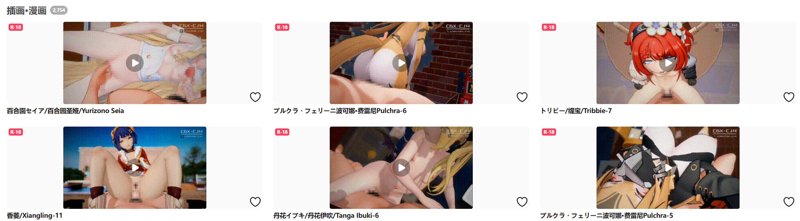
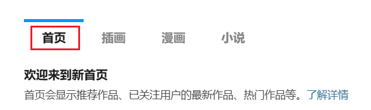
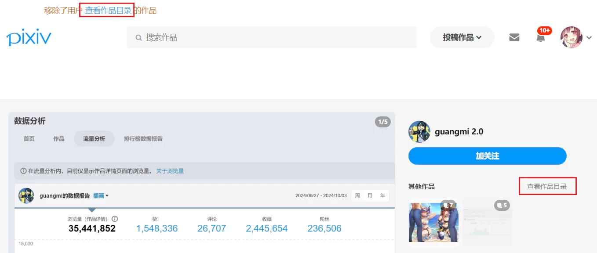
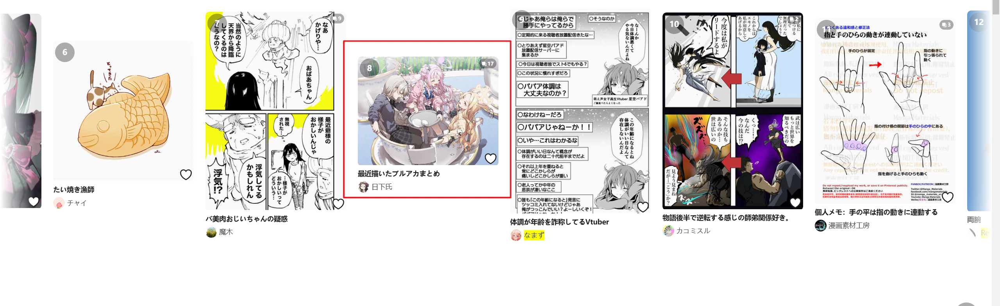
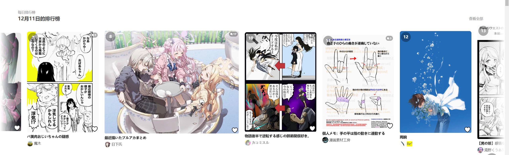
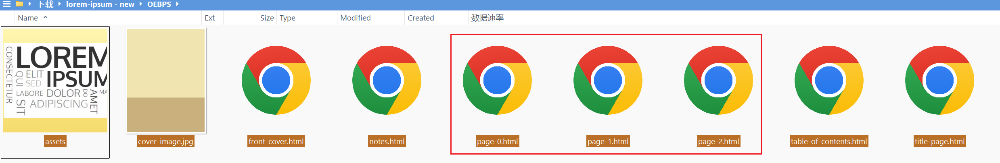
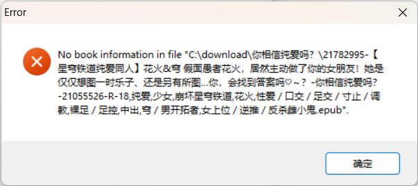

# CHANGLOG

TODO:
- 日语文本需要加粗显示关键字，但是我不懂日语，所以现在下载器的语言设置为日语时，不会显示加粗的关键字。
- 自动合并系列小说

## 17.6.0 2025/05/19

### 🗑️移除设置：隐藏浏览器底部的下载栏

以前 Chrome 浏览器有底部下载栏，但从 2023 年开始就没有了，所以这个设置已经不需要了。

根据下面这个网址里的说明，是从 Chrome V112 版本取消的底部下载栏：

https://groups.google.com/a/chromium.org/g/chromium-extensions/c/CMz8_t9YgL4

### 🗑️移除设置：添加命名标记前缀

“命名”分类下的“添加命名标记前缀”会为一些命名标记添加前缀，比如在 `{user}` 前面添加 `user_`。

但是这个功能只对少数几个标记有效，而且前缀是固定的，不够灵活，所以我移除了这个设置。

用户可以在命名规则里自行添加前缀以替代此功能，例如输入 `user {user}` 或 `用户名 {user}`。

### 💡为下载器的设置项添加了更多提示

下载器的一些设置项之前没有提示文字，或者过于简略，有时会导致用户产生疑惑。

现在我添加了更多的说明文字，以提高易用性。

### 🐧修改了QQ群号

之前的群因为有些人发色图导致信用降低，无法通过群号搜索了。所以我建了个新群。

### 🕑更新了作品发布时间数据

## 17.5.0 2025/04/17

### ✨支持了“好P友的新作品”页面

https://www.pixiv.net/mypixiv_new_illust.php

在这个页面里可以显示更大的缩略图、批量抓取等。

### 🤖把 Tag 列表里含有“AI生成”的作品也视为 AI 作品

之前选择器判断的是 `aiType === 2`，但是有些 AI 图作者自己选择的是非 AI 分类，所以 aiType 是 1，无法判断为 AI 图。

此时如果标签里有“AI生成”，那么就可以识别为 AI 图。

例如：https://www.pixiv.net/artworks/128886235

PS：“AI生成”这个标签在所有语言里都是一样的，不会变化。

### 🐛修复了在手动选择作品后，再切换页面后，被选择的作品缩略图上没有标记的问题

原因是新版页面里没有 `#root` 元素了，导致之前的一些代码失效。现在修复。

### 🐛修复了在作品页面里，切换到其他作者时，高亮状态没有变化的问题

原因同上。

### 🐛修复了“在搜索页面里移除已关注用户的作品 ”失效的问题

原因同上。

### 🐛修复了关注一个用户后，底部弹出的推荐用户列表里，不能预览缩略图的问题

### 移除了代码里的 #root 选择器

以前的 Pixiv 页面有 #root 元素，页面里大部分的可视元素都在里面，所以选择器有很多地方使用了 #root。

现在我用 3 个账号测试，页面里都没有 #root 元素了，所以从代码里也把它去掉了。

### 🕑更新了作品发布时间数据

## 17.4.0 2025/04/08

### 🐛修复了在搜索页面里，可能没有添加快速筛选区域的问题

现在有的 Pixiv 账号会遇到此问题，有的不会。原因是 Pixiv 页面改版了，有些账号的页面代码变化了，导致下载器在寻找一些 DOM 元素时找不到，因此功能失效了。

其中有个很大的变化是新版页面里没有 `#root` 元素了，因此下载器的很多功能都受到了影响。

现在修复。

### 🐛修复了在搜索页面里，抓取时没有生成预览图的问题

原因同上。

### 🐛修复了在一些页面里，高亮关注的用户的功能失效的问题

原因同上。

### 🐛修复了在许多页面里，“显示更大的缩略图”功能失效的问题

原因同上。

另外，地区排行榜以前不支持显示显示更大的缩略图，现在进行了支持。

---------

我对 `src\style\showLargerThumbnails.less` 里的代码也进行了优化。以前所有页面类型里的样式都在同一层级，当需要修改某个页面里的样式时根本找不到对应的样式。而且修改某些样式可能会影响多个页面里的表现。

现在我把每个页面类型里的样式分别保存，不再像以前一样是大杂烩了。

### 🐛修复了在新版首页，预览作品时按 B 收藏多图作品后，收藏按钮没有变红的问题

### 🗑删除了“横图占用二倍宽度”设置

这个设置的初衷是：以前一些横图夹杂在竖图之间，它们的宽度一样，但横图在高度上比较小，面积小，视觉效果不平衡。所以下载器把横图的宽度放大，使其与竖图达成视觉平衡。

但现在我感觉大多数时候已经不需要这个设置了，横图面积看起来不算太小。不知道是不是和以前相比，图片的样式也有发生变化？

而且这个设置在现在的样式下有时还会起反作用，因为它给横图作品设置了固定的 `width:30%`, 如果横图的原图没这么大，就会导致左右两侧出现空白区域。极端情况如下：

https://www.pixiv.net/users/106029976



### 🕑更新了作品发布时间数据

## 17.3.4 2025/03/30

### 🦊检测火狐浏览器，显示提示信息

有人在火狐扩展商店上传了这个扩展，但不是我发布的。
这个下载器不支持 Firefox，我也不会为其修复问题。

https://addons.mozilla.org/en-US/firefox/addon/powerful-pixiv-downloader/

现在下载器会显示提示：

```
你好！下载器检测到它运行在 Firefox 浏览器上。
有人在火狐扩展商店（ADD-ONS）发布了这个扩展，但不是我发布的。
这个下载器不支持 Firefox，可能会遇到一些问题。我不会为其修复问题。
```

但是 addons 里的这个扩展版本号停留在 17.2.0，没有更新，所以我现在添加这个提示，应该不会有显示出来的时候，除非他在 addons 里更新了这个版本。

### 收藏作品出现 403 错误时，显示提示

大量抓取或下载时，用户的 Pixiv 账号可能会被 Pixiv 禁止添加收藏，在收藏作品时会返回 403 错误代码。我有个账号就是这样。

PS：这不会影响取消收藏，可以正常删除收藏。也不会影响正常浏览和下载作品。

现在下载器会对收藏作品的 403 错误显示提示：`403 Forbidden, 你的账号已经被 Pixiv 限制`。


### 设置了下载器的字体，与 Pixiv 保持一致

最近浏览器的默认字体变成了 Noto Sans SC（思源黑体），之前是微软雅黑（我猜测这个变化可能和 Windows 11 最近的更新有关，在某些情况下的默认字体跌落到思源黑体）。

下载器的字体也变成了 Noto Sans SC，但是这与 Pixiv 不符，因为 Pixiv 设置的字体在 Windows 11 上渲染出来是微软雅黑。

```
font-family: win-bug-omega, system-ui, -apple-system, "Segoe UI", Roboto, Ubuntu, Cantarell, "Noto Sans", "Hiragino Kaku Gothic ProN", Meiryo, sans-serif;
```

所以我对下载器设置了相同的字体，使其维持原样（微软雅黑）。

例外：对于下载器面板上的 textarea 类型的输入框，其字体使用 `sans-serif`，也就是 Noto Sans SC。这是因为这些输入框里有大量的文字，而 Noto Sans SC 的字体没有微软雅黑那样撑的很大，看起来会更舒服。

至于下载器面板上的普通文字，使用微软雅黑是为了在低 PPI 屏幕上看的更清晰易读。

### 🐛修复了在排行榜页面里，下载器的 textarea 不会自动撑开高度的问题

这是因为 Pixiv 在该页面里的样式设置了 textarea 的高度固定为 20 px，导致下载器的 textarea 无法按照 row 的值撑开高度，现在修复。

### 🐛修复了在新版首页里，无法高亮关注的用户的 bug

这是因为下载器需要先检测用户是否登录了 Pixiv 账号，然后才会高亮关注的用户。

但新版首页里一些源代码产生了变化，下载器需要修改“检测用户是否登录”的代码，现在进行了适配。

### ✨在“抓取多少页面/作品”设置的后面添加了按钮，可以快速设置最小值和最大值

有时用户需要手动修改此设置，比较麻烦。现在下载器添加了一个按钮，点击就可以直接把值设置为最小值或最大值。

通常最小值是 1，最大值是 -1，不过有些页面可能会特殊一些，下载器会显示实际可用的值。

### 😊界面优化：预览作品时，收藏数量后面会显示爱心图标

如下所示：


第一个数字就是作品的收藏数量。之前只是单纯的数字，新用户可能不知道这代表的是哪一项数据。现在添加了一个爱心图标，就很容易明白是收藏数量了。

PS：这个爱心图标是个 svg 图标。我试过用 emoji 的心 ♥️，但是 emoji 不能更改颜色，所以就改成 svg 了，可以显示为和文字相同的白色。

### 为一些滚动事件设置 passive 参数

例如：

```js
el.addEventListener('mousewheel', this.onWheelScroll, {
  passive: false,
})
```

以前没有设置 passive 参数，导致触发这些事件时，浏览器会在控制台显示警告：


现在设置了 `passive: false`，明确下载器将会调用 `event.preventDefault()` 参数，这样浏览器就不会显示这个警告了。

### 🕑更新了作品发布时间数据

## 17.3.3 2025/03/26

### ✨适配了新版首页



Pixiv 的首页网址现在是一个单独的“首页”页面，而非之前默认的插画页面。

现在对这个首页进行了适配，可以正常预览图片、选择作品、下载作品、显示更大的缩略图。

### 🕑更新了作品发布时间数据

## 17.3.2 2025/01/11

### ✨对“发现-推荐用户”页面进行了有限的支持

https://www.pixiv.net/discovery/users

现在在这个页面里，选择器可以预览作品、快速下载、手动选择作品了。

PS：该页面不区分插画和小说，也就是说只有这一个网址，没有 `novel/` 页面。

### 🐛修复了在“大家的新作”页面里，预览作品等功能失效的问题

这个页面改版了，作品缩略图的选择器变化，导致在此页面里出现了一些问题：

- 预览作品功能失效
- 显示原图功能失效
- 缩略图右上角的查看和下载图标不会显示

现在修复了此问题。

### ⚙️“不下载重复文件”功能改为默认禁用

17.3.0 版本里我把“不下载重复文件”改为了默认启用，但是这引起了一些用户的困惑。

现在改回默认禁用。

### 优化了一些说明文字

`{series_title}`、`{series_order}` 、`{series_id}` 说明里的：

`只在系列页面中可用（小说系列、漫画系列）。`

改为

`当作品属于一个系列时可用。`

### 🕑更新了作品发布时间数据

## 17.3.1 2024/12/29

### 😊鼠标放到作品缩略图上时，不再立即加载作品数据，改为必要时才加载

之前为了让预览作品功能更快响应，下载器会在鼠标进入作品缩略图时会立即加载这个作品的数据。这样在等待时间结束后，就可以立即开始显示图片。

但这样会产生不必要的请求，因为用户即使不想预览作品，仅仅只是鼠标划过作品缩略图，也会产生请求。

多余的请求会产生不良影响：

1. 会增加触发 429 限制的可能性，特别是在抓取时
2. 对于 Pixiv 会员来说，只要请求过一个作品的数据，就会导致这个作品出现在浏览历史里。但这个作品用户可能根本没有打算看（预览）。

关于浏览历史的 issue：https://github.com/xuejianxianzun/PixivBatchDownloader/issues/444

https://www.pixiv.net/history.php

经过测试，浏览历史与用户是否开通了 Pixiv 会员有关系。

如果用户没有开通 Pixiv 会员，那么仅仅请求作品数据是不会让这个作品显示在浏览历史里的。必须打开作品页面才行。

但对于 Pixiv 会员，请求作品数据也会导致这个作品显示在浏览历史里。但很多作品用户并没有预览过，只是鼠标划过就导致出现在了历史里，很不合理。

所以现在下载器改成了在需要显示预览时（即鼠标停留在作品上一定时间后），才会发起请求。

### 😊预览作品时，记忆每个作品查看到了第几张图片

之前下载器不会记忆每个作品查看到了第几张图片，当用户预览一个新的作品时，之前的预览进度就丢失了。也就是再预览之前的作品时，会显示第一张图片。

现在下载器会记住浏览进度，这样在不同作品之间切换预览时，会从上一次预览到的地方开始。

PS：这个记忆是非持久的，刷新页面就没了。

与之相关的一个 issue：https://github.com/xuejianxianzun/PixivBatchDownloader/issues/451

他的问题是当预览一个作品时，按 C 开始下载，由于页面顶部出现了日志区域，导致鼠标脱离了作品缩略图区域，预览消失了。之后再次预览时，会显示第一张图片，丢失了之前的预览进度。

现在不会丢失预览进度了。

### 更新下载进度条时使用节流

下载进度的更新每秒钟可能会触发几十次、上百次。之前下载器没有做节流处理（没意识到这个问题，哈哈），现在做了节流处理。

不用节流的话，好处是进度更新很及时，下载进度是平滑增加的，视觉效果上很丝滑。

但是当下载器大量下载文件时，进度更新的总次数会非常多，这会导致内存占用微小且缓慢的上升。

使用节流就是为了避免上面的问题。现在下载器每 200 ms 更新一次进度信息。

### 每个 Log 区域保存的日志从 100 条增加到 300 条

大量下载时，日志区域太多的话会在页面顶部占据太多空间。这样可以减少日志区域的数量，以减少占据的高度。

### 修改了因为不下载重复文件而跳过文件时的提示

从：
检测到文件 78409039_p0 已经下载过，跳过此次下载

改为：
跳过 78409039_p0 因为：不下载重复文件

在上个版本里，我把“不下载重复文件”功能改为了默认启用，但这样有些新用户在看到下载器跳过文件时，不知道是哪个设置导致的。

新的提示里把设置名字写出来了，可能会有所帮助。至少也更简洁和直接了。

### 🐛修复了特殊情况下，在作品页面里会移除这个作者自己的元素的 bug

下载器会移除“用户阻止名单”里的用户的作品，但不会在该用户自己的页面里移除他自己的作品（否则就全都移除了，没法看到他的主页是什么样了）。

但是在这个作品页面里发生了意外：
https://www.pixiv.net/artworks/123098863

下载器移除了这个作者自己的一些元素（虽然不是作品元素，但也不应该移除）。


PS: 日志上显示移除的这个元素应该不是右侧红框里的元素，应该是作品详情下方的那个“查看用户目录”的链接。

原因是这个作品的简介里含有另一个作者的主页链接，而且在 body 里是第一个 /users/ 主页链接，先于这个作者自己的链接。

下载器在最早的几次检查里，会获取到简介里的错误的用户 ID，导致当前作者被认为是“另一个人”，从而移除了他的元素。

在之后的检查里，可以正确获取到当前作者的 ID，所以实际上不会移除他的作品。

现在下载器在这些页面类型里，会在 document complete 之后再执行检查，这样始终可以获取正确的作者 ID，修复了这个问题。

PS：`Tools.getCurrentPageUserID()` 是个不够可靠的 API，不过之前大多都是用户点击时才执行，所以不会受到这个特殊情况中的影响。这个情况里产生了问题是因为执行实际过早导致的。

### 🕑更新了作品发布时间数据

## 17.3.0 2024/12/12

### ✨新功能：从页面上移除“用户阻止名单”里的用户的作品

该功能默认启用。你可以在“更多”-“抓取”里找到这个设置。

下载器不会抓取“用户阻止名单”里的用户的作品，而且还可以从页面上移除他们的作品，这样你就不会看到不喜欢的用户的作品了。

PS：在被阻止的用户的主页里不会移除他们的作品，所以你可以正常查看他们的主页。

### ⚙️“不下载重复文件”功能改为默认启用

之前“不下载重复文件”功能是默认关闭的，经过投票，现在改为默认启用。

投票数据：在 33 票里，3 个人选择默认关闭，30 人选择默认启用。

### 😊优化特定情况下的抓取效率：抓取作品详情前预先检查过滤条件，以减少非必要的慢速抓取

https://github.com/xuejianxianzun/PixivBatchDownloader/issues/457

比如抓取一个作者的所有作品，并设置了过滤条件：只抓取今年发表的作品。
这个作者的 200 个作品只有 10 个作品符合条件，那么抓取作品详情时不应该使用慢速抓取模式。

之前下载器会使用慢速抓取，因为在决定是否慢速抓取时，判断的是作品总数量。现在改为提前检查过滤条件，这样可以判断只有 10 个作品需要发起请求，不需要使用慢速抓取，因此提高了抓取效率。

**注意：** 这种优化只能对部分过滤条件生效，它们不需要获取作品的详细数据就能够判断出是否符合要求。有些过滤条件必须请求作品的详细数据才能判断，此时无法应用这个优化措施。

### 😊根据文本长度，动态设置 textarea 的高度

一些设置的输入框是 textarea，例如：
- 不能含有标签
- 用户阻止名单
- 使用第一个匹配的标签建立文件夹。

之前这些 textarea 的高度（rows）固定为 1，当内容较多时，查看和编辑起来很不方便。

现在下载器会动态设置高度，最多允许同时显示 4 行（内容超过 4 行的话依然会显示滚动条）。

### 🐛修复了系列漫画最多只能抓取 100 页的问题

这个系列漫画有 252 页：
https://www.pixiv.net/user/1001918/series/5915
https://www.pixiv.net/user/1001918/series/5915?p=252

之前下载器最多只会下载到 100 页，页码大于 100 的话就会判断为抓取完毕。

现在修复了此问题，我把最大页码修改为了 1000 页，应该够用了。不知道有没有超过 1000 页的。

### 🐛修复了合并系列小说时，总会下载封面图片的 bug

上次更新导致少了一处条件判断，即使用户关闭了下载封面图，在合并系列小说时依然会下载。

现在修复。

### 🐛修复了“横图占用二倍宽度”在一些情况下没有生效的问题

分为两种情况：

1. 下载器识别到了横图，但由于缩略图本身宽度太小，导致只占据了完整宽度的一部分，如下：


此时横图作品宽度是 540px，但这些动图的缩略图宽度只有 320px。下载器确实把缩略图替换成 540px 的了，但即便如此，这些缩略图的真实宽度也只有 320px，所以没有填满宽度。现在修改样式使缩略图填满宽度。修复后如下：


2. 下载器未能识别到一些横图，主要是在首页一些横向滚动的区域里动态添加的横图。如关注用户的新作品，和排行榜区域。如下：



现在进行了修复，可以识别到这些横图了，同时还修改了一些 css 使其子元素能填满宽度。修复后如下：



### 🕑更新了作品发布时间数据

## 17.2.0 2024/11/13

### ✨新增设置：下载间隔

在“更多”-“下载”里添加了此设置：

```
下载间隔：当作品数量超过指定数量时启用：120 | 间隔时间：0 秒
```

每隔一定时间开始一次下载。
默认值为 0，即无限制。
如果设置为 1 秒钟，那么每小时最多会从 Pixiv 下载 3600 个文件。
如果你担心因为下载文件太频繁导致账号被 Ban，可以设置大于 0 的数字，以缓解此问题。

默认未启用（因为间隔时间默认是 0 秒）。

#### 技术细节

**当作品数量超过指定数量时启用**：
这个数量是抓取结果的总数量，而非剩余未下载的文件数量。
也就是说即使最后只剩下 1 个文件没有下载，也依然会应用间隔时间。

默认值 120 是因为多数页面 2 页里的作品数量不超过 120 个。下载超过 2 页的话才会应用间隔时间。

注意：小说的封面图和内嵌图片不会算在这个数量里，因为这些图片并不是一条抓取结果数据。所以 1 个小说只会算作 1 个数量。

**间隔时间**：

可以设置为小数。取值范围是 0 - 3600；可以设置的最长的间隔时间是 1 小时。不过应该没人会这么设置吧，哈哈。

间隔时间是在下载开始前生效的，也就是每个文件间隔 x 秒下载。它不是在文件下载后生效的。

对于不同的文件，处理如下：
- 插画、漫画、动图，每个文件之间都等待
- 小说：小说本体是 blob 文件，所以不需要等待间隔。但如果有封面和内嵌的图片，则每个图片之间都需要等待
- 对于因为一些筛选条件导致跳过下载的文件（包括跳过重复文件），不需要等待，直接放行

小说里的封面图和内嵌图片都是会应用间隔时间的。例如 1 个小说里有 10 张图片，那么每张图片之间都需要等待。这会导致这个小说需要花费比较多的时间才能完成下载。
并且下载内嵌图片期间可能会阻塞其他文件的下载（因为每次可以开始下载文件的时机都被用来下载内嵌图片了），不过也有可能多个小说同时下载时，它们的内嵌图片轮流下载。

设置了间隔时间后，下载依然是并发的，但是在下载速度很快的时候可能会表现为单线程（同时下载一个）。

假如设置 1 秒的间隔，如果文件下载都很快，都在 1 秒内完成。那么前面的文件下载完了，后面的还没有开始下载（因为要等待 1 秒的间隔时间），以同时只有 1 个文件在下载，表现为单线程。
如果文件下载的比较慢，假如都要 3 秒钟，那么前面的没下载完时，后面的就已经开始下载，这样是多线程的。

### 😄当日志数量很多时，不再清空日志区域

如果日志区域里显示的日志条数太多（比如几百、几千条），会占用比较多的内存，并且更新日志时页面也会很卡。

之前的策略是日志超出 300 条时就清空一次日志区域，但这会导致用户无法查被清空的日志。有时里面的一些错误提示可能是有用的。

现在不会再清空日志区域，而是改为每当有 100 条日志时就新建一个日志区域。旧的日志区域会被保留，这样用户可以查看到所有日志。

### 🐛修复了在发现页面中，不会高亮关注的用户的问题

高亮用名的 css 规则依赖于下载器添加的一个私有属性，例如：

```css
html[data-xzpagetheme="white"] body .pbdHighlightFollowing {
    background-color: yellow;
}
```

这是为了根据不同的主题颜色，显示不同的高亮颜色。

在发现页面里，之前从页面元素里获取颜色主题时失败，导致这个私有属性的值异常。

现在修复了这个问题。

### 🐛修复了在发现页面中，不能预览鼠标放在画师头像上显示的小图的问题

这些小图现在的选择器是 `div[size="112"]`。

### 🐛修复了在大家的新作品页面里，显示更大的缩略图功能失效的问题

### 😄添加和优化了一些提示

因为“预览搜索页面的筛选结果”不自动下载时，在抓取开始时显示一条提醒日志。

在常见问题里添加了下面的提示：
- 下载的文件保存在浏览器的下载目录里。如果你想保存到其他位置，需要修改浏览器的下载目录。
- 还有些扩展会导致下载器不能开始下载。
- 警告：频繁抓取和下载可能会导致你的账号被 Pixiv 封禁。

另外还替换了 QQ 群号，之前的群爆了。

### 在小说的元数据里添加了发表日期

我想查看发表日期时才发现元数据里没有包含发表日期。现在加上了。

### 🕑更新了作品发布时间数据

## 17.1.4 2024/09/26

### 🐛修复了在发现（discovery）页面中失效的问题

discovery 页面改版了，导致下载器的以下功能在 discovery 页面失效：
- 抓取作品（抓取不到）
- 预览图片
- 显示更大的缩略图

现在修复。

## 17.1.3 2024/09/01

### 🐛修复了同时下载多个小说时，下载小说中的插画进度显示不全的问题

从这个小说页面里抓取旧作品，并且设置里的下载数量大于 1：

https://www.pixiv.net/novel/show.php?id=22894530

日志里有些“正在下载小说中的插画”的进度没走完，如 6/10，就不更新了，而是开始显示新的下载的进度。

如果把同时下载数量设置为 1，则不会发生此问题。

这只是日志的显示问题，实际上所有插画都成功下载了。

原因是“正在下载小说中的插画”的日志是有标记的，之前都是相同的标记，导致同时下载多个小说时，它们输出的日志会互相影响。现在给每个标记都添加了小说的 ID，避免了互相影响，这样就正常了。

现在已修复此问题。

-------------

排查过程：

我先把同时下载数量设置为 1，正常下载了一遍。

在网络请求里搜索 `img-original`（这只包含引用的图片网址。不包含封面图和嵌入的图片），共有 227 条记录，是正确的。

共生成 46 个 epub 文件，总体积 432 MB。

然后我把同时下载数量设置为 5，再次下载，进行对比。（停用缓存）

下载过程中，全程都在同时请求 5 个图片，下载花费的时间确实比单线程下载少了很多。

此时的日志里显示的进度是不全的，部分日志如下：

```
正在下载小说中的插画 3 / 13
正在下载小说中的插画 4 / 4
正在下载小说中的插画 5 / 21
正在下载小说中的插画 6 / 13
正在下载小说中的插画 8 / 21
正在下载小说中的插画 11 / 13
正在下载小说中的插画 2 / 25
正在下载小说中的插画 3 / 25
正在下载小说中的插画 5 / 25
正在下载小说中的插画 10 / 25
```

下载完成后，在网络请求里搜索 `img-original` 也是 227 条记录。

对比文件总体积也是一样的，字节数都完全一致。

所以这个日志上的进度不全的问题，只是显示上出了问题，并不会影响实际的下载。

### 😄更换了下载小说中的插画时的 API，提高了效率，降低了触发 429 限制的概率

如果小说里的图片是引用自另一个插画作品的，如 `[pixivimage:121979454]`，之前下载器会请求这个插画作品的详细数据，来获取这个图片的 URL。小说里引用了多少个插画作品（按插画 ID 算），下载器就要发起多少个请求。

一个很明显的问题就是，如果小说里含有的图片数量较多（特别是批量下载多个小说时），就需要发起很多个请求来获取图片 URL，容易触发 429 限制。

现在我发现 Pixiv 官方用的是另一个 API，可以在一次请求中批量获取所有引用的图片的 URL，如：

https://www.pixiv.net/ajax/novel/22894530/insert_illusts?id%5B%5D=121979454-1&id%5B%5D=121979454-2

参数 `id[]` 可重复使用，以便一次获取多个图片的 URL。

这样每个小说只需要发起一次请求，就可以获取里面所有图片的 URL。这样大大减少了请求数量，效率更高，也不容易触发 429 限制了。

至于这个 API 一次可以传递多少个 `id[]` 参数，我并不清楚，目前最多的是一个小说里含有 130 个图片，这个 API 正常返回了所有图片的数据。

备注：这个 API 里必须传递小说的 ID，所以它只能获取指定小说里的所有图片 URL。推测是小说数据库里含有这个字段，可以低开销的获取里面图片的 URL。

我试过了，不能自由的传递任意图片 ID 来获取图片的 URL，否则就太方便了。

### 😄添加了下载小说图片时，请求失败的错误处理

1. 处理了 insert_illusts API 遇到 429 限制时的问题，会等待一段时间后重试。不过似乎没有这个必要，因为我试了先触发 429 限制，然后下载小说，这个 API 依然可以正常使用，可见它不在 429 限制的范围之内。
2. 处理了下载小说里的插画时，插画下载失败的问题。失败并不会重试，不过相比之前，这个错误被 catch 了，不会阻塞下载流程了。

## 17.1.2 2024/08/28

### Merge PR

https://github.com/xuejianxianzun/PixivBatchDownloader/pull/419

epub: fix send-to-kindle failure on notes.html

### 🕑更新了作品发布时间数据

## 17.1.0 2024/08/17

### 😄优化了一些提示

- 优化了“抓取多少页面”设置项的提示（_设置页数的提示）
- 优化了命名标记的提醒，提示可以在命名规则里使用自定义字符
- 优化了文件名异常（变成 UUID 形式）时的提示
- 优化 429 错误的一处提示

### 😄点击“开始抓取”按钮时，如果有之前的抓取结果则进行询问，以避免误操作

https://github.com/xuejianxianzun/PixivBatchDownloader/issues/411

每次开始抓取时会清空之前的抓取结果。有时用户可能会误操作导致之前的抓取结果被意外清空，所以现在添加了询问，以避免误操作带来的损失。

因为在抓取和下载过程中是无法开始抓取的，所以上面的误操作只会发生在抓取完成后，且没有处于下载状态时，包括未开始下载、下载途中暂停、下载途中停止。

### 🐛修复了在漫画页面里，“在多图作品页面里显示缩略图列表”区域可能会重复添加的问题

在漫画页面里点击图片下方的“阅读作品”时，页面 URL 会产生变化（在网址后面添加了 `#1` 这种格式的 hash 值）。当点击返回按钮时，又会变回原网址。

之前我没注意到这个现象，这导致了在页面来回切换时，重复生成了“在多图作品页面里显示缩略图列表”区域。

现在修复了此问题。

### 日志区域支持多条刷新日志了

之前只支持 1 条刷新日志，但这样当有多条刷新日志时就会冲突。例如在显示下载进度的同时还要显示另一种操作的进度，就需要两条刷新日志。

现在的日志区域支持添加任意多条的刷新日志了。

### 更换了生成 EPUB 小说的库

下载器之前用的是 js-epub-marker.js:
https://github.com/bbottema/js-epub-maker

当小说里的图片很多并且总体积很大时，它生成的 EPUB 文件存在严重的性能问题。EPUB 阅读器会很难打开生成的 EPUB 文件，或者打开速度很慢、卡顿。

关于此问题的记录，详见 `notes/当小说保存为 EPUB 格式，且有很多内嵌图片，总体积很大时，存在严重性能问题的记录` 文件夹。

这是因为两个原因：
1. 即使有多个章节，它也只会生成一个 html 文件。这意味着单个 html 里可能存在过多的内容（特别是图片）。
2. 在保存图片方面，它只能保存封面图，没有添加其他图片（如文章里的图片）的功能，所以我只能把图片转换成 base64 格式内嵌在 html 里。这会导致文件体积增大，以及解析时有额外的性能损耗。

假设有一个含有 100 多 MB 图片的系列小说，由于它只有一个 html 文件，所以点击每个章节都会把这个 html 文件完整的解析一遍。这是重复并且浪费资源的。我需要的是每个章节保存在单独的 html 文件里。

我尝试搞明白它到底能不能为每个章节生成一个单独的 html 文件，但看来似乎是不可能的。因为它生成的文件里，每个章节的内容都被放在一个固定名字的 content.xhtml 里，用不同的 hash 做区分。如果要生成多个文件，那么应该能看到不同的 xhtml 的文件名，但这里只有一个 content.xhtml。

并且它生成的所有文件都是相同的文件名。

我找到了另一个生成 EPUB 的库，它的 demo 就是我想要的，每个章节保存一个单独的 html 文件：



这个库是 jEpub：
https://github.com/lelinhtinh/jEpub

但是它存在另一个问题，就是它依赖 ejs，而 ejs 是个字符串模板框架，它会动态构建 JavaScript 代码，这导致它无法在 Pixiv.net 里运行，会报错：

```
ejs.min.js:1 
Uncaught EvalError: Refused to evaluate a string as JavaScript because 'unsafe-eval' is not an allowed source of script in the following Content Security Policy directive: "script-src 'self' 'wasm-unsafe-eval' 'inline-speculation-rules' http://localhost:* http://127.0.0.1:*".
```

ejs 的这个问题现在也无法解决：https://github.com/mde/ejs/issues/468

这导致 ejs 未能成功运行，而依赖 ejs 的 JEpub 在运行时也会因 ejs 未定义而产生错误，导致无法生成 epub 文件。

我修改了 jepub.js 的代码，解除了对 ejs 的依赖。

### 😄优化下载器生成的 EPUB 小说的文件体积和性能

现在每个章节会单独生成一个 html 文件保存，而不是所有内容都塞在一个 html 里。

另外图片文件会单独保存，而不是内嵌在 html 里，这可以减小文件体积（相比于使用 DataURL 保存图片），以及优化解析页面时的性能。

### 🐛合并系列小说时，可以保存正确的封面图片

之前保存系列小说时，把第一篇小说的封面图当作系列的封面。

但实际上系列的封面可能是另一张图片，现在可以保存真正的封面图了。

### 😄保存小说时简介转换为纯文本

之前的简介保存的是其原始数据（可能含有 html 标签），并且下载器对一些特殊字符进行了替换，导致可读性差，一些超链接也不能用了。

现在只提取文字内容，这样可读性更好。

### 🐛修复小说标题里含有 & 符号导致生成的 epub 无法阅读的问题

https://www.pixiv.net/novel/show.php?id=21782995

这个小说标题里含有 `&` 符号，之前下载器将 `&` 转换成 `&amp;`，但是这会导致 epub 无法解读。



将 epub 解压，看到里面的文件名前半部分就是标题名，可能是因为里面包含了 `&amp;` 导致了错误。


将标题里的 `&` 原样保留不做改动，产生了新的错误，报告说 content html 里这一行解析错误：


```html
<title>【星穹铁道纯爱同人】花火&穹 假面愚者花火，居然主动做了你的女朋友！她是仅仅想图一时乐子、还是另有所图…你，会找到答案吗♡～？</title>
```

```
This page contains the following errors:
error on line 5 at column 24: EntityRef: expecting ';'
```

这还是 `&` 符号导致的，看来只能将其彻底去掉。将 `&` 替换为普通字符如 `and` 之后问题解决，epub 可以正常打开阅读了。

ps：这个修改不会影响 epub 文件的文件名，因为文件名是命名规则的 `{title}` 生成的，一直就是原本的 `&`。这个修改影响的是 epub 内部的文件名和 content html 里的 title。

### 🐛修复抓取小说时，有时抓取到的数量不够的问题

有些小说列表页面之前一页是 24 个小说，最近变成 30 个了。下载器还按一页 24 个抓取就会导致抓取数量低于预期。

现在修复此问题。

发生这个变化的页面有：
1. 自己收藏页面里的小说列表 https://www.pixiv.net/users/9460149/bookmarks/novels/
2. 作者主页的小说列表 https://www.pixiv.net/users/16208053/novels
3. 搜索 tag 的小说列表 https://www.pixiv.net/tags/%E5%87%8C%E8%BE%B1/novels?ai_type=1

### 🐛修复了在搜索页面抓取时，vip 优化策略可能出错导致抓取中止的问题

在搜索页面，下载器每抓取 10 页，就会检查一次最后一个作品的收藏数量。

问题是当需要检查时（也就是 10 的整数倍页数），有可能这个页码里的数据是空的（超出了最后一页，表示已经抓取完毕）。
之前下载器没有在这里检查数据是否为空，导致数据为空时出错，抓取中止，无法完成。

现在修复了此问题。

### 🕑更新了作品发布时间数据

## 17.0.0 2024/05/07

### ⚙️可以设置慢速抓取时的间隔时间了


以前下载器使用 1600 ms 的时间间隔，但某些用户表示这依然会遇到 429 错误，他们希望可以加大间隔时间。

现在我添加了这个设置，它位于“更多”-“抓取”-“减慢抓取速度”-“间隔时间”。

### 小说搜索页面也支持会员搜索优化策略了

### 会员搜索优化策略在抓取列表页时也会生效了

这是新增的一个优化策略。下载器在抓取时分为两个阶段：

1. 抓取列表页（获得作品 ID 列表）
2. 抓取每个作品的详情

之前只在阶段 2 有优化策略，现在阶段 1 也有了。这可以减少很多不必要的抓取。

设想某个标签有 1000 页作品，前面 10 页的收藏数量都大于 30000。用户要抓取收藏数量大于 30000 的作品。

理想的效果是下载器只抓取 10 页，但之前下载器会把这 1000 页全部抓取。这是因为之前在抓取列表页时没有优化策略。在必须使用慢速抓取来避免 429 的情况下，这会浪费很多时间。

所以我进行了优化，现在在抓取列表页时，每隔 10 页会检查最后一个作品的收藏数量是否满足要求，如果低于用户设置的最低收藏数量，就不再抓取后续列表页，直接开始抓取已有作品列表。

这可以避免抓取很多不必要的作品页。

### 修复会员搜索优化策略在获取作品详情阶段存在的问题

如果用户设置收藏数量条件为： >= 100 && <= 200

由于热门度排序总是按收藏数量从高到低排列的，这种收藏数量小的作品会处于很后面，导致前面几十个甚至几百个都不满足收藏数量要求。

之前优化策略是：连续 30 个作品的收藏数量不符合要求时，就停止抓取后续作品。但在上面的情况里，一开始是抓取不到的（因为前面的作品收藏数量很高），连续 30 次之后停止抓取的话，就会导致没有任何抓取结果。这是错误的。

现在改为只检查作品收藏数量是否大于等于用户设置的最小收藏数量，不检查是否满足最大收藏数量。这样解决了上面的问题。

### 解决了一些动图保存为 GIF 时，色差过大的问题

https://github.com/xuejianxianzun/PixivBatchDownloader/issues/399

之前下载器转换 GIF 固定使用质量 10，现在动图的原文件体积越小，就会使用越好的质量，这可以有效解决某些手绘动图保存为 GIF 时，色差过大的问题。

虽然有时使用最佳质量依然无法完全避免色差，但是比之前还是要好很多。

### 🕑更新了作品发布时间数据

## 16.9.0 2024/03/30

### ✨新增功能：保存作品简介


在“下载”选项卡里可以找到该功能，默认未启用。

启用后，可以根据自己的需要启用子功能。

- 每个作品分别保存：下载时，每个作品分别建立一个 TXT 文件，里面只保存了简介。如果简介里有网址链接，则文件名末尾会加上 `links` 字符。
- 汇总到一个文件：抓取完成后，立刻生成一个汇总文件，保存了每个作品的文件名和它对应的简介。

### 优化保存简介时的文本

以纯文本形式保存简介时，优化了对简介里一些超链接的处理。

另外，导出抓取结果为 CSV 时，里面的简介一栏之前是简介的 html 源代码，现在也改为纯文本，以提高可读性。

### 🐛修复了合并系列小说为 epub 格式时，无法打开的问题

和上次的问题原因一样，但是上次只修改了下载单个小说的代码，忘记了合并小说也需要进行修改。现在修复。

### 🕑更新了作品发布时间数据

## 16.8.1 2024/03/22

### 🐛修复了下载的 epub 小说无法打开的问题

上个版本更新导致的 bug，现在修复此问题。

----------

用户向我报告 epub 小说无法打开的问题，我试了下，EPUB File Reader 会报错：


经过检查，这是因为 `dc:rights` 标签里面的 `<br>` 标签没有闭合标记导致的：


上个版本里处理 HTML 转义字符时用了个新函数 `htmlDecode`，小说简介也用这个函数处理了，但是这个函数返回的值是 html 5 规范的，所以简介里原本的 `<br/>` 变成了 `<br>`，导致 epub 格式出错。后处理一下就修复了。但是这个 bug 在之前确实没有预料到。epub 格式只能用 html 4，太烦了。

### 🕑更新了作品发布时间数据

## 16.8.0 2024/02/29

### ✨新增功能：导出和导入收藏列表

在你处于自己或其他人的收藏页面里时，可以在下载器的“更多”分类里找到此功能。

你可以导出自己或其他用户的收藏列表，然后批量添加收藏。

这可以用来拷贝其他用户的收藏列表。

另外，如果你有多个 Pixiv 账号，想要同步它们的收藏列表，可以先导出一个账号的收藏列表，然后使用其他账号导入收藏列表。

提示：下载器导出的收藏数据里包含你为这个作品添加的标签。导入时也可以添加（恢复）这些标签，前提是在“下载器的收藏功能 (✩) ”里选中了“添加标签”。

### 🐛修复了作品简介里的 HTML 转义字符没有处理的问题

https://github.com/xuejianxianzun/PixivBatchDownloader/issues/387

Pixiv 会把简介里的一些特殊字符进行转义处理，例如我投稿了一个作品：

https://www.pixiv.net/artworks/116420283

我输入的简介是：

```
1,2,3,4'5'6'
```

API 返回的数据实际上是：

```
1&#44;2&#44;3&#44;4&#39;5&#39;6&#39;
```

之前我没有发现这个问题，所以下载器在导出抓取结果、保存作品元数据时，使用的是转义后的字符。

现在处理了此问题，保存的是正常字符了。

### 🐛修复了预览作品时快捷键可能冲突的问题

https://github.com/xuejianxianzun/PixivBatchDownloader/issues/386

下载器在预览作品时会使用 B、C、D 等快捷键。之前没判断用户按 Ctrl 的情况，导致用户按 Ctrl + C 也会触发下载器的 C 快捷键。

现在修复了此问题。

### 🕑更新了作品发布时间数据

## 16.7.1 2024/02/02

### 🐛修复了收藏页面里预览作品功能的异常情况

https://github.com/xuejianxianzun/PixivBatchDownloader/issues/385

## 16.7.0 2024/02/01

### ✨新增功能：预览作品时，可以使用方向键和空格键切换图片

之前在预览作品时，用户只能使用鼠标滚轮切换图片。但是这对于使用触摸板的用户很不友好。

现在用户可以使用方向键和空格切换图片了，就像一些本地的图片查看器一样。如下：

- ← ↑ 上一张图片
- → ↓ 下一张图片
- 空格 下一张图片

该功能默认启用。如果你想关闭它，可以在更多-增强-预览作品里关闭“使用方向键和空格切换图片”。

另外，现在你还可以用 Esc 键关闭预览图，按下 B 键收藏这个作品。

### 🐛修复了约稿页面“显示更大的缩略图”失效的问题

约稿页面经常失效，这次修复之后我尝试进行了一些处理，希望能减少失效的频率。

### 😄优化“在搜索页面里移除已关注用户的作品”功能

现在当你新关注了一个用户时，搜索页面里他的作品会被立刻移除。

### 💡优化一些提示

### 🕑更新了作品发布时间数据

## 16.6.0 2024/01/29

### ✨新增功能：在搜索页面里移除已关注用户的作品

这样只会显示未关注用户的作品，便于你发现新的喜欢的用户。

提示：
- 只在搜索页面生效。
- 在图片和小说搜索页面均可生效。

### 💡优化一些文本和提示

### 预览作品时，标题栏上会显示 AI 生成标记

### 🕑更新了作品发布时间数据

## 16.5.3 2023/11/28

### 🐛修复一些页面里显示更大的缩略图失效的问题

Pixiv 最近的变化导致搜索页面、发现页面、约稿页面、作品下方相关作品等缩略图的放大失效，现在修复。

### 😄自动处理某些动图不能转换为 WEBM 视频的问题

https://github.com/xuejianxianzun/PixivBatchDownloader/issues/369

有些视频至少有一个帧延迟大于 32767 ms，这导致它不能转换为 WEBM 视频。之前，这会导致这些文件的下载进度条卡住，因为转换出错并且错误没有被处理。现在下载器会检查这种情况并将其转换为 GIF 图像，避免下载卡住的问题。

### 🕑更新了作品发布时间数据

## 16.5.2 2023/11/14

### 🐛修复了下载器的快速收藏按钮功能异常的问题

https://github.com/xuejianxianzun/PixivBatchDownloader/issues/367

16.5.0 版本添加“下载推荐作品”功能时，导致了下载器的快速收藏按钮出现异常，它不能为作品添加标签，也不能收藏为非公开。

现在修复此问题。

## 16.5.1 2023/11/13

### ⚡优化了特定情况下的抓取效率

解决了这个功能需求：https://github.com/xuejianxianzun/PixivBatchDownloader/issues/364

当用户设置了只下载图像或小说的其中一种时，例如下图的情况：


或者：


下载器在抓取作品数据之前会先判断这个作品是图像还是小说，如果不需要抓取，就直接跳过它。这样可以避免不必要的请求，加快抓取速度。

**注意：**

对于图像作品，它可能是插画、漫画、动图这三种类型里面的任意一种，但是下载器在抓取之前无法判断它具体属于哪一种（实际上，有的时候是确定的，有的时候则不确定。为了在所有情况下都不出错，就都视为不确定）。

所以当你勾选了插画、漫画、动图三者中的任意一个，那么对于一个图像作品，下载器总是会发送请求，然后才能判断它到底符不符合要求。

举个例子，在首页用户可以手动输入 ID 列表进行下载。如果我输入一个 ID `99636469`，请问它是插画、漫画、动图里的哪一种？这是没有办法事先就知道的，三种都有可能。所以如果你勾选了插画、漫画、动图里的任意一个，那么此时下载器总是会发送请求。 

### 🐛修复了下载器不能识别小说首页的问题

之前小说首页的 pathname 是有斜线结尾的 `/novel/`，但是不知何时起没有了结尾的斜线，变成了 `/novel`，这导致下载器将小说首页识别为不支持的页面，只能使用手动选择作品的功能。

现在修复此问题。

### 🐛修复约稿页面里显示更大的缩略图失效的问题

约稿页面的放大失效，现在修复。

### 🕑更新了作品发布时间数据

## 16.5.0 2023/11/10

### ✨新增功能：支持下载推荐作品

在插画作品页面里，收藏作品之后会显示推荐作品。现在下载器可以下载这些推荐作品了。

在 PC 版和移动版网页里都可以使用此功能。截图如下：


----------

首先通过某些特定的选择器检查推荐作品区域是否已经出现。出现之后就可以获取到推荐的作品列表了。

推荐作品固定显示 20 个，不会因为左右切换显示而动态变化。而且我发现这 20 个就是页面底部“相关作品”的前 20 个。

检测到推荐作品时，选择器会在该区域显示一个下载按钮，点击就可以下载这些推荐作品，而且总是会自动开始下载。

### 😄优化快速收藏功能

之前在作品页面里，点击下载器的快速收藏按钮（五角星✩）之后不会显示推荐作品。现在会显示推荐作品。

另外，现在可以使用快捷键 `Ctrl` + `B` 来执行快速收藏。

### 🐛修复了特定情况下，预览作品的详细信息的面板消失后，预览图区域没有按预期消失的问题

预览作品的详细信息的面板有两种消失方式：
1. 鼠标点击
2. 鼠标移出面板区域

当面板消失时，鼠标可能位于作品缩略图区域之外。此时预览图也应该消失，但是之前没做检测，所以预览图依然会显示。

现在修复了此问题。

### 🐛修复显示更大的缩略图失效的问题

P 站改版导致失效，现在修复。

### 🕑更新了作品发布时间数据

## 16.4.0 2023/10/20

### ✨新增功能：预览作品的详细信息

在更多-增强里可以看到此设置。默认未启用。

启用后，当鼠标放在作品缩略图上时，下载器会显示作品的一些详情，类似于作品页面里显示的样式，但是内容更丰富。

在顶部会显示 R-18(G) 标记以及 AI 标记（如果符合条件的话）。

在底部有两个复制按钮，第一个按钮 Cpoy TXT 可以复制作品的一些摘要数据；第二个按钮 Copy JSON 可以复制作品的原始 JSON 数据。

### 优化了保存作品元数据到 TXT 文件时的内容

添加了一些字段，并且调整了一些字段的顺序。

现在它输出的内容是调整到与上面说的 Cpoy TXT 按钮输出的内容基本一致，但是多了一个 Thumbnail 字段。

现在的 TXT 内容可能是这样的：

```
ID
99143068

URL
https://www.pixiv.net/i/99143068

Original
https://i.pximg.net/img-original/img/2022/06/19/00/00/56/99143068_p0.png

Thumbnail
https://i.pximg.net/c/250x250_80_a2/custom-thumb/img/2022/06/19/00/00/56/99143068_p0_custom1200.jpg

xRestrict
AllAges

AI
Unknown

User
そらなにいろ

UserID
4357504

Title
シスターエロフ

Description
https://sora72iro.fanbox.cc/posts/4001096

Tags
#オリジナル
#エルフ
#シスター
#爆乳
#ふともも
#エロフ
#性職者
#エロ衣装

Size
1104 x 1865

Bookmark
87577

Date
2022-06-18T15:00:00+00:00
```

### 优化了复制文本到剪贴板的代码

之前输出面板复制文本使用的是操作 Range 选择范围，之后通过 document.execCommand('copy') 命令实现复制。

但是 execCommand 已经被标为弃用，而且这个方法的完整代码是要设置范围起点和终点，太麻烦了。

现在因为预览作品的详细信息时也需要复制内容，所以我使用了新的复制方法，Clipboard 对象的 write() 方法：

https://developer.mozilla.org/zh-CN/docs/Web/API/Clipboard/write

提示：使用这个方法不需要授权。

### 🐛修复了首页的排行榜区域的“显示更大的缩略图”异常的问题

### 🕑更新了作品发布时间数据

## 16.3.2 2023/09/15

### 🐛修复了批量关注用户时，如果已关注用户数量为 0，会停止执行的问题

也就是说，如果有一个新的 Pixiv 账号，没有关注任何人，那么使用批量关注功能时，会因为抓取结果为 0 而停止执行。

现在修复此问题。

### 🕑更新了作品发布时间数据

## 16.3.1 2023/09/05

### 在作品元数据的 TXT 文件里保存原图和缩略图网址

之前 TXT 里没有 Original 和 Thumbnail 的 URL，从这个版本开始会保存这两个网址。

### 💡优化一些文本和提示

完善了一些提示。

另外在移动端页面使用时，不会弹出快捷键的提示，因为移动端没法用快捷键。

### 🐛修复了“显示更大的缩略图”失效的问题

因为近来此功能频繁出问题，所以我把它改为默认关闭了。

### 🕑更新了作品发布时间数据

### 其他

我想尝试在移动端长按缩略图时显示原图。但是这遇到了一些麻烦，最后我放弃了。

移动端的长按事件可以通过 touchstart 启动一个定时器来处理。touchmove 和 touchcancel 事件取消定时器。

但是显示原图后，还要处理缩放和移动的操作，这在移动端也是挺麻烦的。

另外显示原图功能还依赖于预览作品功能给它传递图片 URL，所以还需要修改预览作品的代码，这太麻烦了。最后我放弃了。

说到预览作品功能，如果在移动端启用，它会在长按缩略图显示上下文菜单时显示。

## 16.3.0 2023/08/29

### ✨新增功能：抓取时可以在标题栏上看到有多少个抓取结果

之前下载器会在下载时在标题栏上显示剩余数量。

现在在抓取阶段也可以显示抓取到的结果数量了。

### ✨新增功能：每隔 30 天显示一次赞助消息

求赞助~

### 🚸定时抓取时，使用Input组件输入间隔时间，优化用户体验

之前如果用户想修改间隔时间，需要先去“更多”里面查看或修改“定时抓取的间隔时间”设置，然后回来点击“定时抓取”按钮。

现在用户只需点击“定时抓取”按钮，下载器会提示用户设置间隔时间，此时可以方便的确认和修改时间。

另外，定时抓取开始后，用户再去修改间隔时间会在下一次执行抓取时生效。以前是不会生效的，始终使用开始时的间隔。

### 🚸在首页通过输入 ID 抓取时，使用Input组件，优化用户体验

### 🚸优化一些设置项的易用性

宽高比例设置之前容易搞错，最近我就搞错了，如图：


该设置的默认值是“横图”，但此时“宽高比”的子选项也是显示的。

我修改了宽高比的数字为 `1.6`，但这是无效的，因为此时宽高比例还是默认的“横图”，而非“宽高比”。所以“宽高比”的子选项不会生效。

现在我让子选项只会在选择了“宽高比”之后才会显示，避免了这种错误的发生。


### 🐛修复保存小说内嵌图片时可能发生的 bug

如果满足这些条件：
1. 用户未登录
2. 小说里的某个图片是通过插画作品 ID 引入的
3. 这个插画作品在用户未登录时获取不到 urls（都是 null）

那么这会导致图片保存错误，并导致这个小说因出错而无法保存，下载也就无法完成。

现在修复了这个 bug。

### 🕑更新了作品发布时间数据

## 16.2.1 2023/08/22

### 🐛修复了收藏页面一些功能的 bug

`移除本页面中所有作品的标签` 和 `取消收藏本页面中的所有作品` 每次只应该获取当前页面的收藏，但上个版本的修改导致它们会获取全部收藏。

现在修复此问题。

### 💡优化一些提示

## 16.2.0 2023/08/21

### ✨新增功能：取消收藏所有已被删除的作品

在用户自己的收藏页面里，打开下载器的“更多”标签页就可以看到这个功能按钮。

此功能会获取全部收藏数据，并从中找出已不存在的作品，取消收藏它们。

文档：`notes/从书签中移除被删除（404）的作品.md`。

我收藏的 29624 个作品里检查出 2054 个被删除的作品，比例比我想象中的更高。

### ⬆️优化了“取消收藏本页面中的所有作品”功能，使其花费的时间减半

之前执行这个功能时，流程是这样的：
1. 获取这一页收藏的作品的 ID 列表
2. 对于每个 ID，发送请求获取详细的数据，提取出 bookmarkData 数据
3. 发送请求来删除这个收藏

现在我发现在步骤 1 里就包含了 bookmarkData 数据，所以步骤 2 是不需要的，现在将其删除。

之前删除每个收藏需要发送 2 个请求，现在只需要发送 1 个，提升了效率。

### ⬆️优化了“移除本页面中所有作品的标签”功能，使其花费的时间减半

原理同上。

### 🐛修复了“显示更大的缩略图”的一些问题

搜索页面显示的几个热门作品之前超出了其原大小范围，导致只显示一部分，现在修复。

### 💡优化了定时抓取的提示

### 🕑更新了作品发布时间数据

## 16.1.3 2023/08/12

### 🐛修复了抓取完成时可能卡住的 bug

当用户启用 “ID 范围”设置时，下载器可能会在抓取完成时出错，导致任务卡住，无法完成抓取并开始下载。

上个版本的修改“修复了慢速抓取功能导致时间范围的优化策略失效的问题”导致了此问题。现在修复。

---------

这是下载器的 10 个并发抓取线程引起的问题。以下是分析。

假设在一个画师主页，抓取 1 页，并要求 ID 大于某个作品的 ID。并且符合条件的结果少于 10 个。

涉及这部分的流程是这样的：

首先，下载器建立抓取任务，默认是 10 个并发：

```js
for (let i = 0; i < this.ajaxThread; i++) {
  this.getWorksData()
}
```

执行 10 个 getWorksData，完成后执行 10 个 afterGetWorksData，里面有预检查下一个 ID 的代码。于是这里也是一批 10 个。

上个版本预检查 ID 的代码如下：

```js
const nextIDData = store.idList[0]
const check = await filter.check({
  id: nextIDData.id,
  workTypeString: nextIDData.type,
})
if (!check) {
  return this.getWorksData()
}
```

这里检查 ID 不通过的话，会直接再次进入 getWorksData，而不需要等待下面的慢速抓取的时间间隔。

但是这也导致了执行到最后几个作品 ID 时，getWorksData 里报错，并且程序因异常而无法继续执行，卡住了。


原因：假设前面的 ID 都被排除了，最后只剩下 4 个 ID 符合要求。执行到这里时，一批 10 个预检查都会获取首个 ID 检查，并且都通过了，那么就返回了 10 个 getWorksData。

但是 4 个 ID 不够 10 个 getWorksData 用，获取不到 ID 的时候就发生了上面的错误。

最简单的修复方法就是处理这个错误。当没有 ID 可用时，直接进入抓取完成的流程：

```js
idData = idData || (store.idList.shift()! as IDData)
if (!idData) {
  return this.afterGetWorksData()
}
const id = idData.id
```

这已经可以修复错误，但是还能进一步优化。

------------

第一个优化：使用定时器让每个 getWorksData 都在空闲时才建立：

```js
for (let i = 0; i < this.ajaxThread; i++) {
  window.setTimeout(() => {
    this.getWorksData()
  }, 0)
}
```

之前是用同步代码立刻执行 10 个 getWorksData，现在用定时器把 getWorksData 放到宏任务里。

同步代码执行完成后，首先执行 1 个宏任务，也就是第一个 getWorksData。

之后 ID 被预检查时， `await filter.check` 是微任务，所以会尽快执行。如果 ID 被过滤掉了，那么就继续向下执行同步代码，然后又是 await 微任务。

所以不管处理了多少个 ID，只要这些 ID 都是会被过滤掉的，那么就只存在 1 个 getWorksData。直到遇到了需要发送网络请求的作品，因为需要等待网络请求，此时剩余的 9 个 getWorksData 宏任务才会开始执行。

不过这样最后还是会产生 10 个 getWorksData，还是会有一些 getWorksData 没有 ID 可用。怎样彻底避免没 ID 可用的问题呢？

第二个优化：在定时器回调里，判断有 ID 可用才会执行 getWorksData，没有的话就不执行，这样就不会出现 ID 不够用的问题了。

```js
for (let i = 0; i < this.ajaxThread; i++) {
  window.setTimeout(() => {
    if (store.idList.length > 0) {
      this.getWorksData()
    } else {
      this.afterGetWorksData()
    }
  }, 0)
}
```

第三个优化：当预检查不通过时，之前是直接返回 getWorksData，让 getWorksData 再次检查并删除这个 ID。现在在预检查里直接删除这个 ID，之后 getWorksData 里检查的就是下一个 ID 了。

```js
if (!check) {
  store.idList.shift()
  return this.getWorksData()
}
```

之前一轮只会删除 1 个 ID，现在一轮可能会删除 2 个 ID（如果这个 ID 未通过预检查的话）。这样就减少了整个流程循环的次数。

至此问题完美解决。

### ✨支持在长按鼠标右键时显示大图，对动图进行缩放

右键预览大图时可以通过鼠标滚轮来缩放画布尺寸。但是我发现动画不会随画布尺寸变化，现在进行了完善。

### ✨新增了 Input 组件

通过引入 `Input.ts` 可以在页面上显示一个输入框（input 或者 textarea），并且可以通过一些选项进行配置，以接收用户的输入。

它看起来可能会像这样：


不过目前在主分支里并没有实际使用它。

### 🕑更新了作品发布时间数据

## 16.1.2 2023/08/11

### 🐛修复了“显示更大的缩略图”的一些问题

之前修复问题的时候没测试夜间模式，结果夜间模式里的问题依然存在。这是因为夜间模式图片的 className 是不同的。

现在修复。

## 16.1.1 2023/08/09

### 🐛修复了慢速抓取功能导致时间范围的优化策略失效的问题

当一个作品 id 被时间范围优化策略判断为不符合过滤条件时，应该跳过它，直接检查下一个。

但是之前慢速抓取导致每个作品 id 都必须等待间隔的时间，一个一个来。

这导致优化策略在启用慢速抓取时失效了，表现为一个一个缓慢的检查，不能迅速跳过不符合条件的 id。

现在修复此问题。

## 16.1.0 2023/08/09

### ✨新增设置项：在多图作品页面里，显示缩略图列表

这个功能很早就有了，就是多图作品页面里，大图下方显示的一横排缩略图列表。只是以前不能关闭，现在加了个开关可以关闭了。

我在做这个功能的时候对 `ImageViewer.ts` 进行了一些重构。之前之所以这个功能没有开关，就是因为它与 ImageViewer 耦合在一起。

ImageViewer 有两个地方在使用：
1. 点击作品缩略图上的放大镜按钮
2. 在多图作品页面里，大图下方的缩略图列表

它们有很多相同的逻辑，并且都需要生成缩略图列表，只是一般不需要把缩略图添加到页面上。只有大图下面的缩略图例外，生成缩略图之后还要添加到页面上。

之前 ImageViewer 需要区分两个地方的区别，并负责把缩略图列表显示在大图下面。这导致两者的功能耦合了，不好做开关，否则代码更乱了。

现在我让 ImageViewer 生成缩略图列表之后只管返回它，不管是否需要添加到页面上。然后我新建了一个类来接收缩略图元素，并负责把它显示到大图下面（如果需要）。在这个单独的类里就很好处理开关这个功能的逻辑了。

### 🐛修复了“显示更大的缩略图”的一些问题

修复了在作品页面内收藏作品后，显示的“推荐作品”的图片无法完全显示的问题。现在将其保持为原大小。

### 🕑更新了作品发布时间数据

## 16.0.4 2023/08/05

### 🐛修复了一个提示可能意外出现的问题

上版本增加的提示 `可能发生了错误。请刷新页面重试` 可能会意外出现，并且日志里可能会多次出现。现在修复此问题。

## 16.0.3 2023/08/04

### 修复了“显示更大的缩略图”的一些问题

1. 修复了缩略图没有完全显示的问题（之前固定了最大宽度，导致图片两侧可能被裁切）
2. 修复了首页“推荐作品”显示不全的问题（之前没有让里面的元素换行，所以只显示了一行）
3. 修复了点击顶部的搜索框，下拉区域里的大图错乱的问题。这里容器固定了宽高，如果显示大图的话只能显示出一部分

### 尝试检测正常下载时卡住的情况

https://github.com/xuejianxianzun/PixivBatchDownloader/issues/338

下载时进度条卡住，有多种可能的原因，有一种可能情况似乎是 Chrome 自己的下载管理功能出问题了，这种情况下它不会向前台脚本返回信息，所以进度会卡住。

尝试检测这种情况：向浏览器发送下载后 3 秒如果没有收到回应，就提示刷新页面重试。

### 更新了作品发布时间数据

### 其他

增加了一个隐藏命令 `ppdtask3`，输入命令可以打开所有的测试页面，目前共 21 个页面。

## 16.0.2 2023/08/03

### 修复了“显示更大的缩略图”失效的问题

## 16.0.1 2023/07/27

### 修复了一些用户在批量关注用户时，遇到 400 错误的问题

有些用户在添加关注时需要附带一个特殊的 token，如果缺少就会导致 400 错误。

下载器无法解决此问题，目前使用 iframe 方法模拟点击来关注用户。此方法存在如下问题：
1. 内存占用大，添加到 120 个左右就可能导致 Out of Memory。
2. 在超出内存之前就很容易因为 fetch 被取消而导致页面卡死。
3. 花费的时间比较久。

详情参见：`notes\recaptcha_enterprise_score_token 添加关注的用户时的验证码.md`

为了解决遇到的一些问题，花了很长时间。

### 其他优化

批量关注用户时，添加 1000 个关注之后下载器会自动停止，以免用户被 Pixiv 封号。

详情参见：`notes\批量关注用户太频繁导致账户被封禁限制.md`

### 修复了一些页面里，显示更大的缩略图异常的问题

Pixiv 原本的中间区域不是全宽的，显示更大的缩略图功能会加宽。

最近在首页和其他某些页面里加宽或放大图片失效了，现在修复。

### 更新了作品发布时间数据

## 16.0.0 2023/07/20

### 新增功能：导出关注的用户列表（JSON）

在你或其他用户的 Following 页面里，你可以导出关注的用户列表。

由于只导出关注的用户的 id 列表，所以体积通常都很小。

我导出了 3494 个 id，文件体积 44.0 KB (45,069 字节)，每条数据 约为 13 Byte。

有些关注过的用户可能销号不存在了，导致 Pixiv 上显示的已关注数量大于实际关注数量。下载器在导出时获取的都是当前存在的用户。

### 新增功能：批量关注用户（JSON）

选择“导出关注的用户列表（JSON）”生成的 JSON 文件，下载器会读取里面的用户列表，然后关注他们。

我在小号上测试批量关注这 3494 个画师，用单线程持续发出请求，没有设置间隔，全部添加完成也没有出现 429 错误。但是实际情况很诡异，虽然都返回了 200 ，看似这个操作是不会消耗令牌的，但是全部执行完之后，只增加了一百多个关注，和 429 限制很相似。

--------------

这两个功能是搭配使用的。你可以先导出，然后导入来批量关注用户。

当你有多个帐户时，可以使用这个方法同步你关注的用户列表。

你也可以复制其他用户的关注用户列表。

**注意：**
下载器在批量关注用户时，会设置时间间隔以避免因 429 错误导致关注失败，但是这不能百分百避免 429 错误。如果执行完毕后，你发现已关注数量少于预期，可以再次导入列表以进行批量关注。

批量关注之前，下载器或先获取一遍你的关注列表，已经关注过的就不需要重复发送关注请求了，节约时间。

### 新增功能：导出与导入 ID 列表

这是为了解决 429 问题进行的尝试，因为未登录时不会触发 429 错误，所以可以退出登录然后高速抓取。但是它有很大的局限，不是完美的。

这个方法的操作步骤如下：
1. 在“更多”-“下载”里开启设置项“获取 ID 列表完毕后导出它，并停止抓取”
2. 开始抓取，当获取到全部 ID 列表后，下载器会导出一个 JSON 文件，并停止抓取
3. 退出登录（或使用另一个未登录 Pixiv 的浏览器），然后打开 Pixiv 首页
4. 点击“导入 ID 列表”按钮，即可进行高速抓取。

局限：
1. 因为未登录，对于插画作品，不仅无法抓取到 R18(G) 作品的数据，就算不是 R18(G) 但是有少许色情元素的作品也不能抓取。（sl 值为 4 或 6 的，或 R18 的，返回数据里的 urls 都是 null，无法获取到图片网址）。只能获取到普通且健全的作品的数据。
2. 因为未登录，对于小说作品，无法抓取到 R18(G) 作品的数据（404）。普通作品都可以抓取。
3. 因为未登录，所以无法检查作品的收藏状态，不能使用“收藏状态”过滤选项。
4. 因为未登录，你在 Pixiv 账户设置里的屏蔽（Mute）用户或标签的功能也不会生效。

适用场景：
- 适合要抓取的作品全部是普通（全年龄）并且没有色情元素的作品时使用。特别是抓取全年龄小说时最合适。
- 适合大量抓取时使用。少量抓取（几百个）的话没必要用这个方法。
- 不能检查收藏状态，也不能使用“下载后收藏”功能。

### 控制导出的 JSON 文件的体积小于 512 MB

当下载器的抓取结果很多时，导出的 JSON 文件的体积可能大于 512MB，这会导致导入到下载器时失败。

现在下载器导出的 JSON 文件体积上限是 500 MB。如果总数据量超过这个体积，就拆分成多个文件。

------------

一些数据：
-  573002 条插画结果，文件体积为 824 MB (865,027,197 字节)，平均每条结果的体积约为 1.44 KB。
-  23316 条小说结果（中文），文件体积为 373 MB (391,208,847 字节)，平均每条结果的体积约为 16 KB。下载后所有文件的总体积为 327 MB (343,388,875 字节)，比抓取结果稍小，因为抓取结果里的一些属性不会被保存。平均每个文件的体积约为 14 KB。
-  23316 条下载记录，文件体积为 3.87 MB (4,068,619 字节)，平均每条结果的体积约为 0.17 KB。

小说数据来源自：https://www.pixiv.net/tags/中文/novels

抓取了全部小说，共 23316 个作品。命名规则 `{p_title}/{id}-{user}-{user_id}-{tags_transl_only}`，文件名里有中文，这会使下载记录体积比较大，可以覆盖通常情况。

插画和下载记录的体积比较平均，可预测。但是小说的体积比较悬殊，有的只有几 KB，但有一些接近 100 KB。

导入的时候，体积超过 512 MB 导致导入失败了，我不得不写了一份代码用来把这个大文件分割成多个小文件。但是要从根本解决问题，还是需要限制导出的文件体积小于 512MB。

为了保险，我把导出的体积上限定为 500 MB。如果超过这个体积，就拆分成多个文件。

我有过多个想法，但是有的很快就被否定了：
1. 既然知道每条结果的平均体积，那么可否设置一个数字把结果分成多个批次？但是问题在于如果混杂了小说，而小说的体积又比较大，每条结果的体积差别也会比较大，就很难处理。
2. 在文件生成后检查 Blob 对象的 byteLength，如果超大就设置分割标记，重新生成。但是这样挺傻的。
3. 在添加每条数据时实时统计 byteLength，避免体积超出限制。

最后我采用了第 3 个方法，不过有个小问题，就是汉字等字符的长度问题：

`'{"name":"雪见仙尊"}'`

这个字符串的 length 是 15，但是字节数是 23。使用 `textEncode.encode(string).length` 可以获取 byteLength，这不是技术限制，关键是我担心频繁的 encode 会对性能造成影响。

之后我测试了执行所需时间：

导出 23316 条小说结果（中文），文件体积为 373 MB。

之前的代码不限制文件体积，也不需要执行 encode，把数据拼接到 result 数组里所需的时间约为 600ms。

现在对每一条字符串都执行 encode，执行完毕的时间约为 1400ms。时间是原来的两倍多一点，可以接受。

这些抓取结果都是小说，每一条的体积都比插画大，如果是插画结果的话可能倍数会低一些。

### 用户未登录时不获取屏蔽设置（Mute）

之前如果用户未登录，下载器获取屏蔽设置（Mute）会失败（401）），并且 Mute 模块会抛出错误导致抓取中止。

现在下载器会检查用户是否登录，如果未登录则不会获取屏蔽设置。

而且即使请求发生错误，下载器也可以继续抓取。

### “显示更大的缩略图”功能改为默认开启

这个功能开启后会导致首页“关注用户・好P友的作品”区域的横向滚动出现异常，发现页面里似乎也有同样问题，其他地方没有问题。

之前因为上述问题，这个功能是默认关闭的，现在改为默认开启。

### 更新了作品发布时间数据

## 15.9.0 2023/07/11

### 添加了“停止抓取”按钮

当用户点击“开始抓取”按钮后，“停止抓取”按钮会显示出来。点击它就可以停止抓取。

如果点击时已有抓取到的作品，则会保留此时的抓取结果以供下载。

-------------

抓取流程通常分为两个阶段：

第一个阶段获取要抓取的作品 ID 列表，在各个页面的抓取实例里自行定义对应的方法（通常是 `getIdList` 方法，也可能是其他方法）。有些页面里这个过程是瞬间完成的（不需要发起请求，或者只需要一个请求），就没必要响应停止抓取的信号。如果是持续的过程，则会响应停止抓取的信号，取消本次抓取任务。在这个阶段停止抓取不会产生抓取结果。

第二个阶段是逐个获取作品的详细数据，可能会发起一个或多个请求。这是在虚拟类里定义的 `getWorksData` 公共方法，会响应停止抓取的信号，停止抓取并保留抓取到的结果。

### 添加屏蔽设置（Mute）的提示

在这里可以看到用户屏蔽的标签和用户：

https://www.pixiv.net/setting_mute.php

下载器会检查这里的设置，但是之前没有在日志上显示提示，现在会提示里面的屏蔽设置（如果有）。

### 修复了下载小说内嵌图片时的 bug

小说里一张内嵌插图被多次调用时（也就是重复出现时），下载器生成的 EPUB 文件里只会把第一次调用替换为图片。现在可以把后面的调用也替换为图片了。

https://github.com/xuejianxianzun/PixivBatchDownloader/issues/334

### 修复了手动选择作品时无法点击收藏按钮（红心）的问题

### 在搜索页面预览抓取结果时，始终按收藏数量排序

当处于搜索页面，并且启用了“预览搜索页面的筛选结果”时，不使用“文件下载顺序”里的排序结果，而是始终按收藏数量排序。

### 更新了作品发布时间数据

## 15.8.0 2023/06/28

### 优化：批量收藏作品时减慢速度，以减少 429 错误发生的概率

短时间内添加大量的收藏也会引起 429 错误。下载器在一些情况下会批量添加收藏，之前没有在收藏之间添加间隔，容易引发 429 错误，现在添加了慢速收藏机制，每 2 秒发起一个收藏请求。

此外我还优化了收藏遇到 429 错误后重试的一些细节。

PS：一些单个的收藏请求（非批量收藏）会立即执行，不会等待。

-------------

我进行了大量的测试，以确保添加收藏的速度不会导致 429 错误。

有一次慢速抓取了 480 个作品，并启用下载后收藏作品。全部收藏完成也没有出现 429。

在收藏页面给未分类作品添加标签时，执行到 `598 / 1180` 时依然没有出现 429 错误。

不过如果用户同时还在进行抓取，那我就没办法了。

### 优化：当翻译后的标签是英文时，优先使用原标签

https://github.com/xuejianxianzun/PixivBatchDownloader/issues/313

Pixiv 会把有些中文标签翻译为英文，这导致用户使用 `{tags_transl_only}` 保存翻译后的标签时，反而会得到英文，例如：

```
原神 Genshin Impact
神里綾華 Ayaka Kamisato
八重神子 Guuji Yae
明日方舟 Arknights
史尔特尔 Surtr
```

现在进行了优化，如果中文标签被翻译成了英文，那么下载器会保存中文标签。

但是 `フラミンゴ flamingo`不会使用原标签，因为原标签里没有中文。此时依然会使用翻译后的英文。

### 优化移动端界面

在一些宽度较小的手机上，下载器的按钮不能并排，现在改成可以并排 2 个。

### 可以应用搜索页面的 AI 过滤条件

Pixiv 在搜索页面的过滤条件中添加了 “AI 作品”设置，查询字符串名字是 `ai_type`，如果 `ai_type=1` 则表示隐藏 AI 作品。
现在下载器在抓取时可以应用此过滤条件了。

### 修复 bug

之前搜索页面的横图没能占据 2 倍宽度：

https://www.pixiv.net/tags/C.C.%2010000users%E5%85%A5%E3%82%8A/artworks?s_mode=s_tag

现在修复了这个问题。

问题原因是搜索页面添加作品缩略图时，添加的元素是 IMG 而不是其容器，之前的代码没能监控到这个情况。

### 更新了作品发布时间数据

## 15.7.0 2023/06/06[label](../kemono-party-downloader/notes/kemono-party-downloader.zip)

### 优化了在移动端浏览器的使用体验

之前下载器在移动端浏览器（如 Kiwi 浏览器）上使用时，有些功能不能正常使用，而且下载器的界面也不能完整显示。

现在修复了这些问题。

具体可以查看 `notes/对移动端浏览器进行优化.md`。

### 更新了作品发布时间数据

### 其他

`chrome.storage.local` 之前的存储上限之前我记得是 5MB，但是现在看文档显示为 10MB，可能是增大了吧。

https://developer.chrome.com/docs/extensions/reference/storage/#property-local

我之前担心过把用户的关注列表保存到这里，可能会导致超出存储限制。现在看来应该很难达到限制。

如果以后发现不够用，可以增加 `unlimitedStorage` 权限来提高容量。现在似乎没有必要使用此权限。

## 15.6.2 2023/05/28

### 修复一些用户的“高亮关注的用户”显示效果异常的 bug

一些用户的 pixiv 页面处于夜间模式时，被高亮的用户名可能同时具有黄色背景和黄色字体颜色。

这是错误的，此时不应该具有黄色背景。

原因是下载器之前依赖 html 标签上的特定属性来判断页面处于普通模式还是夜间模式，但是现在我发现当 html 标签上没有任何属性时，既有可能是普通模式，也有可能是夜间模式。所以有时候下载器设置的高亮效果就会出现错误。

现在下载器在 html 标签上添加了自定义的属性，解决了判断不准确的问题，修复了这个 bug。

## 15.6.1 2023/05/24

### 修复一些用户的“高亮关注的用户”功能没有高亮效果的问题

这是一处 css 问题，因为我的 pixiv 的 html 标签上总是有 data-theme 属性，如：

```css
html[data-theme='default']
html[data-theme='light']
html[data-theme='dark']
```

所以我就用 data-theme 区分普通模式和夜间模式。但是有的 pixiv 用户的 html 标签上没有 data-theme 属性，所以我写的样式就不会生效。

现在我修复了这个 bug。

没有 data-theme 属性的原因是该用户没有开启过 pixiv 的夜间模式。开启过一次之后就会有 data-theme 属性了，刷新页面也会有。但是切换浏览器就没有了，这应该是因为 pixiv 在 localStorage 里储存主题属性有关。pixiv 会使用 `theme` 作为 key 储存一个字符串如 `default` 或者 `dark`。而用户在一个新浏览器里使用 pixiv，又或者是清除了浏览器缓存，那么这个本地保存的 `theme` 属性没有了，就会导致 html 标签上没有 data-theme 属性。

## 15.6.0 2023/05/24

### 新增功能：高亮关注的用户

你关注（Following）的用户的名字会具有黄色背景，或者显示为黄色（这取决于你是否开启了 Pixiv 的夜间模式）。

这便于你确认自己是否关注了某个用户。

这个功能默认开启。

你可以在“更多”选项卡的“增强”分类里找到它。

-------------

为了优化此功能的效果，下载器新增了 webRequest 权限。好消息是这并未导致浏览器显示新的权限提示。

这个权限的作用是当用户点击按钮来新增或取消关注时（实际上这会发送一个网络请求），下载器可以检测到这个请求，并即时在页面上更新高亮效果。

如果不使用这个权限，那么下载器只能定时检查关注数据是否有变化，做不到实时变化。

-----------

在制作这个功能的时候我写了两个文档：

- `notes/高亮关注的用户.md`
- `notes/在后台脚本中管理关注用户的列表.md`

主要是遇到了一些复杂的情况，虽然在做这个功能之前我就预料到做起来会比较麻烦，但实际上遇到的麻烦比预想的还多不少。不管是数据结构、储存数据的位置、修改和同步数据的方式，还有一些业务流程，都经历了推翻重做。

### 下载完成后，清除后台保存的临时数据

下载过程中，后台脚本会以 tabID 为 key 保存 batchNo 和 idList。并且因为后台脚本在闲置时会被回收销毁，所以这些数据还进行了持久保存。

之前当发起下载的页面被关闭之后，下载器会清除它的数据。

现在增加了在下载完成后就立刻清除它的数据的功能。

这是因为用户的关注列表数据也保存在 chrome.storage.local 里，为了避免空间不够用，所以我加紧了对临时数据的清理。

不过在下载过程中是不会清除临时数据的。不过一般也不用担心。

### 更新了作品发布时间数据

## 15.5.0 2023/03/14

### 新增设置：标签分隔符号

https://github.com/xuejianxianzun/PixivBatchDownloader/pull/309

在“更多”选项卡的“命名”分类里添加了这个设置。

下载器默认使用 `,` 分割标签，如 `tag1,tag2,tag3`。现在你可以自定义文件名中使用的标签分隔符号，以替换默认的 `,`。

这是一些可能常用的分隔符：

```
,
#
&
_
-
```

分隔符不仅可以使用单个字符，也可以设置为多个字符（如果你有需要的话）。

### 修复了作品标题中的异常字符导致文件无法自动保存的 bug

https://github.com/xuejianxianzun/PixivBatchDownloader/issues/306

https://www.pixiv.net/novel/show.php?id=15066191

这个小说标题里的“上”后面含有一个特殊的字符 `\u0000`，导致下载器保存文件时出现问题，浏览器弹出另存为对话框，并把文件名从这个特殊字符截断。

现在下载器会移除此类特殊字符，修复了这个问题。

## 15.4.1 2023/02/28

### 导出、导入、清除下载记录时会显示进度

导出下载记录时，日志上会显示详细进度，如：

```
导出下载记录
任务进度 0/9
任务进度 1/9
任务进度 2/9
任务进度 3/9
任务进度 4/9
任务进度 5/9
任务进度 6/9
任务进度 7/9
任务进度 8/9
任务进度 9/9
导出成功
```

如果没有下载记录可以导出，会提示 `没有数据可供使用`。

-----------

导入下载记录时，日志上会显示详细进度，如：

```
导入下载记录
数据较多，需要花费一些时间
0/4505325
待处理 599280
待处理 46571
待处理 68285
待处理 122967
待处理 220552
待处理 401155
待处理 688776
待处理 961817
待处理 1395922
4505325/4505325
导入成功
```

这样显示进度在导入大量数据时比较有用，避免用户觉得程序卡住了。

导入过程中，如果执行数据库操作时出现错误，下载器会显示错误信息，如 `ConstraintError: Key already exists in the object store.`。

*清空下载记录后，导入 4505325 条下载记录，花费的时间为 9 - 10 分钟。*

-----------

清除下载记录时，日志上会显示详细进度，如：

```
清除下载记录
任务进度 0/9
任务进度 1/9
任务进度 2/9
任务进度 3/9
任务进度 4/9
任务进度 5/9
任务进度 6/9
任务进度 7/9
任务进度 8/9
任务进度 9/9
下载记录已清除
```

这是因为当下载记录的数量很多时，清除记录需要花费一定的时间，而非瞬间完成。 如果用户确认清除下载记录之后，马上关闭了页面，那么可能有部分数据没有被清除。

在日志上显示进度可以提醒用户，让用户等待操作完成。

*当数据库中有 4505325 条下载记录时，清除全部记录花费的时间超过了一分钟。*

## 15.4.0 2023/02/26

### 新增功能：预览作品时，按快捷键 C 下载当前显示的这张图片

之前用户在预览作品时，可以按快捷键 `D` 下载这个作品。

但是一个作品可能有多张图片，用户有时只想下载预览的这张图片（例如：这个作品的第 2 张图片），而不是下载作品里的所有图片。

现在可以按快捷键 `C` 只下载当前显示的图片。

*之所以使用快捷键 `C`，是因为它是 “currently” 的首字母。*

### 从抓取结果里移除了 dlCount 属性

dlCount 表示下载器需要从这个作品里下载几个文件。它不是作品本身数据的一部分，现在我把它保存到单独的变量，不再保存到抓取结果里了。

导出抓取结果时不会导出它。

未完成的下载任务数据里也没有它，当恢复任务后，下载器会重新生成它。

### 新增功能：重新显示帮助

在“管理设置”的按钮里添加了“重新显示帮助”按钮。

这是因为下载器添加的帮助信息逐渐增多，有些提示只会显示一次。但是之后用户也许会忘了某些提示的内容（主要是可能忘记快捷键是什么），点击“重新显示帮助”按钮，这些提示就可以再次显示。

## 15.3.2 2023/02/26

### 替换第三方库 UZIP.js 为 pako.min.js

以前下载器转换动图为 APNG 图像时用到一个第三方库 pako.js 来压缩数据，在两个月前我把它替换成了 UZIP.js。

UZIP.js 生成的 APNG 文件体积比 pako.js 大一些，但是它压缩数据时可以节省越 20% 的时间。同时它生成的依然是符合标准的 APNG 文件。

但是 HoneyView 在播放修改后生成的某些 APNG 图像时不正常。所以我现在把 UZIP.js 换回了 pako.min.js，这样 HoneyView 可以正常播放。

关于此问题的详细情况，参见 notes 目录中的笔记 `HoneyView 播放某些 APNG 文件不正常的问题.md`。

### 更新了作品发布时间数据

## 15.3.1 2023/02/18

### 修复了画师名字里含有特定异常字符导致无法下载的问题

https://github.com/xuejianxianzun/PixivBatchDownloader/issues/301

https://www.pixiv.net/users/46532390

这个画师的名字是 `con.fundo_`，问题不是出在点 `.` 上，因为这个 `.` 没有出现在路径开头或结尾，是合法的。

问题在于 `con` 是 Windows 的保留文件名，并且还同时满足以下条件，才导致了文件名非法，无法下载：

- 保留文件名出现在某一层路径的开头（如果出现在路径中间或者是结尾，则是合法的）
- 保留文件名后跟着一个 `.`（如果跟着的不是 `.` 而是其他字符，则是合法的）

根据以上规则，可以判断出 `{user}/aux.1/{id}` 也是非法的。测试正确。

如果在 `aux` 前面添加任意字符如 `1aux.1`，或者把 `.` 改为其他字符如 `aux-1`，就是合法的了。

现在下载器可以检测此问题，并把半角的 `.` 替换成全角的 `．`，修复了这个问题。

### 更新了作品发布时间数据

## 15.3.0 2023/02/07

### 优化提示：增加了一个显示在标题栏上的标记 ☑

以前当下载完成时，下载器会在页面标题上显示 ✓ 标记。

现在下载器添加了 ☑ 标记，如果你看到 ☑，就意味着这次完成的下载任务不是从当前页面建立的。这在某些时候可以避免混淆。

它会在发生以下情况时取代 ✓ ：

1. 下载完成时，页面网址相比开始抓取时发生了变化。
2. 下载完成后，如果用户改变当前页面的页码（也就是翻页），则 ✓ 会变成 ☑。

---------

这个标记判断的是 **抓取开始** 时的 URL。这个 URL 保存在 `store.URLWhenCrawlStart`。在保存和恢复未完成任务时，这个变量也会被保存和恢复。

### 添加了一些提示

用户以前可能容易忽略掉一些提示和快捷键。现在下载器会在首次使用相关功能时，显示对应的提示。

### 清除下载记录时会弹出一个确认框，以避免误操作

### 添加了日语的 README 文档

感谢 lunae-f 的翻译，我把这个文档加入到了仓库里。

https://github.com/xuejianxianzun/PixivBatchDownloader/issues/296

## 15.2.0 2023/01/28

### 新增设置项：文件下载顺序

```
文件下载顺序 - 排序依据 o作品 ID o收藏数量 o收藏时间 | o降序 o升序 
```

你可以在“更多”选项卡的“下载”分类中找到这个设置。

这个功能默认未启用。

这不是必须的设置；如果你有需要，可以启用此设置。

----------

**注意：** 启用此设置可能会增加下载完成所需要的时间。

这是因为当下载器同时下载多个文件时，后面的文件可能比前面的文件更早完成下载。为了保持下载顺序，下载器会让后面的文件等待一段时间。

例如下载线程为 5，下载的文件的顺序编号是 1、2、3、4、5，但是 5 最先完成下载。下载器会让 5 等待 1、2、3、4 全部下载并保存到硬盘上之后，再保存 5。这就导致 5 需要等待一段时间，所以这有可能导致下载时间增加。

当下载的文件中有动图时，等待时间很容易进一步增加。假如一个动图下载后开始转换（甚至假设它是第一个，还没下载完，更没有开始转换），此时后面的图片已经下载完了，但是由于动图没转换完，所以后面的图片都要等待这个动图转换完成。也就是说其他下载线程被这个动图阻塞了。由于动图转换花费的时间可能会比较久，所以等待时间也会变多。

----------

当上一个文件未保存成功时，下载器会等待 50ms 之后再次查询。

这个间隔值不能太大，否则会增加下载过程中等待的时间，等于浪费了。

如果文件体积都很小下载的很快，或者有缓存，都是瞬间下载完成的，此时 50ms 的等待时间已经会造成明显的浪费。

### 新增功能：移除本页面中所有作品的标签

当你在自己的收藏页面时，可以在“更多”选项卡里看到这个按钮。

点击这个按钮之后，本页面中的所有作品会变成未分类状态。

### 慢速抓取改为默认开启

以前慢速抓取是默认关闭的，现在改为默认开启，以减少 429 问题出现的概率。

同时，当出现 429 错误时，下载器会在日志里显示新的提示。

并且我对 429 错误的提示使用了防抖函数，以避免短时间内出现多条重复的日志。

429 时打开作品页面会看到提示信息，但并没有明确说明原因：

```
发生了错误
出现错误。请稍后再试。
```

404 错误的作品提示的原因则是暂无权限：

```
发生了错误
尚无权限浏览该作品
```

## 早期的更新记录

因为完整的更新记录已经接近 10000 行了，导致这个 MD 文档体积大，预览速度慢，所以我把 2022 年及更早的更新记录单独保存到了这个文件里：

CHANGELOG-Early.md

## 小说的测试用例

含有 2 张内嵌图片的小说：
https://www.pixiv.net/novel/show.php?id=21552226

它后面的这篇小说有 26 张内嵌图片：
https://www.pixiv.net/novel/show.php?id=21809989


## 下载小说的测试用例

小说里的图片有两种形式，P 站在小说正文里添加有对应的标记。
1. 上传的图片，标记如 `[uploadedimage:17995414]`，其对应数据保存在 `embeddedImages` 里。
2. 引用其他作品的图片，标记如 `[pixivimage:99760571-1]`，形式为作品 id 后面跟着图片序号，从 1 开始。但也有可能没有序号。

**单篇小说：**

包含 6 个嵌入的图片 `[uploadedimage:17995414]`：
https://www.pixiv.net/novel/show.php?id=22088160

包含 1 个引用的图片 `[pixivimage:70551567]`：
https://www.pixiv.net/novel/show.php?id=10083001

含有 130 个图片的小说，它的图片全都是引用自同一个插画，从 `[pixivimage:99760571-1]` 一直到 `[pixivimage:99760571-130]`：
https://www.pixiv.net/novel/show.php?id=17968738

这个小说引用的插画作品已经 404 了，因此不会保存它里面的图片：
https://www.pixiv.net/novel/show.php?id=13898151#3

没有图片的小说：
https://www.pixiv.net/novel/show.php?id=21782995

**系列小说：**

这个系列小说里有 9 张图片：
都是嵌入的 uploadedimage
https://www.pixiv.net/novel/series/12324638

这个系列小说里一共有 57 张图片，图片总体积 184.8 MB：
都是嵌入的 uploadedimage
https://www.pixiv.net/novel/series/10923616

这个系列小说里有 227 张图片，图片总体积 418 MB：
第一篇小说里有 2 个嵌入的图片，其他的都是引用的 pixivimage
第二篇小说里没有图片。
https://www.pixiv.net/novel/series/1521095

没有图片的系列小说：(星铁捕奴计划)
https://www.pixiv.net/novel/series/7616746

**含有特殊字符的：**

简介里含有 `&` 符号需要进行处理：
https://www.pixiv.net/novel/show.php?id=22260000

`&` 符号不能出现在 EPUB 里（至少不能出现在 book.opf 头部类似 `<dc:description>` 等一些标签里），而其转义符号 `&amp;` 包含了 `&` 本身，所以也不能用。最后我只好把它完全换掉，替换成 ` and `。但这样做有个缺点，如果这个 `&` 是网址里的，那么替换成 ` and ` 后这个网址就是错误的了。目前我还不清楚如何完美解决这个问题。

标题里含有 `&` 符号需要进行处理：
https://www.pixiv.net/novel/show.php?id=21782995