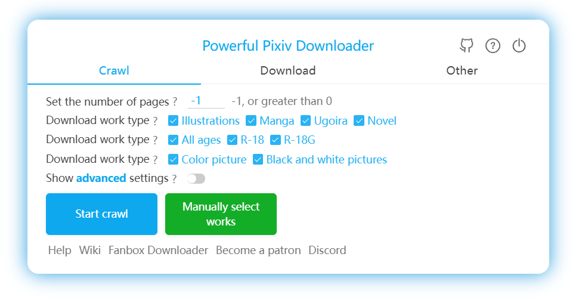
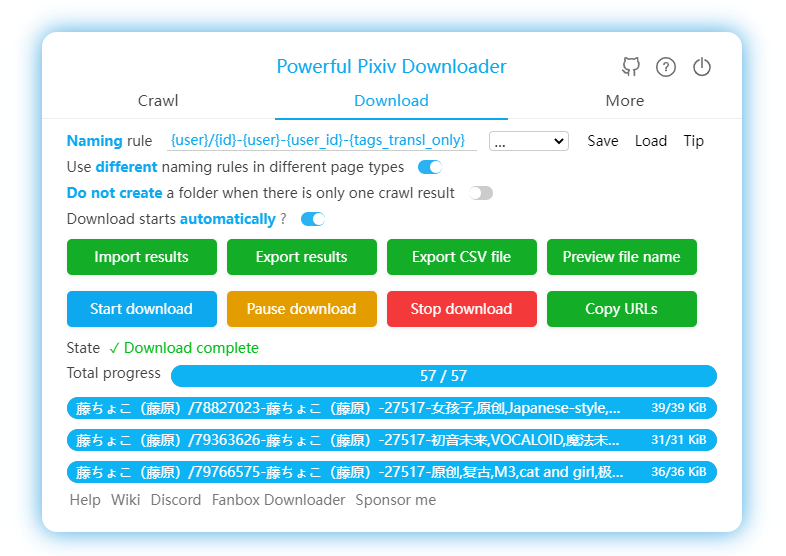

[简体中文](https://github.com/xuejianxianzun/PixivBatchDownloader/blob/master/README.md)

[繁體中文](https://github.com/xuejianxianzun/PixivBatchDownloader/blob/master/README-ZH-TW.md)

[日本語](https://github.com/xuejianxianzun/PixivBatchDownloader/blob/master/README-JA.md)

[韩国语](https://github.com/xuejianxianzun/PixivBatchDownloader/blob/master/README-KO.md)

[Russian](https://github.com/xuejianxianzun/PixivBatchDownloader/blob/master/README-RU.md)

[Discord channel](https://discord.gg/eW9JtTK)


<!-- TOC -->

- [Introduction](#introduction)
- [Online Installation](#online-installation)
- [Offline Installation](#offline-installation)
- [Wiki](#wiki)
- [Patreon](#patreon)
- [Thanks](#thanks)
- [Development](#development)

<!-- /TOC -->

# Introduction

**Powerful Pixiv Downloader**

This is a browser extension that lets you download images and novels from Pixiv in batch.

**Available languages:** Simplified Chinese, Traditional Chinese, Japanese, English、Korean、Russian.

**The main function:**

- Batch download all works, bookmarks, followed users, rankings, search results, etc. from a Pixiv user;
- Set various filtering conditions to select the works you want to download;
- Create folders using usernames, work titles, custom text, and other rules;
- Customize file names;
- Download illustrations, manga, Ugoira, novels;
- One-click download any work you see;
- Manually select (multi-select) the works you want to download;
- Scheduled crawling and downloading;
- Convert Ugoira to WebM, GIF, APNG formats;
- Save novels in TXT, EPUB formats;
- Save user avatars and cover images;
- Save download progress and resume incomplete downloads;
- Save download history to avoid duplicates;
- Batch bookmark works;
- Add tags to unclassified works in bookmarks;
- Various enhancement features to optimize Pixiv usage experience and efficiency;
- Preview works and view original images without entering the work page;
- Built-in image viewer to view multi-image works;
- Highlight followed users;





# Online Installation

Browsers with Chromium core, such as Chrome and Edge, can install this extension from the **[Chrome Web Store](https://chrome.google.com/webstore/detail/powerful-pixiv-downloader/dkndmhgdcmjdmkdonmbgjpijejdcilfh)**.

Firefox browsers can install this extension from **[Add-Ons](https://addons.mozilla.org/firefox/addon/powerfulpixivdownloader/)**.

# Offline Installation

Please check the Wiki page:
[Offline Installation](https://xuejianxianzun.github.io/PBDWiki/#/en/OfflineInstallation)

If you want to use this extension on Android, please check the Wiki page:
[Install on Microsoft Edge Canary Browser](https://xuejianxianzun.github.io/PBDWiki/#/en/MicrosoftEdgeCanary)

# Wiki

[View Wiki](https://xuejianxianzun.github.io/PBDWiki/#/en/Introduction)

# Patreon

<a href='https://www.patreon.com/xuejianxianzun'></a>

Thank you for your support!

# Thanks

- Thanks [道滿](https://zhtw.me/) , [VHlqg](https://github.com/VHlqg) for translating traditional Chinese.

- Thanks [光の軌跡](https://github.com/jiaer24) for translating traditional Japanese.

- Thanks [bropines](https://github.com/bropines) for translating traditional Russia.

- Thanks [KOZ39](https://github.com/KOZ39) for translating traditional Korean.

- Thanks [z2n](https://github.com/z2n) for improvements to the program.

# Development

1. This tool needs to be installed Node.JS first during development.

2. Clone this project (or fork first) and install dependencies:

```
git clone https://github.com/xuejianxianzun/PixivBatchDownloader.git

cd ./PixivBatchDownloader

npm i
```

So far, the initialization is complete.

You can load the `dist` folder as an extension in the extension management of your browser for local debugging.

-----------

The npm command of this project:

```
npm run ts // compile ts file to dist folder
npm run less // compile less files to the dist folder
npm run fmt // format all files

npm run pre-build // execute fmt, ts, less commands (compile all code, but do not package)

npm run build // execute fmt, ts, less commands, and copy other files needed for packaging to the dist folder, and finally pack the dist folder into a zip file
```

When you modify the code and compile it, the code will be compiled to the `dist` folder. You need to refresh the offline loaded extension in the browser's extension management, and then refresh the pixiv page to apply the new code.
