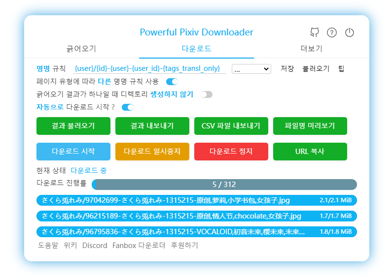

[중국어 간체](https://github.com/xuejianxianzun/PixivBatchDownloader/blob/master/README.md)

[중국어 번체](https://github.com/xuejianxianzun/PixivBatchDownloader/blob/master/README-ZH-TW.md)

[English](https://github.com/xuejianxianzun/PixivBatchDownloader/blob/master/README-EN.md)

[Russian](https://github.com/xuejianxianzun/PixivBatchDownloader/blob/master/README-RU.md)

[Discord](https://discord.gg/eW9JtTK)


<!-- TOC -->

- [소개](#소개)
- [설치](#설치)
  - [온라인 설치](#온라인-설치)
  - [오프라인 설치](#오프라인-설치)
- [위키](#위키)
- [Patreon](#patreon)
- [도움을 주신 분들](#도움을-주신-분들)
- [개발](#개발)
- [도움말](#도움말)
  - [지원하는 언어](#지원하는-언어)
  - [팁](#팁)
  - [사용 가능한 페이지와 테스트 URL](#사용-가능한-페이지와-테스트-url)

<!-- /TOC -->

# 소개

**Powerful Pixiv Downloader**

이것은 **Chrome** 브라우저의 확장 프로그램으로 Pixiv에서 일러스트 및 소설을 일괄 다운로드할 수 있습니다.

사용 가능한 언어: 중국어 간체, 중국어 번체, 일본어, 영어, 한국어입니다.

주요 기능은 다음과 같습니다:

- 아티스트의 모든 작품, 북마크, 팔로우 중, 랭킹, 검색 결과 등을 일괄 다운로드합니다;
- 모든 작품을 원클릭으로 다운로드할 수 있습니다;
- 다운로드할 작품을 수동으로 선택합니다(복수 선택);
- 다운로드할 작품을 필터링하도록 필터 조건을 설정합니다;
- 일러스트레이션, 만화, 우고이라(애니메이션), 소설 다운로드
- GIF, WebM, APNG, ZIP 형식으로 ugoira를 저장합니다;
- TXT, EPUB 형식으로 소설을 저장합니다;
- 아티스트 이름, 날짜, 제목 등과 같은 다양한 데이터로 폴더를 생성합니다;
- 파일 이름을 사용자 정의하고 정렬합니다;
- 정렬이 혼동되지 않도록 일련 번호 앞에 0을 추가합니다;
- 아티스트의 프로필 이미지 및 커버 이미지를 저장합니다;
- 더 쉽게 볼 수 있도록 더 큰 축소판을 표시합니다;
- 썸네일에서 이미지를 미리 보고 원본 이미지를 봅니다;
- 반복 다운로드를 방지하기 위해 다운로드 기록을 저장합니다;
- 다운로드 진행률을 저장하고 완료되지 않은 다운로드를 다시 시작합니다;
- 작업 데이터를 내보냅니다;
- 북마크는 일괄적으로 작동합니다;
- 북마크에서 분류되지 않은 작품에 태그를 추가합니다;
- 시간 제한 크롤링;




# 설치

## 온라인 설치

1. Chromium 기반 브라우저는 **[Chrome 웹 스토어](https://chrome.google.com/webstore/detail/powerful-pixiv-downloader/dkndmhgdcmjdmkdonmbgjpijejdcilfh)**에서 이 확장 프로그램을 설치할 수 있습니다.

2. Microsoft Edge 브라우저는 **[Microsoft Edge 추가 기능](https://microsoftedge.microsoft.com/addons/detail/hpcoocgpiepjcngmhhknkflhpkoklphp)**에서 이 확장 프로그램을 설치할 수 있습니다.

**참고:** 경우에 따라 Chrome 웹 스토어의 확장 버전이 최신 버전이 아닐 수 있습니다. 필요한 경우 오프라인으로 설치할 수 있습니다.

## 오프라인 설치

1. [Releases](https://github.com/xuejianxianzun/PixivBatchDownloader/releases/)에서 설치 패키지의 최신 버전을 다운로드하고, 디렉토리에 압축을 해제합니다.
2. 확장 프로그램으로 접근합니다. Chrome 브라우저는 메뉴에서 "도구 더보기"-"확장 프로그램"을 클릭하고, Edge 브라우저는 메뉴에서 "확장"을 클릭합니다.
3. 확장 프로그램에서 "개발자 모드"를 활성화합니다.
4. "압축해제된 확장 프로그램을 로드합니다." 버튼을 클릭하고, 설치 패키지가 압축 해제된 디렉토리를 선택합니다.

**참고:** 오프라인 설치 후 pixiv 페이지를 새로고침 하거나 브라우저를 다시 시작하여 사용해주세요.

----------

- 다운로드한 파일은 브라우저의 다운로드 디렉토리에 저장됩니다.

- 다운로드 시 팝업이 표시되지 않도록 브라우저 설정에서 "다운로드 전에 각 파일의 저장 위치 확인" 옵션을 꺼주세요.

# 위키

[위키](https://xuejianxianzun.github.io/PBDWiki)

참고: 현재 중국어로만 제공됩니다. 번역을 환영합니다!

# Patreon

<a href='https://www.patreon.com/xuejianxianzun'></a>

지원해 주셔서 감사합니다!

# 도움을 주신 분들

- [道滿](https://zhtw.me/) , [VHlqg](https://github.com/VHlqg) 중국어 번체로 번역해 주셔서 감사합니다.

- [KOZ39](https://github.com/KOZ39) 한국어로 번역해 주셔서 감사합니다.

- 러시아 번역에 대해 [bropines](https://github.com/bropines)에게 감사드립니다.

- [光の軌跡](https://github.com/jiaer24) 일본어로 번역해 주셔서 감사합니다.

- [z2n](https://github.com/z2n) 프로그램을 개선해 주셔서 감사합니다.

# 개발

1. 이 도구는 개발 중에 Node.js를 먼저 설치해야 합니다.

2. 다음 종속성을 전역으로 설치합니다:

```
npm i -g less prettier typescript webpack webpack-cli
```

3. 이 프로젝트를 복제하고(또는 먼저 포크) 종속성을 설치합니다:

```
git clone https://github.com/xuejianxianzun/PixivBatchDownloader.git

cd ./PixivBatchDownloader

npm i
```

지금까지 초기화가 완료되었습니다.

로컬 디버깅을 위해 브라우저의 확장 프로그램에서 'dist' 디렉토리를 로드할 수 있습니다.

-----------

이 프로젝트의 npm 명령어는 다음과 같습니다:

```
npm run ts // ts 파일을 dist 디렉토리에 컴파일합니다.
npm run less // less 파일을 dist 디렉토리에 컴파일합니다.
npm run fmt // 모든 파일 서식 지정

npm run pre-build // fmt, ts, less 명령을 실행합니다(모든 코드를 포함하지만 패키지화하지는 않음).

npm run build // fmt, ts, less 명령을 실행하고 패키징에 필요한 다른 파일을 dist 디렉토리에 복사한 다음 dist 디렉토리를 zip 파일로 압축합니다.
```

코드를 수정하여 컴파일하면 코드는 dist 디렉토리에 컴파일됩니다. 브라우저의 확장 프로그램에서 오프라인으로 로드된 확장 프로그램을 업데이트한 다음 pixiv 페이지를 새로고침하여 새 코드를 적용해야 합니다.

# 도움말

## 지원하는 언어

- 简体中文
- 繁體中文
- English
- 日本語
- 한국어
- Русский

당신은 또한 번역을 개선할 수 있습니다. 감사합니다 :)

## 팁

- 다운로드 후 파일명이 이상할 경우, 다운로드 기능이 있는 다른 브라우저 확장 프로그램을 비활성화해주세요.

## 사용 가능한 페이지와 테스트 URL

0 [홈페이지](https://www.pixiv.net/)

1 [작품 페이지](https://www.pixiv.net/artworks/72503012)

2 [목록 페이지](https://www.pixiv.net/users/544479/artworks)

2 [태그 페이지](https://www.pixiv.net/users/544479/artworks/%E6%9D%B1%E6%96%B9)

3 [북마크-레거시](https://www.pixiv.net/bookmark.php)

4 [북마크](https://www.pixiv.net/users/9460149/bookmarks/artworks)

5 [검색](https://www.pixiv.net/tags/saber/artworks?s_mode=s_tag)

6 [지역 랭킹](https://www.pixiv.net/ranking_area.php?type=state&no=0)

7 [랭킹](https://www.pixiv.net/ranking.php)

8 [Pixivision](https://www.pixivision.net/zh/a/3190)

9 [자세한 북마크](https://www.pixiv.net/bookmark_detail.php?id=63148723)

10 [신작: 팔로우 중](https://www.pixiv.net/bookmark_new_illust.php)

11 [디스커버리](https://www.pixiv.net/discovery)

12 [모두의 최신 일러스트](https://www.pixiv.net/new_illust.php)

13 [소설](https://www.pixiv.net/novel/show.php?id=12771688)

14 [소설의 시리즈](https://www.pixiv.net/novel/series/1090654)

15 [소설 검색](https://www.pixiv.net/tags/%E7%99%BE%E5%90%88/novels)

16 [소설 랭킹](https://www.pixiv.net/novel/ranking.php?mode=daily)

17 [신작 소설: 팔로우 중](https://www.pixiv.net/novel/bookmark_new.php)

18 [모두의 최신 소설](https://www.pixiv.net/novel/new.php)

19 [만화 시리즈 페이지](https://www.pixiv.net/user/3698796/series/61267)

20 [팔로우 중](https://www.pixiv.net/users/9460149/following)

21 [리퀘스트](https://www.pixiv.net/request)

22 [URL 한정 공개](https://www.pixiv.net/artworks/unlisted/CbLRCId2sY3ZzQDqnQj6)
