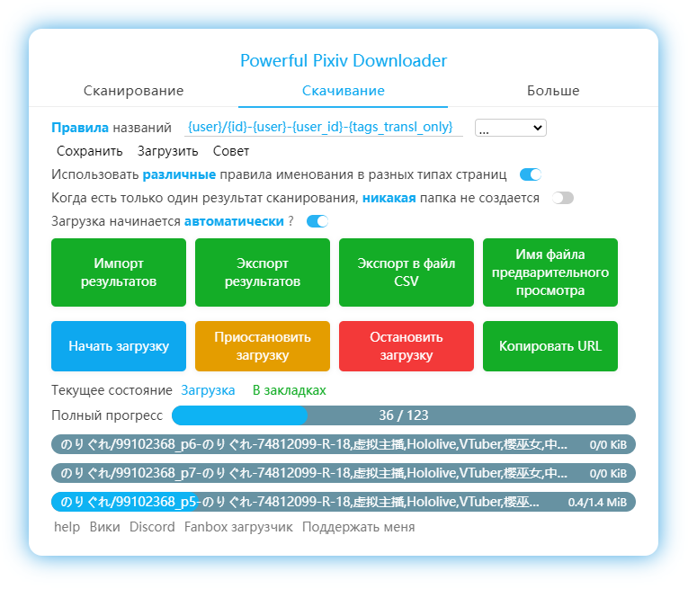

[简体中文](https://github.com/xuejianxianzun/PixivBatchDownloader/blob/master/README.md)

[繁體中文](https://github.com/xuejianxianzun/PixivBatchDownloader/blob/master/README-ZH-TW.md)

[日本語](https://github.com/xuejianxianzun/PixivBatchDownloader/blob/master/README-JA.md)

[韩国语](https://github.com/xuejianxianzun/PixivBatchDownloader/blob/master/README-KO.md)

[English](https://github.com/xuejianxianzun/PixivBatchDownloader/blob/master/README-EN.md)

[Discord channel](https://discord.gg/eW9JtTK)


<!-- TOC -->

- [Вступление](#вступление)
- [Установка](#установка)
  - [Онлайн установка](#онлайн-установка)
  - [Автономная установка](#автономная-установка)
- [Wiki](#wiki)
- [Patreon](#patreon)
- [Благодарности](#благодарности)
- [Разработка](#разработка)
- [Помощь](#помощь)
  - [Поддерживаемые языки](#поддерживаемые-языки)
  - [Примечание](#примечание)
  - [Доступные страницы и тестовый URL](#доступные-страницы-и-тестовый-url)
  - [Перевел на Русский bropines](#перевел-на-русский-bropines)

<!-- /TOC -->

# Вступление

**Мощный загрузчик Pixiv**

Это расширение для браузера ** Chrome**, которое позволяет загружать изображения и новеллы из Pixiv в пакетном режиме.

Доступные языки: Упрощенный китайский, Традиционный китайский, Японский, Английский, Корейский.

Основная функция:

- Пакетная загрузка всех работ художника, ваших закладок, ваших подписчиков, рейтингов, результатов поиска и т.д.;
- Загрузка любой работы, которую вы видите, в один клик;
- Вручную выберите работу, которую вы хотите загрузить на странице;
- Установите условия фильтрации, чтобы отфильтровать работы, которые вы хотите загрузить;
- Скачать иллюстрации, мангу, угойру (анимацию), романы;
- Сохраняйте ugoira(анимацию) в форматах GIF, WebM, APNG, ZIP;
- Сохранять новеллы в формате TXT, EPUB;
- Создавайте папки с различными данными, такими как имя исполнителя, дата, название и т.д.;
- Настраивайте имена файлов и сортируйте их;
- Добавьте 0 перед серийным номером, чтобы сортировка не была запутанной;
- Сохранить аватар пользователя и изображение обложки;
- отображение увеличенных миниатюр для более удобного просмотра;
- Предварительный просмотр изображения на миниатюре и просмотр исходного изображения;
- Сохраняйте записи загрузок, чтобы избежать повторных загрузок;
- Сохранение хода загрузки, возобновление незавершенных загрузок;
- экспорт рабочих данных;
- Собирать работы партиями;
- добавляйте теги к работам без рубрики в свои закладки;
- Своевременный обход;




# Установка

## Онлайн установка

1. В браузере **Chromium kernel** это расширение можно установить из раздела **[Chrome Web Store](https://chrome.google.com/webstore/detail/powerful-pixiv-downloader/dkndmhgdcmjdmkdonmbgjpijejdcilfh)**.

**Примечание:** Иногда расширение в Chrome Web Store может быть не самой последней версии. При необходимости вы можете установить его в автономном режиме.

## Автономная установка

1. Загрузите последнюю версию установочного пакета со страницы [Страница релиза](https://github.com/xuejianxianzun/PixivBatchDownloader/releases/) и распакуйте его в папку.
2. Введите управление расширением. Chrome нажимает "Дополнительные инструменты" - "Управление расширениями" в меню; Edge нажимает "Расширения" в меню.
3. На странице управления расширением включите "Режим разработчика".
4. Нажмите кнопку "Загрузить распакованное" и выберите папку, в которую распакован установочный пакет.

**Примечание:** После автономной установки, пожалуйста, обновите страницу pixiv или перезапустите браузер для нормального использования.

----------

- Загруженный файл будет сохранен в каталоге загрузок вашего браузера.

- Пожалуйста, отключите "Спрашивать, куда сохранить каждый файл перед загрузкой". в настройках браузера.

# Wiki

[Wiki](https://xuejianxianzun.github.io/PBDWiki)

Примечание: В настоящее время доступен только на китайском языке. Перевод приветствуется!

# Patreon

<a href='https://www.patreon.com/xuejianxianzun'></a>

Спасибо за вашу поддержку!

# Благодарности

- Спасибо [道滿](https://zhtw.me/) , [VHlqg](https://github.com/VHlqg) за перевод традиционного китайского языка.

- Спасибо [KOZ39](https://github.com/KOZ39) за перевод традиционного корейского языка.

- Спасибо [bropines](https://github.com/bropines) за русский перевод.

- Спасибо [光の軌跡](https://github.com/jiaer24) за перевод традиционного японского языка.

- Спасибо [z2n](https://github.com/z2n) за улучшение программы.

- Ну типа я перевел, спасибо Pinus.

# Разработка

1. При разработке этого инструмента необходимо сначала установить Node.JS.

2. Установите следующие зависимости глобально:

```
npm i -g less prettier typescript webpack webpack-cli
```

3. Клонируйте этот проект (или сначала сделайте форк) и установите зависимости:

```
git clone https://github.com/xuejianxianzun/PixivBatchDownloader.git

cd ./PixivBatchDownloader

npm i
```

На данный момент инициализация завершена.

Вы можете загрузить папку `dist` в качестве расширения в управлении расширениями вашего браузера для локальной отладки.

-----------

Команды npm для этого проекта:

```
npm run ts // скомпилируйте файл ts в папку dist
npm run less // скомпилируйте файлы less в папку dist
npm run fmt // форматы всех файлов

npm run pre-build // выполните команды fmt, ts, less (компилируется весь код, но не упаковывается)

npm run build // выполните команды fmt, ts, less и скомпилируйте другие файлы, необходимые для упаковки, в папку dist, и, наконец, упакуйте папку dist в zip-файл
```

Когда вы изменяете код и компилируете его, код будет скомпилирован в папку `dist`. Вам нужно обновить автономно загруженное расширение в управлении расширениями браузера, а затем обновить страницу pixiv, чтобы применить новый код.

# Помощь

## Поддерживаемые языки

- 简体中文
- 繁體中文
- English
- 日本語
- 한국어
- Русский

Вы также можете оптимизировать перевод, большое спасибо :)

## Примечание

- Если имя файла после загрузки ненормальное, отключите другие расширения браузера, которые имеют возможность загрузки.

## Доступные страницы и тестовый URL

0 [Главная страница](https://www.pixiv.net/)

1 [Страница с иллюстрациями](https://www.pixiv.net/artworks/72503012)

2 [Страница списка](https://www.pixiv.net/users/544479/artworks)

2 [Страница тегов](https://www.pixiv.net/users/544479/artworks/%E6%9D%B1%E6%96%B9)

3 [Закладки-(старые)](https://www.pixiv.net/bookmark.php)

4 [Закладки](https://www.pixiv.net/users/9460149/bookmarks/artworks)

5 [Поиск](https://www.pixiv.net/tags/saber/artworks?s_mode=s_tag)

6 [Рейтинг регионов](https://www.pixiv.net/ranking_area.php?type=state&no=0)

7 [Рейтинг](https://www.pixiv.net/ranking.php)

8 [Pixivision](https://www.pixivision.net/zh/a/3190)

9 [Деталь закладки](https://www.pixiv.net/bookmark_detail.php?id=63148723)

10 [Новая работа: Following](https://www.pixiv.net/bookmark_new_illust.php)

11 [Открытия](https://www.pixiv.net/discovery)

12 [Новое от всех пользователей](https://www.pixiv.net/new_illust.php)

13 [Новеллы](https://www.pixiv.net/novel/show.php?id=12771688)

14 [Серии новелл](https://www.pixiv.net/novel/series/1090654)

15 [Поиск новелл](https://www.pixiv.net/tags/%E7%99%BE%E5%90%88/novels)

16 [Рейтинг новелл](https://www.pixiv.net/novel/ranking.php?mode=daily)

17 [Новая новелла: Following](https://www.pixiv.net/novel/bookmark_new.php)

18 [Новая новелл для ВСЕХ пользователей](https://www.pixiv.net/novel/new.php)

19 [Страница серий манги](https://www.pixiv.net/user/3698796/series/61267)

20 [Следуемые](https://www.pixiv.net/users/9460149/following)

21 [Запрос](https://www.pixiv.net/request)

22 [URL с ограничением](https://www.pixiv.net/artworks/unlisted/CbLRCId2sY3ZzQDqnQj6)

## Перевел на Русский [bropines](https://github.com/bropines)
