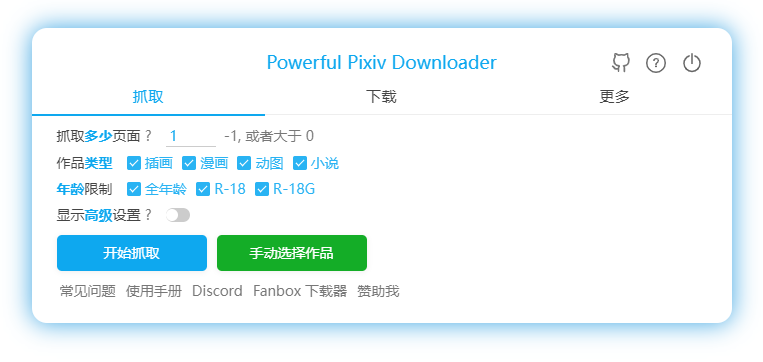
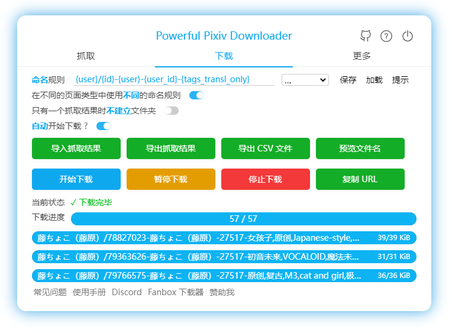

[English](https://github.com/xuejianxianzun/PixivBatchDownloader/blob/master/README-EN.md)

[繁體中文](https://github.com/xuejianxianzun/PixivBatchDownloader/blob/master/README-ZH-TW.md)

[韩国语](https://github.com/xuejianxianzun/PixivBatchDownloader/blob/master/README-KO.md)

[Russian](https://github.com/xuejianxianzun/PixivBatchDownloader/blob/master/README-RU.md)

*日本語 No translation yet*

[Discord 频道](https://discord.gg/eW9JtTK)


<!-- TOC -->

- [简介](#简介)
- [安装](#安装)
  - [在线安装](#在线安装)
  - [离线安装](#离线安装)
- [Wiki](#wiki)
- [鸣谢](#鸣谢)
- [支持和捐助](#支持和捐助)
- [开发](#开发)
- [帮助](#帮助)
  - [常见问题](#常见问题)
  - [支持的语言](#支持的语言)
  - [可以使用的页面类型以及测试网址](#可以使用的页面类型以及测试网址)
- [友情链接](#友情链接)

<!-- /TOC -->

offline 分支是用来打包为离线安装包的。

offline 分支会检查 github 上是否发布了新版本；master 分支上不会检查 github 上是否有新版本。

# 简介

**Powerful Pixiv Downloader**

这是一个 Chrome 浏览器扩展程序，用于批量下载 Pixiv 上的图片和小说。

支持的语言：简体中文、繁體中文、日本語、English、한국어。

主要功能：

- 批量下载画师的所有作品、你的收藏、你的关注、排行榜、搜索结果等；
- 一键下载你看到的任何作品；
- 在页面上手动选择你要下载的作品；
- 设置过滤条件，筛选你要下载的作品；
- 下载插画、漫画、动图、小说；
- 保存动图为 GIF、WebM、APNG、ZIP 格式；
- 保存小说为 TXT、EPUB 格式；
- 使用画师名字、日期、标题等多种数据建立文件夹；
- 自定义文件名，并进行排序；
- 在序号前面补 0，使排序不会混乱；
- 保存用户头像和封面图片；
- 显示更大的缩略图，查看起来更为轻松；
- 在缩略图上预览作品大图，查看原图；
- 保存下载记录，避免重复下载；
- 保存下载进度，恢复未完成的下载；
- 导出作品数据；
- 批量收藏作品；
- 为你收藏里的未分类作品添加标签；
- 定时抓取；





[访问官网](https://pixiv.download/)

[在 YouTube 查看视频教程](https://www.youtube.com/playlist?list=PLO2Mj4AiZzWEpN6x_lAG8mzeNyJzd478d)

# 安装

## 在线安装

1. **Chromium 内核**的浏览器可以从 **[Chrome Web Store](https://chrome.google.com/webstore/detail/powerful-pixiv-downloader/dkndmhgdcmjdmkdonmbgjpijejdcilfh)** 安装本扩展。

**注意：** 有时候 Chrome Web Store 上的扩展可能不是最新版本。如果有需要，你可以离线安装。

## 离线安装

如果您不能在线安装，您可以从 [Releases 页面](https://github.com/xuejianxianzun/PixivBatchDownloader/releases/latest) 离线安装。

[离线安装指南](https://xuejianxianzun.github.io/PBDWiki/#/zh-cn/%E7%A6%BB%E7%BA%BF%E5%AE%89%E8%A3%85)

---------

- 下载的文件会保存在浏览器的下载目录里。

- 请关闭浏览器设置中的“下载前询问每个文件的保存位置”选项，以免在下载时出现弹窗。

# Wiki

[查看 Wiki](https://xuejianxianzun.github.io/PBDWiki)

# 鸣谢

- 感谢 [道滿](https://zhtw.me/) 、 [VHlqg](https://github.com/VHlqg) 翻译繁体中文。

- 感谢 [光の軌跡](https://github.com/jiaer24) 翻译日语。

- 感谢 [KOZ39](https://github.com/KOZ39) 翻译韩语。

- 感谢 [bropines](https://github.com/bropines) 翻译俄语。

- 感谢 [Reinford0](https://github.com/Reinford0) 对本工具的测试和改进。

- 感谢 [z2n](https://github.com/z2n) 对本工具项目构建做出的改进。

# 支持和捐助

如果您感觉本脚本帮到了您，您可以对我进行支持和捐助，不胜感激 (*╹▽╹*)

1. 国内的众筹赞助平台“爱发电”（类似于 patreon）：

[https://afdian.net/@xuejianxianzun](https://afdian.net/@xuejianxianzun)

2. 可通过微信和支付宝扫码转账：

 

3. 国外的赞助网站 Patreon：

[https://www.patreon.com/xuejianxianzun](https://www.patreon.com/xuejianxianzun)

# 开发

1. 本工具在开发时需要先安装 Node.JS。

2. 全局安装以下依赖：

```
npm i -g less prettier typescript webpack webpack-cli
```

3. Clone 本项目（或者先 Fork），并安装依赖：

```
git clone https://github.com/xuejianxianzun/PixivBatchDownloader.git

cd ./PixivBatchDownloader

npm i
```

至此初始化完成。

你可以在浏览器的扩展管理里，加载 `dist` 文件夹作为扩展程序，以进行本地调试。

-----------

本项目的 npm 命令：

```
npm run ts  // 编译 ts 文件到 dist 文件夹
npm run less // 编译 less 文件到 dist 文件夹
npm run fmt // 格式化所有文件

npm run pre-build // 执行 fmt、ts、less 命令（即编译所有代码，但是不打包）

npm run build // 执行 fmt、ts、less 命令，并把打包所需的其他文件也复制到 dist 文件夹，最后把 dist 文件夹打包成 zip 文件
```

当你修改了代码并且编译之后，代码会被编译到 `dist` 文件夹。你需要在浏览器的扩展管理里刷新离线加载的这个扩展，然后刷新 pixiv 页面，以应用新的代码。

# 帮助

## 常见问题

如果你遇到问题，可以查看下载器面板左下角的“常见问题”，以及 Wiki。

- 如果下载后的文件名异常，请禁用其他有下载功能的浏览器扩展。

- 如果使用 ssr、v2ray 等工具，下载时开启“全局代理”以提高下载速度。

- 如有其他问题或建议，加欢迎 **QQ 群 499873152** 进行交流。

## 支持的语言

- 简体中文
- 繁體中文
- English
- 日本語
- 한국어
- Русский

欢迎您对翻译做出改进，谢谢~

## 可以使用的页面类型以及测试网址

0 [首页](https://www.pixiv.net/)

1 [作品页面](https://www.pixiv.net/artworks/72503012)

2 [插画列表页](https://www.pixiv.net/users/544479/artworks)

2 [小说列表页](https://www.pixiv.net/users/35419040/novels)

2 [Tag 页面](https://www.pixiv.net/users/544479/artworks/%E6%9D%B1%E6%96%B9)

2 [小说 Tag 页面](https://www.pixiv.net/users/35419040/novels/%E6%81%8B%E6%84%9B)

3 [收藏页面-旧版](https://www.pixiv.net/bookmark.php)

4 [收藏页面-新版](https://www.pixiv.net/users/9460149/bookmarks/artworks)

5 [搜索页面](https://www.pixiv.net/tags/saber/artworks?s_mode=s_tag)

6 [地区排行榜](https://www.pixiv.net/ranking_area.php?type=state&no=0)

7 [插画、漫画排行榜](https://www.pixiv.net/ranking.php)

8 [Pixivision](https://www.pixivision.net/zh/a/3190)

9 [收藏作品的详情](https://www.pixiv.net/bookmark_detail.php?id=63148723) （此类页面似乎已经被移除）

10 [关注的新作品](https://www.pixiv.net/bookmark_new_illust.php)

11 [发现](https://www.pixiv.net/discovery)

12 [大家的新作品](https://www.pixiv.net/new_illust.php)

13 [小说页面](https://www.pixiv.net/novel/show.php?id=12771688)

14 [系列小说页面](https://www.pixiv.net/novel/series/1090654)

15 [小说搜索页面](https://www.pixiv.net/tags/%E7%99%BE%E5%90%88/novels)

16 [小说排行榜](https://www.pixiv.net/novel/ranking.php?mode=daily)

17 [关注的新作品-小说](https://www.pixiv.net/novel/bookmark_new.php)

18 [大家的新作品-小说](https://www.pixiv.net/novel/new.php)

19 [漫画系列页面](https://www.pixiv.net/user/3698796/series/61267)

20 [关注](https://www.pixiv.net/users/9460149/following)

21 [约稿](https://www.pixiv.net/request)

22 [仅可由链接浏览](https://www.pixiv.net/artworks/unlisted/CbLRCId2sY3ZzQDqnQj6)

# 友情链接

[PixivUserBatchDownload](https://github.com/Mapaler/PixivUserBatchDownload/)

Pixiv User Batch Download 简称 PUBD，它是一个 UserScript 脚本，可以让你在 Pixiv 的画师页面里批量抓取所有作品，发送到 Aria2 下载，适合动手能力强的用户使用。

- **配合 Aria2 下载，可发送到本地或远端路由器。**

- 可使用掩码自定义保存文件夹、重命名。

[PixivFanboxDownloader](https://github.com/xuejianxianzun/PixivFanboxDownloader)

用于批量下载 Pixiv Fanbox 上的文件的浏览器扩展程序。
