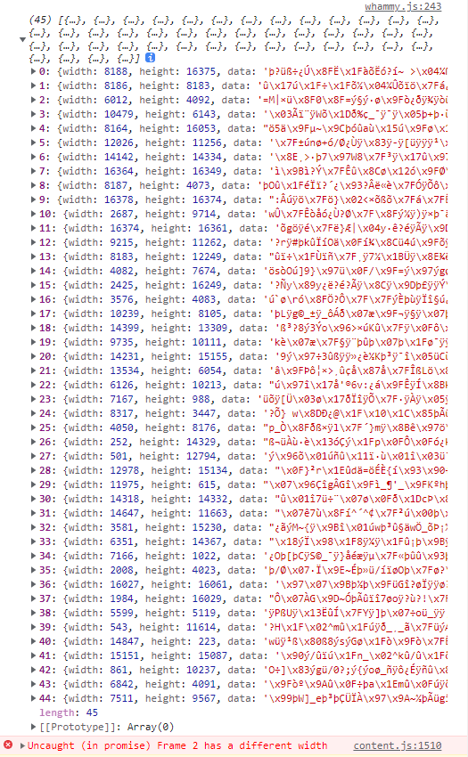
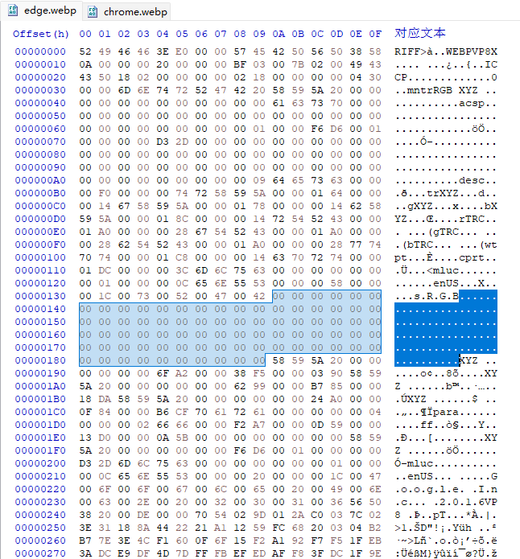
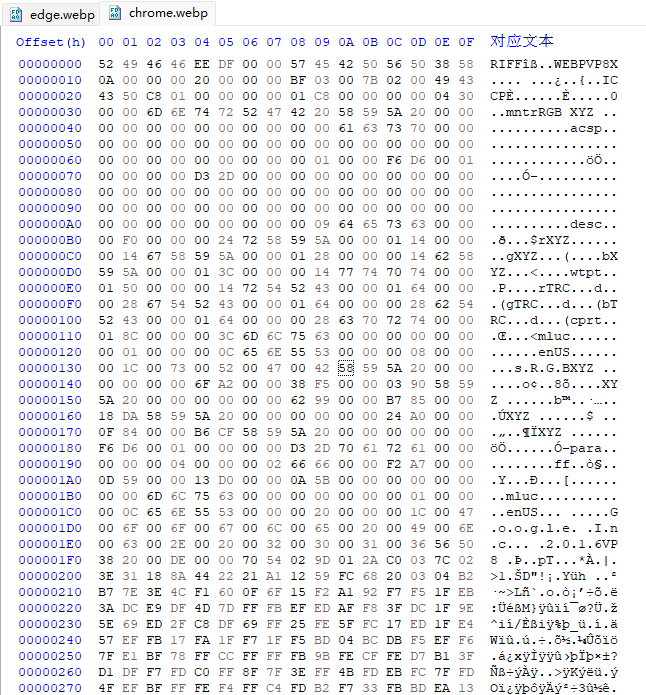

# Chrome 108 版本转换 WebM 失败的问题

昨晚有用户反馈动图转换失败，我试了下还真是，所有动图在转换为 WebM 格式时都会失败，报错 `Frame 2 has a different width`.



经过测试，我昨天刚更新的 Chrome 108 版本出现了此错误，但是 Edge 107 版本一切正常。

我还特意安装了 360 极速浏览器 X（内核为 95），也能正常转换。所以这是 Chrome 108 版本导致的问题。

由于这个问题对下载影响非常严重（转换出错的文件会卡住下载线程，导致下载无法继续），所以我决定尽快修复，发布新版本。

我先用谷歌搜索 Chrome 108 版本对 WebP 的编码做了什么改动，但是什么信息都没找到，看来只好自己尝试了。过程中走了不少弯路，浪费了很多时间。但是找到真相后，一切却又很简单。

## 问题原因

下载器先把图片转换为 DataURL，然后传递给编码器。

```js
canvas.toDataURL('image/webp', 0.9)
encoder.add(url, delay)
```

我在不同浏览器里获取同一个图片的 DataURL，然后粘贴到地址栏打开图片，再右键保存为 webp 图像文件。

对比文件体积，发现 Chrome 108 保存的图片体积比 Edge 107 小了 80 btye。

用十六进制查看器打开这两个图片文件进行对比，发现以前版本的图片里有 80 byte 的空白字符，而 Chrome 108 则没有。

Edge 107：



Chrome 108：



所以解决思路已经有了，就是检测浏览器版本，如果大于 108 则进行特殊处理。

## 对编码器里代码的研究

编码器库文件是 whammy.js，在 `compile` 方法里，会用 `atob` 函数把下载器传递的 DataURL 转换成二进制数据。

```js
var str = atob(frame.image.slice(23))
// frame.image 就是 DataURL，这里去掉了开头的 data:image/webp;base64, 标记，然后转换
```

这行代码生成的就是图片文件的二进制数据，它的内容和上面我在浏览器里保存成的 webp 图像是一样的。

虽然 Chrome 108 移除了 80 byte 的空白字符，不过把这里的二进制数据保存成图片依然是没有问题的。

问题在于转换成 WebM 视频的时候，不能直接使用图片数据，要从其中移除一部分内容（图片的 EXIF 信息等）。

```js
var p1 = str.substr(0, 15)
var p2 = str.substr(577)
str = p1 + p2
```

以前第二部分的偏移量是 `577`，现在由于新版本 Chrome 移除了 80 byte 的内容，所以把 `577` 减去 80 变成 `497` 就行了。

不过这里不能直接改成 `479`，需要先检测浏览器的版本号，如果大于等于 108 则使用 `497`，否则不变。

这样修改之后，问题马上解决了。

ps：实际上我走了很多弯路，一开始虽然也是从 DataURL 开始着手研究，但是没想起来保存成图片文件，而是顺着代码去研究编码器里面是怎么对传入的 DataURL 进行转换和操作的，给我整的头晕脑胀也没找到确切原因。后来我发现两个浏览器生成的 DataURL 长度不一样，这才想起保存图片，对比体积差异，进而对比文件内容，一下子搞清楚了。

果然找对思路很重要啊，白白浪费俩小时了。

这个问题和解决的代码我也提交到了 whammy.js 的 issues 里。

https://github.com/antimatter15/whammy/issues/72
