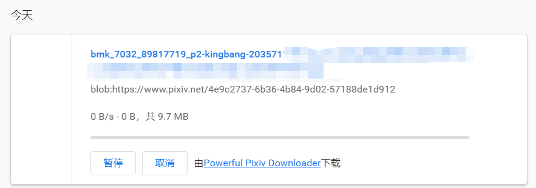

## Chrome 下载文件卡住，导致下载器卡住的情况

我偶尔会遇到这种情况。

### 表现

1. 下载器的下载进度卡住，并且不会自动暂停重试。
2. 手动暂停，再开始下载，依然会直接卡住，无法继续下载。
3. 查看 Chrome 的下载管理，发现最近一个下载的文件始终在卡着，不能完成。如图：

上图的文件的 url 是正常的，复制 url 在地址栏打开，可以看到这个图片。

此外，在下载文件夹里也可以看到这个图片的缓存文件 `.tmp` 结尾的文件，看起来缓存文件已经创建好了（可以打开查看图片），但是没有保存成目标文件。

### 处理方法

1. 关闭 Chrome 浏览器。点击关闭按钮，会提示仍然有文件在下载：

选择“退出”。

2. 之后可以在任务管理器里看到，仍然存在一个 `chrome.exe` 进程。可能这就是负责下载的进程。必须先把这个进程结束掉，才能重新启动 Chrome，否则 Chrome 会无法启动。

3. 重新启动 Chrome 之后，在 Pixiv 页面继续下载。

### 推测原因

这个问题不能稳定复现，我也不能确定原因。扩展管理里也没有错误信息。

出现这个问题时，文件是完整的，并且在硬盘上创建了缓存文件，但是下载却卡住了。

我推测主要的原因可能出在硬盘上，比如硬盘 I/O 繁忙，或者出现了某些错误。

如果硬盘没出问题的话，那就是 Chrome 的偶然性 bug 了吧。