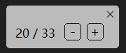

# HoneyView 播放某些 APNG 文件不正常的问题

日期：2023/02/26

在 2022/12/26 的一项修改 `替换第三方库 pako.js 为 UZIP.js` 导致生成的 APNG 文件体积比以前大一些，文件内容自然也有细微的不同。

今天有用户报告问题，把下面这个动图转换为 APNG 时，用 HoneyView 不能正常播放。我试了试确实如此。

https://www.pixiv.net/artworks/95767772

这个动图源文件有 33 帧 jpg 图像，转换后应该也有 33 帧图像，但是 HoneyView 在播放时却只会循环播放前 11 帧。

那么这个 APNG 文件真的有问题吗？我用其他方法打开这个图像，但是都很正常：

1. 把图片拖到 Chrome 浏览器中打开，播放正常
2. 安装另一个图片查看软件 XnViewMP，播放正常，并且帧数显示确实是 33 帧
3. 用软件 APNG Disassembler （https://apngdis.sourceforge.net/） 提取这个 APNG 里的图像，能正常提取出来 33 个 PNG 图像
4. 用 HxD （十六进制查看器）打开这个图像，找到保存帧数的位置，数值确实是 33。

综上，这个 APNG 图像在技术上应该是符合标准的，HoneyView 播放异常应该是 HoneyView 自己的问题。

我本想向 HoneyView 报告这个问题，但是我在它的官网看到如下提示：

>由于内部原因，除了最低程度的安全性修补外，将不再对 Honeyview 进行更新。 因此，请您理解：目前很难再在 Honeyview 中添加新功能。 对此造成的不便，我们深表歉意。

我又看了 HoneyView 上次更新的时间已经是半年前了。

我感觉即使这个问题被他们确认，也可能不会修复。或者即使修复，也可能需要在很久之后才会发布新版本。所以我不如把下载器生成 APNG 的代码改回以前的版本，这样解决起来更快。

-----------

现在我已经把 UZIP.js 改成了 pako.min.js，生成的文件可以正常在 HoneyView 里播放。

