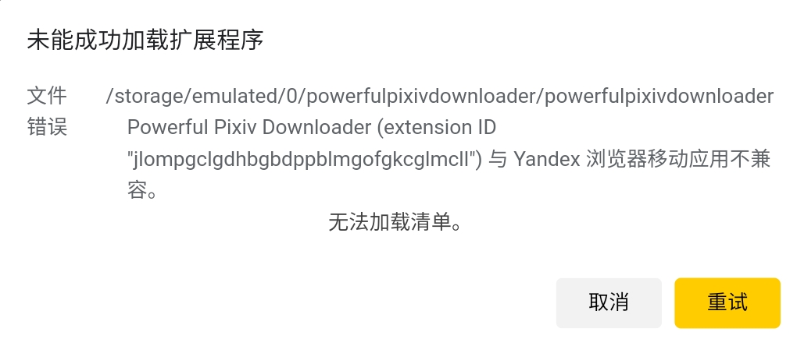

今天的日期：2021/09/02。Chrome 稳定版的内核是 93。

我更新了这个下载器的清单版本（升级到 Manifest V3），但是 V3 需要 Chromium 内核版本 ≥ 88 才可以用。

目前下载器的迁移已经完成，但是 V3 的支持情况不够好，导致我决定不发布它。

## 国内套壳浏览器的情况

可能有一些国内用户在使用套壳浏览器，它们的内核版本是否支持 V3 呢？我去看了一下目前还在更新的国产套壳浏览器，结论是：

目前只有傲游浏览器可以支持。

下面为各个套壳浏览器的内核版本：（由高到低排序）

| 浏览器        | 内核版本 |
| ------------- | -------- |
| 傲游浏览器    | 89       |
| 云起浏览器    | 87       |
| 搜狗浏览器    | 87       |
| 360急速浏览器 | 86       |
| 极速浏览器    | 86       |
| 百分（Cent）浏览器    | 86       |
| 华为浏览器    | 85       |
| 星愿浏览器    | 80       |
| 猎豹浏览器    | 79       |
| 猎豹浏览器    | 79       |
| QQ浏览器      | 70       |
| 2345浏览器    | 69       |

版本号最低的只有 69、70，蚌埠住了。

目前只有傲游浏览器能支持 V3，但是它安装和启动的过程中共弹出了 2 次 UAC，而且启动之后风扇很响，不知道这是否和它号称自己为“区块链浏览器”有关，反正我不喜欢。

我测试了某个浏览器，它不支持 V3，加载扩展时提示：

`Invalid value for 'web_accessible_resources[0]'.`

此外国内的用户即使使用的是 Google Chrome 浏览器，但是有少部分用户可能无法自动更新。

## 手机上的 Yandex 浏览器

手机上的 Yandex 浏览器最新版本的内核虽然已经是 88，但是尝试让它加载 V3 版本的下载器，却出现错误提示：

所以如果下载器升级到 V3，手机上的用户就无法使用下载器了。这个影响比较大，也是我不发布这个版本的主要原因。