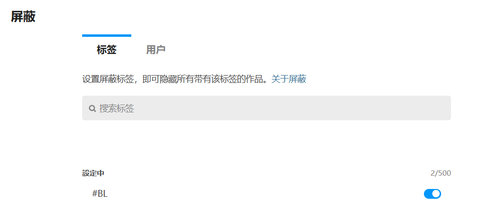
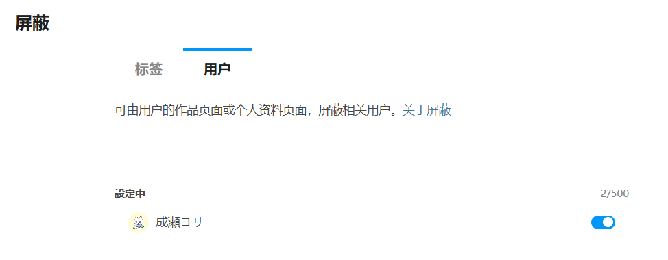
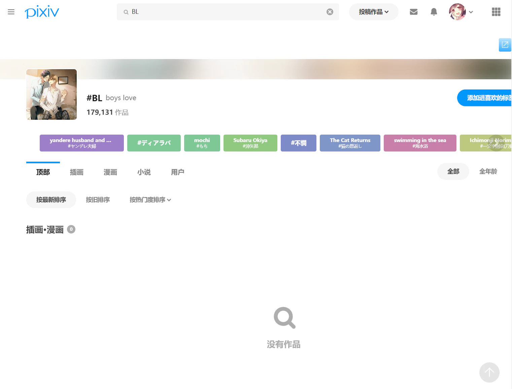
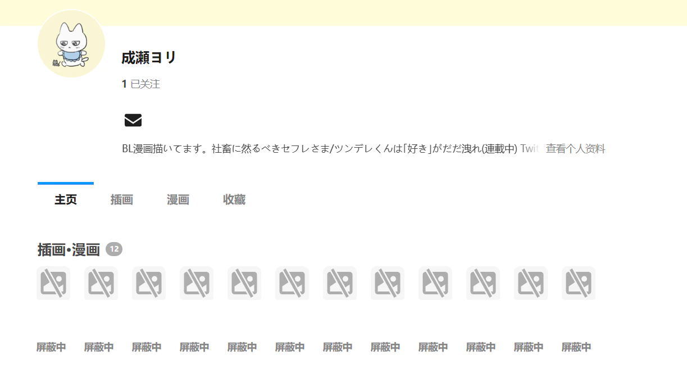

Pixiv 会员可以在用户设置里屏蔽标签和用户。

https://www.pixiv.net/settings/viewing/mute?type=tag

https://www.pixiv.net/settings/viewing/mute?type=user

普通会员只可设置1个屏蔽对象，高级会员的用户最高可设置500个屏蔽对象。

屏蔽标签后，不会显示该标签的作品：

屏蔽用户后，在其主页里会把作品显示为“屏蔽中”；在其他页面里也不会显示他的作品。

**注意：** Pixiv 的 API 会照常返回数据（如同没有屏蔽），只是在前端显示时进行了处理。

下载器会获取用户的屏蔽设置，对抓取结果进行过滤。

