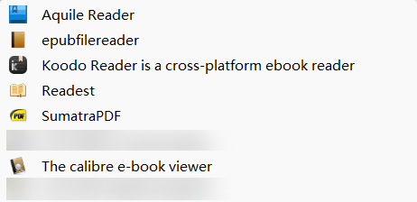
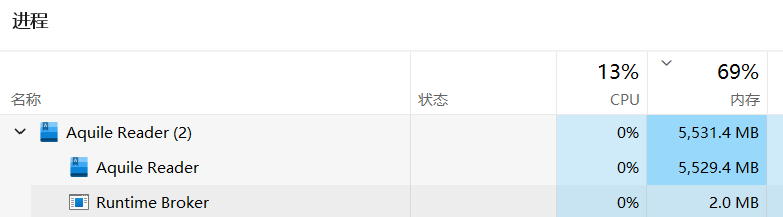
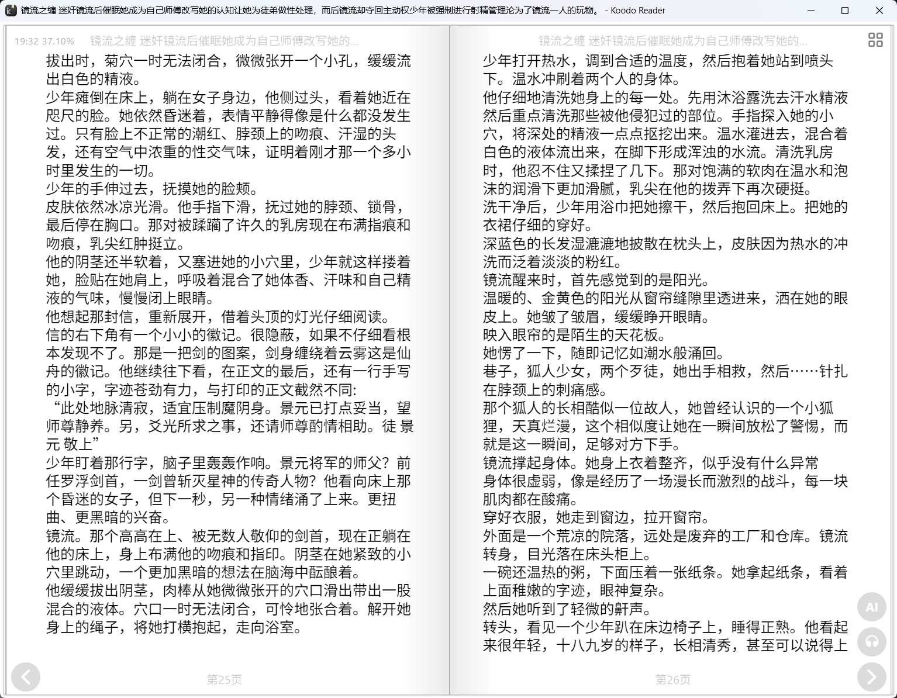
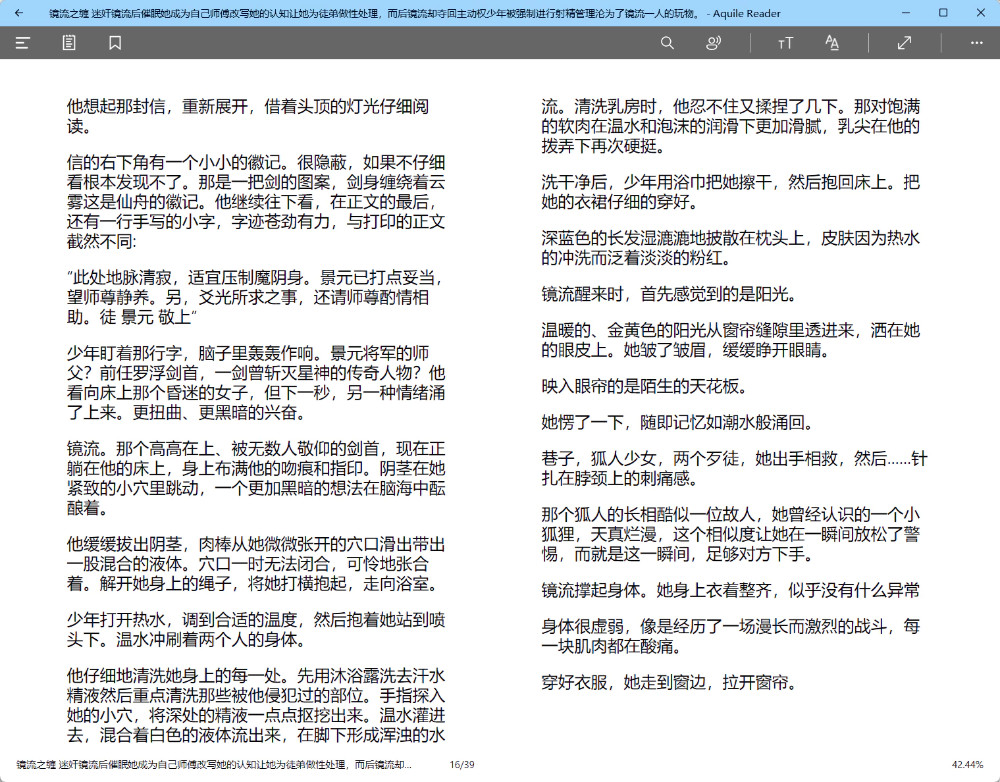
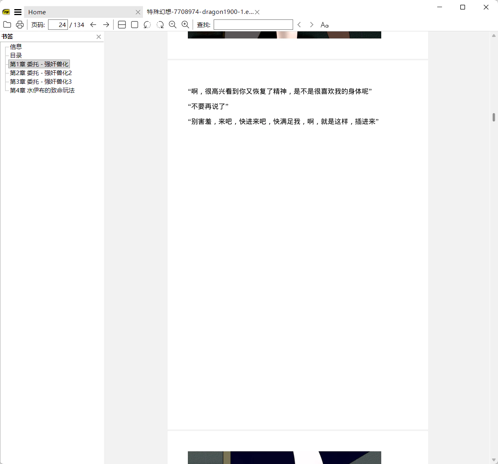
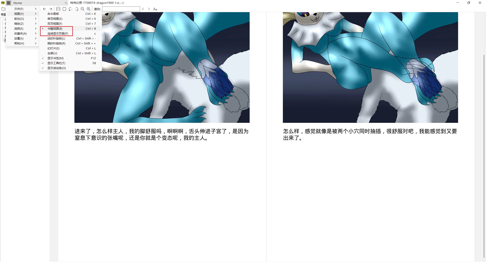
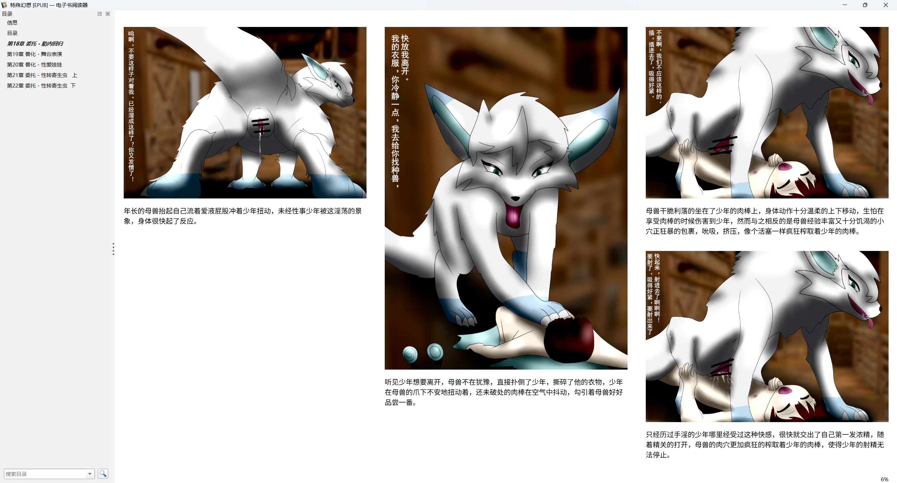
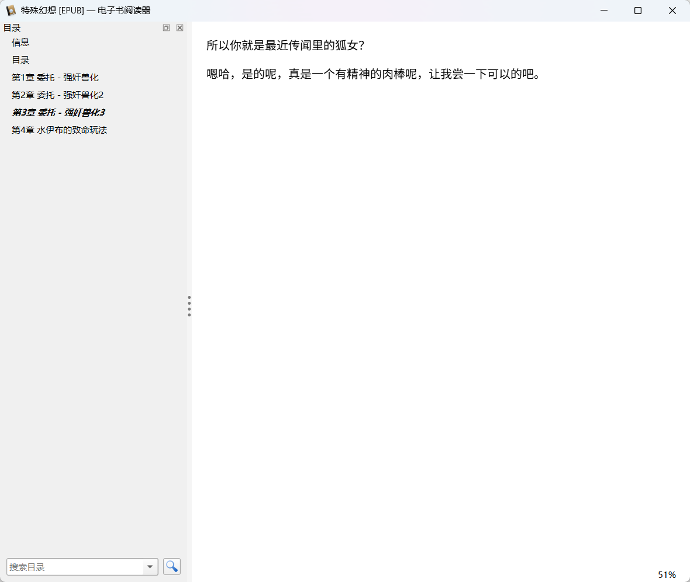
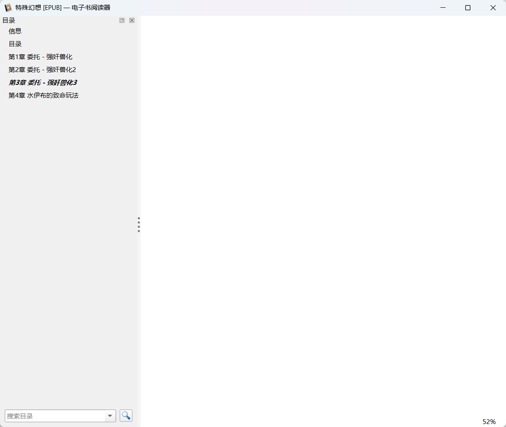

# Windows 上一些 EPUB 小说阅读器的表现

**NSFW**

日期：2026-04-20

我在测试合并系列小说时，下载了一些比较大的 EPUB 文件，每个 400 MB，都含有大量的插图。

是从这个系列小说里下载的：
https://www.pixiv.net/novel/series/7708974

目前它有 51 篇小说，含有 1299 张图片，其中插画有 1252 张，总体积是 4.46 GB。

我本来只是想看看 Aquile Reader 的性能表现，测试完之后又试了其他一些小说阅读器，一共 6 款：

综合来看，Aquile Reader 的内存占用最多，但阅读体验也是最好的，所以我依然把它作为默认的阅读器。

## Aquile Reader

它在打开 400 MB 的 EPUB 时占用了 10 GB 内存：

闲置一会儿会回落到 5 - 6 GB 内存。

虽然它内存占用最多，但是排版效果最好。这个小说里经常是一张图片后面跟一两段文字，所以图片多而文字少。它的图文排版自然：

其他阅读器的排版和阅读体验多少都有问题。

## EPUB File Reader

https://www.epubfilereader.com/

这是一个老旧的软件，我留着它基本只是为了测试兼容性，所以就不贴图了。内存占用倒是很少，基本没有超过 100 MB。

它基本没什么排版（就像是直接显示 HTML 页面一样），而且图片都是以原始大小显示(不会缩放以自适应宽度)，所以阅读体验很差。

## Koodo Reader

https://koodoreader.com/zh

它在阅读时的内存占用大致是 Aquile Reader 的一半或略少一些，又是一个吃内存大户。

不过它的阅读体验存在问题。有时可以像 Aquile Reader 那样正常的左侧显示图片，右侧显示文字。但有时会出现一侧空白：

Aquile Reader 里没有这个问题。

另外它在阅读连续的分段文字时，段落之间没有添加空白区域，完全无法区分段落：

Aquile Reader 的表现依然完胜：

## Readest

https://readest.com/zh

它的内存占用比较少，没有超过 500 MB。但是排版存在问题：

左侧出现了一个竖条的图片，这其实是上一页最右侧的图片没有显示完整，导致有一小部分显示在了下一页。

这个效果很诡异。不管是窗口最大化还是使用比较小的窗口，都存在这个问题。

## SumatraPDF

https://www.sumatrapdfreader.org/free-pdf-reader

它是一个免费的 PDF 阅读器，不过也支持 EPUB 文件。它的内存占用也没有超过 500 MB，但是阅读体验不佳。

默认情况下它是单列显示的，这时查看只有一段文字的内容时，空白很大（因为文字下面的空间不够显示这种图片）：

虽然可以设置为书籍模式（并且需要取消“连续显示页面）来左右显示：

但此时的阅读体验也存在问题，这是它作为 PDF 阅读器的特性导致的。比如：
- 不能直接调整字号大小，除非调整缩放比例。但这样图片也会显示的更大，导致在小窗口时图片显示不全，只能使用大窗口。
- 滚动页面（或按 PageDown）时并不一定会翻页，可能只是向下滚动了半屏。

## Calibre

https://calibre-ebook.com/

它的内存占用比较少，没有超过 500 MB。但是阅读体验和排版都存在问题。

首先它并不是单纯的阅读器，而是有管理、编辑功能，所以在首次打开这个 EPUB 文件时，它有个添加到书库的功能，并且需要十几秒：

但这还没完，之后真正打开这本书的时候又要加载十几秒：

阅读体验也不好，估计它不是专门为了阅读优化的，如果窗口最大化，会显示多列内容：

即使使用普通大小的窗口，它也依然存在问题。有时一段文字下面会有整页的空白。

这让我挺费解的，因为在源代码里，文字和图片其实是挨在一起的。双栏显示时，文字下方的空间可能不够显示下一张图片，所以才留了空白，就像 Aquile Reader 这样：

但 Calibre 在小窗口时是单列显示的，那下面为什么还要留这么多空白呢？在看到一段文字后，即使我按 PageDown 也会显示整页的空白：

