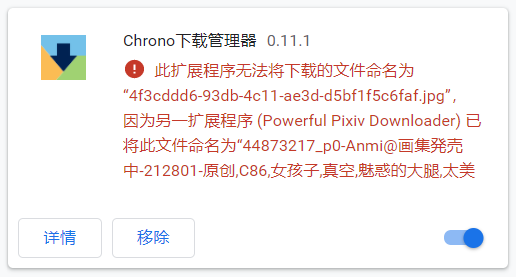

# Chrome 扩展中 onDeterminingFilename 导致文件命名冲突的简单研究

## onDeterminingFilename 是什么

`chrome.downloads.onDeterminingFilename` 是 Chrome 扩展程序 API 中的一个事件。

文档：https://developer.chrome.com/docs/extensions/reference/downloads/#event-onDeterminingFilename

扩展程序监听此事件，可以在下载开始之前设置文件名。

例如，一个扩展程序的功能是“管理浏览器中所有的下载”，并且把文件以序号方式命名。那么它就必须使用这个事件。

但是这种方式很容易引起冲突。

## 冲突示例

例如我的扩展（A）发起一个下载：

```js
chrome.downloads.download({
  url: 'blob:https://www.pixiv.net/7060589a-a7c7-4064-a7a8-774736b005b2',
  filename: '我的名字.png',
})
```

这个文件是一个 blob url，类型是 `image/png`。

默认的文件名是 `7060589a-a7c7-4064-a7a8-774736b005b2.png`，这没什么意义，所以我设置文件名为 `我的名字.png`。

但是另一个扩展（B）使用 `onDeterminingFilename` 监听器修改了文件名：

```js
chrome.downloads.onDeterminingFilename.addListener(function (
  downloadItem,
  suggest
) {
  // 扩展 B 根据自己的规则，设置为新的名字
  suggest({ filename: '001.png' })
  // 或者不传递参数，使用浏览器的默认命名
  // `7060589a-a7c7-4064-a7a8-774736b005b2.png`
  suggest()
})
```

最终可能有两种结果：

1. `001.png` 扩展 B 使用自己的规则设置的文件名
2. `7060589a-a7c7-4064-a7a8-774736b005b2.png` 浏览器设置的默认文件名


*事实上大部分有冲突的扩展都会导致第二种名字，对用户来说体验极差。*

用户希望使用 `我的名字.png`，不希望被其他扩展程序修改。（但是他又安装了有冲突的扩展程序）

用户看到文件名不对，就来问我，我也很无奈。

对于这种冲突，文档说：用户只应该安装一个具有此功能（改名）的扩展程序。我认为这是非常不负责任的做法。

但问题是大部分用户怎么会知道这个事情？

就算知道了，也要挨个排查。

就算排查出来了，那怎么办，必须二选一吗？委婉一点的方法是启用一个的时候禁用另一个。但这样反复操作也很麻烦。

官方的态度就是让用户二选一（或者 N 选一），而没有考虑从代码或者设计层面解决这种冲突。

## 我设置的文件名呢？

我设置了文件名 `我的名字.png`，它哪里去了？

```js
chrome.downloads.download({
  url: 'blob:https://www.pixiv.net/7060589a-a7c7-4064-a7a8-774736b005b2',
  filename: '我的名字.png',
})
```

根据文档：https://developer.chrome.com/docs/extensions/reference/downloads/#type-FilenameSuggestion 的说明，因为有扩展程序使用了 `onDeterminingFilename` 事件，所以我设置的 filename 会被忽略。

>filename is ignored if there are any onDeterminingFilename listeners registered by any extensions.

一开始我以为，即使 filename 被忽略了，但是 `onDeterminingFilename` 事件的 `downloadItem` 参数里也应该有我设置的文件名，但其实没有。`downloadItem` 里的 `filename` 就是默认文件名。


其他扩展程序根本不会知道我设置了 `我的名字.png` 这个名字，自然也不会将此名字纳入考虑。

这种做法非常强硬。如果允许扩展程序把“有无中自定义的名字”纳入考虑，或许会减少一些冲突。

又或者允许开发者在 `download` 方法里设置一个标记，表示不希望被其他扩展修改文件名，这也会好一些。

## 打不过就加入？

如果我就是要保持我的文件名呢？（因为我的扩展下载的文件都是 blob url，显然应该保留自己设置的文件名）

一开始我写了这样的代码：

```js
chrome.downloads.onDeterminingFilename.addListener(function (
  downloadItem,
  suggest
) {
  // 如果这个下载是我的扩展发起的，就强制修改文件名
  if (downloadItem?.byExtensionName?.startsWith('Powerful Pixiv Downloader')) {
    suggest({ filename: '我的名字.png' })
  }
})
```

## 缺陷

上面的方法问题很大。

### 1. 对执行顺序有要求

打不过就加入的方法其实是一种竞争。我的扩展（A）和有冲突的扩展（B）都会修改这个文件的名字。谁是最后执行的，就按谁的来。（执行顺序其实是扩展程序的安装顺序，谁是后安装的，谁就后执行，谁的就生效）

如果扩展 B 先修改文件名，我后修改，扩展 B 就会显示一条错误信息。扩展程序之间的战斗就是这么残酷！



执行顺序是个不稳定因素，我无法控制我的扩展是最后执行（安装）的。

### 2. 会影响其他扩展

为什么会影响其他扩展？我不是进行了判断，只处理我自己发起的下载吗？

实际上，如果你没有调用 `suggest`，浏览器会自动调用。这点很恶心。

```js
// 如果这个下载是我的扩展发起的，就强制修改文件名
if (downloadItem?.byExtensionName?.startsWith('Powerful Pixiv Downloader')) {
 suggest({ filename: '我的名字.png' })
}
// 如果不是呢？
// 浏览器会自动调用无参数的 suggest 方法，设置为默认文件名
// 等于
else{
  suggest()
}
```

所以，就像当初我的扩展（A）被扩展 B 影响了一样，我的这种写法也会影响其他扩展程序的下载，把它们的文件名也搞乱了。

我终究变成了自己最讨厌的模样。

话说，这个默认调用 `suggest` 的处理，真是非常粗暴、强硬的感觉。

### 3. 怎么能够不影响其他扩展？

有办法，但是缺陷很大，导致这样的代码不能实际使用。所以还是会影响其他扩展。

方法是：如果不是自己发起的下载，就返回 `true`。

```js
// 如果这个下载是我的扩展发起的，就强制修改文件名
if (downloadItem?.byExtensionName?.startsWith('Powerful Pixiv Downloader')) {
 suggest({ filename: '我的名字.png' })
}
// 如果不是就返回 true
else{
  return true
}
```

原理：

文档中说如果需要异步调用 `suggest`，必须返回 `true`。

我这里返回了 `true`，浏览器就会开始等待我在之后调用 `suggest`，但是我什么也没做，所以浏览器等待一段时间后（超时了），就不再等待，开始下载。这样也不会自动调用 `suggest`，所以不会修改其他扩展程序的文件名。

那么缺陷很大是指什么？那就是等待时间超级长，大约有 15 秒。想象一下，其他扩展程序下载的每个文件都先等待 15 秒，然后才真正开始下载，用户要抓狂了。

即使我在 `return true` 前面没有写任何异步代码，又或者写一个立即执行完毕的定时器，Chrome 还是等待 15 秒，等待我执行 `suggest`。这有什么需要等待的吗？

但是没有好的办法。如果不 `return true`，这里换成其他任何代码，都无法阻止浏览器自动调用 `suggest`，设置成默认的文件名。

## 总结

`onDeterminingFilename` 是个很有用的功能，但是引起冲突的时候也无法从代码层面解决冲突。

发生冲突时，你只有 2 个选择：

1. 打不过就加入。自己也变成恶人。没有独善其身同时又不影响其他扩展的办法。
2. 忍气吞声，继续被其他扩展乱改自己的文件名。

这两种方法都会给用户和开发者带来麻烦。

昨天我打不过就加入了。但是我发现这只会让世界更加混乱，从此以后又多了一个乱改其他扩展文件名的坏蛋。

最后我还是改回去了，忍气吞声。

---------

在对这玩意进行研究的过程中，令我很费解的一点是：

为什么 Chrome 就非得让使用了此事件的扩展程序**必须修改文件名**呢？我不能选择某些情况修改，某些情况不修改吗？为什么不让开发人员这么做呢？

现在的情况是，如果我在事件监听器里不修改，就自动帮我修改成默认文件名（调用 `suggest`）。

如果我用 `return true` 的方法规避，还要等待 15 秒。明明没有需要执行的异步代码。

那个想不被修改，保持自己的初始名字，在谷歌简单粗暴的处理下，从一开始就被抛弃了。

此外，这个 `suggest` 方法说是“建议”，但其实（最后一个建议）必然会被采纳，`suggest` 这个词合适吗？还不如直接用 `set` 或者 `change`，减少理解障碍。

事实上这种冲突已经不少了，在我的扩展的用户中，反馈此问题的至少也有百十个人了。网上也早有讨论，但是至今没有解决办法。

https://stackoverflow.com/questions/55991260/specifying-path-filename-in-downloads-download-api-not-working-in-chrome-but-d/67006571#67006571

（这个提问里的解决办法就是打不过就加入，但是恐怕他当时还没意识到这样会影响其他扩展）。

https://bugs.chromium.org/p/chromium/issues/detail?id=579563

这个 2016 年发起的讨论，至今没有解决办法。

我很庆幸 Web Extensions 里没有这个 `onDeterminingFilename` 事件。

https://developer.mozilla.org/en-US/docs/Mozilla/Add-ons/WebExtensions/API/downloads

虽然这样就不能方便的制作“管理其他扩展程序的下载内容的扩展程序”，但我必须说这是一件好事。