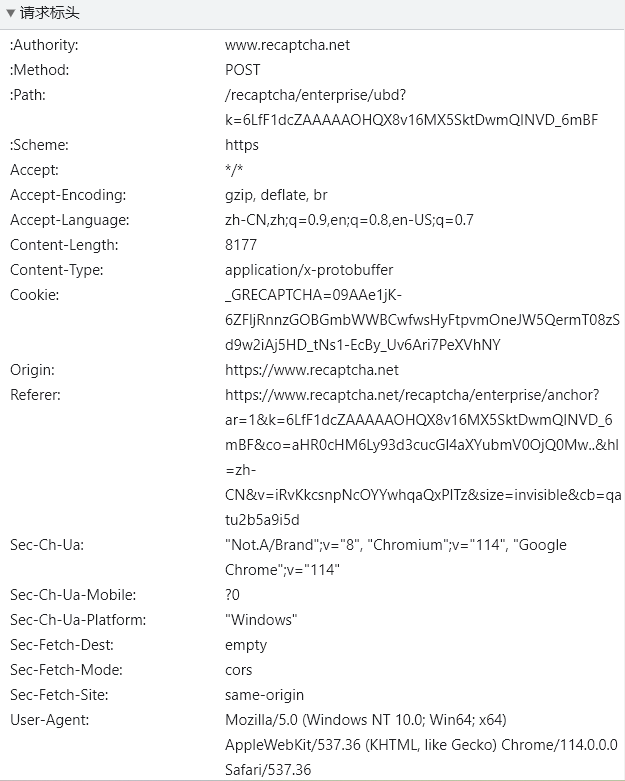
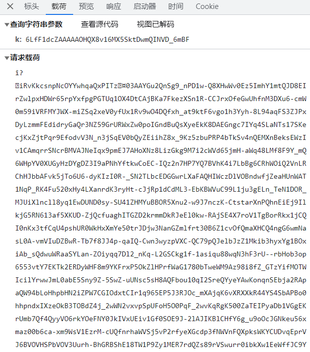
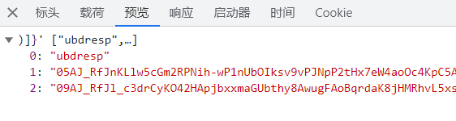
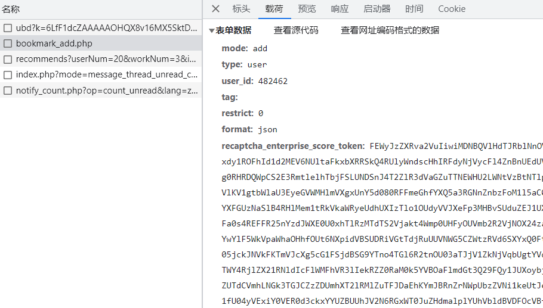
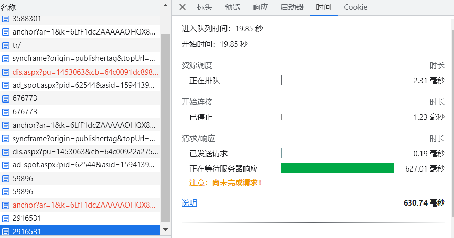
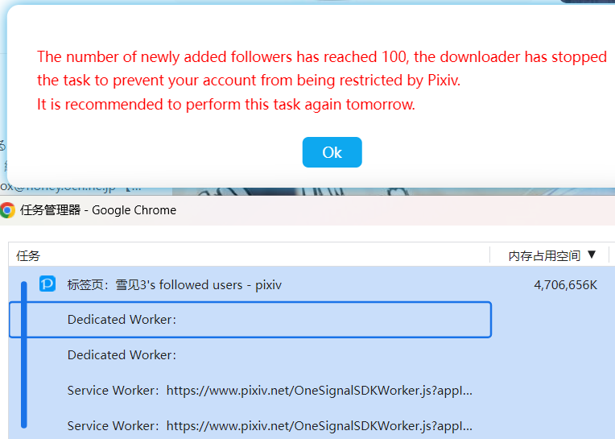
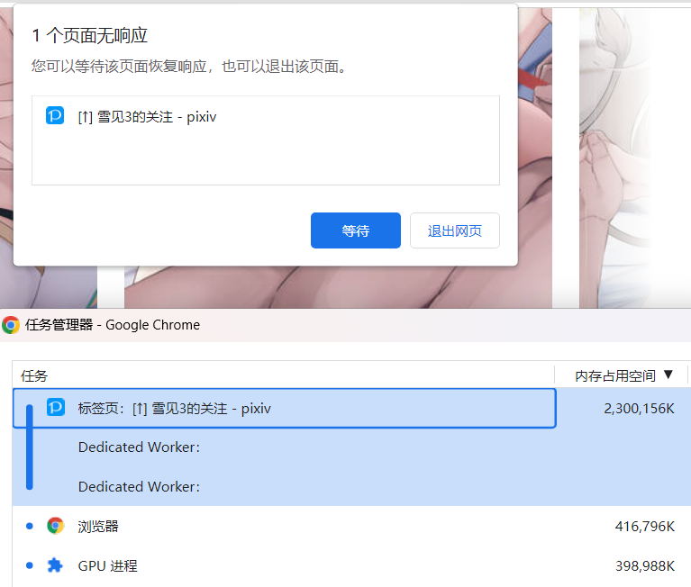
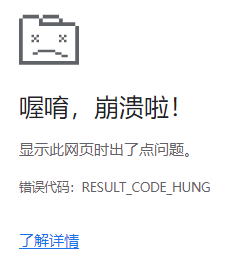
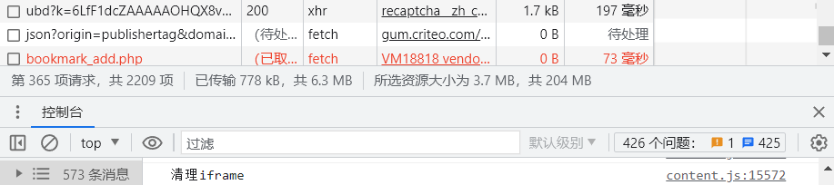
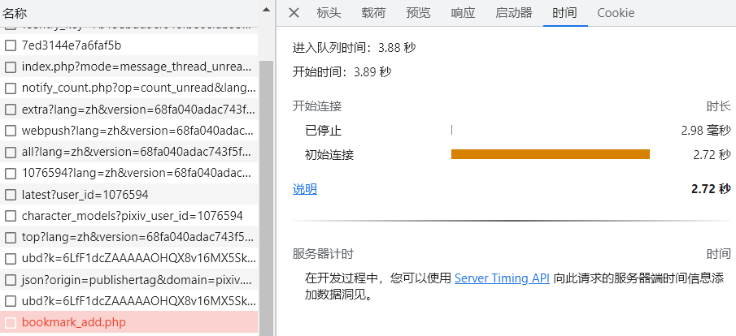

# recaptcha_enterprise_score_token

## 起因

一些 Pixiv 账号可能在关注画师之前，需要先发送一次请求，获取一个字符串数组：

```
POST

"Content-Type": "application/x-protobuffer"

/recaptcha/enterprise/ubd?k=<string>如6LfF1dcZAAAAAOHQX8v16MX5SktDwmQINVD_6mBF
```

注意还需要附带 Uint8Array 的二进制载荷，现在我不清楚这个载荷是如何产生的。而且它返回的字符串数组是不能直接用在之后的请求里的。







返回值如：

```js
["ubdresp","05AJ_RfJlH59h5yu8OphhN3ChcIMvQa0taMgtHTX2wuDngFIJuJM7elI6FqAovek5CvTYHDowirJ1Qfl3YmA476D6Z5RbFzOTTZq1n-iNB0XJmZXwTOsmH7_Bx7Prl5WIn2C47mh5iBizydeMiv0UTMRrVDB56xjSqMs7JbpIfI_r8WTzO3qLaXUfG3dp5JQQ0oW81maDJ4OoiStk64f5xeRQxscxEyQh6L02sw32HhFHJhXh2vH_TdP0H8cOBJylKmV02htkuhtIXMGnA3Y7jZb1cgOqkBuRED-k7-_eNA0AVcJCyJH4XKor5BLoSUlJuNByh857i6V9jJLsdnhQKi54h_NXwBfdi7UCyy_JbVLcdroTq6V6LoBgzLdI0xWGzahECS6Jv7FkQsxNfICaWiQ6Xnxou7GAcKkvxyUHMjC97MFoCu2I7vfi5q-ohByVGSse3ySSdT44lu4LE3b-CQ3oWy8TtUZQdoWl7v69Sn6dkB0f0y74278LAunVW2jhq-ioMs0T54Ht2RgN7VZk15y8lnXt81WWk8wOpeqz7vakDRg4s4lraTR9xmagrNAwcUWM8WL9OKk2uCL_G9pQwNQnG3lp0nKJdBEnme8gG4mJh3FVRb4DPZPlizt0QGTPcF2lg2isEtElFnF3rmB_3j4yNV3yeJB4xlgsA_en3EpOqXLF4r7uddlaO9BymakU3WplSPYTSLrC5mcTFWfcfvHR5Lzbwqcw_JTRbMSWIAAq_vZdPj7WstMjF3HdA5Cn8N5uXluhun_1Wa7Hchw1_5JZi-5WPed434zyUwltHpHzneblWoP_tn4dsEmzRrqK-TjPatZyd2xrJ0jx-oW8Ad4-9mvepS9ssOKlrn7wTflQxMJBj0-8IARJbfrwV3Uzg78JA3YaC6U-AluC2Wqa0L6BI0Lkx39XDUX9iHEt5P4SwRVBSQETx7-QZp9VyvRJU3ooJZmXeXH3P-rUmUiTlWBg5gBqqL7AS18foXjXdZOumJlxqx0qh8xUI2f-qAKxGxgIxPJr1XmSFpsO2eshrAEESlYx_Ydpa1zzrmo6JVjjoK_9BeduPoxyKwOzhXa284M0RDPNmSY5AUmID9fVSFeKspgVMOHSRK56KB2iwiu0h50YdKO3z7PfinbS3XzYcEKAnkP6XBS_bJZKNGwxizGjakCWxJjB3a-nwRBI7msJsLXLv2yZtJjR4Q7qceDAHmYB8VmnBUFK8dziUymjpkrNM0IVGNQxCh1Nte1UnxzhKQYnXikQoVpyh1JsVmANepcG2_GkJCMlJzgQefJ86O_3P710MgFPP9I9gXy-sHSQAFNYRqHKjTepY3vK4OXAT-WQTjaTYoJHQiqsujxegaxFfB4Tp8n6aPuR1Yc5TSjP0nyhQMQx9B8XApZaATqYvcImFY62dHFGeVGsQMWyjw23uEJL0hXoqVFMzVTBG7VvTr3-9F3c","09AJ_RfJlshC1roVDoaX9-rrhXcNPJVDja38X2KnpwJLounR52F5xEQoTNMmzLVSODdomXzCzxNpvzbk3DWcQcGKMcM9kMgzs"]
```

它返回值里的字符经过某种处理后，会变成 recaptcha_enterprise_score_token，并在关注画师时发送：



所以这些 Pixiv 账户在关注画师时需要发送两个请求：
1. 请求 recaptcha 字符串
2. 发送关注画师的请求 `/bookmark_add.php`

某些账号不需要两步，直接关注就可以了 `/bookmark_add.php`，而且也不需要携带 recaptcha_enterprise_score_token，或者这个值可以为空。

## 难点

1. 不知道向 `/recaptcha/enterprise/ubd` 发送请求时的 protobuffer 载荷是如何产生的。
2. 不知道它的返回值是如何变成 recaptcha_enterprise_score_token 的。
3. 每次关注画师时，获取的字符和产生的 recaptcha_enterprise_score_token 都是不同的。也就是说它是一直变的。

下载器在替这些用户添加关注时，无法获取到 recaptcha_enterprise_score_token，导致关注失败，产生 400 状态码。

由于整个流程中的令牌都是加密的，而且最终评估阶段在服务器端完成，我无法破解。所以对于用户因此遇到 400 错误的情况，我只能进行对应提示，无法处理。

令人遗憾的是，很多近期创建的账号（我不知道具体始于何时），都需要使用此验证方法。所以这使得下载器对相当多的用户（尤其是新注册的小号）无法使用批量关注功能。因为下载器压根就无法代替用户进行操作。用户只能手动操作。

## 文档

快速入门： https://cloud.google.com/recaptcha-enterprise/docs/overview?hl=zh-cn

2、3 步就是向 `/recaptcha/enterprise/ubd` 请求获得令牌，4 就是添加关注时 `/bookmark_add.php` 附带 recaptcha_enterprise_score_token。

5、6、7 由后端收到 recaptcha_enterprise_score_token 后再向 reCAPTCHA Enterprise 发送请求获得评分，以决定对请求进行放行或返回 400 错误。

解读评估： https://cloud.google.com/recaptcha-enterprise/docs/interpret-assessment?hl=zh-cn

## 尝试其他方法

1. 我先尝试了在后台脚本里捕获 Pixiv 原本请求 `/bookmark_add.php` 时传递的 recaptcha_enterprise_score_token 并保存，但是很快发现这是没用的，因为每次请求都要通过  `/recaptcha/enterprise/ubd` 生成唯一的一次性使用的令牌，所以保存已使用的 recaptcha_enterprise_score_token 没有意义。

2. 我尝试复制 Pixiv 本来的加关注按钮，修改里面的 user id，但是没用，点击后添加的还是修改前的。如果自己生成按钮的话我没法绑定它原本的事件。

```html
<button class="sc-bdnxRM jvCTkj sc-dlnjwi cnpwVx sc-1obql3d-0 Rlftz gtm-undefined sc-1obql3d-0 Rlftz gtm-undefined" data-gtm-user-id="22220502" data-click-action="click" data-click-label="follow" height="40">已关注</button>
```

3. 用笨办法：iframe 加载画师主页，然后点击关注按钮。

```js
let url = 'https://www.pixiv.net/users/22220502'
let i = document.createElement('iframe')
document.body.append(i)
i.onload = function () {
  const button = i.contentDocument.querySelector('button[data-click-label]')
  console.log(button)
  button && button.click()
}
i.src = url
```

用 js 的 `click()` 方法可以照常触发关注的 2 步流程，实现关注。

而且这个方法也能够成功。

这个方法可能遇到的意外情况，目前我猜测有两种：
1. 页面里没有关注按钮，可能是用户销号了，或者其他目前尚不知道的原因；
2. 点击关注按钮后下载器会等待 3 秒然后销毁这个 iframe。如果此时请求尚未完成，可能未能成功关注此用户。目前没有做针对的解决办法。网络正常的话 3 秒应该不会超时。

## 使用 iframe 方案遇到的问题

### 内存泄漏 未能解决

同时只存在一个 iframe，并且用完之后用 `this.iframe.remove()` 移除这个 iframe，下次使用时重新创建。

有一次添加 100 个关注（iframe），内存占用从 10.4 GB 升到 13.9 GB，增加了 3.5 GB。

我查了资料才知道，仅仅移除 iframe 不会销毁它的内存占用，必须彻底解除它的引用。

我尝试把 iframe 从 this 上取消，变成局部变量，并在用完之后这样移除：

```js
iframe.src = "about:blank"
iframe.remove()
iframe = null as any
```

然而问题没有解决，和之前的内存使用量依然差多。不清楚该如何处理。

当内存使用量超出一定限制后，页面会崩溃，显示错误代码：Out of Memory。

一次测试的情况：

新增关注数量达到 126 个之后很快 Out of Memory，此时页面所占用的内存接近 4.8 GB。

页面初始内存是 170MB，增加了 4.6 GB。平均每个 iframe 增加了 36MB 的内存占用。


### 加载网页时卡死的问题 已解决

原本是直接把网址设置为 iframe 的 src `iframe.src = url`，但是通常在执行到第 5 个左右的时候，就会出现请求待完成而导致整个页面卡死的问题。



这件事情比较奇怪，这个请求之后也许可以正常完成的，但是浏览器只等待了很短的时间，就导致页面卡死，无法进行任何操作，并导致 CPU 占用率逐渐升高。最后有可能页面崩溃并显示错误代码 `RESULT_CODE_HUNG`。

之后我尝试了用 srcdoc 直接设置 iframe 的内容，但是这会导致 pixiv 内部的一个脚本错误，无法渲染页面。

```js
const res = await fetch(url)
const text = await res.text()
iframe.srcdoc = text
```

报错：

```
vendors~pixiv~spa~stacc3.658d366fc9a123789bb4.js:2442 Uncaught DOMException: Failed to execute 'replaceState' on 'History': A history state object with URL 'about:srcdoc' cannot be created in a document with origin 'https://www.pixiv.net' and URL 'about:srcdoc'.
```

之后我改回了用 src 的方法，但是在前面执行一次请求，让 iframe 的 src 可以使用缓存，避免了 iframe 加载失败以及页面卡死的问题。

```js
await fetch(url)
this.iframe.src = url
```

### 未知原因导致的页面卡死 未能解决

解决了上面的加载页面导致的卡死问题之后，还是会出现卡死，经常在添加了几十个关注后就会卡死，而且发生频率很高，超过一半。

我先观察了是否是因为页面内存用量达到限制所致，不过似乎不是这个原因。有一次添加 100 个关注，该页面使用的内存超过了 4GB，并未出现卡死。



有的时候内存只用了 2 GB 左右，就会卡死提示无响应，选择退出网页就会显示 RESULT_CODE_HUNG 错误。





--------

之后我怀疑和 `/bookmark_add.php` 被取消有关：



有好几次我观察到最后一个 fetch 请求是个被取消的 `/bookmark_add.php`，时间栏里的状态是等待服务器响应，没有等到回应就被取消，然后页面就卡死了。



它的调用链和正常完成的 `/bookmark_add.php` 的调用链是一致的。

至于它为什么会被取消，我也不清楚。可能是它还未执行完，iframe 就销毁了。但是这个可能性感觉不是很大，因为点击关注按钮后，下载器会等待 3 秒钟，看图上的情况，时间是够用的。

我尝试把定时器的时间设置为随机数以降低被反爬虫措施针对的可能，但是也没有效果。

把定时器从 3 秒增加到 4 秒，也没改善。

最重要的是，即使这个 fetch 被取消，下载器代码也未收到任何错误。页面直接卡死了。因此下载器无法进行错误处理。

为什么这个 fetch 取消会导致页面卡死？真不懂。

### 点击了取消关注按钮 未能解决

在多次测试中，有一次我发现操作的 100 个用户都是点击的取消关注按钮，原本添加 100 个关注变成了取消 100 个关注。

这很奇怪，因为下载器会先获取已关注用户列表，所以只会打开未关注用户的主页，然后点击关注按钮。

这次却变成了打开的是已关注用户的主页，点击了取消关注按钮。

原因尚不清楚，之后测试也未能复现。

### 总结

目前使用 iframe 方法模拟点击来关注用户。此方法存在如下问题：
1. 内存占用大，添加到 120 个左右就可能导致 Out of Memory。
2. 在超出内存之前就很容易因为 fetch 被取消而导致页面卡死。
3. 花费的时间比较久。
