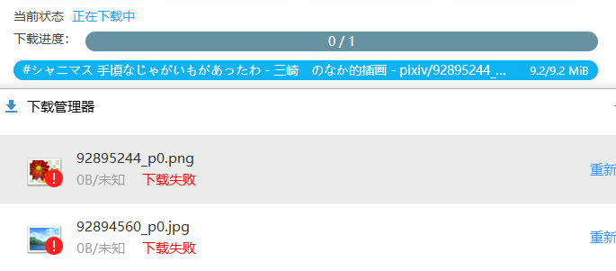

参考：

1. [2020年8月国内浏览器市场占有率排行](https://www.cnbeta.com/articles/tech/1030221.htm)
2. [2021年 8 月国产 Chrome 套壳浏览器的版本号](https://zhuanlan.zhihu.com/p/405207457)

本文档的日期：2021/09/20。

我测试了一些国产套壳浏览器，尝试安装本扩展并下载 pixiv 的作品。

通常来说，内核版本太低的浏览器无法正常下载。但是某些内核版本较高的浏览器也存在问题。

一个有趣的现象是，这些不能正常下载的垃圾浏览器，通常都会在 UA 里给自己起一个单独的名称。能正常下载的浏览器都没有额外添加名称。

## 不能正常使用的浏览器

### 搜狗浏览器

```
"Mozilla/5.0 (Windows NT 10.0; WOW64) AppleWebKit/537.36 (KHTML, like Gecko) Chrome/87.0.4280.66 Safari/537.36 SE 2.X MetaSr 1.0"
```

搜狗浏览器使用本扩展不能正常下载。

下载器把文件转换成 Blob URL，并使用浏览器的 `download` API 下载此文件。但是搜狗浏览器显示文件的体积是“未知”，并且最终会下载失败。这导致浏览器里的下载进度会卡住。



搜狗浏览器最新版本是 12（内核版本 87）。这应该是搜狗魔改导致的结果，因为下载管理里面复制文件的 URL 可以看到确实是 Blob URL，而且还是有效的（可以在网页中加载），但是搜狗无法下载。

此外，在搜狗浏览器的地址栏里粘贴 Blob URL 并回车，没有任何反应。

我推测是搜狗对 Blob URL 的处理有问题。不太可能是魔改了 `download` API。

最后吐槽下，搜狗浏览器把“扩展管理”页面进行了彻底的魔改。好像不可以离线安装扩展程序。而且从 Google Web Store 里安装扩展竟然会显示红色警告。真是绝了。

### QQ浏览器

```
"Mozilla/5.0 (Windows NT 10.0; WOW64) AppleWebKit/537.36 (KHTML, like Gecko) Chrome/70.0.3538.25 Safari/537.36 Core/1.70.3872.400 QQBrowser/10.8.4455.400"
```

QQ 浏览器也不能正常下载。吐槽下它的内核版本才 70，真坑爹。

下载器的下载进度条走完之后就没反应了。打开 QQ 浏览器的下载管理发现什么都没有。绝了。


不能确定导致此问题的原因。

另外，每当启用下载器时，背景页都会产生一个错误：

```
Uncaught Error: Invalid value for argument 2. Property '.2': Value must be one of:
[blocking, responseHeaders].
```

下载器在参数数组里使用了 `extraHeaders`，但是查阅文档发现，这是 Chrome 79 版本才支持的一个功能。因为 QQ 浏览器的内核版本只有 70，所以会出现此问题。

但是这并没有影响下载器加载 pixiv 的文件，因为下载器的进度条是走完了的。但是为何 QQ 浏览器没有建立下载任务，我也不清楚。

由此问题可知，本程序使用的 API 要求 Chrome 内核版本大于等于 79。

### 2345浏览器

"Mozilla/5.0 (Windows NT 10.0; WOW64) AppleWebKit/537.36 (KHTML, like Gecko) Chrome/69.0.3947.100 Safari/537.36 2345Explorer/10.21.0.21486"

极其垃圾，不仅内核版本号最低，而且刚安装上在后台下载了一个 `2345SafeCenterInstaller.exe` 尝试自动安装。

安装扩展程序的时候，我无法安装（提示安装成功了，但是它的扩展管理里面根本没有）。

其他群友测试安装上了，但是下载会卡住。毕竟它的内核版本号太低了，下载出现问题很正常。

### 猎豹浏览器

```
"Mozilla/5.0 (Windows NT 10.0; WOW64) AppleWebKit/537.36 (KHTML, like Gecko) Chrome/79.0.3945.79 Safari/537.36"
```

使用命名规则 `{p_title}/{id}` 下载，可以建立文件夹，也可以下载文件，但是文件没有被放进文件夹里（所以文件夹是个空文件夹）。

值得一提的是，使用猎豹浏览器打开 pixiv.net，会提示这是一个欺诈网站，存在风险。需要忽略警告才能继续访问。

## 可以正常使用的浏览器

在测试过程中，有一些浏览器可以正常使用本下载器。做一下记录。

### 360极速浏览器

```
"Mozilla/5.0 (Windows NT 10.0; WOW64) AppleWebKit/537.36 (KHTML, like Gecko) Chrome/86.0.4240.198 Safari/537.36"
```

### 360安全浏览器

```
"Mozilla/5.0 (Windows NT 10.0; WOW64) AppleWebKit/537.36 (KHTML, like Gecko) Chrome/86.0.4240.198 Safari/537.36"
```

### 极速浏览器

```
"Mozilla/5.0 (Windows NT 10.0; Win64; x64) AppleWebKit/537.36 (KHTML, like Gecko) Chrome/86.0.4240.198 Safari/537.36"
```

### Cent浏览器（百分浏览器）

```
"Mozilla/5.0 (Windows NT 10.0; WOW64) AppleWebKit/537.36 (KHTML, like Gecko) Chrome/86.0.4240.198 Safari/537.36"
```

### 115 浏览器

115 浏览器的测试日期为 2022 年 3 月，内核版本 83，可以正常使用。

```
"Mozilla/5.0 (Windows NT 10.0; WOW64) AppleWebKit/537.36 (KHTML, like Gecko) Chrome/83.0.4103.61 Safari/537.36 115Browser/25.0.1.0"
```