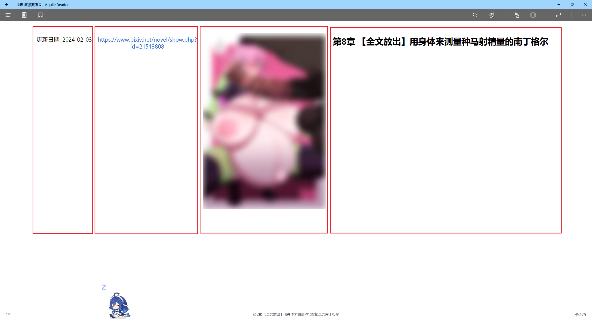
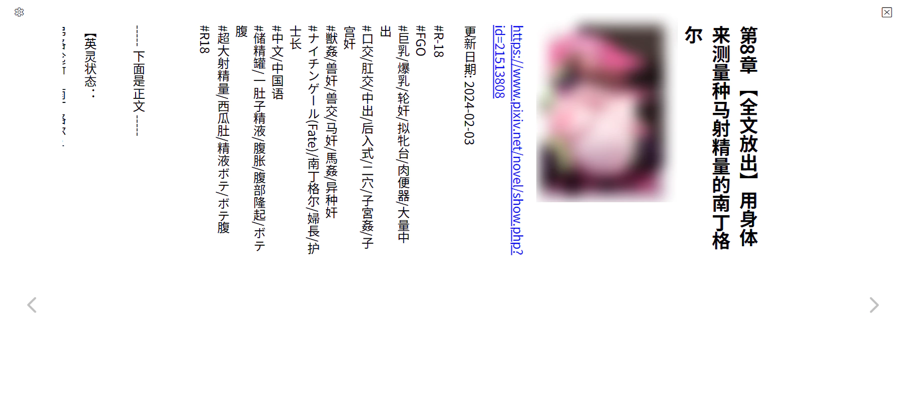

# 一些小说阅读器对竖排 EPUB 的支持情况

下载器现在支持生成竖排的 EPUB 小说（使用样式 `body {writing-mode: vertical-rl;}`）。此时：
- 对于单篇小说，只对正文内容使用竖排。
- 对于系列小说，每个章节的内容都使用竖排。

我测试了 Windows 上一些小说阅读器对竖排的支持情况。

## calibre

🟢

状态：完全支持。

主页网址：https://calibre-ebook.com/zh_CN/download_windows

完美呈现竖排内容。

## Thorium Reader

🟢

状态：完全支持。

主页网址：https://www.thoriumreader.com/en/download/

完美呈现竖排内容。

## Koodo Reader

🟡

状态：默认横排，需要手动改为竖排

主页网址：https://www.koodoreader.com/

它会忽略书籍设置的方向，只遵从自己内部的排版设置。默认总是会使用横排，需要用户手动改为竖排才会以竖排呈现。不过这样的话，之后打开横排书籍也会显示为竖排。

## Aquile Reader

🔴

状态：渲染错误

它会试图呈现竖排内容，但实际上不可用。

问题 1：段落是竖排的（正确），但里面的文字却依然是横向排列的（错误）。

问题 2：对于每一章，它只会显示第一页的内容（就是上图中能看到的内容），我不知道该怎么做才能看到接下来的内容（左侧看不到的区域），反复尝试无果。所以它完全无法阅读竖排内容。

## EPUB Reader Online

🔴

状态：无法阅读第一页之后的内容

主页网址：https://epub-reader.online/#

它能正确显示竖排文字效果，但有个问题和 Aquile Reader 的问题 2 类似：

在第一页之后（画面最左侧）还有内容，但我不知道怎么查看到后面的内容。所以实际上不可用。

## 安卓上的静读天下

🟡

状态：默认横排，需要手动改为竖排

它和 Koodo Reader 一样会忽略书籍设置的方向。默认总是会使用横排，需要用户手动改为竖排才会以竖排呈现。

有趣的一点是，由于手机屏幕是竖的，所以在静读天下的竖排模式里，需要把手机横过来看。当然竖排确实适合使用这样的横向纸张，只是体验有点新奇。

