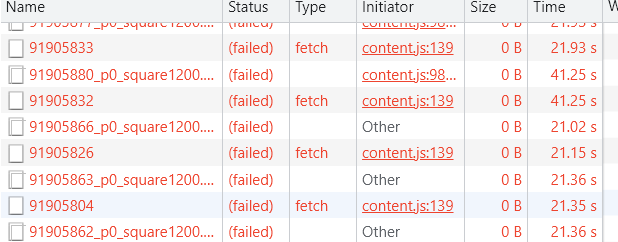
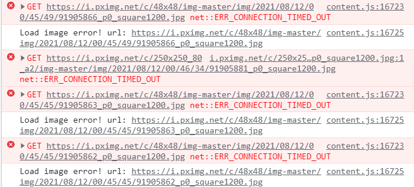

下载器遇到的一些网络请求错误

## 超时

下载器的很多请求都是使用 `fetch`，并且没有设置超时时间。

**在使用代理软件的时候，可能不会发生超时错误。** 下面的请求即使经过了 1.4 min 也没有超时。

这可能是因为代理的存在，此时浏览器是与代理软件通信的，而不是与 pixiv 通信。所以当代理软件在保持着这个请求时，浏览器永远不会认为这个请求会超时。（除非代理软件告诉浏览器请求超时了）

在下图中，浏览器通过代理发送请求，在请求还未返回时直接关闭代理。过一会儿之后浏览器显示请求超时。这应该是因为浏览器得不到代理软件的回应，所以判断这个请求超时了。

推测：使用代理并且代理正常工作时，浏览器可能不会发生超时错误。

如果请求途中断开代理，以及不使用代理（直连）时，会发生超时错误。
