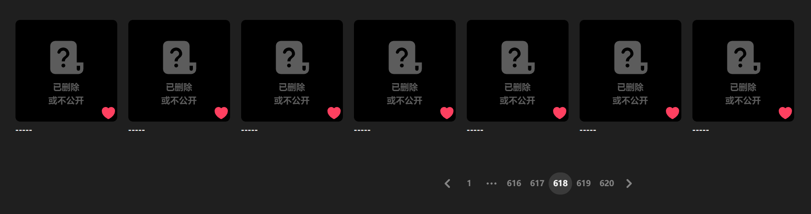
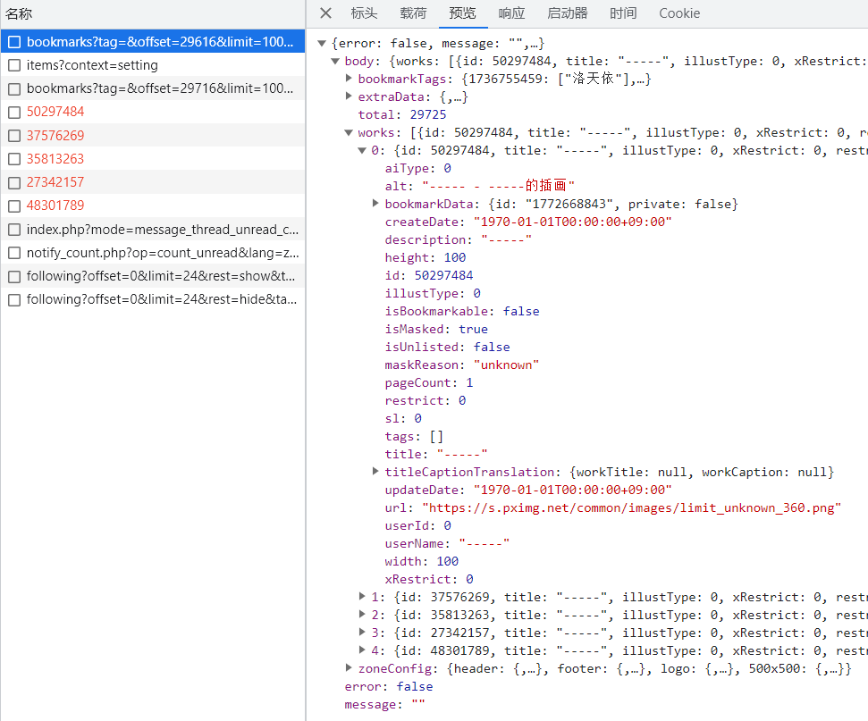

# 从书签中移除被删除（404）的作品

如果收藏的作品被删除，那么在收藏页面里就看不到作品详情，也无法点击进入作品页面。



Pixiv 没有向用户提供删除这些失效的收藏的操作接口，所以用户无法移除它们。

如果尝试使用获取作品详细数据的 API 来获取被删除的作品的数据，Pixiv 会返回 404 错误码。

但是用于获取收藏列表的 API 可以获得作品的粗略信息，被删除的作品也在其中。



这样就可以获得必要的信息，然后使用删除书签的 API 来取消收藏这些作品。

-------------

一个被删除的插画的数据示例：

```json
{
    "id": 50297484,
    "title": "-----",
    "illustType": 0,
    "xRestrict": 0,
    "restrict": 0,
    "sl": 0,
    "url": "https://s.pximg.net/common/images/limit_unknown_360.png",
    "description": "-----",
    "tags": [],
    "userId": 0,
    "userName": "-----",
    "width": 100,
    "height": 100,
    "pageCount": 1,
    "isBookmarkable": false,
    "bookmarkData": {
        "id": "1772668843",
        "private": false
    },
    "alt": "----- - -----的插画",
    "titleCaptionTranslation": {
        "workTitle": null,
        "workCaption": null
    },
    "createDate": "1970-01-01T00:00:00+09:00",
    "updateDate": "1970-01-01T00:00:00+09:00",
    "isUnlisted": false,
    "isMasked": true,
    "aiType": 0,
    "maskReason": "unknown"
}
```

一个被删除的小说的数据示例：

```json
{
    "id": "12855046",
    "title": "-----",
    "xRestrict": 0,
    "restrict": 0,
    "url": "https://s.pximg.net/common/images/limit_unknown_s.png?20110520",
    "tags": [],
    "userId": 0,
    "userName": "-----",
    "profileImageUrl": "https://s.pximg.net/common/images/no_profile_s.png",
    "textCount": 0,
    "wordCount": 0,
    "readingTime": 0,
    "useWordCount": false,
    "description": "-----",
    "isBookmarkable": false,
    "bookmarkData": {
        "id": "1022489201",
        "private": false
    },
    "bookmarkCount": null,
    "isOriginal": false,
    "marker": null,
    "titleCaptionTranslation": {
        "workTitle": null,
        "workCaption": null
    },
    "createDate": "1970-01-01T00:00:00+09:00",
    "updateDate": "1970-01-01T00:00:00+09:00",
    "isMasked": true,
    "isUnlisted": false,
    "maskReason": "unknown",
    "aiType": 0
}
```