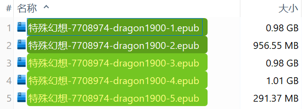
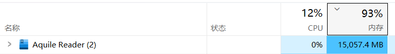

有些系列小说含有大量插图，导致体积很大，需要分割成多个文件。例如：

https://www.pixiv.net/novel/series/7708974

目前它有 51 篇小说，含有 1299 张图片，其中插画有 1252 张，总体积是 4.46 GB。

一开始我设置的分割阈值是 100 MB，之后有人觉得太小了，想要加大，于是我增加到了 200 MB，现在又有人想要加大。

于是我想干脆加一个设置吧，就是“合并系列小说时的分割阈值”，让用户可以自己设置分割阈值。

不过最大值设置为多少好呢？我打算尝试一下 1000 MB，也就是每次加载的小说数据达到 1 GB 时生成一个文件。测试成功了：

但是内存使用情况也很极限，达到了 4 GB 限制。

这个标签页初始内存是 200 MB：

当下载器保存了 1 GB 数据时，内存占用增加了 2 GB：

随后生成 EPUB 文件，内存再次翻倍到 4 GB：

峰值内存是 4.4 - 4.5 GB，之后迅速回落到初始内存。

-------------

分析一下内存占用为什么是 4 倍：

在加载小说里的图片后，下载器会为其生成 ArrayBuffer 并传递给 jepub 库保存。之后 jepub 会把它添加到 zip 文件里。此时造成了 2 倍的内存占用，也就是 1 GB 文件数据占用了 2 GB 内存。

但是我有一个疑问：下载器会把图片的 ArrayBuffer 设置为 null，之后 jepub 里的数据也会被回收，理论上只有 zip 里那一份。但实际上有 2 份内存使用量，我不知道是为什么。

最后生成 zip 文件时，内存使用量翻倍，到了 4 GB。这是预料之内的。

--------------

PS：Aquile Reader 在打开 1 GB 的 EPUB 文件时，内存占用达到了 15 GB：

