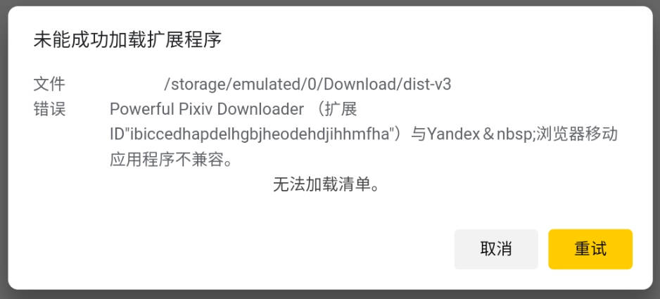
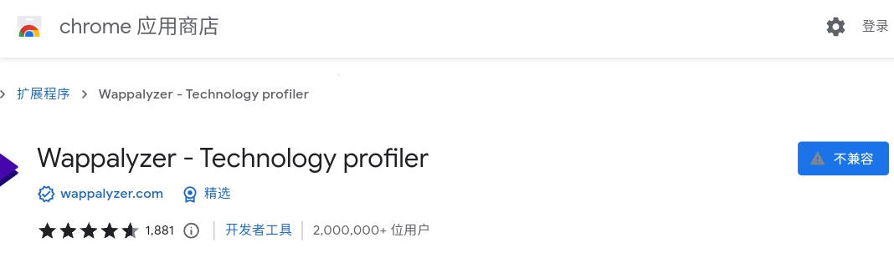

# 在 Yandex 浏览器（安卓）上调试扩展程序

我们可以输入网址打开[扩展管理页面](browser://extensions)，加载扩展程序：

browser://extensions

这会打开文件浏览器，我们需要找到并选择扩展程序的 manifest.json 文件，把扩展程序加载到 Yandex 浏览器中。

官方文档：https://yandex.com/support/browser-mobile-android-phone/personal-settings/extensions.html#developers2

# Manifest version 3 支持

2022/11/11

Yandex 浏览器最新版本仍然不支持 Manifest version 3 的扩展程序。

离线加载 V3 的扩展程序会出现错误：

为了保险起见，我还得测试一下它是否支持在线安装 V3 的扩展程序。

这个扩展程序是 V3 的： https://chrome.google.com/webstore/detail/gppongmhjkpfnbhagpmjfkannfbllamg

结果 Yandex 直接显示不兼容，无法安装。

所以我对 Yandex 已经没有念想了，年底必须升级到 V3，它不支持我也没办法。

# 显示警告

下载器即将对 Android 上的 Yandex 浏览器发出警告，因为它不能支持 Manifest version 3。

我的安卓手机上的 Yandex 浏览器的 UA：

`Mozilla/5.0 (Linux; arm_64; Android 10; MI 8 Lite) AppleWebKit/537.36 (KHTML, like Gecko) Chrome/106.0.0.0 YaBrowser/22.11.0.224.00 SA/3 Mobile Safari/537.36`

当 Yandex 浏览器启用桌面模式后的 UA：

`Mozilla/5.0 (X11; Linux x86_64) AppleWebKit/537.36 (KHTML, like Gecko) Chrome/106.0.0.0 YaBrowser/22.11.0.224.00 SA/3 Safari/537.36`

不要检查 Android 字样，因为桌面模式下可能没有 Android 标识。
