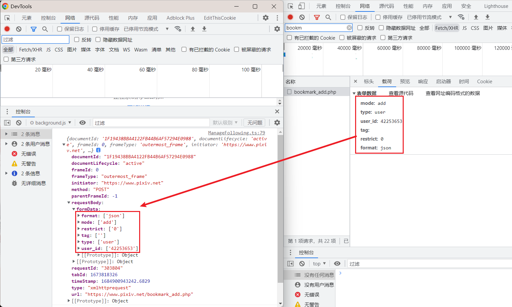
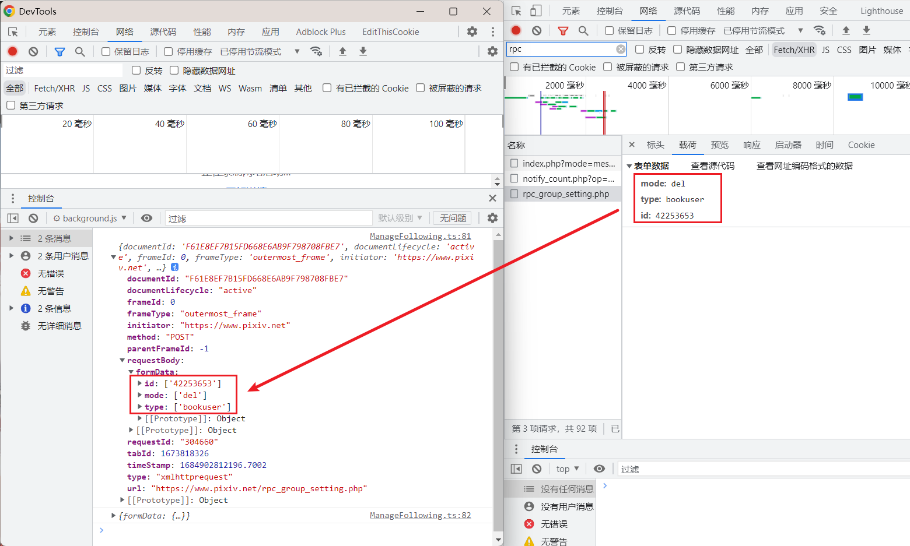

# 在后台脚本中管理关注列表

一开始我把数据存储在 localStorage 里，每个标签页读取并在数据变化时写入。

但是这存在问题，多个标签页之间可能重复请求关注列表，也可能产生数据不一致的问题。

我需要一个全局的管理系统，这只能用后台脚本来做。

## 要解决的问题

非全局时面临的问题：

### 重复请求关注列表

如果两个标签页在几乎同时开始检查关注数量，并且关注数量变化了需要全量更新，那么它们都会请求关注数据。

这会造成重复的请求。虽然我已经把检查更新的定时器设置为随机值，但如果用户打开的标签页很多，仍然有可能会几乎同时开始检查，或者是一个页面已经开始获取更新数据，但是另一个页面不知道它的状态，它只能自己也开始请求，造成重复请求。

还有一种情况是当没有存储的关注数据时，用户打开了多个 pixiv 页面，由于没有关注数据，这些页面都会请求关注数据，这也很浪费。

如果要添加一个更新状态，表示已经有页面正在更新数据（让其他页面不要再去请求数据），或者是现在空闲可以更新，那么这相比于读写 localStorage，更适合交给后台来做。

### 数据不一致

假设在某个标签页里，用户添加了一个关注，此页面的数据里就添加了一个关注。

在另一个标签页里，用户添加了另一个关注，这个页面里的数据也添加了一个关注。

现在这两份数据就不一样了。如果它们都把自己的数据写入 localStorage，那么等于后写入的生效，先写入的被覆盖了。

一个解决思路是在合适的时机读取 localStorage 里的数据进行更新，例如一个标签里的数据变化并写入 localStorage 后，其他页面就全都重新从 localStorage 读取数据，更新自己的数据。

但是这难以实现，因为各个页面（或者说所有的 pixiv 标签页）之间缺乏通讯手段，这就不得不借助后台脚本了。

而且还有个数据冲突的情况无法解决：当一个页面 A 开始发送请求获取更新的关注数据的过程中，注意这个操作不是瞬间完成的。这时候如果其他页面 B 瞬时更新某一个用户数据，B 的数据瞬时写入 localStorage。

那么之后 A 在请求更新数据完成时，这个被删除的用户可能还存在于 A 的数据里（因为用户添加或取消关注某个用户时，A 可能已经获取了一部分数据，而这些数据里含有或缺少这个用户的数据）。由于 A 比 B 后完成，A 的数据随后写入 localStorage 覆盖了数据，这就可能导致 B 的操作失效，并且数据也是不准确的。

因此当 A 在请求期间，其他瞬时完成的操作（添加或取消关注一个用户）不应该写入存储里，而是应该有某种排队等待机制，等待 A 完成操作后，基于 A 的数据进行对应的处理，最后在排队任务为空时才能写入存储。

这无疑也适合使用后台来做，如果用 localStorage 实现这样的排队机制，会是灾难性的，因为各个页面是各自为政，而这个机制需要读写任务队列，还需要配合其他标记（如是否处于更新中的标记）来实现。

## 实现

### 流程

扩展安装或更新时，把初始数据存储到 chrome.storage.local 里。

当用户打开前台 Pixiv 页面时，前台页面向后台请求数据，后台返回数据。

当某个前台页面需要更新数据时，需要先向后台发送申请，后台会根据状态锁进行判断，如果没有其他正在获取更新的页面，则通知（允许）此页面执行更新。
如果不符合条件，则不通知（不允许）此页面执行更新。也就是同时只能有 1 个页面在执行更新。
当前台请求完了所有关注数据时，提交到后台，后台更新数据，并把新数据派发给所有前台页面。
这解决了重复请求的问题。

当用户添加或取消一个关注时，后台脚本会监测到对应的网络请求，并把添加或删除的动作放入等待队列，以确保操作按顺序执行。
如果后台处于空闲状态，则立即执行队列里的所有操作，并把新的数据派发给所有前台页面。
如果后台处于锁定状态（这说明有某个页面正在请求新的关注列表数据（这是个持续的过程）），队列需要等待后台变成空闲状态再执行。

前台提交的完整的关注数据（覆写现有数据）的操作不会被放入队列，而是立即执行（也就是比队列中的任务优先执行）。

这解决了数据冲突的问题。

### 前后台之间的通讯

当前台脚本初始化之后，如果检测到用户已登录 Pixiv 账号，就会向后台发送 `requestFollowingData` 消息请求数据。

后台发送 `dispathFollowingData` 消息传递数据。

如果前台发现数据里没有当前登录用户的数据，则向后台发送 `needUpdateFollowingData`，表明自己想要需要通过网络请求更新数据。

如果后台准许前台请求新的数据，则发送 `updateFollowingData`，否则不发送此消息。

前台通过网络请求更新数据之后，向后台发送 `setFollowingData` 消息传递新的数据。

每当后台储存的数据变化后，都会发送 `dispathFollowingData` 消息传递新的数据。

---------

另外，后台有时会向前台发送消息 `getLoggedUserID`，获取当前登录的用户的 ID。

### 前台发送的消息需要附带当前登录用户的 ID

在前台向后台发送的某些里消息里需要附带当前登录用户的 ID，后台也需要根据这个 ID 去操作对应的数据。

但是现在前台页面申请更新时没有附带用户 ID，因为这通常不会导致问题。

包括无痕模式下也是如此，因为无痕模式和普通模式里，虽然用户可能登录两个不同的 pixiv 账号，但是下载器的后台脚本也会分别运行，不会搞混。

如果用户在一种模式（如普通模式里）打开了多个 pixiv 页面，然后在有的页面退出登录，切换到新的账号，那么就同时存在两个账号的 pixiv 页面。
当新账号的页面请求进行更新时，如果后台没有锁定，就可以用新账号的页面执行更新，所以也不存在问题。

------------

实际上完美的设计是所有操作都分用户 ID，也就是所有状态、数据都区分，或者说每收到一个新的用户 ID 就 new 一个管理后台。但是这样会使管理后台和前台页面都变得更为复杂，由于可能存在多个后台实例，那么每个消息监听函数都会存在多个回调。每个回调里需要根据用户 ID 判断这个消息是否应该由自己（这个实例）来处理。

而且作为管理多个实例的“顶层总后台”也首先需要通过监听消息来获取用户 ID，判断用户 ID 对应的后台不存在的话，new 一个新的后台。

考虑到不使用多个后台的话，影响通常也不大，所以就不采用多个后台的方案了。

不使用多个后台，那么某些状态标记只有一份，不会区分用户。主要的影响是当某个用户 ID 处于更新数据的过程中（这是一个持续的事务），后台会锁定数据，此时如果有另一个用户 ID 也请求更新数据，由于只有一个状态锁，后台会驳回后者的请求。后者就需要等到下一次请求更新时才有机会实际进行更新。

不过这种情况只会在用户在同一个后台所对应的前台里登录不同 pixiv 账户时触发，实际上影响不大。

### 依然有数据冲突的可能

虽然用后台进行管理是为了解决使用 localStorage 储存数据时的数据冲突问题，但是如果用户同时启动了多个后台呢？

例如打开一个普通窗口，又打开一个或多个无痕窗口，这多个不同窗口会启动多个扩展后台，它们都会操作存储在 chrome.storage.local 里的关注列表数据。

不管这些窗口里登录的 Pixiv 账户是否有重复的，都有可能会导致数据冲突。

但是这我就没办法解决了，而且数据冲突只会导致某些修改没有被保存到持久数据里，而不是数据消失，所以影响不是很大。

## 监听用户新增或取消关注的动作

使用 webRequest 权限监听用户添加一个关注，或取消一个关注的请求，实时检测变化。

https://developer.chrome.com/docs/extensions/reference/webRequest/#examples

chrome.webRequest 只能在后台脚本中使用。

### 新增关注

当点击关注按钮时，API 为

```
https://www.pixiv.net/bookmark_add.php
```

需要注意，收藏一个作品后，点击作品下方的编辑收藏按钮，也会跳转到 `bookmark_add.php`。所以监听关注用户的请求时需要判断请求方法为 POST。

请求方法为 POST，Content-Type: application/x-www-form-urlencoded; charset=utf-8，body 如：

```
mode=add&type=user&user_id=89469319&tag=&restrict=0&format=json
```

```
mode: add
type: user
user_id: 89469319
tag: 
restrict: 0
format: json
```

对于下载器来说，必须获取 body，通过判断它的参数内容来确定用户的操作。

但是请求数据里没有包含登录用户的 ID，所以后台脚本需要额外向发出请求的标签页发送消息，获得用户 ID。

后台脚本输出的请求详情如：



### 取消关注

点击取消关注按钮时，API 为 

```
https://www.pixiv.net/rpc_group_setting.php
```

请求方法为 POST，Content-Type: application/x-www-form-urlencoded; charset=utf-8，body 如：

```
mode=del&type=bookuser&id=89469319
```

```
mode: del
type: bookuser
id: 89469319
```

感觉这个 API 调用稍显怪异，可能是早期 API 一直保留到了现在。

注意：这个 API 里没有指定 `restrict` 属性，也就是说取消关注时不会区分关注用户是公开还是不公开的。

同样的，请求数据里没有包含登录用户的 ID，所以后台脚本需要额外向发出请求的标签页发送消息，获得用户 ID。

后台脚本输出的请求详情如：




### 更改某个关注用户的公开或不公开状态

目前，下载器并不需要区分一个关注是公开的还是不公开的。所以这个 API 仅作记录，没有监听它。

```
https://www.pixiv.net/ajax/following/user/restrict_change

POST

把一个关注用户从公开关注改为不公开：
user_id=13214430&restrict=1

从不公开改为公开：
user_id=13214430&restrict=0
```

### 如何获得 request body 载荷

示例代码如：

```js
chrome.webRequest.onBeforeRequest.addListener(details => {
  if (details.method === 'POST') {
    console.log(details)
    console.log(details.requestBody)
    if(details?.requestBody?.formData){
      // formData 类型是 [key: string]: string[]
      // 也就是说，每个属性的值是数组
    }
  }
}, {
  urls: [
    'https://*.pixiv.net/bookmark_add.php'
  ],
  types: ['xmlhttprequest']
},
  ['requestBody'])
```

要获取 requestBody，必须监听 onBeforeRequest 事件，其他事件不可以。

然后在监听器的第三个参数 extraInfoSpec 里指定 `'requestBody'`，这样才能获取到 body。

数据可能被存储在 `details?.requestBody?.formData` 里：

如果请求方法是 POST 并且正文是一系列以 UTF8 编码的键值对，编码为 multipart/form-data 或 application/x-www-form-urlencoded，则此字典存在并且每个键包含该键的所有值的列表。如果数据是另一种媒体类型，或者格式不正确，则字典不存在。该字典的示例值是 {'key': ['value1', 'value2']}。

少数情况可能会被存储在 `details?.requestBody?.raw` 里：

如果请求方法是 PUT 或 POST，并且正文尚未在 formData 中解析，则未解析的请求正文元素包含在此数组中。

注意：
- formData 和 raw 属性只会同时存在一个。
- 如果 formData 存在，那么无法获取 body 的原始值（例如原始字符串，如 `mode=add&type=user&user_id=42253653&tag=&restrict=0&format=json`。如果 raw 存在，那么可能 raw 里保存着原始值）。

## 已知问题

### 用户新增或取消关注的请求失败时的问题

现在下载器默认用户新增或取消关注的请求是成功的，这是因为下载器只监听了 `chrome.webRequest.onBeforeRequest`，而要监听请求是否成功，需要使用 `onCompleted` 或者 `onErrorOccurred`。

当下载器监听到用户发出了新增或取消一个关注的请求时，下载器会立刻在本地数据里做出对应处理。但是如果请求失败（可能是网络问题，也可能因为用户在其他标签页里退出了当前标签页里的账户），那么本地数据就不对了。

但是这影响不大，因为前台页面会每隔一段时间请求关注总数量，如果本地数据对不上，就会重新请求新的数据，错误的数据会被替换成新的数据。

### 用户退出登录后，非公开关注的数据与公开关注相同的问题

假设用户 A 有 100 个公开关注，1 个非公开关注，总数为 101。

假设用户在新的标签页里退出了账户 A，登录了账户 B。但是之前登录为 A 的标签页依然存在，没有关闭。

那么 A 的标签页里请求 A 自己的关注数据，将会得到 2 个 100，总数为 400。

这是因为 A 已经不再处于登录状态了，此时请求 A 的非公开关注，Pixiv 会返回公开关注数据。所以就等于有了两份公开关注数据。

在这种情况下，如果 A 的页面检查更新，其结果就是新的错误数据覆盖旧的正确数据。

新的错误数据里，公开关注的数据变成两倍，但是没有非公开关注的数据。

这个问题影响也不大，因为 A 的页面一般很快就会被关闭，不会产生错误数据。

即使产生了错误数据，之后 A 登录回来之后，再次检查更新，就会重新获取到正确的数据。
