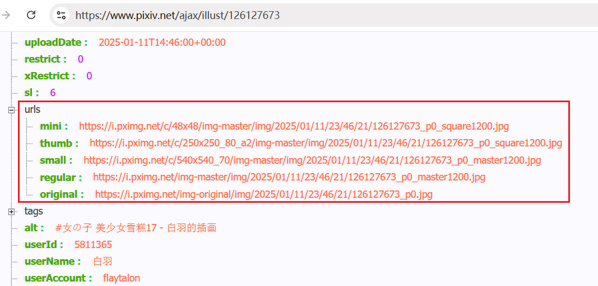
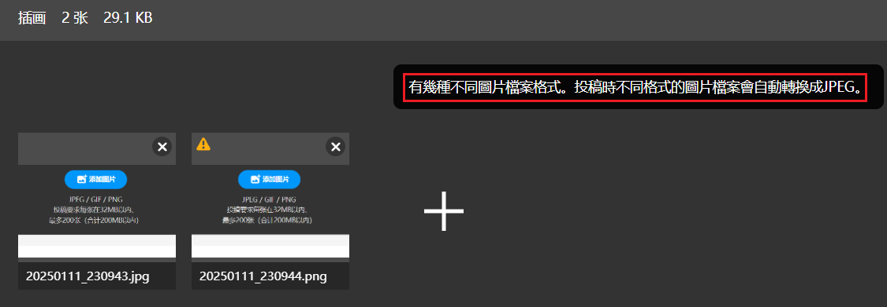

Pixiv 的多图作品的数据里，只有第一张图片的 urls，没有后续图片的 urls。

所以下载器把后续图片的格式视为与第一张图片相同，即所有图片要么全是 jpg 格式，要么全是 png 格式。不会出现 jpg 和 png 格式混合的情况。

那么这个做法对不对呢？刚才我验证了一下，是对的。

我尝试在投稿时同时上传 jpg 和 png 图片，看到了如下提示：

**有幾種不同圖片檔案格式。投稿時不同格式的圖片檔案會自動轉換成JPEG。**

这就保证了所有图片都会是相同的格式。

