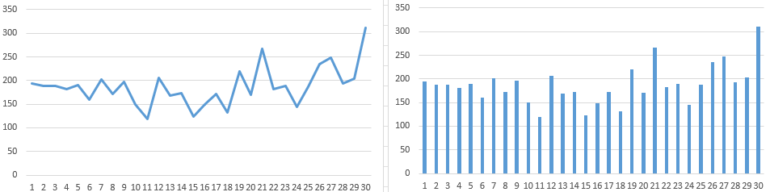

# 大量抓取时被 Pixiv 限制的情况的测试

- 测试页面：在 https://www.pixiv.net/tags/R-18/artworks?s_mode=s_tag 测试，抓取 100 页，共 6000 个作品。
- 浏览器：Chrome 104
- 操作系统：windows 10

测试时开启了预览搜索页面的抓取结果，上限为 3000。

------------------

下载器在抓取作品时，有 2 个阶段：

1. 抓取列表页。此阶段并发抓取数量为 1 或 10（在搜索页面的数量是 10，其他页面为 1）。
2. 抓取每个作品的信息。此阶段并发抓取数量为 10（截止 13.3.1 版本）。

# 简单总结

- 测试 1 是原始条件（多线程抓取）
- 测试 2 是单线程抓取
- 测试 3、4 是单线程抓取 + 每抓取一个作品就等待 1 秒左右
- 测试 5 是单线程抓取 + 每抓取 100 个作品就等待 60 秒

时间分别为：（秒）

1. 7300
2. 7457
3. 12500 或 11312
4. 10875
5. 10225

测试 1 最快，但是被限制的次数很多。测试 2 和测试 1 的表现几乎一样。

3、4、5 都使用了定时器，它们被限制的次数减少了，但是花费的时间都远远超过了 1、2。所以使用定时器的方式是不能作为解决方案的。

------------

在 Pixiv 的限制之下，想要在抓取时不被限制，那么抓取时间必定会比下载器现在的时间更久。下载器现在虽然被限制的次数多，但那是因为顶格抓取，是最快的抓取速度。

所以想要比现在更快，是做不到的了，除非有新的 API 可以一次获取大量作品的数据。

做完这些测试之后，我现在的目标是：**能否在抓取时间与现在差不多的情况下，减少限制出现的次数？**

我测试了 `测试边抓取边下载的方式花费的时间.md`，此方式花费的时间比现在多一些，但能够减少出现限制的次数，是一个备选项。但是这种方式需要修改大量的代码和改变用户习惯，我不想这样修改。

那么接下来要做的事有 2 点：

1. 由于在被限制时，用户无法正常查看作品，这是个不方便的地方。所以，如果有用户希望不被限制（即使这会导致抓取的时间变得更久），那么我可以提供一个选项，就是使用定时器的方式来避免被限制。
2. 在画师主页页面尝试使用 ids 的 API 进行优化。（但此方法不完美）

# 测试 1

## 测试条件

采用目前 13.3.1 版本的抓取方式：两个阶段均为 10 个并发请求。

该标签页大部分时间都处于后台。

## 测试表现

抓取列表页时暂停了 1 次。

测试了两次，只计算抓取作品阶段花费的时间：：

- 第一次：7202s = 120 分钟 = 2 小时
- 第二次：7379s = 123 分钟 ≈ 2 小时

可见长时间大批量抓取时，其时间是比较稳定的。

以下为第二次抓取时的数据汇总：

抓取作品时时，中间因为 429 错误码暂停了 31 次。

下载器目前设置的每次暂停时间是 200 秒，所以一共暂停了 6200 秒。用在抓取上的时间顶多为 1000 秒（估计值）。

每次暂停时的已抓取作品数量为：

```js
const resultNumber = [
  166, 360, 548, 736, 917, 1107, 1267, 1469, 1641, 1838, 1988, 2107, 2313, 2482,
  2655, 2778, 2927, 3099, 3231, 3451, 3621, 3888, 4070, 4259, 4404, 4591, 4826,
  5074, 5267, 5471, 5782,
]

// 计算每一批抓取到的作品数量
const crawlNmber = []
for (let i = 0; i < resultNumber.length - 1; i++) {
  result.push(resultNumber[i + 1] - resultNumber[i])
}

```

每一批抓取到的作品数量为：

```js
// crawlNmber
[194, 188, 188, 181, 190, 160, 202, 172, 197, 150, 119, 206, 169, 173, 123, 149, 172, 132, 220, 170, 267, 182, 189, 145, 187, 235, 248, 193, 204, 311,]
```

最小值为 119，最大值为 311，平均值为 187。

将其图表化之后，发现每次能抓取的数量并没有固定的规律。



## 初步结论

1. 抓取 6000 个作品一共用了 7200 秒，平均 1.2 秒可以抓取 1 个作品。
2. 每等待 200 秒平均可以抓取到 187 个作品，每等待约 1.1 秒可以抓取 1 个作品。

保险起见，应该取 1.2 秒。

如果后续测试中，测试方式为每抓取一个作品就等待一段时间，那么这个时间应该首先参考 1.2 秒。

# 测试 2

## 测试条件

尝试单线程抓取：每次只发送 1 个抓取请求（抓取列表页和抓取作品页时均为 1）。

该标签页大部分时间都处于后台。

## 测试表现

抓取列表页时没有被限制。说明列表抓取线程设置为 1 确实能减少此阶段被限制的可能性。

测试了 1 次，从抓取开始到抓取结束的时间为：

7457s = 124 分钟 ≈ 2小时

抓取作品时时，中间因为 429 错误码暂停了 32 次。比测试 1 多一次暂停。

每次暂停时的已抓取作品数量为：

```js
const arr = [31, 179, 295, 412, 628, 843, 1031, 1249, 1453, 1694, 1855, 2079, 2318, 2469,
  2647, 2869, 3039, 3177, 3432, 3662, 3875, 4056, 4230, 4411, 4534, 4723, 4861,
  5003, 5185, 5362, 5572, 5815,]

const result = []

for (let i = 0; i < arr.length - 1; i++) {
  result.push(arr[i + 1] - arr[i])
}
```

每一批抓取到的作品数量为：

```js
// crawlNmber
[148, 116, 117, 216, 215, 188, 218, 204, 241, 161, 224, 239, 151, 178, 222, 170, 138, 255, 230, 213, 181, 174, 181, 123, 189, 138, 142, 182, 177, 210, 243,]
```

最小值为 116，最大值为 255，平均值为 182。

## 初步结论

数据与测试 1 非常相似，可见只是单纯的把抓取线程设置为 1 是没用的。

只要是在一定时间内，达到了抓取数量的限制，就会被限制。至于 10 个并发还是 1 个并发，只是对限制到来的时间略有影响而已。

# 测试 3

## 测试条件

1. 单线程抓取：每次只发送 1 个抓取请求（抓取列表页和抓取作品页时均为 1）。
2. 在抓取作品阶段，每个作品抓取完成后，延迟 1200 ms（1.2 秒）才会开始下一个请求。
 
此时每个网络请求的时间大约为 200 ms，也就是说实际上是每秒 1.4 或 1.5 秒完成 1 个请求（但如果页面处于后台，时间就会增加）。

## 测试表现

测试了 2 次，抓取列表页、作品时均没有被限制。一直稳定的持续抓取完毕了。

由于加了 1.2 s 的延迟，所以抓取所需的时间肯定不会少于 7200 秒。这样子太慢了，和前面的 2 种测试相比，在速度上并没有优势，不具备实用性。

但是花费的时间比我预想的还要多。

1. 第一次测试，该标签页大约 2/3 时间是前台， 1/3 是后台。只计算抓取作品时花费的时间，共 12500s ≈ 3.5 小时。如果页面一直处于后台，预计时间至少会有 4 个小时。如果页面完全处于前台，预计花费的时间可能为 9000 s - 10000 s，约 2.7 个小时。
2. 第二次测试，该标签页一直处于前台，计算时间包括抓取列表页和抓取作品的全部抓取流程，共 11312s ≈ 3.14 小时。

## 初步结论

使用定时器的方法存在问题，原因是当页面处于后台时，定时器的执行时机会被延后，此时抓取时间会更久！

关于定时器的延迟问题，可以查看文档 `页面处于后台时，定时器的延迟问题.md`。

就本例来说，1200 ms 的延迟，在后台时会变成 1800 ms。再加上 200-300 ms 的网络请求时间，那么：

- 前台时，每次请求花费 1200 + 300 = 1500 ms。每 60 秒可以完成 40 个请求；
- 后台时，每次请求花费 1800 + 300 = 2100 ms。每 60 秒可以完成 30 个请求；

掐秒表计算 60 秒内前后台的抓取数量，观测结果与计算相符。

在此测试中，一共有 6100 次请求（列表页+作品页），时间预计为：

- 前台时，6100*1.5 = 9150 s
- 后台时，6100*2.1 = 12810 s

## 不被限制的时间间隔

本次测试使用了 1200 ms 的时间间隔，没有被限制。

我又测试了 1100 ms 的间隔，会被限制。

所以不被限制的时间间隔不应小于 1200 ms。

# 测试 4

## 测试条件

同测试 3，但每次抓取作品之后的延迟时间缩短到了 800 ms。

1. 单线程抓取：每次只发送 1 个抓取请求（抓取列表页和抓取作品页时均为 1）。
2. 在抓取作品阶段，每个作品抓取完成后，延迟 800 ms 才会开始下一个请求。

此时每个网络请求的时间大约为 300 ms，也就是说实际上是大约每 1.1 秒发送 1 个请求（但如果页面处于后台，时间就会增加）。

该标签页绝大部分时间都处于前台。

## 测试表现

抓取列表页时没有被限制。

测试了 1 次，从抓取开始到抓取结束的时间为：

10875s ≈ 3 小时

抓取作品的阶段触发了抓取限制，但发生频率比测试 1、2 降低了许多，一共只有 4 次：

每次暂停时的已抓取作品数量为：

```
235
1144
1721
4172
4510
```

## 初步结论

使用 800 ms 的延迟比使用 1200ms 的延迟会快一些，但是速度的提升有限。

# 测试 5

## 测试条件

1. 单线程抓取：每次只发送 1 个抓取请求（抓取列表页和抓取作品页时均为 1）。
2. 每抓取 100 个作品，暂停 60 秒，然后再继续抓取后续作品。

该标签页一直处于前台。

## 测试表现

抓取列表页时没有被限制。

抓取作品时多次被限制而暂停。

测试了 1 次，从抓取开始到抓取结束的时间为：

10225 s ≈ 2.85 小时

预计时间为 6000*0.3+(6000/100*60) = 5400 秒，但实际上花费了接近两倍的时间。这是因为暂停了 24 次，暂停的时间一共是 24*200 = 4800 秒。 5400+4800 = 10200 秒。

每次暂停时的已抓取作品数量为：

```
75
275
487
655
840
1042
1226
1376
1532
1690
1906
2316
2465
2601
2748
2881
3272
3467
3808
4036
4446
4624
5232
5637
```

## 初步结论

花费的时间和测试 4 相差无几，但是被限制的次数变多了，还不如测试 4。
