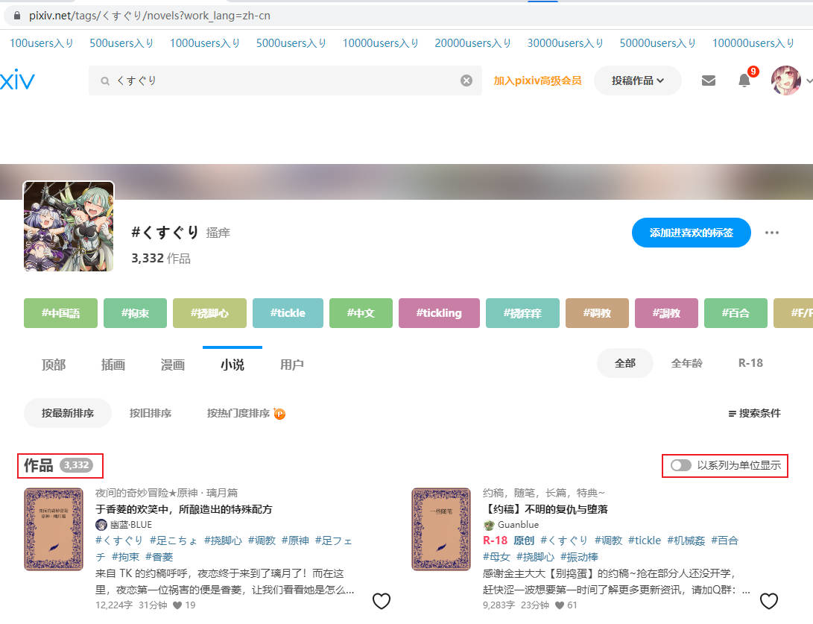
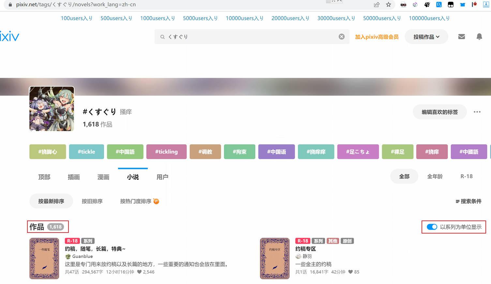
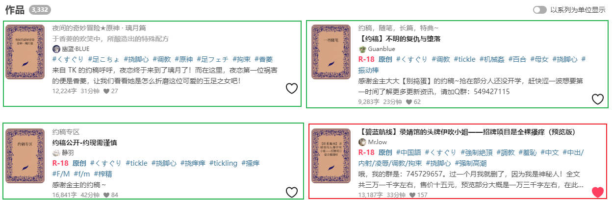
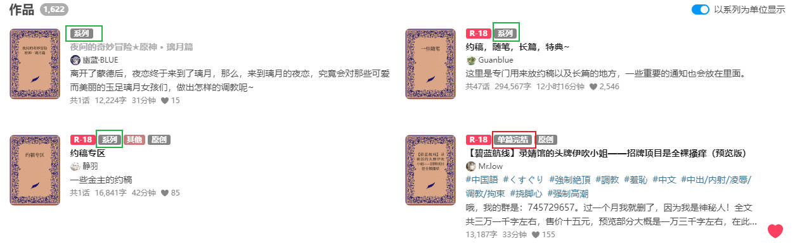
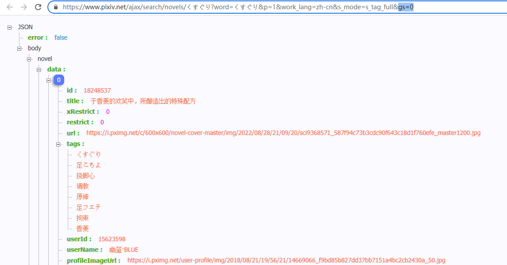

# 小说搜索页面的“以系列为单位显示”

2022/08/28

小说搜索页面有一个选项：“以系列为单位显示”。

我不清楚它是什么时候出现的，也没有在意。但是最近 Pixiv 又在偷偷改版。说偷偷是因为它每次改版都是灰度测试，只有一小部分用户会先改为新版，这使得改版导致的问题不能及时被我知道。

今天有个用户说他抓取小说时，数量不对，我远程到他的电脑上才找到原因。

## 默认值的变化

现在，大部分用户的这个选项是默认关闭的。然而，Pixiv 正在对此进行修改，有一些用户的这个选项是默认开启的。

如果没有在 URL 中指定此设置的值，那么对于同样的网址，这两种用户看到的作品数量是不同的：

https://www.pixiv.net/tags/%E3%81%8F%E3%81%99%E3%81%90%E3%82%8A/novels?work_lang=zh-cn

我看到的（“以系列为单位显示”是关闭的）：

出现问题的用户所看到的（“以系列为单位显示”是开启的）：

新版用户打开此网址时，“以系列为单位显示”直接就是开启的。

## 开启与关闭此设置的搜索结果

以现在的搜索结果为例，未开启“以系列为单位显示”时，每个作品都是单独显示的。

其中前 3 个是系列小说里的，第 4 个是单篇小说。

开启“以系列为单位显示”之后，pixiv 返回的搜索结果不再以小说为单位，而是以系列为单位：

每个搜索结果都会标明是“系列”还是“单篇”。

系列小说只会在搜索结果中显示 1 个结果，它显示的文字、超链接都是系列页面的，而不是里面的小说。

单篇小说显示的文字和超链接没有变。

所以开启“以系列为单位显示”之后，显示的结果数量比关闭时要少。因为此时显示的数量其实是系列数量+单篇数量，而非小说作品的数量。

## 对抓取的影响

抓取时也是如此，如果不指定“以系列为单位显示”的状态，服务器返回的数据也是不同的。

- 对于旧版用户，服务器会返回“以系列为单位显示”关闭时的结果；
- 对于新版用户，服务器会返回“以系列为单位显示”开启时的结果；

关闭时：

开启时：

**注意：** 开启时，返回的结果的数据格式与关闭时是不同的。

对于系列作品，返回的数据是系列数据，而不是里面的小说的数据。

可以通过 `isOneShot` 属性判断这个结果是系列还是单篇，如果为 `true` 则是单篇，`false` 是系列。

## gs

在 URL 中，`gs` 表示“以系列为单位显示”是否启用。

- `0` 表示关闭“以系列为单位显示”；
- `1` 表示开启“以系列为单位显示”；

## 对此变化的处理

下载器在请求数据时，将会始终设置 `gs=0`，也就是始终关闭“以系列为单位显示”。因为这样获取的才是小说数据。

`gs=1` 时返回的数据里有些是系列数据，而非小说数据，所以是不能使用的。
