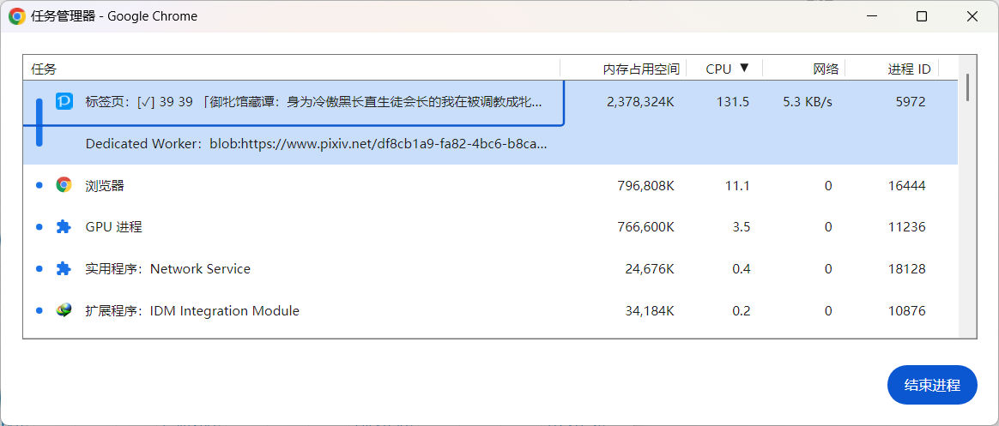
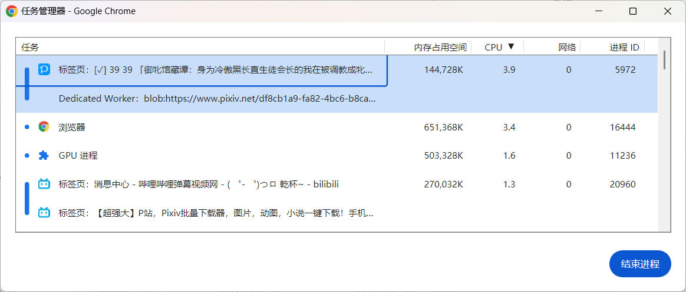
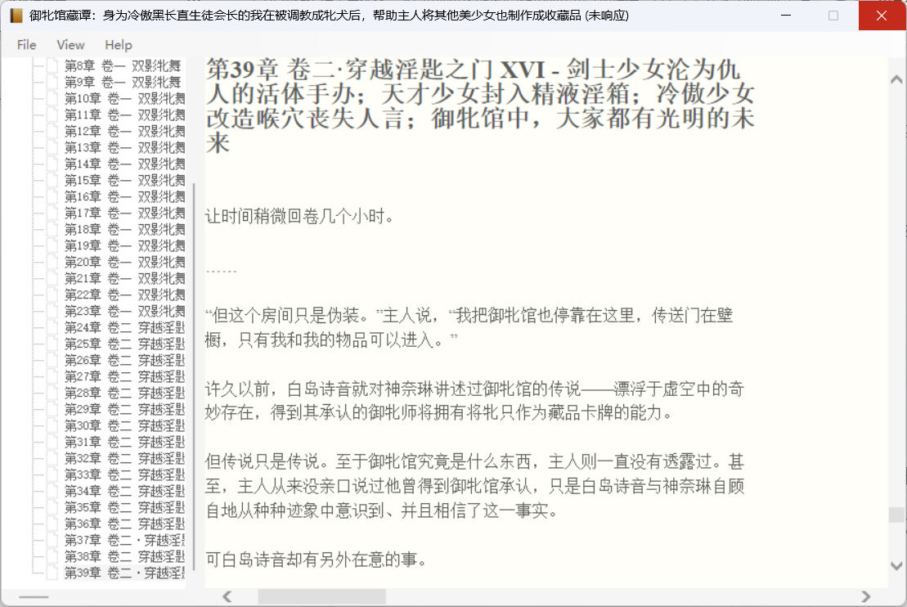

# 一个含有很多图片，总体积很大的系列小说记录

2024/07/18

https://www.pixiv.net/novel/series/10923616

这个系列小说有 39 篇，这不是重点，重点是里面含有的图片较多，总体积还很大。

**更新：** 2024/08/15 

我已经完成了生成 EPUB 时的优化，此时这个系列里有 42 篇小说，58 张内嵌图片，图片总体积 195.8 MB。

问题已解决。

## 体积

合并成 txt 格式时，txt 文件 1.28 MB。有 57 张图片，图片总体积 184.8 MB。

合并成 epub 格式时，epub 文件 234 MB，封面图 200 KB。

**更新：** 优化后，epub 文件体积只有 198 MB。

## 下载时的内存占用

以 txt 格式合并时，没有性能问题（除了下载图片导致整个过程时间比较长）。

以 epub 格式合并时，由于体积较大，导致存在一定的性能问题（但通常应该不会导致页面崩溃）。

合并时，该页面的内存使用率逐渐增加，并且在在 600 MB 维持较长时间。

然后在生成 EPUB 文件并下载的瞬间，内存暴增到 2.4 GB：

**更新：** 优化后，生成 EPUB 时内存只会增加到 800 MB，相比之前的 2.4 GB 少了很多。

在几秒后就会回落到正常值：

有个用户说他合并时页面崩溃了，估计是系统剩余内存不足导致的。毕竟占用 2.4 GB 内存没超过 4 GB，正常来说应该不会导致页面崩溃的。

## 阅读时的性能问题

**更新：** 优化后，已经不存在性能问题，内存占用非常小，因为现在每个章节都是单独的一个 html 文件。而且图片是单独保存的，不再以 base64 格式内嵌在 html 里。这使得 html 的体积很小（通常只有几十 KB），与之前所有内容塞在一个 html 里的情况差别巨大。

这个 234 MB 的 epub 文件，在我的电脑上阅读时体验不好。我使用的阅读器是 epubfilereader，cpu 是 i5 12400。

点开之后首先会显示第一页的封面，这挺快的。但是点击其他章节目录时，反应就比较慢了，而且资源占用也会增加很多。

我在打开后直接点击最后一章，CPU 使用率在 15 - 20 之间波动，内存使用率从几百 MB 逐渐增加，达到 4 GB 之后才停止。

过了接近 3 分钟，最后一章才显示出来，但此时还是未响应状态，不能点击。

再过半分钟（达到 3 分钟半），才是可以正常阅读的状态。

完全打开后阅读时，cpu 使用率很低，内存使用量稳定在 3.4 GB。

## 阅读器性能这么差的原因

这不是这个阅读器的问题，我用一个在浏览器里阅读的网站打开这个 epub，也是反应不过来。

实际上这是因为下载器生成的是单个 html 文件，保存了所有章节。所以这相当于是个单页面的网页，里面含有非常多的内容。

把这个 epub 解压成 zip，小说本体的 html 有 309 MB，包含了所有章节的内容（包括图片）。

所以 epub 阅读器是这样工作的：

比如我点击 39 章，但因为所有章节都在同一个 html 文件里，所以它实际上需要完整打开所有章节。所以它才需要那么长时间，以及占用 4 GB 内存。

当这个页面完全打开后，它会把滚动条定位到第 39 章的位置。

其实不管点击那一章，都是完整打开了所有章节的，所以向上向下滚动都可以看到全文。

不过，如果将这个 309 MB 的 html 用 Chrome 浏览器打开，打开速度很快，阅读时也很流畅，只占用 400 MB 内存，比这个 epub 阅读器好太多了。

## 优化思路

如果把每一章的内容保存到一个单独的 html 文件，那么这个 39 章，共 309 MB 的 html，平均每一章只有不到 10 MB 的体积。这样阅读器应该可以轻易打开阅读了。

不过下载器现在合并 epub 时使用的库不支持把每个章节拆分成单独的文件。后来我换了一个可以拆分章节的库。

另外还有个细节：

图片是以 base64 格式保存在 html 里的，这也是导致体积膨胀的原因。相比 txt 格式的 184 MB，epub 里的 html 文件的体积达到了 309 MB。

