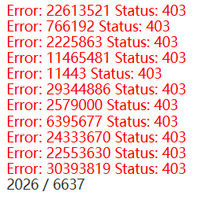
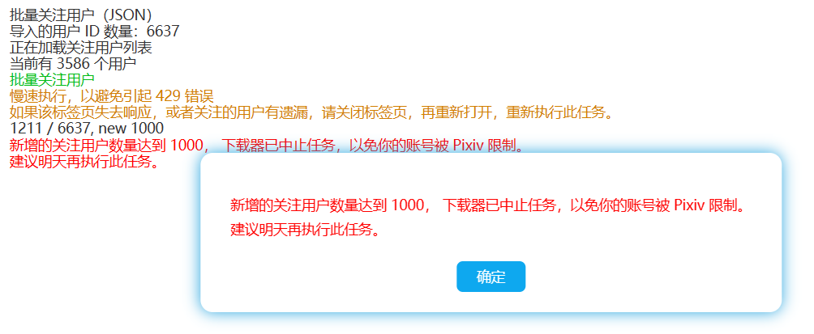

# 批量关注用户太频繁导致账户被封禁限制

在上版本里，虽然下载器批量关注用户时已经主动减慢了添加速度，大约 2.5 秒发送一个请求。但是添加关注的请求达到一定数量时， `/bookmark_add.php` API 返回 403 状态码，并且用户被 Pixiv 限制，无法恢复正常。并且封禁时也没有事先发送站内通知消息。

至于达到封禁限制时，这个数量是多少，我尚不清楚。

现在我尝试进行如下处理：
1. 把添加关注的速度降低到 3 秒一个。
2. 在新增 1000 个关注之后自动停止执行。

执行完成后没有被限制，可以照常进行关注用户等操作。这个方案通过。

--------------

不过并非所有用户都会遇到这个问题，一些注册时间较晚的用户，`/bookmark_add.php` API 无法直接使用，而是需要先获取 recaptcha_enterprise_score_token，下载器为了解决这个问题，花费了更多时间去处理，发送一个请求最少需要 6 秒，而且同样设置了 1000 个的限制，不会导致被封禁。
