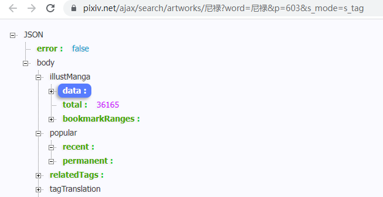
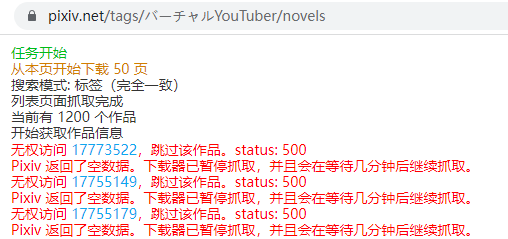
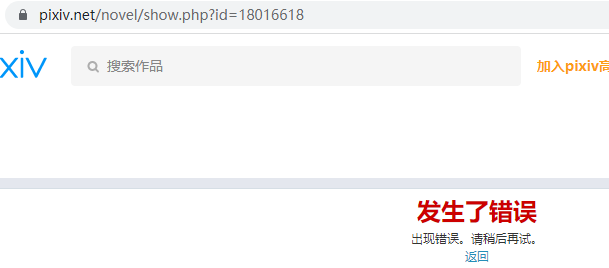

- [抓取 tag 搜索页面、以及其他页面遇到限制的问题](#抓取-tag-搜索页面以及其他页面遇到限制的问题)
  - [被限制时的特征](#被限制时的特征)
    - [搜索图片作品时](#搜索图片作品时)
    - [搜索小说作品时](#搜索小说作品时)
    - [抓取自己收藏的小说时](#抓取自己收藏的小说时)
  - [会被限制的情况](#会被限制的情况)
  - [被限制时的页数](#被限制时的页数)
  - [限制的时长](#限制的时长)
  - [解决办法](#解决办法)

# 抓取 tag 搜索页面、以及其他页面遇到限制的问题

2022/07/24

## 被限制时的特征

### 搜索图片作品时

抓取这个图片搜索页面的所有作品：

https://www.pixiv.net/tags/%E5%B0%BC%E7%A6%84/artworks?s_mode=s_tag

正常的抓取结果是有作品数据和作品总数的：

https://www.pixiv.net/ajax/search/artworks/%E5%B0%BC%E7%A6%84?word=%E5%B0%BC%E7%A6%84&p=603&s_mode=s_tag



一共有 603 页，下载器会在短时间内发起大量的请求（10个并发请求），当抓取几百页之后受到了限制，此时返回的每一页的数据里，作品数据是空数组，作品总数是 0。

一旦遇到限制，后面的每一页的数据都是空的，无法获取到作品数据。


此时刷新前台页面，也显示作品数量为 0。


### 搜索小说作品时

抓取这个小说搜索页面的所有作品：

https://www.pixiv.net/tags/%E3%83%90%E3%83%BC%E3%83%81%E3%83%A3%E3%83%ABYouTuber/novels

当遇到限制时，会和上面一样，每一页的数据都是空的。

此时刷新前台页面，也显示作品数量为 0。

额外的，如果是抓取小说时被限制了，那么获取小说作品数据时，会返回 500 状态码：



此时打开小说作品页面，该页面会无法正常显示。需要等待限制解除之后才能恢复正常显示：



### 抓取自己收藏的小说时

同上

## 会被限制的情况

在搜索页面会被限制。在搜索图片和小说的页面均会触发限制。

在收藏页面抓取大量小说也会触发限制。

---------------

在收藏页面抓取大量图像作品不会被限制。

在自己的关注页面抓取所有用户的作品时，不会被限制。

## 被限制时的页数

每次受到限制时，抓取的页数不一样。

小说页面触发限制会更严格一点，抓取 50 页就可能会被限制，而且被限制之后，获取不到作品数据（返回 500 状态码）。（此时打开其他小说页面，不能正常查看作品）

图片页面的限制宽松一点，一般抓取超过一百页才会被限制（我猜测如果有一段时间没有进行过大量抓取的话，能抓取到 300 页左右），而且被限制之后，依然可以获取到作品数据。（此时打开其他图片页面，能正常查看作品）

## 限制的时长

遇到限制后开始计时，之后不停刷新页面，等到页面能够正常显示作品数据时结束。

现在的测试结果是，图片页面的限制会在 3 分钟之后解除。小说页面的限制会更快解除。但是为了保险起见，我都视为 3 分钟来处理。

如果连续触发多次限制，限制时长不会增加。

但是我现在只测试了在单个搜索页面受到限制的情况，不知道如果同时在多个搜索页面进行抓取的话会怎么样。

## 解决办法

在抓取列表页阶段，如果下载器检测到 pixiv 返回的作品总数为 0，或者作品返回 500 状态码，就会暂停抓取，并在一段时间后（现在是 200 秒）继续抓取。

从目前的测试结果来看是有效的，作品一个不漏的抓取完成了。


在一次测试中，我抓取小说页面，共 1190 个作品，每次遇到限制时暂停，大约每次可以抓取 200 个作品数据，之后会被再次限制。

```
// 每次遇到限制时的抓取数量：
189
411
615
794
995
1124
1190
```