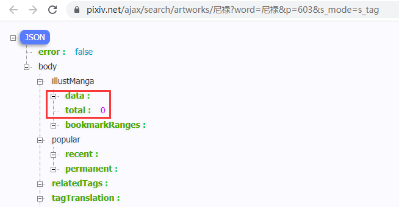
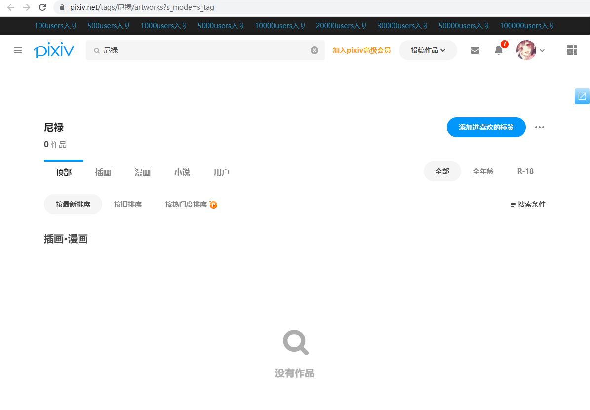
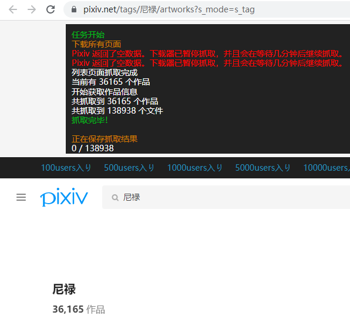

- [抓取 tag 搜索页面遇到限制的问题](#抓取-tag-搜索页面遇到限制的问题)
  - [被限制时的特征](#被限制时的特征)
  - [被限制时的页数](#被限制时的页数)
  - [限制的时长](#限制的时长)
  - [会被限制的情况](#会被限制的情况)
  - [解决办法](#解决办法)

# 抓取 tag 搜索页面遇到限制的问题

今天的日期是 2022/03/22。

抓取这个页面的所有作品：

https://www.pixiv.net/tags/%E5%B0%BC%E7%A6%84/artworks?s_mode=s_tag

正常的抓取结果是有作品数据和作品总数的：

https://www.pixiv.net/ajax/search/artworks/%E5%B0%BC%E7%A6%84?word=%E5%B0%BC%E7%A6%84&p=603&s_mode=s_tag

## 被限制时的特征

目前一共有 603 页，下载器会在短时间内发起大量的请求（10个并发请求），当抓取几百页之后，疑似受到了限制，此时返回的每一页的数据里，作品数据是空数组，作品总数是 0。

一旦遇到限制，后面的每一页的数据都是空的，无法获取到作品数据。

此时刷新前台页面，也显示作品数量为 0。

## 被限制时的页数

每次受到限制时，抓取的页数不一样。

我猜测如果有一段时间没有进行过大量抓取的话，能抓取到 300 页左右。

如果在一段时间内触发了限制，可能每次抓取 100 多页就会受到限制。

## 限制的时长

遇到限制后开始计时，之后不停刷新页面，等到页面能够正常显示作品数据时结束。

现在的测试结果是限制会在 3 分钟之后解除。

但是我现在只测试了在单个搜索页面受到限制的情况，不知道如果同时在多个搜索页面进行抓取的话会怎么样。

也不知道如果连续触发多次限制，限制时长是否会增加。

## 会被限制的情况

目前只有在搜索图像作品时，抓取作品列表数据会被限制。

作为额外说明，下列情况不会被限制：

- 获取每个作品的数据时，不会被限制
- 在搜索小说时，获取作品列表数据也不会被限制
- 在自己的关注页面抓取所有用户的作品时，不会被限制。我获取了 3149 个用户的作品列表数据（490761 个作品），没有被限制

我搜索小说的 R-18 标签，抓取 1000 页，试了几次都没有被限制。

https://www.pixiv.net/tags/R-18/novels?s_mode=s_tag

## 解决办法

在抓取列表页阶段，如果下载器检测到 pixiv 返回的作品总数为 0，就会暂停抓取，并在一段时间后（现在是 200 秒）继续抓取。

从目前的测试结果来看是有效的，作品一个不漏的抓取完成了。

