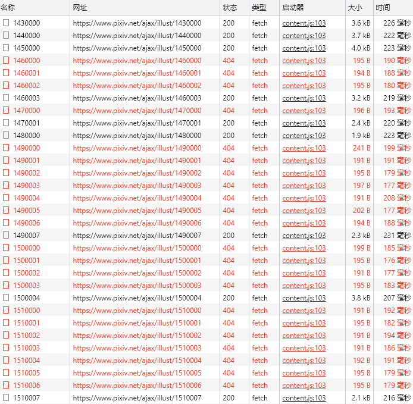
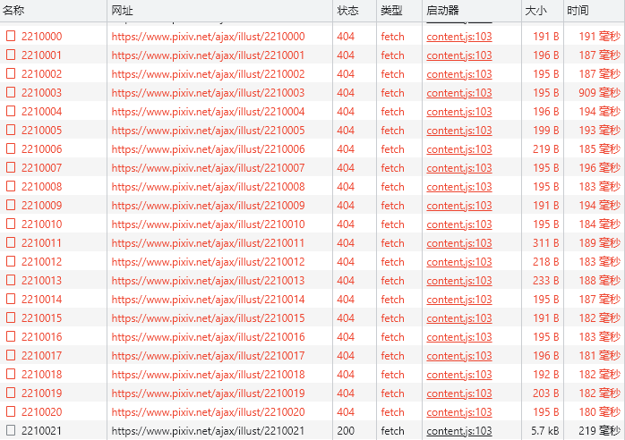
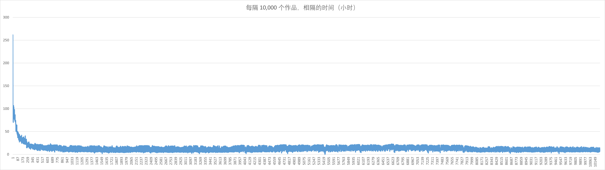
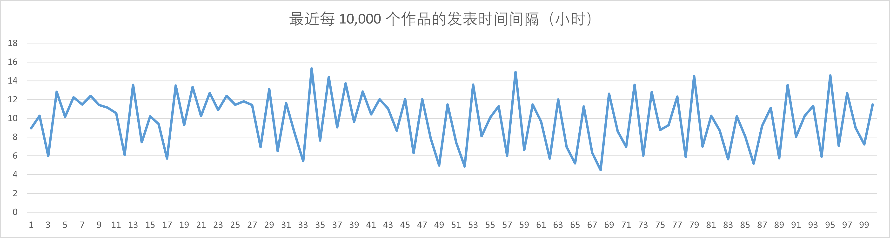
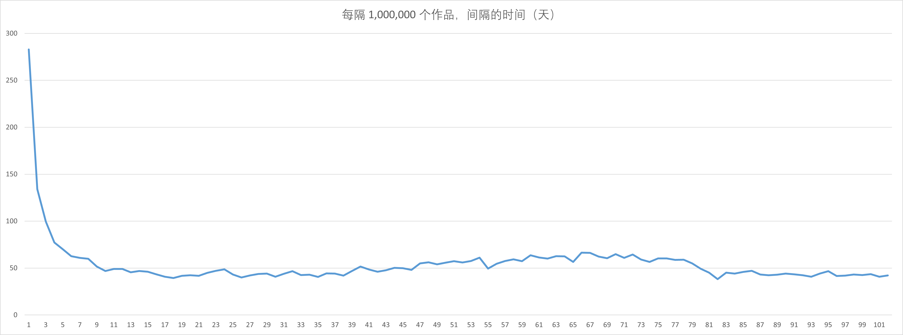
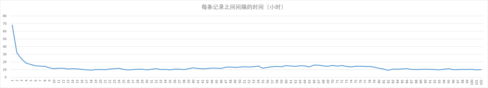

# 抓取作品的发布时间数据

## 目的

当用户设置了时间范围时，优化抓取效率。

假如用户设置了时间范围（如设置抓取 2022-2023 年的作品）：

以前下载器会对抓取到的所有作品发出请求，以获取它们的发表日期。

现在我打算在下载器内置一些作品的时间数据，这样在抓取作品之前，根据它的 id 就可以知道它大致的发表日期，这样可以提前判断出不符合条件的作品，不需要去抓取它们。这样就可以提高抓取效率。

## 启动抓取

抓取作品数据的代码保存在 `WorkPublishTime.ts` 里。

先在 `bindEvents` 里设置抓取的 id 范围，然后编译代码，刷新扩展，最后在页面上输入指令来执行抓取。

- `ppdtask1` 抓取图像作品
- `ppdtask2` 抓取小说作品

## 保存数据

抓取的图像和小说数据会保存在文件里，文件名格式如下：

- `workPublishTime-illusts-1-102324813.json`
- `workPublishTime-novels-1-18628857.json`

把里面的数据分别复制（或追加）到 `src\ts\store\WorkPublishTimeIllusts.ts` 和 `src\ts\store\WorkPublishTimeNovels.ts` 里面保存，以供使用。

## 抓取中的细节

下载器会每隔 10000 个作品就抓取一次，保存它的 id 和发布时间。



如果某次要抓取的作品是 404，下载器就会把 id + 1，尝试继续抓取，直到抓取到一个有数据的作品。

当指定范围内的作品全部抓取完成后，下载器会把抓取结果输保存到一个 JSON 文件里下载下来。

之前生成的文件，也就是数据源，现在保存在项目的 `notes/作品发表时间的数据/` 目录里。

---------------

由于 404 的作品比正常作品数量还多，所以抓取时发出的请求会增加很多。

早期的作品（id 小于 10000000 以内的作品）里我认为被删除的作品超过了一半。有时候 60 个请求里只有 20 个有效作品，这个比例比较常见，就是只有 1/3 的请求有效。比较糟糕的时候，90 个请求里只有 20 个有效作品。

下面这次抓取，连续 21 个作品都是 404：



近期的作品被删除的比例没有那么高，在 90,000,000 的 id 附近，大约只有 1/3 的请求是 404。

-----------

一开始我打算每隔 1000 个作品抓取一次，但是后来我改为间隔 10000 个了。原因：

1. 间隔 1000 的话要抓取的作品数量太多了（会有超过 100000 条数据）。由于 pixiv 现在有 429 限制，抓取只能以慢速进行，将会花费至少数十小时。雪上加霜的是，由于以前的作品有许多被删除了，下载器会抓取到很多 404 的作品，这些无效请求大大增加了抓取所需的时间。当我抓取了 8 小时之后，才此时抓取到了 id 4400000，只抓取完了 1/25。
2. 更重要的是，当我对比此时获取到的前后两个作品的发布时间时（间隔 1000 个作品），我发现它们的间隔时间通常在 1-3 小时之间。从设计此功能的目的考虑，并不需要把时间精确到 3 小时之内，大致精确到天数就行了。所以间隔 10000 个也能满足需求，而且抓取花费的时间也会少的多。同时数据的体积也会减少很多。

## 抓取截止的 id

当前下载器所记录的最新数据：

- 图像作品：截止到 2022 年 10 月 29 日，最后一个作品 id 是 102324813
- 小说作品：截止到 2022 年 10 月 30 日，最后一个作品 id 是 18628857

后面每过一定时间，下载器需要对新增的作品进行抓取，把它们的发布时间数据追加到数据源里。

## 数据量和文件体积

抓取图像作品，1-102324813，花费了接近 12 个小时，共 10233 条数据。

一开始的数据结构是对象数组，未格式化，体积约为 370KiB。

```js
[{"id":20,"time":1189343647000},{"id":10000,"time":1190285376000},]
```

之后我将其转换为二维数组，以减小体积，这样体积变成了 249KiB，体积减少了三分之一。

```js
[[20,1189343647000],[10000,1190285376000],[20006,1190613767000],]
```

其实还有能进一步减小体积的办法，就是把时间末尾的毫秒部分去掉。

由于 pixiv 的时间戳里只精确到秒，所以毫秒部分全都是 `000`。如果删除毫秒部分，可以再减少 30KiB 体积，接近 1/8。

由于这个比例比较小，必要性不大，所以我没有这么做。

*没有必要将其转换成 Map 结构，因为此数据在使用时能够通过数组下标直接取值。*

-----------------

抓取小说作品，1-18628857，共 1863 条数据。

数据结构也是上面的二维数组，体积约 45KiB。

-----------------

图像和小说的数据合起来约 315KiB，还算能接受。在未来也不会大幅增加。

如果按一开始 1000 个作品间隔来抓取的话，体积就会超过 3MiB 了，那就不太适合内嵌了。

## 使用方法

对于任意作品 id，例如 `67507815`，首先计算它相对于作品间隔的倍数（向下取整）：

```js
Math.floor(67507815/10000)
// 6750
```

使用倍数作为下标，从数据源中取出对应的数据：

```js
// data[6750]
[67500003, 1519767915000]
```

这个数据是数据源里较为接近指定 id 的数据。

*因为数据的 id 一般是整万，或者比整万稍微多一点点，所以它的 id 通常会比指定 id 小。（但如果指定 id 也是整万或者出头，那么这个 id 可能会比指定 id 大一点点。）*

*使用这个下标取数据的方法的前提是，每两个数据之间的 id 相差不会超过指定间隔（10000）。也就是说如果有连续 10000 个作品都是无效作品（如404），就会导致缺少一条应有的数据。目前并未有此种极端情况。*

--------------

然后取出时间区间：

- 如果这个 id 比指定 id 小，就取这个 id 的时间和下一个 id 的时间来作为时间区间。
- 如果这个 id 比指定 id 大，就取这个 id 的时间和上一个 id 的时间来作为时间区间。

如果时间区间符合用户设置的时间范围，那么就抓取指定 id 的作品，获取它的详细数据再做判断。

如果时间区间不符合用户设置的时间范围，就无需抓取指定 id 的作品，直接跳过它即可，这就达到了节约时间的目的。

## 数据发掘

### 每 10,000 个图像作品所经过的时间

*数据保存在 `每隔 10000 个作品的发表时间之差.txt` 里。数据的单位是秒，图表里的单位则是小时。*



可以看到间隔时间在一开始很大，到了后面则趋于稳定。然而，在中间靠后的部分，时间反而有小幅度的增加。

近期的间隔时间看起来在 10 小时左右。

由于数据项太多（一万多项），导致图表的线条密密麻麻地挤在一起，连成了一片，只能看不清楚。所以下面我会减少数据项，使图表更清晰。

### 最近每 10,000 个图像作品所经过的时间

从 `每隔 10000 个作品的发表时间之差.txt` 取最后 100 行数据，计算出它们的平均间隔为 35205 秒，9.8 小时。



### 每 1,000,000 个图像作品所经过的时间

每隔 100 个数据来计算两个数据的时间差，这样就计算了每隔 1,000,000 个作品所经过的时间。

*数据保存在 `每隔 1000000 个作品的发表时间之差.txt` 里。数据的单位是秒，图表里的单位则是天。*



可以看到，大约从 id 10,000,000 之后（2010 年初开始）就进入了较为稳定的阶段，每 50 天左右就会增加 1,000,000 个图像作品。但是中间确实有段时间的数值增加了（也就是新作品的投稿频率降低了）。

从最近（最后面）的一些数据来看，近来 pixiv 大约每隔 43 天增加 1,000,000 个图像作品。

依此计算，**最近**平均每天增加 23,000 个作品，平均每小时增加 970 个作品，平均每分钟增加 16 个作品。平均每隔 3.75  秒就有一个新作品发表。

### 数据源的精度

把每隔 1,000,000 个作品所经过的时间再除以 100，就等于以每 100 个数据为单位，计算它们的平均间隔时间。

*此时的单位是小时。*



**这项数据可以代表数据源的精度**，也就是相邻的两条数据的时间相差多少。

可以看到，在大部分情况下，时间间隔（精度）处于 10-15 小时之间。

---------------

计算相邻两条数据之间间隔时间的代码：

```js
// data 就是数据源
const data =[]

const a = []
for (let index = 1; index < data.length; index++) {
  const num = data[index][1] - data[index - 1][1]
  // 把时间换算成秒
  a.push(num/1000)
}

const str = a.join('\n')
const blob = new Blob([str])
const url = URL.createObjectURL(blob)
window.open(url)
```
