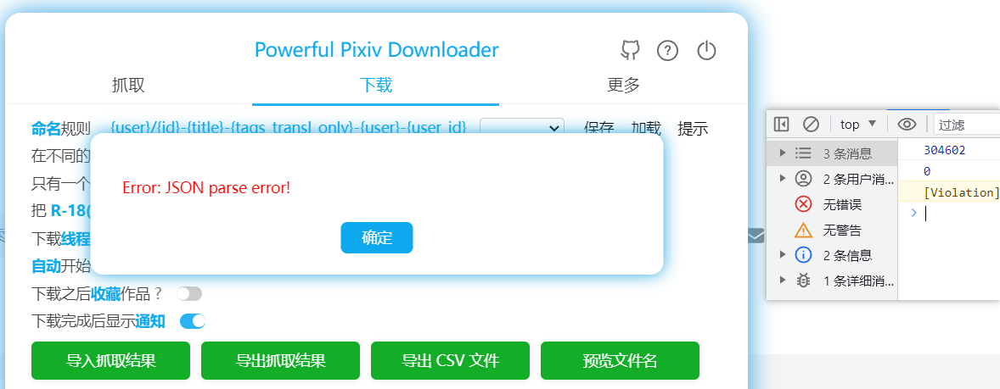

# 抓取结果体积太大的问题

有人分享了一个抓取结果：824 MB (865,027,197 字节)

https://drive.google.com/file/d/1-cOcIVoU6Jvr8hzsuWCjT9XKQC6zTUxR/view?usp=sharing

导入的时候报错 JSON parse error！

## 原因：文件体积太大

我猜测是文件体积太大的原因。

我导出了一个只有 233 个抓取结果的 json 文件，导入并读取为 text 之后，获取 string 的 Byte length，和文件体积一模一样：

文件体积是 297 KB (304,602 字节)，读取后 string 的内存字节数也是 304602。

那么这么 824 MB (865,027,197 字节) 读取后的长度是多少呢？输出了 0：



可见此时并没有读取成功。

之后我还试了个 453485855 字节的文件，读取后也和原文件字节数相同。

MDN 上说 V8 的 string 长度限制是 1GB，但是 824MB 没有超过 1GB，所以我推测长度限制是 512MB。

## 尝试分割文件

我用 VSCode 和 Sublime Text 打开这个文件都失败了。

VSCode 报错 invalid string length，ST 读取有进度但是非常之慢，我没有耐心等到它结束。

用记事本打开卡死了。

下载了一个分割文件的软件，也提示文件体积太大，打不开。

我又尝试用 NodeJS 的命令行读取文件，也提示体积太大：

```js
const itemsArray = require('./result.json');
Uncaught Error: Cannot create a string longer than 0x1fffffe8 characters
```

提示体积不能超过 512MB。

## 使用代码分割

然后我又尝试了个流式读取的库：

https://www.npmjs.com/package/stream-json

我本以为它会把抓取结果分成若干部分返回，但可能由于抓取结果是一个数组，所以它把所有数据读取为 1 个结果返回了。

所以它读取完也需要一些时间，好在不是很久，而且它确实能读取到所有数据，这样就可以对数据进行操作了。

抓取结果的数据格式如下：

```js
[{}, {}, {}, {}, {}, ]
```

读取后的 data 是个 Object，格式如下：（如果源数据格式不一样，可能结果也不一样，我没试）

```js
{
  key: 0,
  value: [{}, {}, {}, {}, {}, ]
}
```

`data.value` 就是抓取结果的原始数组。

最后成功了，我以 100000 条数据为单位，把数据保存成了多个小文件。

代码地址：

https://github.com/xuejianxianzun/split-json

代码在执行过程中使用了 4 GB 内存。

需要注意的是，在保存数据时，单批数据的体积小于 512 MB 也有可能失败。在一开始，我以 200000 条数据为单位，第二批数据字符串化之后的体积是 296 MB (311,144,446 字节)，NodeJS 报错了：

`Reached heap limit Allocation failed - JavaScript heap out of memory``

JavaScript 堆内存不足，这可能是执行到这里时，NodeJS 所申请的内存不够用了，所以执行失败了。

之后我把批次设置为 100000，单个文件体积约 100 - 150 MB，没有报错了。

