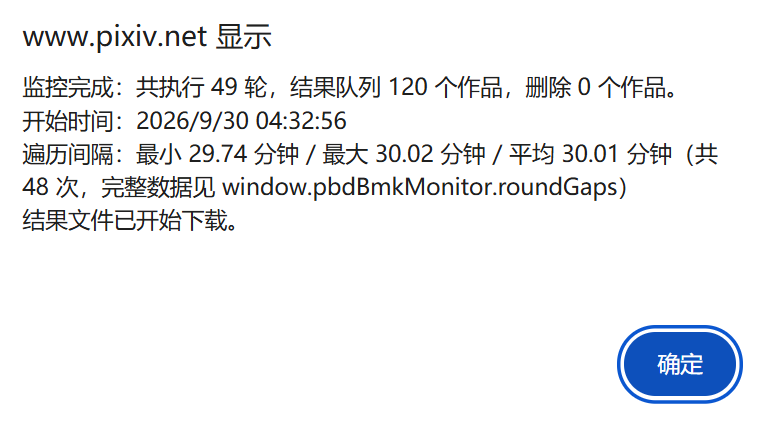

# 日均收藏数量的压制曲线

「日均收藏数量」是 `Filter.ts` 里 `checkBMK()` 使用的一个补充过滤条件：用作品的收藏数量除以它发布以来的天数，得到日均收藏数量，再和设置项 `BMKNumAverage`（默认 600）比较。

本文说明这条曲线**为什么存在**、**怎么实现的**，以及**各个刻度的系数、倍率**。

- 相关代码：`src/ts/filter/Filter.ts` 的 `checkBMK()`，以及它上面的 4 个常量（`minimumHours`、`limitHours`、`minimumRatio`、`normalRatio`）
- 相关设置：`BMKNumAverageSwitch`、`BMKNumAverage`（设置面板里的「满足日均收藏数量条件 >= 600」）

## 设计目的

「收藏数量 ÷ 发布天数」是一种外推，它假设作品之后仍保持同样的收藏增长速度。但作品刚发布时收藏数量增长得很快，之后会逐渐放缓，于是：

- 作品越新，这个外推值虚高得越厉害；
- 例如某个作品发表了 0.5 小时、有 30 个收藏，会被算出日均 1440 个收藏（30 ÷ (0.5 ÷ 24)），
  而它之后很可能达不到这个速度。

所以启用这个设置时，这样的新作品会被误判为高质量作品。**这个功能的目的本来就是「抓取近期新发布的高质量作品」**，因此必须把新作品的外推值压制下来，否则它会同时放过（虚高新作品）和错过（真实优秀的新作品）。

压制要满足三个要求：

1. **连续**：不能在某条时间线上产生断崖（同一个作品前后一分钟得到相反结果）；
2. **覆盖 24 小时**：作品在发表后的头一天里，增长速度都不可靠，不能只处理最初几个小时；
3. **有粒度**：不要用一个粗暴的下限值一刀切，而应该随着发表时长逐渐放开。

## 术语

- **倍率 R**：把收藏数量放大成日均收藏数量时用的倍数。
  一天有 24 小时，所以**不压制**时「R = 24 ÷ 发表小时数」（发表 2 小时放大 12 倍、发表 24 小时放大 1 倍）。
- **系数 K**：实际用于计算的系数，`K = R ÷ 发表小时数`。也就是 `日均收藏数量 = 收藏数量 × K`。
  （发表 2 小时时 K = 4。⚠️ 设置项说明里还写着旧的「乘以 6」，待同步。）
- **保留比**：`R ÷ 24`，表示压制后保留了「正常口径」的多少，从 33% 逐渐放开到 100%。
- **等效时长**：`24 ÷ K`，相当于把这个作品当成「发表了多久」的作品来计算。

## 实现方式

对发表不足 24 小时的作品，让倍率从 8 **线性**增加到 24：

```
发表小时数 h = max((当前时间 - 发布时间) ÷ 3600000, 2)
x = min((h - 2) ÷ 22, 1)
倍率 R = 8 + 16 × x
系数 K = R ÷ h
日均收藏数量 = 收藏数量 × R ÷ h
```

示意图：



- **发表不足 2 小时**（包括发布时间在未来、也就是时钟偏差导致算出负数的情况）：
  一律按 2 小时计算，R = 8、K = 4。
- **发表 24 小时及更久**：R = 24，即 `收藏数量 × 24 ÷ h`，**与压制之前的算法完全一致**。
- 判定规则没有改动：`收藏数量在设置的范围内` 或 `日均收藏数量 ≥ 设置值`，满足任意一个就保留作品。

代码里的常量（改这几个值就能调整压制强度）：

| 常量 | 值 | 含义 |
| --- | --- | --- |
| `minimumHours` | 2 | 压制曲线的起点（小时）。发表不足这个时长的一律按这个时长计算 |
| `limitHours` | 24 | 压制曲线的终点（小时）。达到这个时长后不再压制 |
| `minimumRatio` | 8 | 倍率下限（发表不足 2 小时时使用），等于把外推值压到三分之一。这个值是 2026-09-29 用真实数据校准出来的，见下面的「用真实数据校准」 |
| `normalRatio` | 24 | 倍率上限（发表 24 小时及更久时使用），等于不压制 |

例如把 `minimumRatio` 从 8 改成 6（保留比 25%）就是再严格一档；改成 12（保留比 50%）则回到校准前的旧值。

### 为什么是「取下限」而不是「跳过检查」

如果写成「发表不足 2 小时就跳过日均收藏数量的检查」，在 2 小时处会产生断崖：同一个作品在 1 小时 59 分和 2 小时 01 分会得到完全相反的结果。

改成给分母取下限（`Math.max(h, 2)`）就是连续的。实测：跨过 2 小时时，通过所需的最少收藏数只从 150 增加到 151。

### 为什么曲线是线性的

1. 线性最简单：起点、终点两个锚点就能完全确定它，没有额外的形状参数需要调。
2. 系数 `K = 0.7273 + 6.5455 ÷ h`（2 ≤ h < 24），在整段上**严格递减**，所以「作品越新、要求越高」，不会出现非单调的怪现象。
3. 倍率在 24 小时处是连续的（两侧都是 24），只是斜率有一个很小的折角，不影响判定结果。

备注：
- 一开始我也考虑过用平滑阶跃 `3x² - 2x³`，它起步更慢、在 2~12 小时比线性更严格、在 14~24 小时略微更松。但后来我决定对发表时间短的作品放宽一些要求，减少误伤（过滤掉了一些高质量作品）的可能性，因此改为了线性。
- 由于收藏数量的增速是随时间放缓的，所以更完善的做法是把这个压制算法的时间范围覆盖到数天里，而非只覆盖一天。但是这同样会面临估算不准确的情况，而且“日均收藏数量”的定义就是按天为单位，如果给发表超过了一天、两天的作品也进行压制，就不符合定义了，也会让用户困惑，所以我只把这个曲线用在了 1 天范围之内。

## 各刻度的系数、倍率

阈值取默认值 600 时，「通过所需的收藏数量」是指：收藏数量至少要有多少个，才能满足日均收藏数量 600。

| 发表时长 | 倍率 R | 保留比 | 系数 K | 等效时长 | 通过所需收藏数 | 不压制时所需收藏数 |
| --- | --- | --- | --- | --- | --- | --- |
| 2 小时 | 8.00 | 33.3% | **4.00** | 6.0 小时 | 150 | 50 |
| 4 小时 | 9.45 | 39.4% | **2.36** | 10.2 小时 | 254 | 100 |
| 6 小时 | 10.91 | 45.5% | **1.82** | 13.2 小时 | 330 | 150 |
| 8 小时 | 12.36 | 51.5% | **1.55** | 15.5 小时 | 389 | 200 |
| 10 小时 | 13.82 | 57.6% | **1.38** | 17.4 小时 | 435 | 250 |
| 12 小时 | 15.27 | 63.6% | **1.27** | 18.9 小时 | 472 | 300 |
| 14 小时 | 16.73 | 69.7% | **1.19** | 20.1 小时 | 503 | 350 |
| 16 小时 | 18.18 | 75.8% | **1.14** | 21.1 小时 | 529 | 400 |
| 18 小时 | 19.64 | 81.8% | **1.09** | 22.0 小时 | 550 | 450 |
| 20 小时 | 21.09 | 87.9% | **1.05** | 22.8 小时 | 569 | 500 |
| 22 小时 | 22.55 | 93.9% | **1.02** | 23.4 小时 | 586 | 550 |
| 24 小时 | 24.00 | 100.0% | **1.00** | 24 小时 | 600 | 600 |
| 3 天 | 24.00 | 100.0% | **0.33** | 3 天 | 1800 | 1800 |

超过 24 小时就不再压制，所以 3 天及更久的作品和原来的算法一样（这也是设置项文档里举的例子：发布 3 天、1800 个收藏 = 日均 600）。

## 为什么这些数字是经验值

这条曲线**不是**从真实数据拟合出来的。为了拿到「发表后 24 小时内的收藏增长曲线」，曾经写过脚本追踪多个作品的收藏数量，但那个实验已经废弃：

- 采集过程中 Windows 自动更新并重启，数据中断；
- 更重要的是，增长速度还和很多其他因素有关，例如：
  - 发布时间：如果发布之后是在线用户人数越来越少的时间段，那么增长速度就比热门时段慢
  - 作品内容：热门内容（如最近很火的二次元角色）可能增长速度快，后劲长，冷门角色就会差一些；美少女的图片增长快，风景类的图片增长慢；R18 内容增长快，普通图片增长慢。还有画风差别也有影响。
  - 画师人气：高人气画师与无人问津的画师之间，图片的收藏增速曲线也可能不同。

所以我没有比较可靠的增速曲线数据，一开始的数字是按经验设定的：倍率下限取 12（把外推值砍掉一半），既压低虚高，又不至于误杀明显优秀的新作品。

（2026-09-28 做好了采集工具 `notes/追踪 24 小时真实收藏数量的脚本.js`，2026-09-29 用它采集到第一批真实数据，并据此把下限校准成了 8，见下一节。）

## 用真实数据校准（2026-09-29）

测试 1 拿到了 499 个有效样本：每个作品都记录了「脚本运行时的收藏数量」和「发表满 24 小时时的真实收藏数量」，前者用曲线外推出来的日均收藏数量与后者对比，就能看出曲线偏松还是偏紧。

数据文件是：`notes/pbd-bmk24-2026-09-29T15-28-10-clean.js`

### 结论：倍率下限从 12 收紧到 8（保留比 50% → 33%）

**校准前（下限 12）在阈值 600 下的表现**：正确保留 71 个、**误放 27 个**（预测 ≥ 600 但真实不到）、**误杀 4 个**（预测不到 600 但真实够了），精确率 72%、召回率 95%。也就是说**每 100 个被放行的作品里约有 28 个其实没到 600**，整体偏松。

**偏差的分布**：按真实发表时长分箱，中位比值（预测 ÷ 真实）如下 —— 偏差集中在 2~8 小时，而 **24 小时处几乎无偏**，说明「≥ 24 小时不压制」这个锚点是对的：

| 发表时长 | 0~2h | 2~3h | 3~4h | 4~5h | 5~6h | 6~8h | 8~10h | 12~24h |
| --- | --- | --- | --- | --- | --- | --- | --- | --- |
| 中位比值 | 1.20 | 1.76 | 1.56 | 1.49 | 1.43 | 1.37 | 1.20 | 0.99 |

**扫描后的选择**：把曲线族 `倍率 = R₀ + (24 − R₀) × x^p` 扫了一遍，发现**有效的杠杆是下限 R₀，曲线形状 p 影响很小**。各档位在阈值 600 下的表现：

| 下限 R₀ | 保留比 | 正确保留 | 误放 | 误杀 | 精确率 | 召回率 | 中位比值 |
| --- | --- | --- | --- | --- | --- | --- | --- |
| 12（原值） | 50% | 71 | 27 | 4 | 72% | 95% | 1.40 |
| 10 | 42% | 71 | 18 | 4 | 80% | 95% | 1.23 |
| 9 | 38% | 71 | 12 | 4 | 86% | 95% | 1.14 |
| **8（现值）** | 33% | 71 | **6** | 4 | **92%** | 95% | **1.05** |
| 7 | 29% | 69 | 4 | 6 | 95% | 92% | 0.98 |
| 6 | 25% | 64 | 3 | 11 | 96% | 85% | 0.90 |

选 8 的理由：**正确保留的 71 个一个不少、误杀仍然是 4 个（没有变多）**，而误放从 27 降到 6，整体中位比值从 1.40 回到 1.05。而且只改一个常量，两条不变量（≥24 小时不压制、不足 2 小时取下限）都不动。

代价：0~2 小时那一档会略微偏紧（该档中位比值 0.80；2 小时处的系数从 6 变成 4，阈值 600 时从「100 个收藏」变成「150 个收藏」）。这是折中的结果 —— 数据其实暗示「理想倍率在 2 小时处要 ~10、3~8 小时只要 ~7~8」，是个非单调的形状，两参数的曲线族拟合不了；我没有采用非单调的曲线，避免过拟合。

### 这次校准的局限（这些数字不是普适常数）

1. **样本量小**：499 条里真实达标（≥ 600）的只有 75 条，所以误放/误杀的计数大约有 ±3 的误差 —— 「6 个」和「4 个」的差别不必当真，靠得住的是「偏松、需要收紧一档」这个方向。
2. **发表时长和发布时刻是绑定的**：一次快照里「发布时刻 = 抓取时刻 − 发表时长」，两者是同一条信息。所以像「夜间发布的作品成长更慢」这种影响**无法从这份数据里分离出来**（这份数据里发表 ≤ 2 小时的作品全部是 22:00~00:54 JST 发布的，白天发布的新作品一条都没有）。要分离它，需要在**不同时间点各抓一批**。
3. 一次抓取、几个页面切片，不是随机样本。

所以：**按整体偏差（1.2~1.4）调一档**是这次校准的合理结论；上面那些分箱的比例不要当成固定系数去拟合。

## 验证

用 vm 加载**真实的 `Filter.ts`** 跑了 61 项断言（临时脚本，未加入 `tests/`）。验证脚本里的曲线参数是**从 `Filter.ts` 源码里读出来的**，不会再和实现漂移。关键几条：

- 发表 2 小时（含更短的 0.5 小时、1 小时）的系数是 4；发表 24 小时的系数是 1、与旧算法一致；
- 发表 3 天、1800 个收藏通过（与设置项文档的例子一致）；
- 跨过 2 小时不断崖；要求值随时间单调不减、且最大一次增幅只有 5 个收藏以内；
- 系数在 2~48 小时单调递减；发表 0 小时不除零；发布时间在未来（时钟偏差）不会算出 Infinity；
- 关闭日均收藏数量检查、关闭收藏数量检查、缺少 `createDate` 时，行为都不受影响。

## 测试

## 测试 1：获取作品在发表后第 24 小时的收藏数量

第一次抓取：2026-09-28 23:30

我从 3 个页面里分别抓取 2 页（120 个）作品：
- [原神](https://www.pixiv.net/search?q=%E5%8E%9F%E7%A5%9E&s_mode=tag&type=artwork&p=2&ai_type=1&r=1)
- [泳装](https://www.pixiv.net/tags/%E6%B0%B4%E7%9D%80/illustrations?ai_type=1&r=1)
- [虚拟主播](https://www.pixiv.net/tags/%E3%83%90%E3%83%BC%E3%83%81%E3%83%A3%E3%83%ABYouTuber/illustrations?p=1&ai_type=1&r=1)
- [BlueArchive](https://www.pixiv.net/tags/BlueArchive/artworks?p=1&ai_type=1&r=1)
- [关注的新作品](https://www.pixiv.net/bookmark_new_illust.php?p=1)

这些都是最近发表的作品，都是图片作品，大部分发表在 24 小时以内。

我抓取之后导出抓取结果，一共 593 个抓取结果。

让 AI 写个 js 脚本：
根据数据源（JSON 文件）生成一个 js 脚本，我要在浏览器控制台里执行。脚本功能：
把这个抓取结果的原始数据作为数据源。里面的数据是 `Result[]`，每个作品一份数据，没有重复；
有 2 个队列：任务队列、结果队列。
脚本运行后，从抓取结果里提取出所有发表时间未达到 24 小时的作品的数据，生成任务队列，包含每个作品的 id、发表时间、脚本运行时减去发表时间的小时数、脚本执行时的收藏数量、预测的日均收藏数量。
然后运行不断循环的定时器（10 秒执行一次），从任务队列里找到【现在时间减去发表时间】达到或超过了 24 小时的作品 id，抓取其数据（API 是 `https://www.pixiv.net/ajax/illust/{id}`，数据类型是 `ArtworkData`），获得此时的收藏数量，然后从任务队列里把该作品的数据移动到结果队列里，并附上 24 小时时的真实收藏数量。
当任务队列为空时，说明执行完毕。此时清除定时器、把结果队列导出为一个 JSON 文件、弹窗提醒。

脚本文件：
`notes/追踪 24 小时真实收藏数量的脚本.js`

通过检查 24 小时时的实际收藏数量与预测值的偏差，就可以校正压制曲线的系数。

开始执行时间：2026-09-28 23:56
一天后执行完毕（但中间有 12 个小时左右的时间段没有进行抓取，导致部分数据失效），并进行了分析。

## 测试 2：记录 24 小时内的抓取数量变化（作废）

从[大家的新作](https://www.pixiv.net/new_illust.php) 抓取最新的 300 个作品。

出抓取结果，然后让 AI 写个 js 脚本：
写一个在控制台里执行的，持续监控的脚本：
选择数据源（json 文件），里面的数据格式是 `Result[]`，每个作品一份数据，没有重复；
导入数据源后，生成结果队列，包含：每个作品的 id、发表时间、检查结果数组（默认是空数组）。
脚本运行后，记录开始运行的时间。然后每隔 30 分钟执行一次遍历任务，并且刚运行时也立即执行一次：
依次请求所有作品的数据（每次请求之间间隔 2.5 秒）。如果遇到 429 错误，则等待 4 分钟之后再重试刚才出错的请求，并继续队列。遇到其他错误的话不需要重试，并且从结果队列里删除这个作品的数据，以后执行也不需要处理它了（因为它可能已经被删除）。
每当获取到一个作品的数据后，都生成一个对象，结构为 `{当前时间: Date, 当前距离发表过去了多少小时: (精确到小数点后 2 位), 本次获取的收藏数量: number}`，追加到这个 id 的检查结果数组里。
累计执行完 49 次遍历任务后（覆盖了 24 小时），导出结果队列为 JSON 文件，停止任务，弹窗提醒。

脚本文件：
`notes/持续监控作品收藏数量的脚本.js`

开始执行时间：2026-09-29 00:57

结果：此实验作废。

一个原因是：我在用 Edge 浏览器挂机执行的 11 个小时里，它没有发出一次请求，没有记录到任何数据。

另一个原因是：这次测试的作品不一定符合该功能的设计目的。原因：
- 在大家的新作里，大部分作品的画师都人气不高，作品质量也不高，所以很多作品在 24 小时后只有个位数的收藏。这么少的收藏数量意味着数据（收藏数量变化的间隔时间）太稀疏，收藏数量也太少，很难画出比较连贯、准确的收藏曲线。
- 日均收藏数量的设计目的是为了筛选高质量作品，因此不适合使用“大家的新作”这样大部分是低质量作品的情况来做测试。那么怎么获得新发表的高质量作品呢？我首先想到了排行榜，但是排行榜里的数据是滞后的，大部分都超过 24 小时了。另一个选择是从我关注的画师里抓取新作品，虽然我关注的用户不全是高质量的，而且有个人喜好偏向，但整体质量还不错。不过也有一个明显的问题：这些作品的发布间隔较大，在 24 小时内发表的作品数量大概不到 150 个，在 4 小时内发表的数量只有十几个，无法追踪到最开始几个小时里的收藏数量变化。

-----
### 不可靠的 Edge 浏览器导致测试失败

傻逼 Edge 浏览器，我就不该在 Edge 上执行。我的电脑是笔记本做主机，其屏幕当做副屏，日常开着 Edge 查看资料、播放音乐、查看一些监控信息（如任务管理器、Chrome 的调试窗口）。外接的屏幕作为主机，用 Chrome 日常使用和开发。

在执行这个脚本时，我为了查看进度方便，就在副屏的 Edge 里执行了。执行了 3 小时之后我去睡觉了，因为我不想让笔记本屏幕发出的光影响我睡觉，但笔记本内屏无法主动关闭，所以我用一个黑屏窗口遮挡了屏幕。Edge 的控制台窗口是一直打开的。结果等我 11 小时之后再次查看任务时，发现由于窗口被遮挡，在这 11 个小时里，没有任何定时器被执行。本来想每隔 30 分钟打点一次，结果是从第 3 个小时打点之后，直接跳到了第 14 小时。时间全白费了，测试也作废了。

我事先知道浏览器在窗口被遮挡时可能延长定时器的执行间隔，但我想着只要延迟的不算多，问题就不大。这是我长期使用 Chrome 得到的经验。我没想到 Edge 是完全停止执行，彻彻底底的不执行。这非常省电，但问题是我一直插着电，系统负载也不高，你省电给谁看呢？这时候怎么不会检查电源状态了？

之后我进行了反思。对于这种长时间执行的任务，要想让屏幕不发光，可以采用更好的做法：
- 在系统里设置 5 分钟无操作之后关闭屏幕（我之前是 45 分钟）
- 合上笔记本的盖子（也需要修改系统电源设置，把合上盖子的功能从默认的“睡眠”改为“无操作”）。

因为我不想反复修改系统设置（之后还需要改回来），所以使用了窗口遮挡的方法，结果踩了大坑。

Chrome 的表现就好很多。前两天我在 Chromne 上挂机运行长时间的抓取任务，也是用黑屏窗口遮挡 Chrome，之后 Chrome 顺利的一直执行完了任务，没有异常。这使我错误的以为 Edge 浏览器也同样可靠。结果根本不可靠。

不过还有其他变量，因为下载器抓取时使用的定时器是 worker 里的定时器，它通常不会被浏览器延长。而我在 Edge 里执行的脚本没有使用 worker 定时器，所以无法直接比较。

但这里还有一个坑：息屏（关闭屏幕）会导致所有窗口变成不可见状态，此时浏览器也有可能进入与“窗口被完全遮挡”的相同的处理方式。
因此更保险的做法是：
- 使用 Chrome 浏览器
- 在浏览器的性能设置里，把目标网站添加到“始终让以下网站保持活跃状态”设置的列表里
- 不遮挡浏览器
- 不息屏（但是我需要息屏，而且使用 Chrome 的话息屏时的表现也好得多）

问 AI 的结果也是如此：
对于依赖后台定时器（如挂机网页游戏、自动刷新脚本或实时数据拉取）的网页，在 Chrome 被完全遮挡时，定时器大概率会以每分钟 1 次的频率一直保持运行。而在 Edge 被遮挡时，它不仅在系统底层的 CPU 调度优先级更低（效率模式），而且极易在触及设定的闲置时间后被彻底冻结断联。

虽然我之前就很讨厌 Edge 浏览器，但在副屏里使用浏览器时（不能和主力 Chrome 相同），所以我图方便用了 Edge 浏览器。这是一个非常大的错误，Edge 的极致省电行为根本不适合运行持续执行的脚本。

------

### 浏览器对比 1

我进行了另一个测试：当浏览器被完全遮挡时，定时器会被延长到多久。

在浏览器的控制台里执行下面代码：

```js
// 每 10 秒循环执行一次，并输出现在距离上次执行的时间差
let lastTime = Date.now()
setInterval(() => {
  const now = Date.now()
  console.log(`Time since last execution: ${(now - lastTime) / 1000} s`)
  lastTime = now
}, 10000)
```

之后把用其他窗口把浏览器挡住，等待半个多小时后切回来查看。两个浏览器的表现都一样：最开始正常执行了几次，之后执行间隔就被统一拉长到了 60 秒（一分钟）。

### 浏览器对比 2

打开 Chrome 浏览器的配置 2 窗口，拖到副屏，执行同样的测试 2 脚本，然后在它的窗口上也覆盖了全屏的黑色窗口，还额外覆盖了 Edge 的窗口（此时 Edge 的窗口在最上层）。在一段时间后观察 Chrome 有没有执行定时器。

对比测试开始时间：15:10
检查时间：22:56
测试期间始终没有息屏，也没有把这个 Chrome 窗口切换到前台，它始终是被完全遮挡的。
检查结果：预计会执行 15 轮，实际查看时正好在执行第 15 次遍历，与预测完全一致。
但此时有个变量：没有息屏。如果息屏的话，Chrome 会完全停止执行吗？还是说只会把定时器延长到 1 分钟，不会完全停止执行？

### 浏览器对比 3

在第二天，我完全复刻了 Edge 失败的情况，只是把浏览器换成了 Chrome。

我在 Chrome 的控制台里运行测试 2 里的脚本，然后用同样的全屏窗口覆盖它，同样的 45 分钟后自动息屏。9 小时之后再切换到 Chrome 查看，显示已完成 19 轮，完美符合预期。

不过这次测试又有个变量：之前我被 Edge 坑的时候，我没有在它的性能设置里让 pixiv.net 始终保持活跃。在被坑了之后，我倒是在 Chrome 里设置了让 pixiv.net 始终保持活跃。

如果 Chrome 也没有设置保持活跃，那么 Chrome 会像 Edge 那样停止执行吗？

于是我又进行了测试：在始终保持活跃的列表里移除了 pixiv.net，重启浏览器，再次以遮挡 + 息屏的条件进行测试，连续测试了两次，执行次数都符合预期。在第二次执行中预期会任务完成（应该会在 4 点半完成），我在 5 点多的时候查看，果然符合预期，任务已经完成了。



这次对 Chrome 的测试持续了完整的 24 小时，一切顺利。

结论：
- Chrome 浏览器即使不在设置里让 pixiv.net 保持活跃，也依然能在在遮挡 + 息屏时可靠运行👍
- Edge 就完全不行，至少在没有设置让 pixiv.net 保持活跃时不行，会完全停止运行👎

## 测试 3：记录 24 小时内的抓取数量变化

脚本文件：
`notes/持续监控作品收藏数量的脚本.js`

为了使用质量较高的作品，所以这次测试的作品是从我 [关注的新作品](https://www.pixiv.net/bookmark_new_illust.php?p=1) 里抓取的。有多个批次的作品，来自：
- 9 月 30 日 4 点：抓取 2 页共 120 个作品，然后执行测试脚本。这些作品大部分都是 24 小时之内发表的，不过有发布时间大多都比较久了，在 4 小时以内的作品数量很少。和预期一样在 24 小时时执行完毕。
- 10 月 1 日 11 点：在最近几小时内发表的 24 个作品
- 10 月 1 日 16 点：在最近几小时内发表的 28 个作品（接续上一批作品）
- 10 月 1 日 20 点：在最近几小时内发表的 40 个作品（接续上一批作品）

PS：可以打开多个标签页，分别抓取不同批次的数据。但期间不要关机、睡眠或关闭标签页，否则不同批次之间的缓存数据会串。

数据文件：
`notes/pbd-bmk-monitor-2026-09-30T20-39-20.json`

