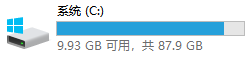
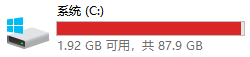
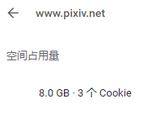
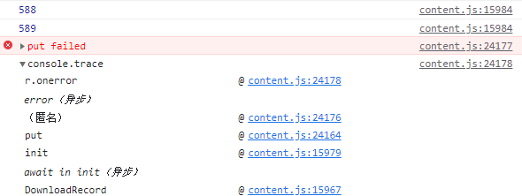
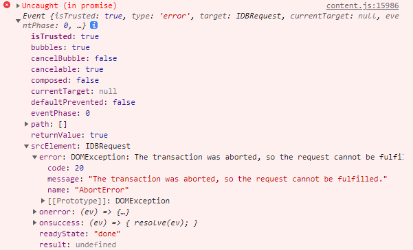
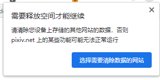

# 测试 Chrome 中 IndexedDB 的储存容量上限

测试环境：

- Windows 10 21H2
- Chrome 103

## 简单的总结

只要磁盘剩余空间足够，Chrome 中的 IndexedDB 至少可以存储 10GB 的数据。

不知道其上限是多少。

即使磁盘空间耗尽，Chrome 也没有自动清除这些数据。重新启动 Chrome 之后这些数据依然存在。

## 测试过程

我在 `src\ts\download\DownloadRecord.ts` 中添加了测试代码，每执行完一次会在 IndexedDB 中添加 4GB 的数据。

```js
// 测试在 IndexedDB 中储存大量数据的代码
// 创建 4MB 大小的文件并存储，循环 1024 次，总体积为 4GB
const str = 'abcd'.repeat(1024 * 1024)
const blob = new Blob([str])
const arr = new Array(1024)
let times = 0
for (const item of arr) {
  await this.IDB.put('record1', {
    id: new Date().getTime() + Math.random(),
    file: blob
  })
  times++
  console.log(times)
}
```

--------------------

测试开始前，我的磁盘剩余空间约为 10 GB：



执行上面的代码两次，添加了 8GB 的数据，没有任何异常。





------------------

再次执行上面的代码，因为剩余的存储空间不到 4GB，所以在代码执行过程中，磁盘空间就用完了：


代码也不出意外的报错了：






```js
// IndexedDB 报错信息
{
  code: 20
  message: "The transaction was aborted, so the request cannot be fulfilled."
  name: "AbortError"
}
```

此时 Chrome 的菜单按钮处也弹出了提示：



------------------

关闭浏览器，重新打开，发现它没有自动清除这多达 10GB 的数据。

------------------

## 总结

我添加了大约 10GB 的数据，实际上还可以添加更多。

------------------

参考 Firefox 浏览器的标准：

https://developer.mozilla.org/zh-CN/docs/Web/API/IndexedDB_API/Browser_storage_limits_and_eviction_criteria#%E5%82%A8%E5%AD%98%E9%99%90%E5%88%B6

上面的文档里提到有两种限制：

1. 全局限制，为磁盘空间的 50％。
2. 组限制，至少有 10 MB，最大为 2GB。（根据其下方补充说明里的链接来看，Chrome 中的组限制最大也是 2GB，但最小值不是 10MB）

我这个磁盘总容量约为 88GB，在 IndexedDB 里存储了接近 10GB 的数据，直到磁盘空间用尽，Chrome 也没有自动清理这些数据。

所以这样的表现不符合组限制的描述，可能是全局限制吧，也就是可存储的数据的上限为磁盘空间（或者数据所在分区？）的 50％。

------------------

下载器目前会创建 3 个 IndexedDB 数据库：

1. `DLRecord`：保存下载记录，用于判断重复的下载。
2. `PBD`：储存未下载完毕的抓取结果，用于恢复未完成的下载。（会自动清理超过 30 天的数据）
3. `PBDBG`：储存设置面板的背景图片。

在长期使用之后，`DLRecord` 占据的空间应该是最大的。

一条下载记录可能是这样的：

```json
{"id":"99818796_p0","n":"うさ城まに/99818796-うさ城まに-7367-原创,女孩子,水手连衣裙,bare feet.jpg","d":"2022/07/18/18/53/43"}
```

下载记录的体积大小主要受文件名字段 `n` 的影响。

上面这条记录不到 200B。假设每条记录占用 200B，那么 1GB 的存储空间可以保存超过 5,000,000 条下载记录。

如果有人下载了 1 亿个文件，那么下载记录应该不会超过 20GB。

------------------

Pixiv 现在有一亿多个作品（图像+小说），假设共包含约 10 亿个文件。

```1000000000*200/1024/1024/1024 ≈ 186```

10 亿条下载记录最大可能有 186GB，也有可能更小。

如果有人用下载器下载了 Pixiv 的所有作品，但他存放 IndexedDB 数据的磁盘空间不够大，那么下载器可能无法储存所有下载记录。（这不会影响文件正常下载）

但是这属于极端情况，一般不用考虑。
