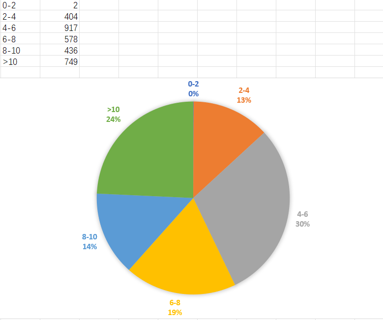
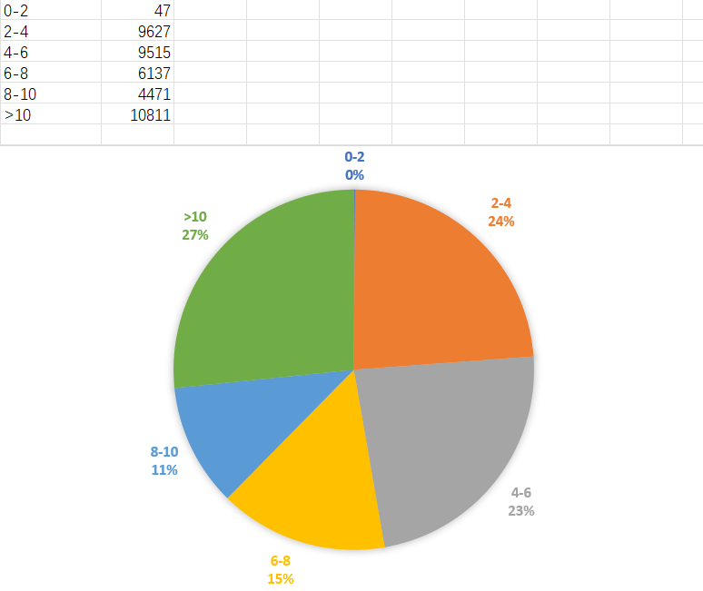
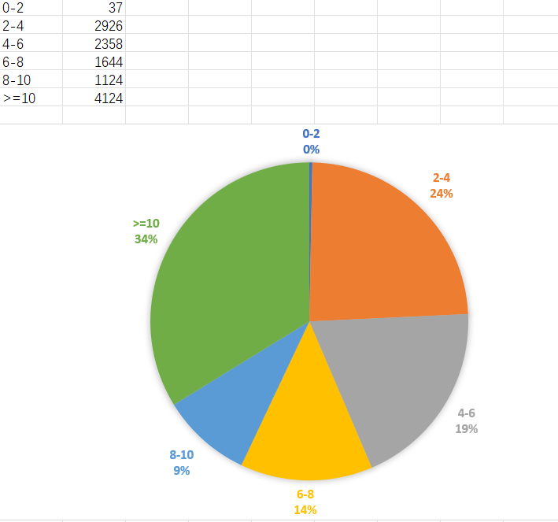

# 浏览量和收藏量的比例

用作品的浏览量除以收藏量，得到一个数字。意思是平均每当有多少人浏览这个作品，这个作品就会获得一次收藏。

这个值应该越低越好。

例如 https://www.pixiv.net/artworks/69956142，浏览量 702,060，收藏数量 342,868，平均每 2 次浏览就能够获得一次收藏。

## 设想

1. 是不是这个值越低，作品质量就越高呢？如果是的话，我们可以用这个值来判断作品的质量。
2. 如果 1 成立，那么对于新发表的作品，就可以用这个值来筛选了。

因为新发表的作品，其收藏数量通常都比较低，如果使用“收藏数量”筛选，可能会漏掉新发表的高质量图片。

如果“浏览量和收藏量的比例”是可靠的，那么我们可以使用“浏览量和收藏量的比例”筛选出新发表的高质量图片。

## 验证

在 `バーチャルYouTuber`(虚拟主播) 标签的搜索页面，按热门度排序（大致等于按收藏数量倒序排列），抓取全部作品，共有 281,421 个作品。

### 1 万收藏以上

首先看 6 万收藏以上的作品数据：


第一页共有 34 个作品，收藏数量都大于 60000，它们浏览量/收藏量的值的**大部分低于 10**。

后面的作品的数据也只对 10 以下的值进行详细的分析。

```
id        收藏量  浏览量和收藏量的比例
69956142	342777	2.047651972
83672006	140722	5.911676923
73518990	125883	5.627153786
80392830	108996	5.172015487
84116049	106005	4.7606811
67545806	101159	14.37144495
85423310	94424	5.712848428
82618568	84686	8.203823536
85217066	83550	4.826295631
85479513	83159	7.518224125
70352399	82476	7.964814006
80035153	78026	4.088380796
80254940	77680	13.47776777
88401634	77560	3.822627643
85606062	77504	6.647721408
67839234	77261	14.94899108
70385021	76930	6.473105421
82049678	73916	4.476365063
85618605	72984	3.953784391
83603397	72654	4.963319294
87033410	71244	4.765341643
78519865	71031	5.36761414
78351780	69004	5.252115819
85779247	68343	5.435260378
85885757	67752	6.677898807
90500201	67499	4.534348657
84869751	65455	6.283141089
61680160	65001	18.95570837
66580027	63951	4.77163766
69660263	62452	6.494876065
80766197	62420	10.65991669
84308202	62264	8.369619684
83892424	61355	3.615108793
69725907	60364	7.452140349
```

然后看所有大于 1 万收藏量的作品，共有 3086 个。由于其数量非常多，散点图上的圆点都堆叠在一起，已经不能准确的观察了，所以改用饼图。下同。



这些高质量作品的“浏览量和收藏量的比例”的值其实分布比较平均。所以并不能说“值越小，图片质量就一定越高”。

### 1000-9999

1000-9999 收藏量区间有 40609 个作品：



2 - 4 比例的区域占比反而加大了。

1000-9999 收藏量的作品质量是比不上 1 万收藏以上的作品的，但是其低比例区域占比反而增大了。

这也说明以“低比例”来判断图片质量并不可靠。

### 1 - 999

1 - 999 收藏量的作品有 235996 个，其数据如下：


这个饼图和前面大相径庭，比例大于 10 的作品占比 64%。

这些作品确实质量比较低，所以有这么多比例大于 10 的作品也很合理。

其中的卧龙凤雏，一个 8000 多浏览才有（仅有） 1 个收藏：

https://www.pixiv.net/artworks/85683216

另一个则是 7000 多浏览才有（仅有） 1 个收藏：

https://www.pixiv.net/artworks/89141267

### 一个月内发表的作品

统计发表时间在 30 天以内的作品的数据。

去掉收藏数量为 0 的作品，去掉收藏数量大于 10,000 的作品，去掉比值大于 100 的作品，有 12,214 个作品。其数据如下：



这个图看起来有点熟悉，因为其低比例区域（2-4，4-6）和 1000 - 9999 收藏区间的占比差不多，和 10000 收藏以上的占比也差不多。

## 结论

使用“浏览量和收藏量的比例”来筛选作品质量是不靠谱的。

看一看收藏数量大于 10000 的作品的饼图，和一个月内发表的新作品的饼图，两者里面 0 - 4 部分的比例几乎一样。

比例小并不能说明这个作品质量一定很高。我下载了值小于 4 的新作品（发表不到一个月），我认为其中高质量作品的比例大概不到 1/4。

比例大也不能说明这个作品质量低。在 60000 收藏数量以上的作品中，也有一些作品的值大于 10。

至少当值在 10 以内的时候，作品的质量分布是比较平均的。大于 10 的作品或许质量确实比 10 以内的作品质量差一些。但是如果按照 `0 - 10` 来筛选的话，那么就会得到大约 2/3 的作品了。显然这么多作品不会都是高质量的。

所以，如果用“浏览量和收藏量的比例”来筛选图片，那么效果接近于“**随机抽选**一定数量的图片”。这些图片并不能保证质量。

抽选到的图片有多少，取决于数值有多大。参考上面的饼图，如果你对一个月内的作品使用比例 `0 - 6` 进行筛选，那么你将会随机获得 43% 的图片。
