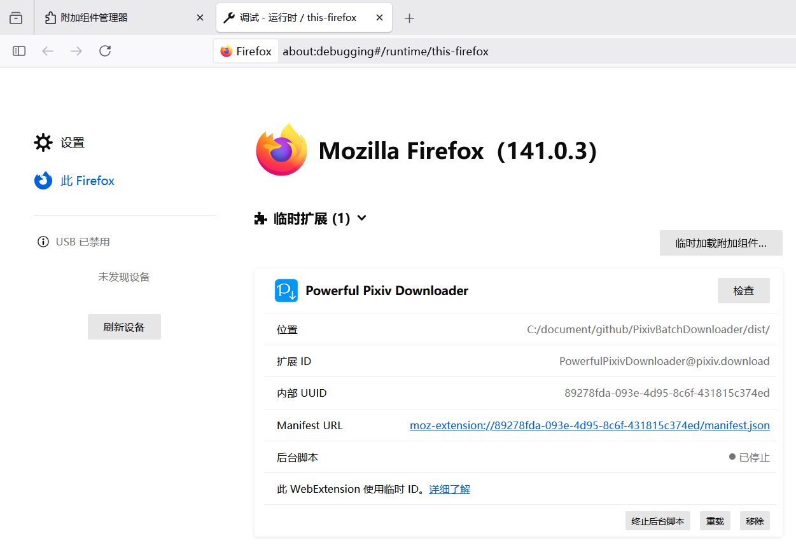
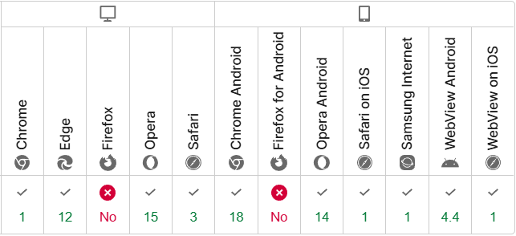
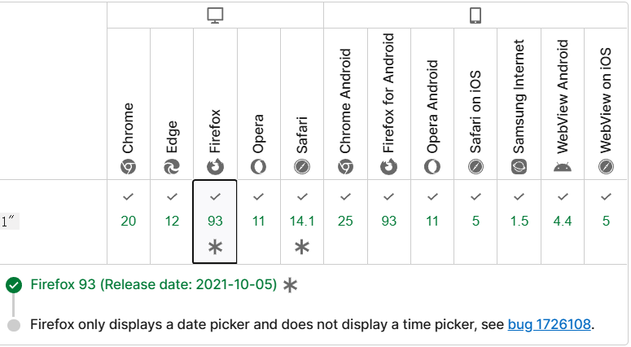

# 让 Chrome 浏览器的扩展程序兼容 Firefox 浏览器

我要把 Pixiv 下载器改成兼容 Firefox 浏览器，做个笔记。

## 官方文档

Firefox 浏览器扩展的开发、测试、发布等文档：
https://extensionworkshop.com/documentation/develop/

移植 Google Chrome 扩展程序：
https://extensionworkshop.com/documentation/develop/porting-a-google-chrome-extension/

发布扩展时，还需要提交源代码和构建流程，有点麻烦：
https://extensionworkshop.com/documentation/publish/source-code-submission/

下面是我的修改步骤。

## 修改 manifest.json

Firefox 虽然也支持 MV 3，但是一些字段和 Chrome 有区别，需要修改 manifest.json。下面只说我遇到的情况，至于完整的区别，虽然官方文档里有个兼容性表格，但是看着费劲，想了解的话不如问 AI。问的时候记得限定为 MV 3 版本，否则 AI 会回答一些 MV 2 里才能用的属性。

### 添加 id 属性

可以在 `browser_specific_settings` 属性里设置 Firefox 特有的属性，比如扩展的 id：

```json
"browser_specific_settings": {
    "gecko": {
      "id": "PowerfulPixivDownloader@pixiv.download"
    }
  },
```

id 的值是自定义的，具有独特性即可，常见的格式如 `扩展名@邮箱或域名`。

文档：
什么时候需要附加组件 ID？
https://extensionworkshop.com/documentation/develop/extensions-and-the-add-on-id/#when-do-you-need-an-add-on-id

### 后台脚本不能使用 service_worker

在 Chrome 扩展 MV 3 里，后台脚本必须使用 `service_worker`，但 Firefox 不支持，依然需要使用传统的 `scripts`。下面的配置同时具有这两种方式，以便在两个浏览器里都生效：

```json
"background": {
  "preferred_environment": ["service_worker"],
  "service_worker": "js/background.js",
  "scripts": ["js/background.js"]
},
```

此处 `preferred_environment` 的作用是：如果 Firefox 以后支持了 `service_worker`，让它优先使用 `service_worker`，。

**注意：**由于 Chrome 的 MV 3 不支持使用 `scripts`，所以加载这个扩展时会显示一条错误信息：

`'background.scripts' requires manifest version of 2 or lower.`

这不影响扩展的正常使用，但是我看到有人在提交审核时，因为这个原因导致审核不通过，后来他提交申诉才通过了审核。

### incognito 模式的区别

`incognito` 用于设置隐私窗口是否启用独立的后台脚本。

```json
"incognito": "spanning",
```

`spanning` 是默认模式，扩展的后台脚本只有一份，就是主窗口里的。隐身窗口里所使用后台脚本依然是主窗口里的。

还有个 `split` 即拆分模式，主窗口和隐私窗口的后台脚本是独立的。不过多个隐私窗口似乎会共享一个隐私的后台脚本，所以最多也就只有 2 个后台脚本。

下载器之前使用的是 `split`，但是 Firefox 只支持 `spanning`，使用 `split` 的话会报错，所以下载器也得改成 `spanning`（我直接去掉了 `incognito` 属性）。

改成 `spanning` 之后，这个扩展在 Chrome 浏览器的隐私窗口里无法正常下载文件，需要修改代码。有点无语，如果 Firefox 支持 `split` 的话，Chrome 那边我就不用改代码了。

## 使用 webextension-polyfill 处理兼容性

Chrome 的扩展程序 API 以 `chrome.` 开头，Firefox 的扩展程序 API 则是以 `browser.` 开头。

虽然 Firefox 的文档里说 Firefox 也可以直接兼容 `chrome.`，不过看起来更流行使用 webextension-polyfill 来处理兼容性。这个包提供了 Firefox 所使用的 browser 命名空间；当扩展运行在 Chrome 上时则会换成 chrome 命名空间。

### 安装 webextension-polyfill

```shell
npm i webextension-polyfill
```

### 添加到 tsconfig.json 里

在 tsconfig.json 的 `compilerOptions.types` 里添加 webextension-polyfill，例如：

```json
{
  "compilerOptions": {
    "target": "ESNext",
    "module": "ESNext",
    "lib": [
      "dom",
      "dom.iterable",
      "esnext"
    ],
    "sourceMap": true,
    "outDir": "./dist/js",
    "downlevelIteration": true,
    "strict": true,
    "types": ["webextension-polyfill"],
    "allowSyntheticDefaultImports": true
  },
  "include": ["./src/ts/*"],
  "exclude": ["node_modules"]
}
```

### 替换 chrome API

在 ts 文件里使用时，先引入 browser 命名空间（这样才能使用 API），然后把 `chrome.` 替换成` browser.`，例如：

```ts
import browser from 'webextension-polyfill'

// 旧代码
chrome.runtime.onMessage
// 改为：
browser.runtime.onMessage
```

大部分代码都不需要其他改动，除非是以前用了 callback 的旧代码，见下方。

### 修改过时的代码

由于这个扩展是好几年前开始编写的，当时一些 API 不支持 promise 模式，而是使用回调函数。比如 download 方法的第二个参数就是回调函数：

```ts
// 旧代码
chrome.downloads.download({ url }, (id) => {})
```

现在已经不推荐这种写法了，因为这个 API 现在会返回 promise，无须传递回调函数。本来不改也没影响，但是 browser 命名空间直接去掉了第二个参数，旧代码会报错，所以必须修改：

```ts
// 新代码
browser.downloads.download({ url })
.then((id) => {})
```

除了 `browser.downloads.download`，还有其他一些 API 以前也是使用回调的，比如 `browser.downloads.search`、`browser.storage.local.get` 等，需要根据情况处理。

### 类型处理

有些地方的类型可能也需要处理。旧代码的 `onMessage` 的监听函数里，`msg` 可以直接指定类型，如：

```ts
// 指定 msg 为 SendToBackEndData 类型
chrome.runtime.onMessage.addListener(function (msg: SendToBackEndData){})
```

但是 browser 命名空间更加严格，`msg` 只能是 `unknown`，指定为其他类型的话会报错。需要在具体使用时做断言，或者做类型守卫：

```ts
// 类型守卫，尽量写的宽松些
// 因为我只要求有 msg.action 属性，不同的 action 会带有对应的数据类型，
// 所以我可以直接断言 msg 的类型，并不需要依赖类型守卫。
// 这个类型守卫单纯是应付类型检查的。如果导致其他类型的消息被拦截就坏了
function isSendToBackEndData(msg: unknown): msg is SendToBackEndData {
  return !!(msg as any).action
}

browser.runtime.onMessage.addListener(function (msg: unknown){
  if (!isSendToBackEndData(msg)) {
    // 虽然使用类型守卫通过了类型推断，但还有个隐藏的坑：
    // 如果前台发送给后台的不止一种数据类型，那么类型守卫最好写的宽松些，让其他类型也可以通过。
    // 比如我在另一个后台模块也监听了消息，并使用另一种数据类型，
    // 如果在这里检查不通过导致 return 的话，会导致消息直接被中止传递，不会被处理
    return
  }
  
  // 在上面检查过类型之后，下面的 msg 就会被推断为 SendToBackEndData 类型
  msg.action
})
```

还有些其他地方的类型也需要修改，比较简单，就不列出了。

### 修改下载方式

如果你的扩展是把文件的原始 URL 发送给浏览器下载的话，通常不需要看这一部分。

**情况说明：**

这个下载器是在前台页面里下载文件的（生成 blob 对象），下载完之后发送给后台脚本保存。

之前是前台生成 blob URL 发送给浏览器下载，在 Chrome 里没问题，但是在 Firefox 里不行。没有错误信息，就单纯是失败，浏览器不会建立下载。

现在为了兼容 Firefox，下载器的 `incognito` 无法使用 `split` 拆分模式，这让原本正常的 Chrome 的隐私窗口里出现了问题。

折腾了不短的时间，我才搞定了在两个浏览器里下载文件。

#### 兼容两个浏览器的下载方案

省流版：

- 在 Firefox 浏览器里，前台传递 Blob 对象。
- 在 Chrome 浏览器的主窗口里，前台传递 blob URL。
- 在 Chrome 浏览器的隐私窗口里，前台传递 DataURL。

**可用性表格：**

| 情景                        | Blob | blob URL | DataURL |
| --------------------------- | ---- | -------- | ------- |
| Firefox 主窗口              | ✅    | ❌        | ✅       |
| Firefox 隐私窗口            | ✅    | ❌        | ✅       |
| Chrome 主窗口               | ✅    | ✅        | ✅       |
| Chrome 隐私窗口（split）    | ❌    | ✅        | ✅       |
| Chrome 隐私窗口（spanning） | ❌    | ❌        | ✅       |

由于 DataURL 是纯字符串，所以在所有情况下都可用。但是这会造成额外的性能消耗，所以除非其他方式都不可用，我才会使用 DataURL。

ArrayBuffer 的表现和 Blob 完全一致，由于我没有使用它来下载，所以没有列出。

**详细说明：**

- Firefox 无法使用前台生成的 blob URL 来下载，所以我传递了 Blob 对象，再由后台脚本生成 blob URL。
- 在 Chrome 的主窗口里，所有方式都可用。不由得感叹 Chrome 的开发体验真好。
- 在 Chrome 的隐私窗口里：

1. blob：在隐私窗口里，前台传递给后台的数据会被 Chrome 做 JSON 序列化处理（不管 `incognito` 是什么模式）。但 Blob 无法被序列化，导致后台接收的 blob 变成了空对象，无法使用。
2. blob URL：当 `incognito` 为 `split` 拆分模式时可用，但是会出现另存为窗口（之前没有，这俩月才出现的，不知道 Chrome 在搞毛），体验不佳。当 `incognito` 为默认的 `spanning` 时，由于后台脚本与隐私窗口位于不同的环境里，所以无法使用 blob URL 下载。
3. DataURL：始终可用，而且不会出现另存为窗口，很合适在隐私窗口里使用。

### 打包 webextension-polyfill

编译代码时，需要把 webextension-polyfill 也一并打包。

我是用的是 webpack，在本项目中不需要修改打包配置。文件里引入了 webextension-polyfill 之后，webpack 会在打包时自动添加它的代码。

## 调试扩展

Firefox 调试扩展也麻烦，效率不如 Chrome 高。

Chrome 在扩展管理页面里可以添加本地扩展的文件夹，在代码重新编译后也可以点击刷新按钮重新加载。但是 Firefox 的扩展管理页面里只能加载**有签名**的 zip 或 xpi 包，不能加载未签名的压缩包，也不能加载文件夹，所以根本无法在这里调试。

要调试本地扩展的话，需要进入另一个页面，即“调试附加组件”页面 `about:debugging#/runtime/this-firefox` 才能加载本地扩展：



选择扩展文件夹里的 manifest.json 以加载扩展，同时也可以在这个页面里重载扩展、检查背景页面。

但还有个问题，这里添加的扩展是临时的，重启浏览器后就会消失，需要再次加载。而 Chrome 里是持久的，重启也不会丢失调试的扩展。实际上我开发的 3 个扩展程序在 Chrome 里一直都是本地加载的，平时正常使用，修改的时候也可以直接重载来进行调试。但 Firefox 里每次重启后都要重新加载有点逆天了，纯纯降低效率的设计。我都本地加载来调试了，难道我还不知道什么时候该删，什么时候不该删吗？我不需要 Firefox 来替我删除。或许这也是为了安全和隐私考虑的设计吧（毕竟 Firefox 的粉丝喜欢吹这些方面，哈哈）

发布扩展时也挺麻烦，因为下载器的代码是用 webpack 打包了的，是把原代码进行了混合的，这不利于审核。按照 Firefox 官方的要求，每次更新时都需要提供源代码和 build 方法，让测试人员手动构建，并要求生成的文件内容一致。还要提交第三方库的仓库网址，并且要求保持原文件，不能自己修改第三方库里的代码。这些都是发布 Chrome 扩展时没有的步骤，有点难绷。

## Firefox 导致的的兼容性问题

用 Firefox 简直浪费生命。

### 严格的类型检查

一个功能在 Chrome 上好好的，但在 Firefox 上会报错。

我把一个图片加载为 arraybuffer：

```ts
const cover = await fetch(coverURL).then((response) => {
  if (response.ok) return response.arrayBuffer()
})
```

然后把它传递给 jepub.js 来创建电子书。在 Chrome 上一直都是正常的，但是在 Firefox 上却报错了。jepub.js 里的 `if (data instanceof ArrayBuffer)` 检查结果竟然是 `false`。

对此，AI 回答：`response.arrayBuffer()` 返回的 ArrayBuffer 是由浏览器内部的原生代码创建的，而不是通过 `new ArrayBuffer()` 构造的。这可能导致 Firefox 将其视为一个**非标准**的 ArrayBuffer，尽管它在功能上是**等价的**。

按照 AI 的建议，使用 `new ArrayBuffer()` 复制了一份 arraybuffer：

```ts
const newCover = new ArrayBuffer(cover.byteLength);
new Uint8Array(newCover).set(new Uint8Array(cover));
```

经过这样脱裤子放屁的操作，果然可以通过 `data instanceof ArrayBuffer` 的检查了。但之后调用 jszip.js 时又产生了报错：

```
Error: Can't read the data of 'OEBPS/assets/17995414.jpg'. Is it in a supported JavaScript type (String, Blob, ArrayBuffer, etc) ?
```

然而 Chrome 上依然是一切正常的，依然顺利地创建了电子书。

这个报错是另一个地方的 `response.blob()` 导致的，原因是一样的，Firefox 不认为这样生成的 blob 是标准的 blob 对象，当 jszip 对这样的 blob 进行检查时，就产生了上面的错误。

我真的日了 Firefox 的马，你是面向用户的浏览器，而不是后端或者工业代码，现在搞得用户体验屌差（程序员也是用户好吧）。我的代码和数据格式明明没问题，就因为沟槽的类型检查不断折腾，而且这次出问题的还都是第三方库，我还得在第三方库里检查相关代码、打日志，我现在真是边改边骂。

不管是前面说过的前台生成的 blob URL 无法在后台建立下载、还是严格的类型检查，以及发布扩展时的严格要求，都是在平白增加程序员折腾的时间。对于类型的严格要求导致所有使用 Firefox 进行开发的程序员都会被影响，根本没有舒心的开发体验。

### 不支持 mousewheel 事件

监听鼠标滚轮的 `mousewheel` 事件在 Firefox 上不可用，需要换成 `wheel`。

MDN 上说前者不是标准的事件，我之前确实不知道。也许前者出现的更早，但后来制订标准时用了后者？但是不管怎么说，前者流传度还是很广的，而且在兼容性表格里只有 Firefox 不支持，很难绷得住：



### 一些个人牢骚

这倒是很符合我以往的印象，即 Firefox 是严格遵守标准的。但是我不喜欢，因为标准总是滞后的，而浏览器开发商和开发者才是第一线的，非标准特性就是为了解决实际问题、给开发者和用户创造更好的体验才出现的。

比如当年还处于领先地位的 IE 浏览器就率先创造了 XMLHttpRequest (AJAX) 技术、DOM 操作，那时候难道会先有标准吗？IE 的其他非标准特性也启发或影响了相关标准的制订，比如其专有的事件模型（如 `onclick` 属性和 `attachEvent` 方法），CSS 的 filter、表达式等，这些都是 IE 率先使用的，后来才制订了相关标准。

在我看来，Firefox 严格的类型检查、兼容性差很容易给开发者添堵，遇到在别的浏览器里都遇不到的问题。而严格遵守标准、不支持非标准的新特性也会对普通用户造成影响。比如 html 的 input 标签的类型里有 `date`、`time` 属性，即日期和时间选择控件。如果开发者想让用户指定完整的日期和时间，需要使用两个 input 标签，用户需要点击两次控件，而代码也需要分别监听、检查这两个控件，并把它们的值合并成一个新的字符串。Chrome 很早就支持 `datetime-local`，即二合一的控件，使用一个 input 即可，方便很多：


前几年我记得 Firefox 不支持这个控件，我还在想难道我这次还要处理这个兼容性问题？现在看了下发现 Firefox 在 2021 年已经支持了（不知道是不是等这个属性成为标准了才支持），但还有个问题，它一直都只会显示日期选择控件，没有时间选择控件：


兼容性表格：



Firefox 的一些狂热拥趸也很离谱。他们有的人把 Chrome 污名化为新时代的 IE6，因为 Chrome 支持很多老旧的非标准的代码，但这正是兼容性的体现。至于 Chrome 的新特性，又会被一些人批评，说总是搞一些不在标准里的 API，造成新的不兼容问题。但是我喜欢 Chrome，它兼容性强，不容易出错，省了很多 debug 的时间，还有新特性可以提高用户和开发者双方的效率以及体验。像 Firefox 这样墨守成规、脱离用户的浏览器才是 IE6。

所以我一直都不喜欢用 Firefox 浏览器，要不是隔三岔五就有用户提 issuse 希望支持 Firefox，我最近又比较勤快，我才懒得搞。这一搞果然又花费了 10 个小时。大部分时间都在处理兼容性问题，以及在四种场景里下载时不停的踩坑、修改、测试。

### 测试网址

使用 Firefox 浏览器和 Chrome 浏览器，并且分别用主窗口和隐私窗口打开下面的链接，测试下载等功能。

