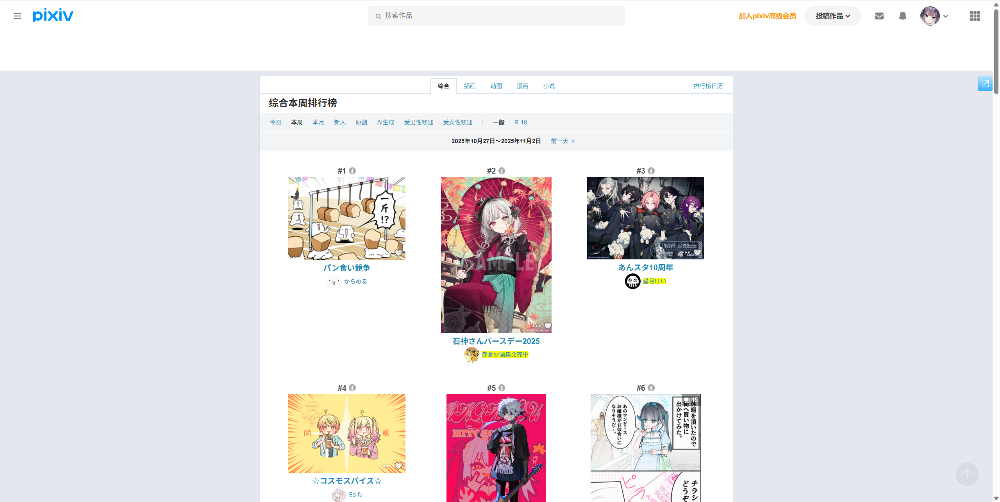
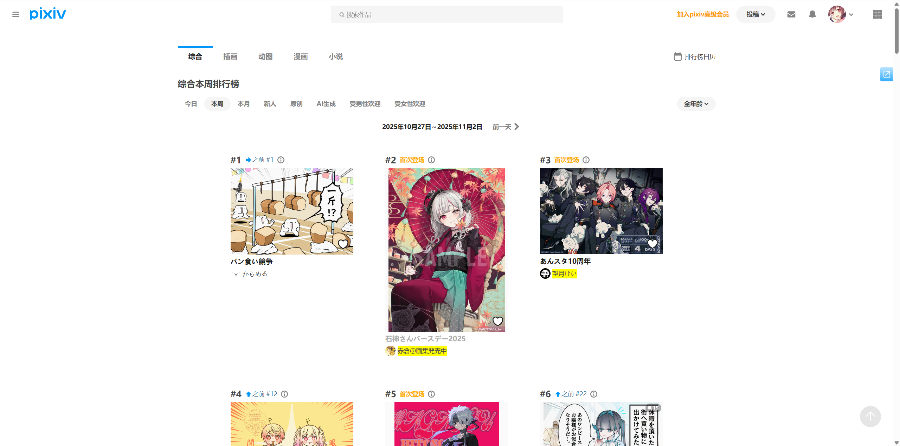
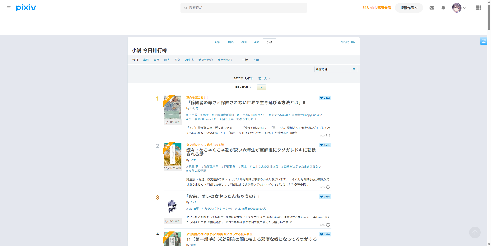
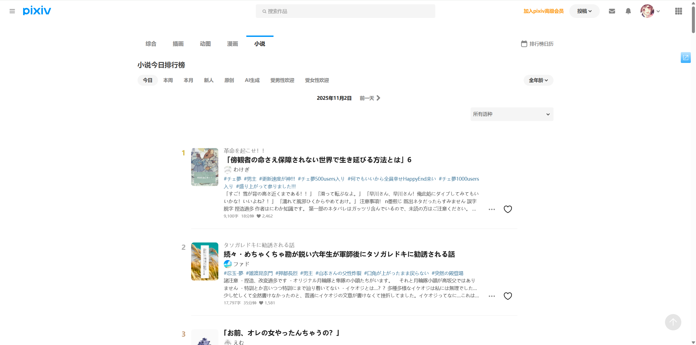

# 记录 Pixiv 的变化

## 作品页面底部的相关作品的变化

2022/04/12

之前作品页面的底部会显示“相关作品”。但是现在发生了一些变化，有时候作品的底部显示的不是“相关作品”，而是显示“推荐作品”，数量固定为 18 个。

这可能与这个作品是否被收藏有关，但是目前并不确定。

## 新首页的推送

2025-07-01

Pixiv 几个月前在首页添加了“首页”页面，现在所有账号都推送了这个更新。

## 排行榜页面的样式更新了

2025-11-01

最近 Pixiv 更新了排行榜页面的样式（插画类和小说的排行榜都进行了更新），下载器已经进行了适配。

由于推送是分批次进行的，所以目前有一些用户看到的依然是旧版页面，但最终所有用户都会更新到新版页面。

主要变化如下：
- UI 更加现代化
- 缩略图的尺寸增加了，之前是最大 240px 的缩略图，现在是 480px。
- 使用了 ajax 来无刷新加载数据。其实插画类的排行榜以前就已经使用 ajax 了，只有小说排行榜没有使用。现在小说排行榜也使用了。PS：其实第一页的数据是包含在源码内的，这样可以节省一次请求。
- 小说排行榜由于使用了 ajax，所以取消了页码。旧版是有翻页按钮的，新版里没有了，滚动到底部时会自动加载下一页里的小说。

虽然新版排行榜里没有页码了，但是依然可以在地址栏里手动输入页码如 `&p=2` 并回车，这样就会从这一页的第一个作品开始显示。例如进入第二页的话，会从第 51 页开始显示。

### 插画类排行榜的前后对比

### 小说排行榜的前后对比

