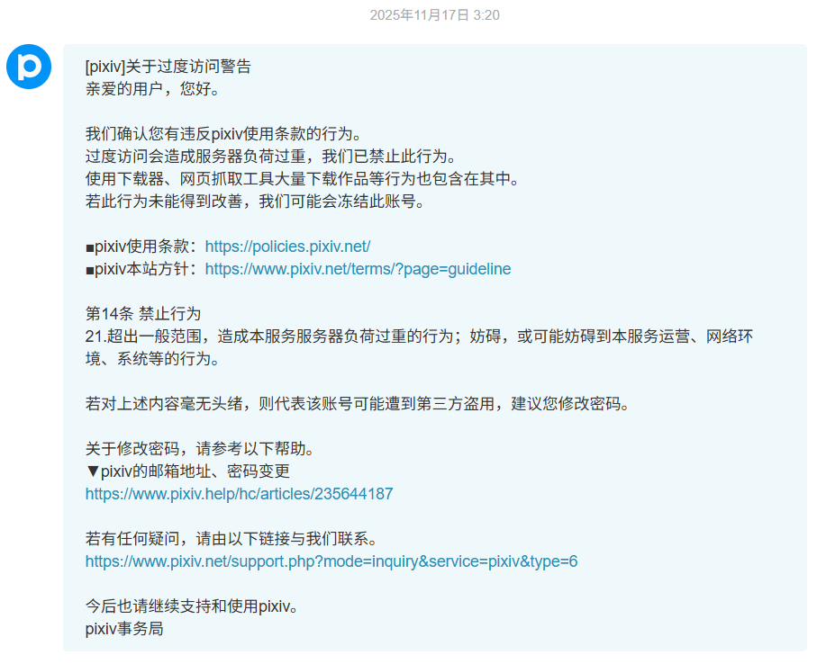
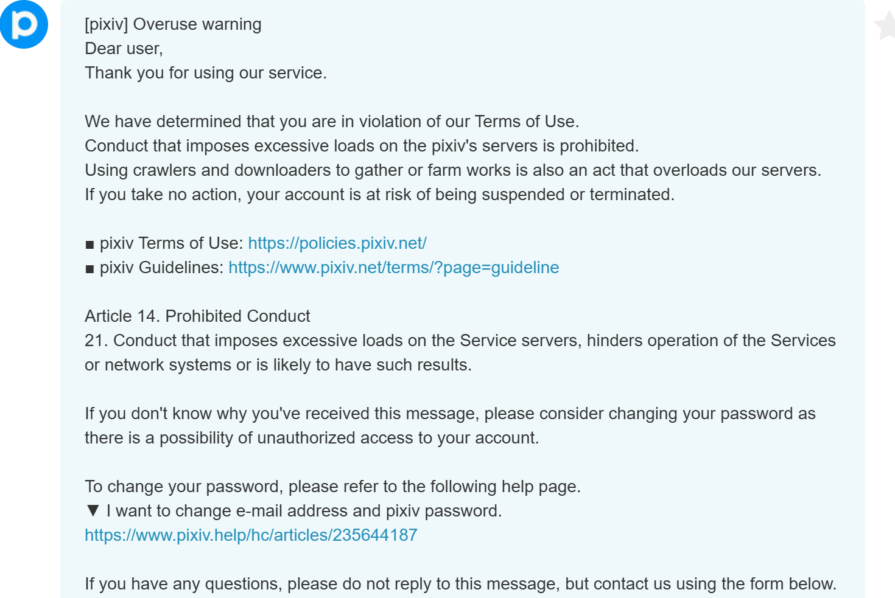

# 过度访问警告

如果某个 Pixiv 用户在一定时间内下载了太多文件，可能会收到警告邮件。

但是具体的限制因素仍然不太清楚（如时间、流量、IP 等条件）。

有一个用户告诉我，根据他的经历来看，可能短期内下载 50GB 左右的文件会触发警告。

但这只是一种可能，如果短期内下载几千个小文件，体积只有几百 MB，也会触发警告。

所以大量下载小说比下载图片更容易被警告，因为小说体积小，下载起来更快，请求的频次很高。

## 警告邮件

被警告时，pixiv事務局会发送站内信，并且会向账号绑定的邮箱也发送一封相同内容的信。

发送警告的时间并不固定（经常会在每小时的第 20 分钟发送，但也有不规律的情况），而且是延后的。

例如我有一次在 1：53 分下载完毕，之后没有动作，在 7 个小时后（8:55）才收到警告信。有时延迟时间没这么久，可能在触发警告后一小时之内就会收到警告信。

获取站内信的 API 里返回的正文内容如下：（`\n` 在下面显示为换行）

```
[pixiv]关于过度访问警告
亲爱的用户，您好。

我们确认您有违反pixiv使用条款的行为。
过度访问会造成服务器负荷过重，我们已禁止此行为。
使用下载器、网页抓取工具大量下载作品等行为也包含在其中。
若此行为未能得到改善，我们可能会冻结此账号。

■pixiv使用条款：https://policies.pixiv.net/
■pixiv本站方针：https://www.pixiv.net/terms/?page=guideline

第14条 禁止行为
21.超出一般范围，造成本服务服务器负荷过重的行为；妨碍，或可能妨碍到本服务运营、网络环境、系统等的行为。

若对上述内容毫无头绪，则代表该账号可能遭到第三方盗用，建议您修改密码。

关于修改密码，请参考以下帮助。
▼pixiv的邮箱地址、密码变更
https://www.pixiv.help/hc/articles/235644187

若有任何疑问，请由以下链接与我们联系。
https://www.pixiv.net/support.php?mode=inquiry&service=pixiv&type=6

今后也请继续支持和使用pixiv。
pixiv事务局
```

这是 `latest_content` 字段里的内容。发送站内信时，内容的语言是与该用户的语言设定一致的，可能是英语、日语等其他语言。

### 截图

#### 简体中文

2025-11-17



#### 英语

2025-09-09



## 封号相关

### 第二次被警告时会怎样

第一次警告只是提示，但如果你第二次被警告，可能有不同的情况：
- 如果第一次警告是几年前的了，那么第二次警告可能也只是提示，没有实际作用。假如你在 2022 年被警告了一次，在 2025 年被警告第二次，账号功能可能不会受到任何限制。
- 如果两次警告的时间相隔的时间比较近（我不清楚具体的阈值），那么你的账号可能面临两种情况：

1. 较轻的处置：你的账号被冻结，不能关注用户和收藏作品，但其他功能正常（可以正常浏览、抓取和下载）。如果你遇到了这种情况，可以尝试给客服发邮件申请解封，有可能恢复正常。
2. 严重的处置：你的账号会被删除，无法登录，也就是彻底无法使用，并且无法申请解封。

前几年经常是第一种处置，但近来经常是第二种处置，这表明 Pixiv 加大了对违规行为的处置力度。

另外，如果你触发了第二种处置（账号被删除）的话，是不会收到第二封邮件的？（存疑）

## 检测用户是否被警告

使用消息 API，获取用户最近收到的几条消息。

```
https://www.pixiv.net/rpc/index.php?mode=latest_message_threads2&num=3&offset=0
```

数量为 `num`。消息队列是倒序的，所以 offset `0` 就是从最新收到的信息开始。

数据格式如下：

```json
{
    "error": false,
    "message": "",
    "body": {
        "total": 1,
        "message_threads": [
            {
              "thread_id": "14233620",
              "modified_at": "1763320807",
              "unread_num": "0",
              "member_num": "2",
              "latest_content": "[pixiv]关于过度访问警告\n亲爱的用户，您好。\n\n我们确认您有违反pixiv使用条款的行为。\n过度访问会造成服务器负荷过重，我们已禁止此行为。\n使用下载器、网页抓取工具大量下载作品等行为也包含在其中。\n若此行为未能得到改善，我们可能会冻结此账号。\n\n■pixiv使用条款：https://policies.pixiv.net/\n■pixiv本站方针：https://www.pixiv.net/terms/?page=guideline\n\n第14条 禁止行为\n21.超出一般范围，造成本服务服务器负荷过重的行为；妨碍，或可能妨碍到本服务运营、网络环境、系统等的行为。\n\n若对上述内容毫无头绪，则代表该账号可能遭到第三方盗用，建议您修改密码。\n\n关于修改密码，请参考以下帮助。\n▼pixiv的邮箱地址、密码变更\nhttps://www.pixiv.help/hc/articles/235644187\n\n若有任何疑问，请由以下链接与我们联系。\nhttps://www.pixiv.net/support.php?mode=inquiry&service=pixiv&type=6\n\n今后也请继续支持和使用pixiv。\npixiv事务局",
              "is_pair": true,
              "thread_name": "pixiv事務局",
              "icon_url": {
                "100x100": "https://i.pximg.net/user-profile/img/2025/01/28/14/59/33/26898736_058dfc75acb3b71f4cdce3fdb7a9da87_50.jpg"
              },
              "followed": true,
              "is_official": true,
              "is_mendako": false,
              "is_active_thread": true
            }
        ],
        "next_url": "/rpc/index.php?mode=latest_message_threads2&num=1&offset=1"
    }
}
```

`pixiv事務局` 是用户名，不会随着语言而变化。 `latest_content` 字段是消息正文，在发送时会使用与用户的 Pixiv 语言设定一致的语言。发送之后不会再变化。

判断 `"thread_name": "pixiv事務局"` 并且 `"is_official": true`，并且在消息内容中检索“pixiv使用条款”的网址 `policies.pixiv.net` 和 `14` 判断这是否是警告邮件。

*不能在消息内容中检索可能会随语言而变化的内容，例如中文内容。*

每当用户下载了 100 个文件，下载器就会检查一次最近的消息，如果发现 1 小时内收到过警告信息，会自动暂停下载并显示提示。
