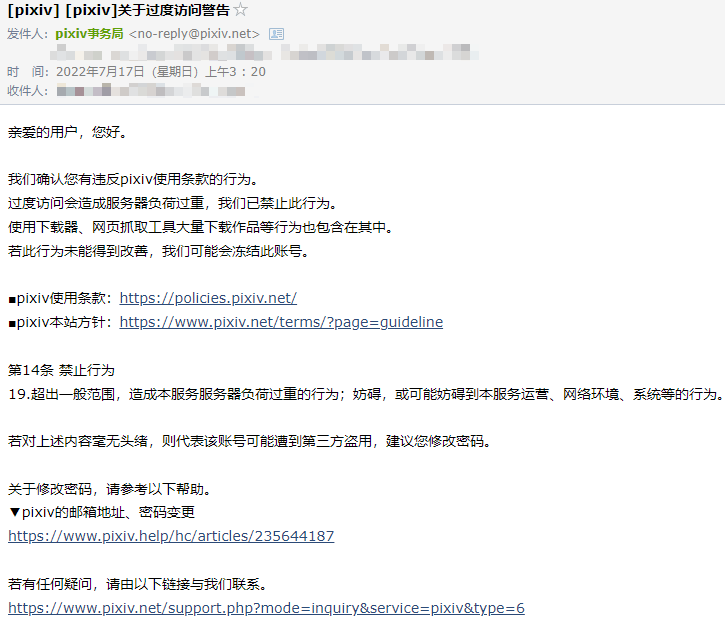
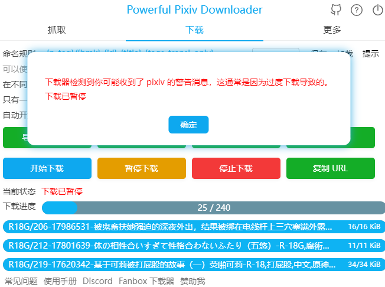

# 过度访问警告

相关讨论：https://github.com/xuejianxianzun/PixivBatchDownloader/issues/228

如果某个 Pixiv 用户在一定时间内下载了太多文件，可能会收到警告邮件。

但是具体的限制因素仍然不太清楚（如时间、流量、IP 等条件）。

有一个用户告诉我，根据他的经历来看，可能短期内下载 50GB 左右的文件会触发警告。

但这只是一种可能，如果短期内下载几千个小文件，体积只有几百 MB，也会触发警告。

所以大量下载小说比下载图片更容易被警告，因为小说体积小，下载起来更快，请求的频次很高。

## 警告邮件

下面是我收到的警告邮件的截图。



同时，pixiv事務局也会在 pixiv 发送私信，消息如下：

```
[pixiv]关于过度访问警告
亲爱的用户，您好。

我们确认您有违反pixiv使用条款的行为。
过度访问会造成服务器负荷过重，我们已禁止此行为。
使用下载器、网页抓取工具大量下载作品等行为也包含在其中。
若此行为未能得到改善，我们可能会冻结此账号。

■pixiv使用条款：https://policies.pixiv.net/
■pixiv本站方针：https://www.pixiv.net/terms/?page=guideline

第14条 禁止行为
19.超出一般范围，造成本服务服务器负荷过重的行为；妨碍，或可能妨碍到本服务运营、网络环境、系统等的行为。

若对上述内容毫无头绪，则代表该账号可能遭到第三方盗用，建议您修改密码。

关于修改密码，请参考以下帮助。
▼pixiv的邮箱地址、密码变更
https://www.pixiv.help/hc/articles/235644187

若有任何疑问，请由以下链接与我们联系。
https://www.pixiv.net/support.php?mode=inquiry&service=pixiv&type=6

今后也请继续支持和使用pixiv。
pixiv事务局
```

这是中文的，对于其他语言的用户，应该会有对应语言的邮件。

消息和邮件都是每小时的 20 分发出的，所以有滞后性。并不是触发限制时马上就会发送警告消息。

## 封号相关

第一次警告只是提示，如果用户收到第 2 次警告，则可能被封禁。

第二次封号，给客服发邮件申请解封有可能解封(估计需要不到一周的时间)，第三次直接封号，申请解封没有回复。

根据一位被封禁过的群友测试（他是因为代充会员被封的），封禁后不能进行收藏作品、关注画师等功能，一些基本的功能仍然可用，包括：

登录、搜索、浏览作品，也能够使用下载器进行下载。

## 检测用户是否被警告

使用消息 API，获取用户最近收到的几条消息。

```
https://www.pixiv.net/rpc/index.php?mode=latest_message_threads2&num=3&offset=0
```

数量为 `num`。消息队列是倒序的，所以 offset `0` 就是从最新收到的信息开始。

数据格式如下：

```json
{
    "error": false,
    "message": "",
    "body": {
        "total": 1,
        "message_threads": [
            {
                "thread_id": "14233620",
                "modified_at": "1657999204",
                "unread_num": "0",
                "member_num": "2",
                "latest_content": "[pixiv]关于过度访问警告\n亲爱的用户，您好。\n\n我们确认您有违反pixiv使用条款的行为。\n过度访问会造成服务器负荷过重，我们已禁止此行为。\n使用下载器、网页抓取工具大量下载作品等行为也包含在其中。\n若此行为未能得到改善，我们可能会冻结此账号。\n\n■pixiv使用条款：https://policies.pixiv.net/\n■pixiv本站方针：https://www.pixiv.net/terms/?page=guideline\n\n第14条 禁止行为\n19.超出一般范围，造成本服务服务器负荷过重的行为；妨碍，或可能妨碍到本服务运营、网络环境、系统等的行为。\n\n若对上述内容毫无头绪，则代表该账号可能遭到第三方盗用，建议您修改密码。\n\n关于修改密码，请参考以下帮助。\n▼pixiv的邮箱地址、密码变更\nhttps://www.pixiv.help/hc/articles/235644187\n\n若有任何疑问，请由以下链接与我们联系。\nhttps://www.pixiv.net/support.php?mode=inquiry&service=pixiv&type=6\n\n今后也请继续支持和使用pixiv。\npixiv事务局",
                "is_pair": true,
                "thread_name": "pixiv事務局",
                "icon_url": {
                    "100x100": "https://i.pximg.net/user-profile/img/2018/04/26/17/49/29/14143210_7f79090d53f5b1befad3ba07818d89dd_50.jpg"
                },
                "followed": true,
                "is_official": true,
                "is_mendako": false,
                "is_active_thread": true,
                "is_fanbox_subscriber": false
            }
        ],
        "next_url": "/rpc/index.php?mode=latest_message_threads2&num=1&offset=1"
    }
}
```

`pixiv事務局` 是用户名，不会随着语言而变化。

判断 `"thread_name": "pixiv事務局"` 并且 `"is_official": true`，并且在消息内容中检索关键词 `guideline` 和 `14` 判断这是否是警告邮件。

*不能在消息内容中检索可能会随语言而变化的内容，例如汉字。*

每当用户下载了 100 个文件，下载器就会检查一次最近消息，如果发现了 1 小时内收到过警告信息，则自动暂停下载。


