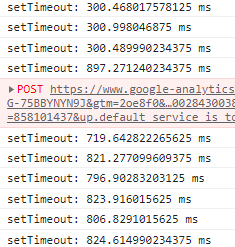
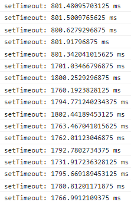
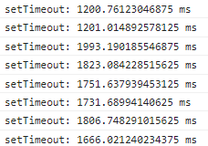

# 页面处于后台时，定时器的延迟问题

“处于后台”指这个标签页被完全遮挡的状态，包括切换到其他标签页和切换到其他全屏程序。

*页面处于前台，且关闭显示器时，依然是前台状态，不会变成后台。*

根据 MDN 的文档：为了优化后台 tab 的加载损耗（以及降低耗电量），在未被激活的 tab 中定时器的最小延时限制为 1 S(1000 ms)。

但实际上，定时器可能被延迟更久，我做了一些测试：

## 测试

设置 300 ms 后执行下一次抓取，当页面处于前台时，时间符合预期。但是当页面处于后台时，时间变成了 800 ms。

```js
   window.setTimeout(()=>{
   console.timeEnd('setTimeout')
   this.getWorksData()
}, 300)
console.time('setTimeout')
```



-----------------

将延迟时间设置为 800 ms 时测试，当页面处于后台时，时间变成了 1700 - 1800 ms。



2.25 倍

-----------------

将延迟时间设置为 1200 ms 时测试，当页面处于后台时，时间变成了 1600 - 1800 ms。



1.5 倍

## 数据汇总

我又进行了更多的测试，数据如下：

| 设置的延迟 | 页面处于后台时的延迟 |
| ---------- | -------------------- |
| 0          | 10                   |
| 50         | 800                  |
| 100        | 800                  |
| 300        | 800                  |
| 700        | 800                  |
| 800        | 1800                 |
| 1200       | 1800                 |
| 1800       | 2800                 |
| 2200       | 2800                 |
| 2800       | 3800                 |
| 3000       | 3800                 |
| 3900       | 4800                 |
| 5000       | 5800                 |
| 60000      | 60800                |

如果把延迟时间设置的非常小，比如 0，即使页面处于后台，延迟时间也依然很小。除此之外，都会大幅增加延迟时间。

很明显，页面处于后台时，定时器的执行时间总是和 **800 ms** 有关。

如果设置的延迟时间的毫秒部分小于 `800`，就会把毫秒部分设置为 `800`。

如果设置的延迟时间的毫秒部分大于等于 `800`，就会把当前延迟时间设置为 `下一秒 + 800 ms`。

所以，延迟时间的毫秒数部分不应该大于等于 800，因为这会导致后台时的实际延迟时间增加约 1 秒，变慢许多。
