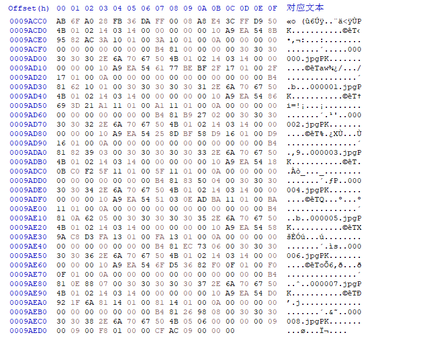

# 预览动图

以该作品为例： https://www.pixiv.net/artworks/99636469

（这是我测试用的非公开作品）

## 对动图的一些调查

### 动图原图的体积上限

在上传多张静态图片制作动图时，上传的文件总体积不能超过 30MB。

我上传了一个动图，原图 9 张，都是 1920x1080 的 png 图片，共 29.7MB。

https://www.pixiv.net/artworks/99636469

https://www.pixiv.net/ajax/illust/99636469

### 服务器上保存有原图

从动图作品的数据里，可以生成每一帧图片的 URL，这样也可以加载所有图片。

https://www.pixiv.net/ajax/illust/99636469

其中 `original` 的 URL 获取的就是原图。

例如 `JSON.body.urls.original` 是下面这样的：

```
https://i.pximg.net/img-original/img/2022/07/10/21/09/53/99636469-c939f0c867922f29d84622aa93ee80f4_ugoira0.png
```

把末尾 `ugoira0` 最后的 0 依次替换成帧数，就可以获取每一帧的原图。

原图是未压缩过的，体积比较大。zip 包里的是压缩过的，所以 zip 压缩包的体积会比较小。

### zip 压缩包里的图片是压缩后的 jpg

我上传的是每张 3MB 多一点的 PNG 图片，总体积 29.7MB。

下载“原图”尺寸的 zip 文件，其体积只有 3MB。

```
https://i.pximg.net/img-zip-ugoira/img/2022/07/10/21/09/53/99636469-c939f0c867922f29d84622aa93ee80f4_ugoira1920x1080.zip
```

zip 里的图片都是压缩过的 jpg 图片。所以我推测，不管用户制作动图时上传的是 png 格式还是 jpg 格式，都会压缩成 jpg 格式再打包。

原图尺寸压缩包里的图片压缩了画质，但是图片的尺寸没有变。

普通尺寸（600x600）压缩包里的图片尺寸最大是 600x600，如果原图超过这个尺寸会被压缩到最大 600px。

## 使用的 URL

先获取 meta 数据：

https://www.pixiv.net/ajax/illust/99636469/ugoira_meta

```json
{
  "src": "https://i.pximg.net/img-zip-ugoira/img/2022/07/10/21/09/53/99636469-c939f0c867922f29d84622aa93ee80f4_ugoira600x600.zip",
  "originalSrc": "https://i.pximg.net/img-zip-ugoira/img/2022/07/10/21/09/53/99636469-c939f0c867922f29d84622aa93ee80f4_ugoira1920x1080.zip",
  "mime_type": "image/jpeg",
}
```

目前我假定压缩包里的都是 jpg 图片，没有其他格式。先检查 `mime_type`，不是 `jpeg` 的就不进行处理。

## 获取压缩包体积

Pixiv 在加载动图时是分区块加载的，并不是一次性加载整个压缩包。这样能先加载出一部分图像，使预览能够尽早的显示出来。

首先发一个 HEAD 请求，获取 headers。

```js
async function head () {
  const r = await fetch('https://i.pximg.net/img-zip-ugoira/img/2022/06/25/22/07/04/99298109_ugoira600x600.zip', {
    method: 'head',
    credentials: 'same-origin'
  })

  for (const iterator of r.headers.entries()) {
    console.log(iterator)
  }
  
  console.log(r.headers.get('content-length'))
}

head()
```

循环之后输出了以下 headers：

```js
['cache-control', 'max-age=31536000']
['content-length', '3596438']
['content-type', 'application/zip']
['expires', 'Sat, 08 Jul 2023 04:12:13 GMT']
['last-modified', 'Sat, 25 Jun 2022 09:51:54 GMT']
```

主要是看 `content-length`，获取压缩包的总字节数。


### 分块加载

然后发送多个 GET 请求，使用 `range` 请求头来定义要加载的区块。

```yml
range: bytes=0-299999
```

如果压缩包的体积很小，一个分块就能加载整个压缩包。

Pixiv 官方是一次加载 `299999` 字节，感觉比较保守。我使用了 500000 字节作为区块的单位，没有出现异常。

```js
async function load (rang) {
  const r = await fetch('https://i.pximg.net/img-zip-ugoira/img/2022/06/25/22/07/04/99298109_ugoira600x600.zip', {
    method: 'get',
    headers: {
      range: rang,
    }
  })
  const d = await r.blob()
}
load('bytes=0-299999')
```

有多个区块时，依次按顺序加载，才能保证先显示开头的图片。

## 汇总分块数据，提取出图像数据

使用一个变量保存 zip 压缩包的数据，每当加载完成一个区块，就把这个区块的数据追加到这个变量里。

但是我遇到了问题，当压缩包只加载了一部分时，它不是一个完整的压缩包，它结尾处的图片文件也是会被截断的，我现在使用的 zip 库无法解压。

我只好采用笨办法，直接操作二进制数据了。

还好 Pixiv 的动图 zip 是仅存储的，结构非常简单。


每个 jpg 文件都有一个固定长度（10 字节）的名字作为开头。

所以根据这个特征，在保存 zip 数据的变量里查找每个 jpg 文件的起始位置，从起始位置到下一个 jpg 文件之间就是这个 jpg 的数据。



不过在 zip 文件结尾，有一些目录数据，是在文件名后面 PK 字符，这部分不能当做文件的起始位置处理。

## 开始绘制动画

从压缩包里提取出 jpg 的数据后，在容器元素里创建画布，播放动画。

一开始只能播放开头的几张图片，所以此时不是完整的动画，只能循环播放最先加载完成的那些图片。

等到加载出的图片越来越多，就可以逐渐完整的播放了。

## 性能相关

从性能记录来看，图片解码和从图像数据生成 Blob 对象这两个部分花费的时间最多。这两个操作都是在压缩包片段加载完成后，提取出图像数据时发生的，应该是没法优化了。

-----------

下载器会先把图片加载到 img 上，然后用 canvas 绘制 img。之前我以为这样每次绘制时都要转换 img，会导致性能浪费，但是从性能记录上看，问题不大，可能浏览器对此有优化。

我尝试用 ImageBitMap 代替 img，但是报错了，遂作罢。

```
The ImageBitmap could not be allocated.
```

-----------

之前下载器使用定时器绘制动图的图像，经测试，当该页面被隐藏时，定时器也会停止执行以节约资源。不过为了动画播放更流畅，我换成了 requestAnimationFrame。这在性能上没有变化。
